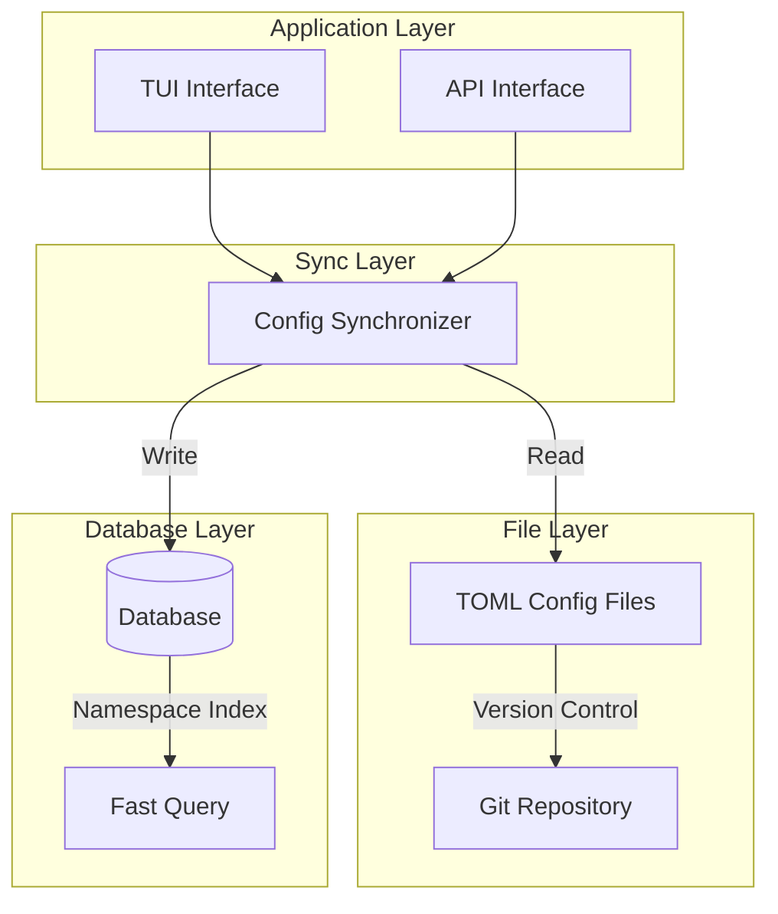
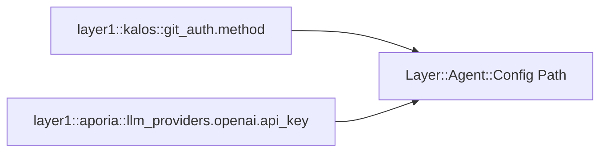
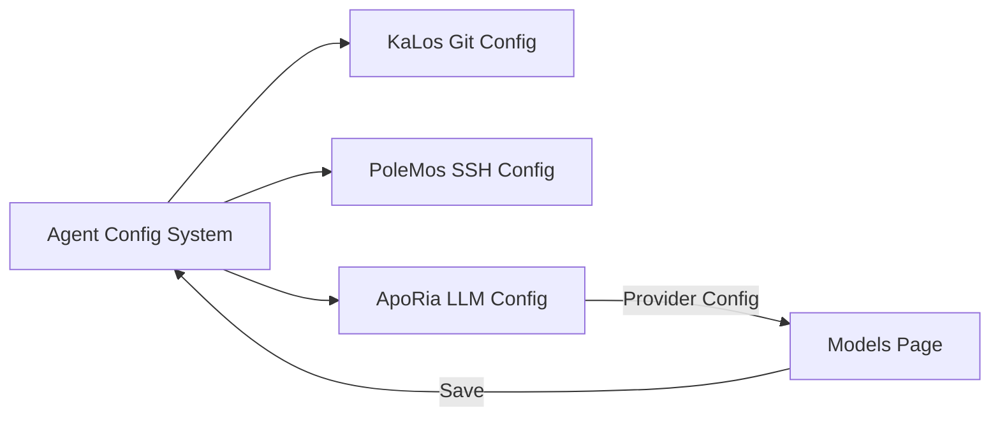

# تصميم نظام تهيئة الوكلاء

## نظرة عامة

يوفر نظام تهيئة الوكلاء آلية موحدة لإدارة التهيئة، تدعم تخزين ملفات TOML واستمرارية قاعدة البيانات، منفّذًا إدارة إصدارات التهيئة وإعادة التحميل الساخن.

## المبادئ الأساسية

### بنية تخزين ثنائية الطبقة



### نطاق التهيئة

اعتماد تصميم نطاق هرمي:



## تصميم البنية

### دورة حياة التهيئة

```mermaid
stateDiagram-v2
    [*] --> Default: System Defaults
    Default --> FileConfig: Load TOML
    FileConfig --> DbSync: Sync to Database
    DbSync --> Active: Configuration Active

    Active --> Updated: User Modification
    Updated --> Validated: Format Validation
    Validated --> DbSync: Save Changes

    Active --> HotReload: Hot Reload Trigger
    HotReload --> Active: No Restart Required
```

### واجهة تهيئة TUI

```mermaid
graph TB
    subgraph Agent Document Modal
        Tabs[Overview | Config | MCP | Skills]
        Tabs --> Content[Content Area]
    end

    subgraph Configuration Page
        Groups[Configuration Group List]
        Groups --> Group1[Git Auth Config]
        Groups --> Group2[Source Management Config]
        Groups --> AddGroup[Add New Config Group]
    end

    Content --> Groups
```

## العلاقة مع الوحدات الأخرى



## اعتبارات التصميم

### الأمان

- تخزين مشفّر للتهيئة الحساسة
- تحكم صلاحيات الوصول
- تدقيق تغيير التهيئة

### قابلية التوسع

- دعم أنواع تهيئة مخصصة
- قواعد تحقق مرنة
- معالجات تهيئة قابلة للإدراج

### الاتساق

- مزامنة الملف وقاعدة البيانات
- إدارة إصدار التهيئة
- كشف التعارض وحله
