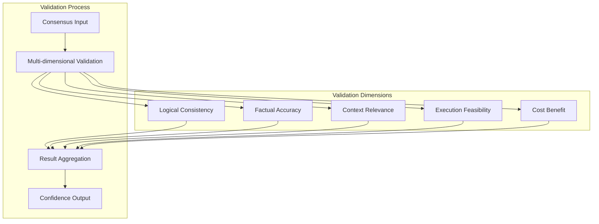
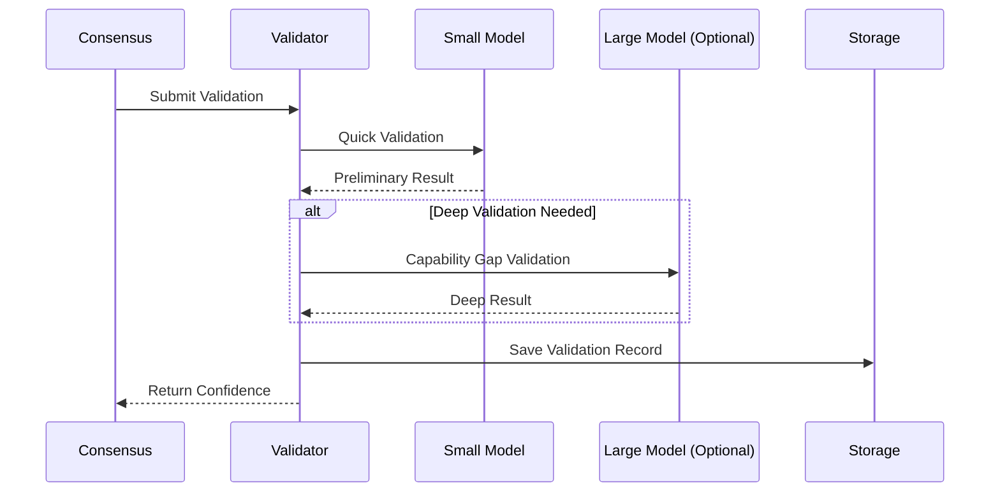
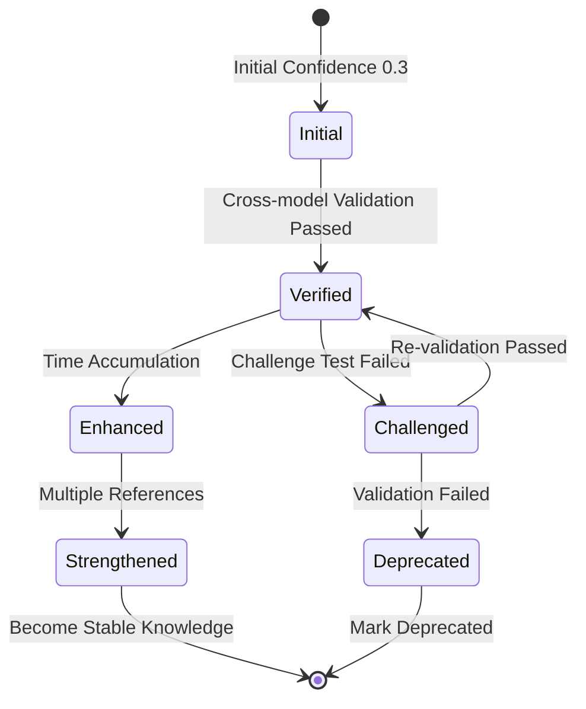
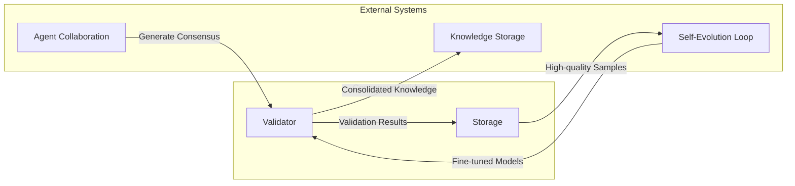

# آلية التحقق بالتوافق

## نظرة عامة

آلية التحقق بالتوافق هي مكوّن أساسي لنظام التعاون متعدد الوكلاء، تُستخدم للتحقق وتقييم موثوقية ودقة التوافق الذي يُكوّنه عدة وكلاء، ضامنةً جودة مخرجات النظام.

## المبادئ الأساسية

### إطار تحقق متعدد الأبعاد

يقوم النظام بتحقق شامل عبر خمسة أبعاد:

### وصف أبعاد التحقق

| البُعد | هدف التحقق | المؤشرات الرئيسية |
| --- | --- | --- |
| الاتساق المنطقي | هل التوافق متسق ذاتيًا | لا تناقضات، استدلال كامل |
| الدقة الواقعية | هل العبارات الواقعية صحيحة | متسقة مع المعرفة المعروفة |
| الصلة بالسياق | هل ذو صلة بالمهمة الحالية | درجة الصلة |
| قابلية التنفيذ | هل الخطة قابلة للتنفيذ | تقييم القابلية للتشغيل |
| التكلفة-الفائدة | هل التكلفة-الفائدة معقولة | تقييم العائد على الاستثمار |

## تصميم البنية

### عملية التحقق التدريجي

### آلية تراكم الثقة

## التكامل مع الأنظمة الأخرى

## اعتبارات التصميم

### التحكم في التكلفة

- إعطاء الأولوية للنماذج الصغيرة للتحقق
- تفعيل النماذج الكبيرة فقط عند الضرورة
- التخزين المؤقت وإعادة استخدام نتائج التحقق

### ضمان الجودة

- تحقق متبادل متعدد الأبعاد
- تراكم الوقت يعزز المصداقية
- اختبارات التحدي تكتشف المشكلات المحتملة

### قابلية التتبع

- سجلات تاريخ تحقق كاملة
- دعم التدقيق والرجوع للخلف
- دعم التحليل الإحصائي
