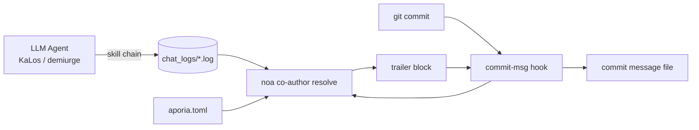

# تحديد وكيل الذكاء الاصطناعي واستراتيجية المشاركة في التأليف (Co-author) للالتزامات

## نظرة عامة

تحدد هذه الوثيقة كيف تُختم التزامات Git المُولّدة بواسطة الذكاء الاصطناعي عبر مشاريع celestia-island
(`noa`، `entelecheia`، `evernight`) بـ **بيانات وصفية للمصدر**: أي النماذج ألّفت
التغيير، عبر أي مزود/منصة تم الوصول إليها، كم من الرموز استهلكت، وما إذا كان
التغيير أُنتج في ظل تكرار مستقل (YOLO).

الآلية **بيانات وصفية براغماتية**: كل التزام يُنتجه وكيل ذكاء اصطناعي يحصل على
كتلة مقطورة `Co-authored-by` (وكتلة `Token usage` اختيارية) تُضاف بواسطة
ربط `commit-msg` الخاص بـ git الذي يثبّته `noa` ويحلّه. هذا ليس بوابة
امتثال قانوني؛ بل تتبّع يتيح للبشر تدقيق أي نموذج وأي مزود لمس الكود.

## الدوافع

| الاهتمام | كيف يساعد هذا |
| --- | --- |
| **إمكانية التتبع** | كل التزام يسجل النموذج/النماذج الدقيقة التي أنتجته. |
| **مساءلة المزود** | يُرمّز بريد المؤلف المزود/المنصة، بما في ذلك المرحلات الخارجية. |
| **مقاومة التسمم** | إذا شحنت مرحلة أو مزود بيانات مُخترقة، يحدد المقطور المشارك المصدر. |
| **تتبع التكلفة** | كتلة `Token usage` الاختيارية تسجل الرفع/التنزيل/الذاكرة المؤقتة لكل نموذج. |
| **وسم الوضع المستقل** | سلسلة تعمل بالكامل تحت تحكم YOLO تُوسم بسلطة `Entelecheia`. |

## نموذج هوية المزود

يستخدم بريد المؤلف نطاق ثقة واحد — `celestia.world` — مع الجزء
المحلي يُرمّز **من خدم النموذج**:

```text
Display Name <provider-or-platform-id@celestia.world>
```

معرّف المزود هو **حقل `website_domain` الإلزامي** المصرّح به في كل
تكوين مزود (ملفات TOML لنقاط الدخول في سجل المزودين و
`aporia.toml` المحلي). هو **لا** يُشتق من `base_url` الخاص بـ API — قد يكشف
مزود واحد عدة مضيفي `base_url` (مثل `zhipu_glm` يخدم كلاً من `open.bigmodel.cn` و
`api.z.ai`، لكن نطاقه القانوني هو `zhipuai.cn`). إذا افتقر مزود لـ
`website_domain`، لا يُنسب مشارك له (يتخطاه المحلل بدلاً من
التخمين من URL أو بادئة النموذج).

- **مزودو الطرف الأول** يُحدّدون بنطاقهم القانوني:

`anthropic.com`، `deepseek.com`، `openai.com`، `zhipuai.cn`، `google.com`، ...

- **مزودو الطرف الثالث / المرحلات** يحتفظون بنطاقهم الخاص ليكون المرحل مرئيًا:

`opencode.ai`، `jdcloud.com`، `openrouter.ai`، `dashscope.aliyuncs.com`، ...

هذا يعني أن *نفس* النموذج المُتلقى عبر مسارات مختلفة يمكن تمييزه:

```text
GLM 5 <zhipuai.cn@celestia.world>              # direct from Zhipu AI
GLM 5 <jdcloud.com@celestia.world>           # GLM 5 served via JD Cloud
Deepseek V4 Pro <deepseek.com@celestia.world> # direct from DeepSeek
Deepseek V4 Pro <opencode.ai@celestia.world>  # DeepSeek served via opencode
```

## مواصفة مقطور المشارك (Co-author)

- مفتاح المقطور: `Co-authored-by` (مقطور معترف به من git).
- القيمة: `Display Name <local@celestia.world>`.
- **مقطور واحد لكل نموذج مميز**، بترتيب الاستخدام.
- اسم العرض مشتق من معرّف النموذج (العلامة + الإصدار، بأحرف العنوان).
- يجب أن يكون الجزء المحلي نطاقًا فرعيًا صالحًا لـ RFC-5321 (أحرف، أرقام، `.`، `-`).

## مقطور سلطة YOLO

عندما تعمل سلسلة الأفكار بأكملها التي أنتجت التزام تحت **تحكم
YOLO** (التكرار المستقل)، يُضاف مشارك إضافي في المقدمة:

```text
Co-authored-by: Entelecheia <demiurge@celestia.world>
```

يُكتشف وضع YOLO من إما:

1. سجل محادثة الجلسة يحتوي على علامة `YOLO cruise control` / `YOLO auto`، أو
1. وجود الملف الحارس `/run/entelecheia/yolo_active`.

يتيح هذا للإنسان أن يرى فورًا "هذا الالتزام أُجري دون إنسان في الحلقة".

## استخدام الرموز المضمّن

مُضمّن في اسم عرض كل نموذج ضمن مقطور `Co-authored-by` (كتلة مقطور واحدة يحللها GitHub بشكل صحيح):

```text
Co-authored-by: Claude Opus 4.8 (↑ 12.5k ↓ 8.3k ●45.2k) <anthropic.com@celestia.world>
Co-authored-by: Deepseek V4 Pro (↑ 5.1k ↓ 3.2k) <deepseek.com@celestia.world>
```

القواعد:

- الاستخدام مضمّن سطريًا كـ `(↑ upload ↓ download)`، مع `●cache` مُلحقًا فقط

عند الإبلاغ عن رموز الإدخال المؤقتة وأنها > 0.

- `↑` = رموز التوجيه/الإدخال؛ `↓` = رموز الإكمال/المخرج.
- العدّ يُعرض بآلاف (`k`)، منزلة عشرية واحدة، صفر زائد مُزال.

## مثال رسالة التزام كاملة

```python
fix(auto_fix): raise clippy/check timeouts from 180s to 300s

The previous 180s timeout was too tight for clean builds on a loaded
machine; raise it to 300s to avoid spurious validation failures.

Co-authored-by: Entelecheia <demiurge@celestia.world>
Co-authored-by: GLM 5 (↑ 36.4k ↓ 1.5k) <zhipuai.cn@celestia.world>
```

## تثبيت ربط noa

يوفّر `noa` دورة حياة الربط:

```text
noa hook install --repo <path> [--force] [--noa-bin <path>]
```

- يكتب `.git/hooks/commit-msg` (وضع `0755`).
- يستدعي الربط `<noa> co-author resolve` ويضيف مخرجاته القياسية إلى ملف

رسالة الالتزام (`$1`).

- الربط **لا يحجب التزام أبدًا**: عند أي فشل في المحلل يخرج `0` بصمت.
- إذا كانت رسالة الالتزام تحتوي بالفعل على مقطور `Co-authored-by:`، الربط

لا يفعل شيئًا (لا يكرر أو يكتب فوق أبدًا).

- `NOA_COAUTHOR_DISABLE=1` في البيئة يُعطّل الربط لالتزام واحد.

## حل المشارك في noa

```text
noa co-author resolve [--repo <path>] [--chat-log-dir <dir>]
                      [--aporia-config <path>] [--lookback-secs <n>]
```

المحلل:

1. يحمل خريطة المزودين: السجل المدمج مدموجًا مع تكوين مزود `aporia.toml`

(الذي يعطي التعيين الدقيق نموذج←نقطة نهاية←مزود).

1. يقرأ أحدث سجل/سجلات محادثة entelecheia ويجمع استخدام الرموز لكل

نموذج. مع `--lookback-secs 0` (افتراضي) يُستخدم فقط السجل الأحدث وحده.

1. يكتشف وضع YOLO (علامة سجل المحادثة أو ملف حارس).
1. يبني قائمة المشاركين (سلطة `Entelecheia` أولًا إذا YOLO، ثم النماذج)

وكتلة استخدام الرموز، ويطبع كتلة المقطور إلى المخرجات القياسية.

## تدفق البيانات



## تكامل entelecheia

- ربط `commit-msg` مثبّت في `/mnt/sdb1/entelecheia/.git/hooks/`.
- كل الالتزامات التي ينتجها خط أنابيب الجراحة (ربط `NoaMergeCommit` في

`packages/scepter/src/state_machine/skill_chain/execution/noa_post_chain.rs`) و

بواسطة حلقة الشفاء الذاتي `KaLos:auto_fix` تمر عبر ربط `commit-msg` الخاص بـ git،

لذا تُختم تلقائيًا.

- لا تغيير مطلوب في مواقع استدعاء الالتزام: الربط هو نقطة الإدراج

الوحيدة.

## تكامل evernight

عندما ينسق وكيل ذكاء اصطناعي التزامًا عبر `evernight` (مثل وكيل على المضيف A ←
evernight SSH ← المضيف B ← `git commit`)، يطلق ربط `commit-msg`
الخاص بالمضيف محليًا ويختم الالتزام. قد يظهر `evernight` نفسه كـ **مزود
عبور** في بريد المؤلف عندما يرحل حركة النموذج (مثل
`GLM 5 <evernight.celestia.world@celestia.world>`)، مما يجعل قفزة النقل
قابلة للتدقيق.

## اعتبارات الأمان

- مقاطير المشارك هي مصدر **مُبلَّغ ذاتيًا** وليس دليلًا تشفيريًا.

العمل المستقبلي قد يضيف إثباتات موقّعة.

- يتدهور المحلل بأمان: سجل محادثة مفقود، أو `noa` مفقود، أو خطأ تحليل

جميعها تنتج كتلة فارغة ويمر الالتزام دون مساس.

- معرّفات المزود تأتي من `aporia.toml` المحلي، لذا يرى المستخدم دائمًا

المزودين الذين *هو* كوّنهم.

## مرجع معرّفات المزودين (السجل المبدئي)

| معرّف المزود | العلامة | تلميح نقطة النهاية |
| --- | --- | --- |
| `zhipuai.cn` | GLM | `open.bigmodel.cn` |
| `deepseek.com` | Deepseek | `api.deepseek.com` |
| `anthropic.com` | Claude | `api.anthropic.com` |
| `openai.com` | GPT / OpenAI | `api.openai.com` |
| `google.com` | Gemini | `googleapis.com` |
| `dashscope.aliyuncs.com` | Qwen | `dashscope.aliyuncs.com` |
| `moonshot.cn` | Kimi | `api.moonshot.cn` |
| `mistral.ai` | Mistral | `api.mistral.ai` |
| `opencode.ai` | (مرحلة) | `opencode.ai` |
| `jdcloud.com` | (مرحلة) | `jdcloud.com` |
| `openrouter.ai` | (مرحلة) | `openrouter.ai` |
