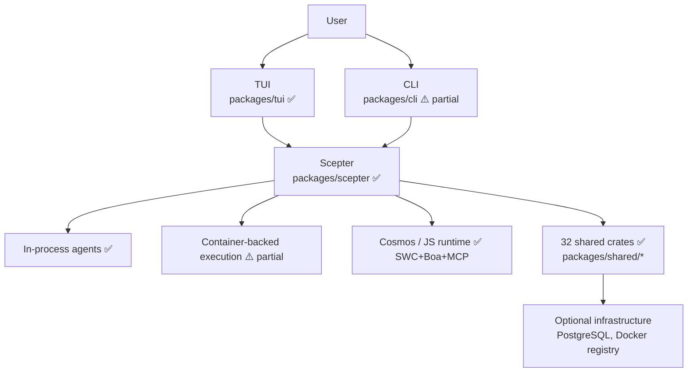
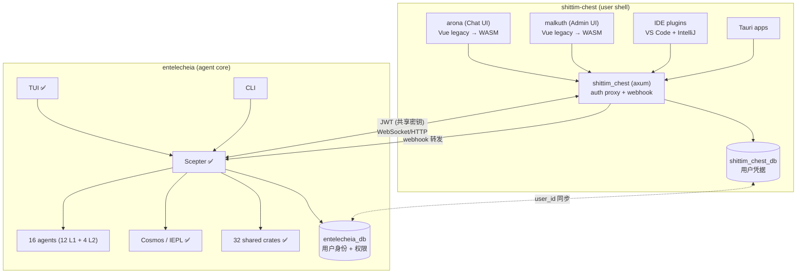
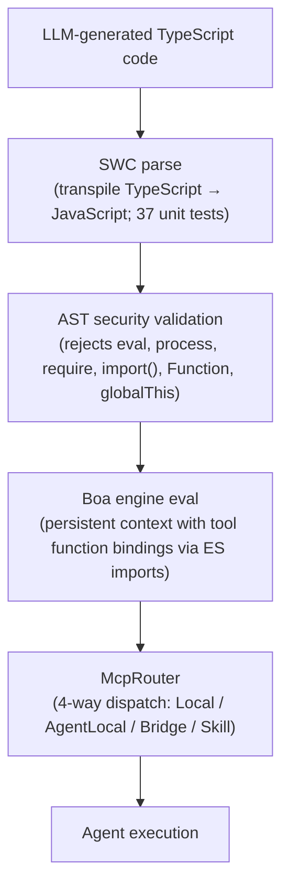
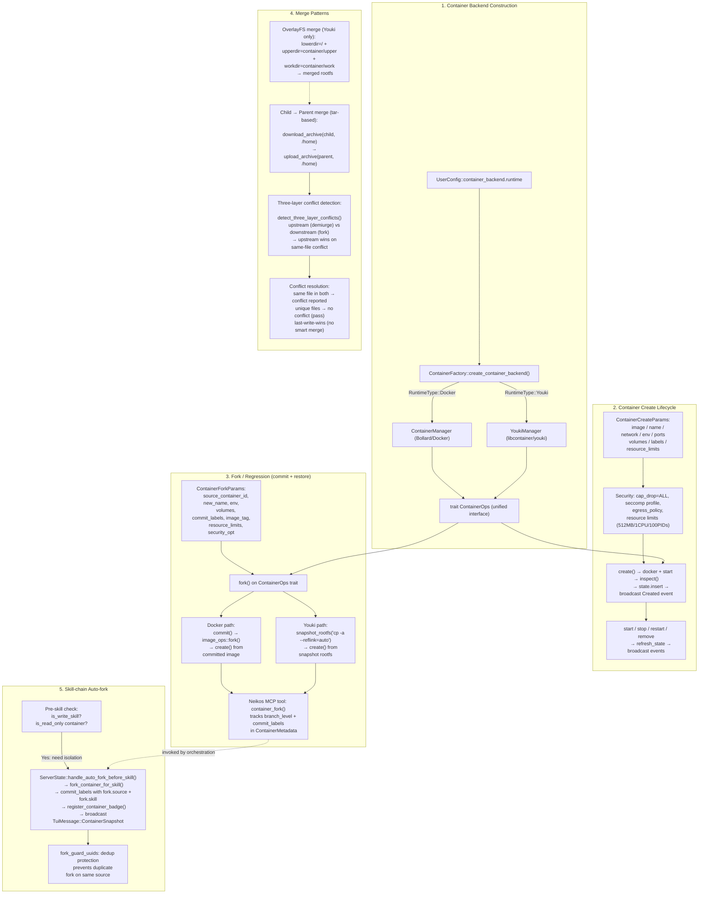
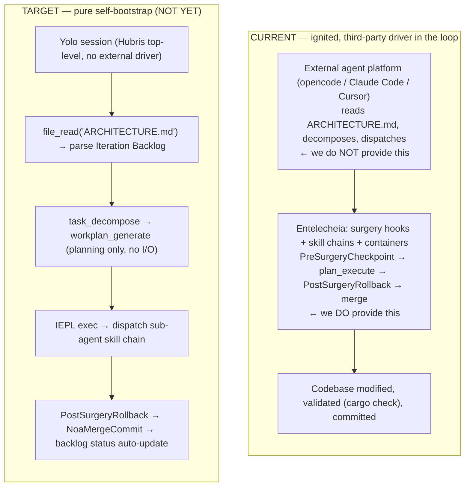
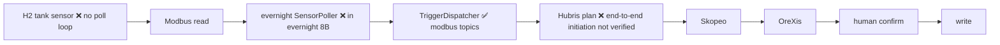
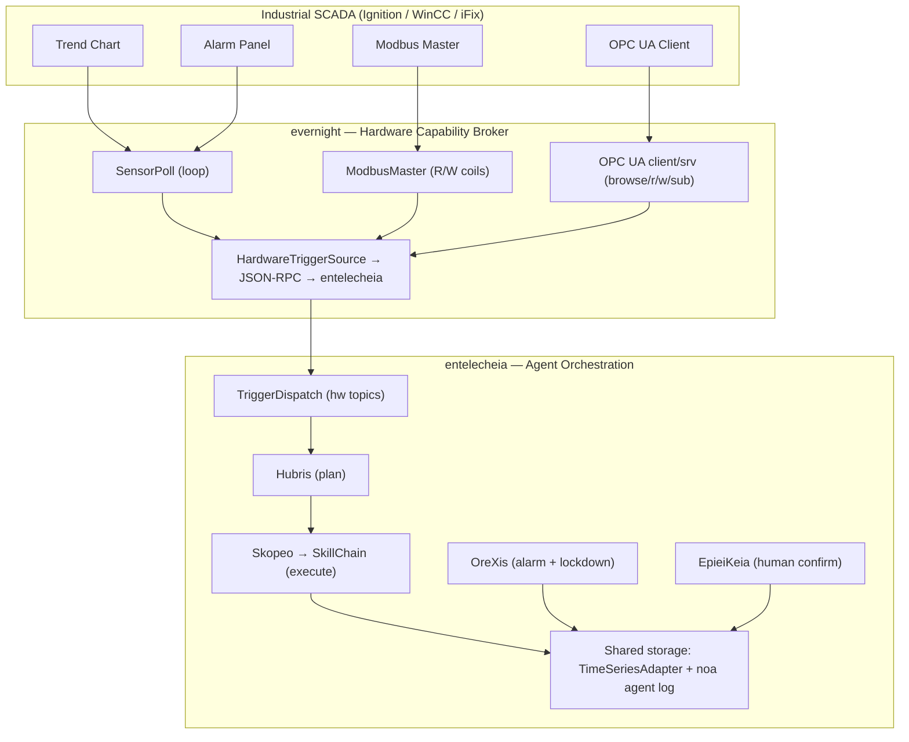

# البنية المعمارية

> **الإصدار**: 0.2.0 — تطوير مبكر، غير جاهز للإنتاج.
> **آخر تحقق**: 2026-06-17 (تحليل عميق — أعيدت معايرته مقابل الكود الفعلي)
> يصف هذا المستند كلًا من الكود المنفّذ والتصميم المقصود.
> اقرأ قسم [الفجوات الحالية](#current-gaps) قبل اتخاذ قرارات النشر.

## تقسيم المستودع

أكملت Entelecheia انقسامها الرئيسي: تم نقل طبقات الواجهة التي تواجه المستخدم إلى مشروع شقيق يسمى **shittim-chest** (`../shittim-chest`). تركز Entelecheia الآن حصريًا على نواة التنسيق متعدد الوكلاء.

| المستودع | النطاق |
| --- | --- |
| **entelecheia** | تنسيق Scepter، 16 وكيلًا (12 L1 + 4 L2)، بيئة تشغيل Cosmos/IEPL، 32 صندوقًا مشتركًا |
| **shittim-chest** | arona (واجهة الدردشة الأمامية)، malkuth (واجهة الإدارة)، خلفية `shittim_chest` (وكيل axum + مصادقة + webhook)، إضافات IDE، تطبيقات Tauri |

## النطاق الحالي

Entelecheia هي مساحة عمل Rust تضم **56 صندوقًا** تتمحور حول `packages/scepter` (خادم التنسيق)، و**32 صندوقًا مشتركًا** ضمن `packages/shared/` (تم تفكيكها بالكامل من صندوق أحادي سابق؛ ولم تتجسد 5 صناديق فرعية مخطط لها أبدًا وتم تضمين وظائفها داخل الصناديق الشقيقة)، و`packages/tui` (واجهة طرفية). واجهة TUI هي الواجهة الأكثر اكتمالًا. يحتوي `packages/cli` على أوامر إدارة الخدمة والدردشة والجدول الزمني.

تم **نقل المكوّنات التالية إلى shittim-chest** وإزالتها من هذا المستودع:

- `packages/webui` (مضيف HTTP/ستاتيك، جسر WebSocket) — أُزيل
- `packages/webui_frontend` (واجهة WASM أمامية) — أُزيل (المرحلة 1)
- `packages/ide/vscode` (إضافة VS Code) — أُزيل (المرحلة 1)
- `packages/ide/idea` (إضافة IntelliJ) — أُزيل (المرحلة 1)
- `packages/app/tauri*` (تطبيقات Tauri سطح المكتب/المحمول) — أُزيل (المرحلة 1)
- كل حالة WebUI والأوامر والعرض في صناديق TUI/CLI/Scepter/المشتركة — أُزيل (المرحلة 2)

خضع المشروع لعملية تفكيك رئيسية: تم حل الصندوق `packages/shared` الأحادي القديم (38 ألف سطر، 187 ملفًا .rs) بالكامل إلى صناديق فرعية مركزة. 5 حدود للصناديق ظهرت في مخططات الطبقات المبكرة لم تتجسد كصناديق منفصلة أبدًا؛ وظيفتها المقصودة تعيش داخل صناديق أخرى (مثلًا، معدّادات المجال مضمّنة في `shared-domain-agent`، وأنواع الخيوط في `shared-state-types`). تستخدم جميع تعريفات التبعية الداخلية `workspace = true` لضمان اتساق الإصدارات.

## فحص واقع المكوّنات

| المكوّن | منفّذ | تصميم فقط / كعب | الحكم |
| --- | --- | --- | --- |
| **Scepter** (التنسيق) | المصادقة/RBAC، توجيه المزودين، دورة حياة الوكيل، تنفيذ سلسلة المهارات، نقاط نهاية WebSocket/HTTP، تشفير المفاتيح. 351 اختبار وحدة عبر 49 ملفًا مصدريًا. يحتوي `AppState` على تطبيقات `FromRef` لـ 5 حالات فرعية؛ تستخدم معالجات agent_lifecycle القيمة `State<Arc<Persistence>>` | سطح API مكتمل. معرّف معالج الدفعات لكن غير مُنشأ. | 🟢 حقيقي |
| **TUI** | دورة حياة كاملة: شاشة البداية، تهيئة Docker، الجدول الزمني، نوافذ الوكلاء، التدويل (8 لغات)، تهيئة المزودين، دعم السمات. 329 اختبار وحدة عبر 47 ملفًا مصدريًا. تم تقسيم `ComponentStore` إلى 5 هياكل فرعية؛ تم تقليص AppState إلى 6 حقول. يتصل عبر مقبس Unix (المفضل) أو WebSocket كبديل. | تكافؤ ميزات مع API الخاص بـ Scepter. لم يتم ربط `CancelRequest`/`ExecuteSudoCommand` بعد. | 🟢 حقيقي |
| **CLI** | إدارة الخدمة، الدردشة، الجدول الزمني، أوامر دورة حياة الوكيل. 28 اختبار وحدة. | ليس في تكافؤ الميزات مع TUI | 🟡 جزئي |
| **WebUI** | أُزيل — نُقل إلى shittim-chest | — | ✅ مكتمل |
| **WebUI Frontend** | أُزيل — نُقل إلى shittim-chest | — | ✅ مكتمل |
| **Cosmos / بيئة JS** | محرك Boa، توزيع استيراد وحدات ES (`__native_dispatch` الداخلي)، توليد النطاقات، McpRouter مع قاطع دائرة+إعادة محاولة. التوليد التلقائي لـ `.d.ts` من `#[derive(TS)]` يملأ ملفات أنواع TypeScript. 50 اختبار وحدة. | خط أنابيب التحويل SWC لـ TypeScript منفّذ ومختبر (37 اختبار وحدة). الخط الأنابيب المؤتمت الكامل (مخرجات LLM ← SWC ← Boa) قابل للوصل عبر `shared_iepl::client` مع ميزة `in-process-transpile`. | 🟢 نشط |
| **16 وكيلًا (12 L1 + 4 L2)** | كل الـ 16 وكيلًا تترجم مع تطبيقات أدوات MCP. 147 أداة MCP إجمالًا — **كلها حقيقية**. صفر ماكروهات `unimplemented!()` أو `todo!()` في قاعدة الكود. | أدوات الهندسة البرمجية الكلاسيكية موسومة بـ `maturity: Stub` في البيانات الوصفية لكن لها تطبيقات حقيقية (استدعاءات عمليات فرعية لـ cargo clippy، eslint، pylint، go vet؛ مقاييس الكود؛ إعادة هيكلة extract-function). | 🟢 نشط |
| **Layer2: أتمتة الويب** | 11 أداة MCP — كلها تطبيقات حقيقية عبر بروتوكول WebDriver: إدارة الجلسات، التنقل، لقطات الشاشة، تنفيذ السكربتات، سجلات وحدة التحكم/الشبكة، لوحة المفاتيح، الفأرة، التسجيل. `maturity: Experimental` لـ 10 أدوات. | — | 🟢 نشط |
| **Layer2: الهندسة البرمجية الكلاسيكية** | 7 أدوات MCP — كلها تطبيقات حقيقية: static_analyze (cargo clippy/eslint/pylint/go vet)، code_review (يكشف الدوال الطويلة، التعشيش العميق، الأرقام السحرية)، quality_check (LOC، التعقيد، الدرجات الحرفية)، refactor_suggest، lsp_diagnose، lsp_symbols، lsp_refactor (إعادة تسمية حقيقية و extract-function). 2 اختبار وحدة. | معاينة العملية الداخلية لإعادة هيكلة LSP فقط (تحتاج خادم LSP للحل الكامل). | 🟢 نشط |
| **Layer2: إنترنت الأشياء الصناعي** | 7 أدوات MCP — كلها تطبيقات حقيقية: modbus_read، modbus_write، s7comm_probe، serial_discover، opcua_browse، opcua_read، opcua_write. اتصال بروتوكول صناعي (Modbus RTU/TCP، Siemens S7comm، عميل OPC UA). `maturity: Experimental`. | نُقلت من SkeMma/PoleMos كجزء من دمج Layer2. | 🟢 نشط |
| **Layer2: العمليات عن بعد** | 16 أداة MCP — كلها تطبيقات حقيقية: إدارة جلسات SSH، تنفيذ الأوامر عن بعد، نقل الملفات (SFTP)، جمع معلومات المضيف، أتمتة الواجهة الرسومية (لقطات شاشة X11/VNC، إدخال، تنقل)، مراقبة النظام. `maturity: Experimental`. | نُقلت من SkeMma/PoleMos كجزء من دمج Layer2. | 🟢 نشط |
| **تصميمات Layer2 الأخرى** | كل وكلاء L2 الأربعة المخطط لها لديهم الآن تطبيقات. يحتوي `res/prompts/domain_agents/` على وثائق التهيئة/المهارات لجميع الوكلاء المنفّذين. | لم يُنشأ `docs/plans/` أبدًا | 🟢 نشط |
| **العزل بالحاويات** | بيئة تشغيل ثنائية المستوى: Docker/Podman (التنسيق الخارجي) عبر Bollard، Youki/libcontainer (صندوق الرمل الداخلي) عبر libcontainer. مستخدم غير جذر، cap_drop=ALL، no-new-privileges، شبكة Docker مخصصة، IPC عبر مقبس Unix، حدود الموارد (512ميجابايت/1CPU/100 PID) عند الإنشاء والتفريع والدمج وإعادة الإنشاء. ملفات seccomp مخصصة. التفريع/الالتزام/اللقطة تعمل بالكامل على كلتا الواجهتين الخلفيتين. | ملفات AppArmor غير منفّذة. `read_only_rootfs` غير مُفعّل افتراضيًا. | 🟡 جزئي |
| **الذاكرة / RAG** | تضمين مدعوم بـ API (متوافق مع OpenAI، تجزئة SHA-256 كبديل، ONNX fastembed BGE-M3). 3 واجهات خلفية للتضمين منفّذة بالكامل. مخزن PgVector، مستندات متجهة في الذاكرة، اجتياز الرسم البياني، RagContextBuffer لحقن السياق المحيطي. 39 اختبار وحدة. | اتصال التضمين←RAG مفكك (المستدعي يوفر تضمينات محسوبة مسبقًا). مسار PgVector أحدث/أقل اختبارًا من البديل في الذاكرة. مزامنة اشتراك RAG محجوزة (غير منفّذة بعد). | 🟡 جزئي |
| **خط أنابيب IEPL** | محرك Boa + جسر MCP + تصفية النطاقات + قاطع دائرة. تحليل SWC لـ TypeScript منفّذ ومختبر (37 اختبار وحدة). التوليد التلقائي لـ `.d.ts` يعمل. توليد كود IEPL (أنواع Rust ← إعلانات TS) موصول. تحويل TS←JS متاح عبر `shared_iepl::client` (وضع العملية الداخلية أو العملية الفرعية). | سلسلة SWC←Boa غير مدمجة لمسار تنفيذ حاوية Cosmos (يتوقع JS مجردًا مسبقًا). | 🟡 جزئي |
| **تكاملات IDE** | أُزيلت — نُقلت إلى shittim-chest | — | ✅ مكتمل |

## مخطط البنية المعمارية

### الحالي



### المستهدف (بعد الانقسام)



مفتاح الرموز: ✅ يعمل | ⚠️ منفّذ جزئيًا | 🔴 كعب/تصميم

## طبقات تبعية الصناديق

الصناديق المشتركة الـ 32 منظمة في رسم بياني للتبعيات الطبقية:

```mermaid
block-beta
    columns 1
    block:L0["Layer 0 (leaf)"]:1
        shared-core shared-logging shared-macros
    end
    block:L1["Layer 1"]:1
        shared-domain-enums shared-mcp-types shared-text shared-concurrent
    end
    block:L2["Layer 2"]:1
        shared-config shared-agent-registry shared-state-types
    end
    block:L3["Layer 3"]:1
        shared-domain-agent shared-container shared-domain-agent-lifecycle shared-domain-agent-runtime
        shared-domain-thread-types shared-domain-toolchain shared-infra-utils
    end
    block:L4["Layer 4"]:1
        shared-state-sync shared-domain-skills shared-hooks shared-domain-auth shared-container-runtime
        shared-domain-skills-permissions shared-timeline shared-iepl
    end
    block:L5["Layer 5"]:1
        shared-llm-provider shared-prompt shared-custom-agent shared-storage
        shared-infra-jsonrpc shared-infra-services shared-e2e-events shared-adapter shared-plugin_host
        shared-rag shared-embedding shared-security-policy
    end
    L0 --> L1 --> L2 --> L3 --> L4 --> L5
```

يستورد المستهلكون (scepter, agents, tui) مباشرة من الصناديق الفرعية الفردية (مثلًا، `_shared_domain_agent`، `_shared_llm_provider`). لا يوجد صندوق تجميع رفيع — تم حل الصندوق `shared` الأحادي القديم بالكامل. تستخدم جميع التبعيات الداخلية تعريفات `workspace = true` لضمان اتساق الإصدارات.

> **ملاحظة:** المخطط أعلاه يسرد 37 موضع صندوق عبر 6 طبقات، لكن 32 فقط موجودة كأعضاء قابلين للترجمة في مساحة العمل. المواضع الـ 5 التالية كانت حدود صناديق مخطط لها لم تتجسد كصناديق منفصلة أبدًا: `shared-domain-enums`، `shared-agent-registry`، `shared-domain-thread-types`، `shared-domain-toolchain`، `shared-state-sync`. وظيفتها مضمّنة داخل الصناديق الشقيقة (مثلًا، معدّادات المجال تعيش داخل `shared-domain-agent`؛ `shared-state-sync` موجود فقط كاسم مستعار لمساحة العمل `_shared_state_sync` يشير إلى `packages/shared/state_types`).

## الوكلاء النشطون

تترجم مساحة العمل 12 وكيل Layer1 (111 أداة MCP) و4 صناديق Layer2 (أتمتة الويب 11 أداة، الهندسة البرمجية الكلاسيكية 7 أدوات، إنترنت الأشياء الصناعي 7 أدوات، العمليات عن بعد 16 أداة). يستخدم جميع الوكلاء الماكرو `agent_mcp_module!` لتسجيل أدوات MCP. تدعم الماكرو `skill_routing` للوكلاء الذين يحتاجون إلى اعتراض ما قبل الإرسال (مثلًا، الإرسال المزدوج `SkillExecutor` الخاص بـ Skopeo).

**حالة تنفيذ الأدوات:** كل الـ 147 أداة لها تطبيقات حقيقية. لا توجد ماكروهات `unimplemented!()` أو `todo!()` في أي مكان بقاعدة الكود. لا تُرجع أي أداة `Ok(())` تافهة بدون منطق حقيقي.

| الوكيل | الطبقة | المسؤولية الحالية | الأدوات | الكعوب | تغطية الاختبارات | النضج |
| --- | --- | --- |  ---  |  ---  |  ---  | --- |
| **HapLotes** | 1 | البوابة، توجيه الرسائل، ربط النقل | 2 | 0 | 21 اختبار | 🟢 حقيقي |
| **SkoPeo** | 1 | التنسيق وتدفق التنفيذ المواجه لـ LLM | 12 | 0 | 41 اختبار | 🟢 حقيقي |
| **HubRis** | 1 | التخطيط، إدارة المهام، التقارير، مساعدو المشكلات | 8 | 0 | 65 اختبار | 🟢 حقيقي |
| **KaLos** | 1 | عمليات الملفات والمستودعات | 8 | 0 | 20 اختبار | 🟢 حقيقي |
| **NeiKos** | 1 | دورة حياة الحاويات ومساعدو التنفيذ | 17 | 0 | 14 اختبار | 🟢 حقيقي |
| **SkeMma** | 1 | تنفيذ السكربتات وبيئة التشغيل المعزولة | 2 | 0 | 124 اختبار | 🟢 حقيقي |
| **ApoRia** | 1 | تهيئة المزودين، مساعدو المعرفة، أدوات RAG | 11 | 0 | 14 اختبار | 🟢 حقيقي |
| **EleOs** | 1 | بحث الويب واسترجاع المعلومات عن بعد | 2 | 0 | 11 اختبار | 🟢 حقيقي |
| **EpieiKeia** | 1 | مساعدو الجدولة والصيانة | 8 | 0 | 4 اختبارات | 🟢 حقيقي |
| **OreXis** | 1 | فرض سياسة الأمان (الحظر وقت التشغيل عبر قائمة الرفض/السماح/الإغلاق) + هرمية الإنذار + تقارير التدقيق | 20 | 0 | 19 اختبار | 🟢 حقيقي |
| **PhiLia** | 1 | الذاكرة والدوال المتعلقة بمخازن البيانات | 7 | 0 | 0 اختبار | 🟡 تغطية اختبار صفرية |
| **PoleMos** | 1 | اتصال المضيف وقياسات الأجهزة | 9 | 0 | 3 اختبارات | 🟡 تغطية اختبار منخفضة |
| **أتمتة الويب** | 2 | أتمتة المتصفح (إنشاء، تنقل، لقطة شاشة، تنفيذ، وحدة تحكم، شبكة، لوحة مفاتيح، فأرة، تسجيل) | 11 | 0 | 3 اختبارات | 🟡 تغطية اختبار منخفضة (`maturity: Experimental`) |
| **الهندسة البرمجية الكلاسيكية** | 2 | تحليل ساكن، مراجعة كود، فحص جودة، اقتراح إعادة هيكلة، LSP تشخيص/رموز/إعادة هيكلة | 7 | 0 | 2 اختبار | 🟡 تغطية اختبار منخفضة (`maturity: Stub` في البيانات الوصفية لكن تطبيقات حقيقية) |
| **إنترنت الأشياء الصناعي** | 2 | اتصال بروتوكول صناعي (Modbus RTU/TCP، Siemens S7comm، عميل OPC UA) | 7 | 0 | 0 اختبار | 🟡 تغطية اختبار منخفضة (`maturity: Experimental`) |
| **العمليات عن بعد** | 2 | تنفيذ SSH عن بعد، نقل ملفات، أتمتة واجهة رسومية، مراقبة نظام | 16 | 0 | 0 اختبار | 🟡 تغطية اختبار منخفضة (`maturity: Experimental`) |

## Layer2 و Layer3

- **Layer2 اليوم**: `web_automation` (11 أداة MCP)، `classic-software-engineering` (7 أدوات MCP)، `industrial_iot` (7 أدوات MCP)، و`remote_operations` (16 أداة MCP) هي صناديق Layer2 النشطة. يوفر `classic-software-engineering` تحليلًا ساكنًا، مراجعة كود، فحوصات جودة، اقتراحات إعادة هيكلة، تشخيصات LSP، استخراج رموز، وإعادة هيكلة LSP — منفّذ في `packages/domain_agents/classic_software_engineering/`. يوفر `industrial_iot` اتصال بروتوكول صناعي (Modbus RTU/TCP، Siemens S7comm، OPC UA) — نُقل من أدوات SkeMma/PoleMos في Layer1. يوفر `remote_operations` تنفيذ SSH عن بعد، نقل ملفات، أتمتة واجهة رسومية، ومراقبة نظام — نُقل من أدوات SkeMma/PoleMos في Layer1. نظام إضافات WASI (`plugin_host`) مع wasmtime + boa TS صندوق رمل مزدوج يستضيف إضافة مرجعية لـ GitHub webhook؛ ومعمارية Trigger (`TriggerDispatcher` / `TriggerTopic` / `TriggerConfig`) توزع الأحداث الخارجية على سلاسل المهارات.
- **تصميمات Layer2 الأخرى**: كل وكلاء L2 الأربعة المخطط له منفّذون الآن. يحتوي `res/prompts/domain_agents/` على وثائق التهيئة/المهارة/MCP لوكلاء L2 المنفّذين. الدليل المخطط له أصلاً `docs/plans/` لم يُنشأ أبدًا.
- **Layer3**: سيتم تحميل الوكلاء المعرفين من قبل المستخدم من أدلة `.amphoreus/` المحلية في مساحة العمل. أوامر CLI للاشتراك/القائمة/التشغيل لوكلاء Layer3 الخارجيين موجودة. يوفر الصندوق `shared-custom-agent` بنية تحتية جزئية. لم يتم تنفيذ أي منطق أعمال فعلي لإضافات Layer3.

## أنماط بيئة التشغيل

### تعريض الأدوات للتنفيذ فقط

سطح الأدوات المواجه للنموذج صغير عمدًا: `exec`، `write_to_var`، و`write_to_var_json`. يتم استدعاء أدوات MCP الداخلية (~146 إجمالًا عبر جميع الوكلاء) من بيئة التشغيل عبر استيراد وحدات ES بدلًا من تعريضها مباشرة واحدة تلو الأخرى. هذا هو الابتكار المعماري الأساسي للمشروع — فهو يقلل من عبء سياق LLM، ويقلل من سطح الهجوم، ويركز فرض الصلاحيات.

### نموذج التنفيذ المختلط

ينسق Scepter كلًا من منطق العملية الداخلية ومسارات التنفيذ المدعومة بالحاويات. تعيش حلقة التنسيق الرئيسية في `SkillChainPipeline::execute()` (`packages/scepter/src/state_machine/skill_chain/pipeline.rs`)، التي تم تفكيكها إلى طرق طور مركزة — `resolve_agent_identity()`، `broadcast_skill_started()`، `finalize_execution()`، `route_to_next_skill()` — بالإضافة إلى الطرق المساعدة الـ 8 الموجودة لفحوصات الحراسة وبناء التوجيهات وقائمة الأدوات المسموحة ودورة حياة المهمة الفرعية. تمركز بناء `ReportDispatchContext` عبر مُنشئ `new()` مما يلغي التكرار 3×.

تمت إعادة هيكلة الدالة القديمة `run_chain_loop` في `execution/execution_steps.rs` إلى غلاف رفيع من 6 أسطر يفوّض إلى `SkillChainPipeline::execute()`.

### خط أنابيب IEPL لـ TypeScript



جزء محرك Boa + جسر MCP يعمل من البداية للنهاية. خط أنابيب التحويل القائم على SWC لـ TypeScript منفّذ ومختبر (37 اختبار وحدة). التوليد التلقائي لـ `.d.ts` من هياكل Rust `#[derive(TS)]` يملأ ملفات أنواع TypeScript لإكمال تلقائي لـ IEPL. الخط الأنابيب المؤتمت الكامل (مخرجات LLM ← SWC ← Boa مع الروابط) قابل للوصل عبر `shared_iepl::client` (أوضاع التحويل داخل العملية أو عملية فرعية). مسار تنفيذ حاوية Cosmos يتوقع حاليًا JS مجردًا مسبقًا (تكامل SWC←Boa غير مفعّل بعد داخل الحاوية).

### منطق إنشاء الحاوية والتفريع والدمج

يُبنى نظام الحاويات حول سمة `ContainerOps` موحدة مع واجهتين خلفيتين قابلتين للتبديل (Docker عبر Bollard، OCI عبر youki/libcontainer). توفر عمليات التفريع (التزام + إنشاء من لقطة) آلية الانحدار/الاستعادة. نقل الأرشيف القائم على tar واكتشاف تعارض ثلاثي الطبقات يشكلان استراتيجية الدمج.

**بنية بيئة التشغيل ثنائية الطبقة:**

| الطبقة | بيئة التشغيل | الافتراضي | النطاق |
| --- | --- | --- | --- |
| **الخارجية** (التنسيق) | Docker/Podman | `CONTAINER_RUNTIME=docker` | حاويات البنية التحتية: scepter، postgres. تُنشأ عبر محرك التهيئة، ويتم فحص صحتها من قبل TUI. تتطلب تنسيقًا كاملًا (شبكات، أحجام، فحوصات صحة). |
| **الداخلية** (صندوق رمل cosmos) | Youki/libcontainer | `COSMOS_CONTAINER_RUNTIME=youki` | صناديق رمل وكيل مؤقتة داخل scepter. خفيفة، سريعة التشغيل، مقيدة بـ seccomp. |

مساعدات اختيار بيئة التشغيل تعيش في `shared/infra_services/src/container_factory.rs`:

- `outer_runtime_type()` — يقرأ `CONTAINER_RUNTIME`، يفترض `docker` افتراضيًا
- `cosmos_runtime_type()` — يقرأ `COSMOS_CONTAINER_RUNTIME`، يفترض `youki` افتراضيًا



| المفهوم | الملف/الملفات المصدرية |
| --- | --- |
| بناء الواجهة الخلفية | `shared/infra_services/src/container_factory.rs` |
| سمة `ContainerOps` | `shared/container/src/ops.rs` |
| إنشاء/تفريع Docker | `shared/container/src/lifecycle.rs`, `image_ops.rs` |
| إنشاء/تفريع Youki | `shared/container_runtime/src/manager.rs`, `rootfs.rs` |
| دمج Child→Parent | `shared/container/src/copy_ops.rs` (تنزيل tar←رفع) |
| تعارض ثلاثي الطبقات | `shared/container/src/copy_ops.rs` (`detect_three_layer_conflicts()`) |
| التفريع التلقائي لسلسلة المهارات | `scepter/src/state_machine/skill_chain/container_ops.rs` |
| أداة تفريع Neikos MCP | `agents/neikos/src/mcp/tools/container/container_fork.rs` |
| لقطة الحاوية | `scepter/src/state_machine/snapshot.rs`, `agents/neikos/src/mcp/tools/container/container_snapshot.rs` |

### حالة ربط المسار من البداية للنهاية

| # | المسار | الحالة | نقاط الاتصال الرئيسية |
| --- | --- | --- | --- |
| 1 | **بدء Scepter ← WS ← سلسلة المهارات** | 🟢 موصول بالكامل | `scepter/src/app/setup.rs:876-1653`, `scepter/src/lib.rs:139-361`, `scepter/src/tui_connection/core/message_dispatch.rs:10-140` |
| 2 | **بدء TUI ← اتصال scepter** | 🟢 موصول بالكامل | مقبس Unix (المفضل) أو WebSocket كبديل مع مصافحة كاملة + مزامنة الحالة |
| 3 | **خط أنابيب IEPL (SWC←Boa←MCP)** | 🟡 موصول جزئيًا | المحوّل يعمل (37 اختبار). توزيع Boa+MCP موصول. جسر SWC←Boa قابل للوصل عبر `shared_iepl::client` لكن ليس داخل الحاوية. |
| 4 | **إنشاء/تفريع/دمج الحاوية** | 🟢 موصول بالكامل | ثنائي المستوى: Docker/Podman (Bollard) + Youki (libcontainer). كلاهما يطبقان سمة `ContainerOps`. |
| 5 | **موزّع المحفّزات (حدث HW←وكيل)** | 🟢 موصول بالكامل | مقبس Unix + WebSocket + PluginHost ← `TriggerDispatcher` ← `SkillInvoker` |
| 6 | **قراءة القياسات/الدفعات** | 🟡 موصول جزئيًا | `BatchProcessor` معرّف، غير مُنشأ. محلل `SensorBatch` موجود، غير مستدعى. |
| 7 | **خط أنابيب RAG/التضمين** | 🟡 موصول جزئيًا | 3 واجهات خلفية للتضمين منفّذة بالكامل. محرك RAG يعمل. اتصال التضمين←RAG مفكك (المستدعي يوفره). |

### العزل بصندوق رمل مزدوج

| قناة التنفيذ | يمكن استدعاء دوال الأدوات (عبر استيراد وحدات ES) | نوع صندوق الرمل | الغرض |
| --- | --- | --- | --- |
| `neikos.exec()` | نعم (عبر استيراد وحدات ES) | سياق Boa المستمر | تنسيق المهارة (توزيع وكيل-إلى-وكيل) |
| `skemma.script_exec()` | لا | صندوق رمل عملية مستقل | الواجهات الخلفية لأدوات MCP (حساب/إدخال-إخراج) |

### نموذج الذاكرة الحالي

ميزات المعرفة والذاكرة موجودة بشكل أبسط مما تصفه وثائق التصميم: مستندات متجهة في الذاكرة، تضمينات قائمة على التجزئة، واجتياز الرسم البياني موجودة. تمت إضافة خدمة تضمين مدعومة بـ API مع بديل تجزئة وخلفية تخزين PgVector، لكن المكدس الكامل ONNX + pgvector غير مدمج بعد من البداية للنهاية.

### تكامل المزودين

تم تهيئة 26 مزود LLM (OpenAI، Anthropic، Google، بالإضافة إلى منظومة LLM الصينية الكاملة: DeepSeek، Qwen، GLM، StepFun، Moonshot، Doubao، Hunyuan، إلخ). نماذج التوليد (صورة/صوت/فيديو/3D) لديها بيانات وصفية TOML وسمة مزود. معظم المزودين الصينيين يستخدمون بروتوكول OpenAI المتوافق فقط، مما يفقد الميزات الأصلية.

## الفجوات الحالية

> **هذا القسم هو المرجع الموثوق بشأن ما لا يعمل بعد.**

### حرجة (تعيق الاستخدام دون TUI)

- **تكافؤ ميزات CLI تحسّن بشكل كبير**: يدعم `packages/cli` الآن إدارة الخدمة (تهيئة، تقديم، إيقاف)، الدردشة، الجدول الزمني، استعلامات دورة حياة الوكيل (عبر `Cli.Status`)، عمليات CRUD لتهيئة المزودين (`config provider {list,get,add,set,rename,remove}`)، وتصفح أدوات/مهارات MCP (`mcp tools`/`mcp skills` عبر `Cli.ListTools`/`Cli.ListSkills`). تمت إزالة `ProcessManager` الميت (بدء/إيقاف/إعادة تشغيل الوكلاء كملفات تنفيذية مستقلة) — الوكلاء تعمل داخل العملية الداخلية في scepter. فجوات CLI المتبقية مقابل TUI: واجهة مستخدم تفاعلية متعددة الصفحات، التدويل، السمات، تصور تفريع/دمج حاوية الوكيل.
- **لوحة أوامر TUI والإلغاء موصولة**: `Ctrl+P` تفتح لوحة الأوامر (12 أمرًا). `Ctrl+G` ترسل `request.cancel` إلى scepter عبر مسار RPC سريع جديد يضبط علم الإلغاء ويجهض JoinHandle للطلب النشط. أوامر الشرطة المائلة `/clear` و`/settings` منفّذة. `WorkerInput::CancelRequest` يوثق مسار Ctrl+G. `ExecuteSudoCommand` يبقى غير موصول (يحتاج تدقيق أمني).
- **WebUI، إضافات IDE، تطبيقات Tauri نُقلت إلى shittim-chest**: تجربة المستخدم المواجهة للويب (واجهة درردة arona، لوحة إدارة malkuth، تكامل IDE، دخول webhook) أصبحت الآن في المشروع الشقيق `../shittim-chest`. تمت إزالة كل مراجع WebUI من TUI، CLI، Scepter، والصناديق المشتركة. (ملاحظة: `packages/webui_bindings/` هو دليل مشروع TypeScript متبقي لا يشير إليه أي صندوق Rust.)

### رئيسية (تعيق جاهزية الإنتاج)

- **الهندسة البرمجية الكلاسيكية لها تطبيقات حقيقية لكنها تحتاج تقوية**: 7 أدوات MCP تعمل بالكامل (قائمة على العمليات الفرعية لـ cargo clippy/eslint/pylint/go vet؛ مراجعة كود قائمة على الأنماط، مقاييس جودة، إعادة هيكلة extract-function). علامة `maturity: Stub` في بيانات التسجيل الوصفية مضللة — الأدوات تعمل لكنها ستستفيد من تكامل خادم LSP لتحليل أعمق. 2 اختبار وحدة.
- **رسائل خطأ مختلطة اللغات**: سلاسل التدويل على مستوى الواجهة موزعة بشكل صحيح حسب معلمة اللغة. رسائل الخطأ المتبقية في منطق أعمال Rust بالإنجليزية. بعض سلاسل ترجمة أسماء النماذج في `tui/src/ui/modals/models.rs` تستخدم الصينية كبيانات مصدر (أسماء نماذج المزودين).
- **يحتوي `AppState` الخاص بـ Scepter على تطبيقات `FromRef`**: تم تطبيق `FromRef<AppState>` لـ `RbacServices`، `Arc<Persistence>`، `Arc<ApiGateway>`، `ConfigServices`، `Arc<ServerState>`. تم نقل معالجات دورة حياة الوكيل إلى `State<Arc<Persistence>>`. المعالجات المتبقية يمكنها الانضمام تدريجيًا.

### متوسطة (تعيق الاكتمال)

- **فجوات أمان الحاويات**: ملفات seccomp مخصصة منفّذة. ملفات AppArmor غير منفّذة. `read_only_rootfs` غير مُفعّل افتراضيًا. حدود الموارد (512ميجابايت ذاكرة، 1 CPU، 100 PID) مطبقة عند إنشاء الحاوية وتفريعها وإعادة إنشائها. بيئة التشغيل ثنائية المستوى (Docker/Podman خارجية + Youki/libcontainer داخلية) تعمل بالكامل.
- **OreXis يعمل بالكامل**: وكيل الأمان يفرض قائمة رفض الأدوات، قائمة السماح، الإغلاق الطارئ، وتجاوزات السياسة الخاصة بالجلسة وقت الاستدعاء عبر `SecurityPolicySet`. هرمية الإنذار (`alarm_tools.rs`) مع عتبات HH/H/L/LL/ROC، التخميل، إزالة الارتداد، ومسارات التصعيد منفّذة. وضع `audit_only` (افتراضي: مغلق) قابل للتبديل. 19 اختبار. مفقود: تحميل مسبق لـ 97 رمز خطأ من hydro-tin-monitor.
- **مكدس الذاكرة/RAG موصول في الغالب**: كل واجهات التضمين الثلاث (API، ONNX fastembed، تجزئة SHA-256 كبديل) منفّذة بالكامل. الواجهة الخلفية PgVector تعمل. اجتياز الرسم البياني يعمل. اتصال التضمين←RAG مفكك (المستدعي يوفر تضمينات محسوبة مسبقًا بدلًا من الحساب التلقائي المضمّن). مزامنة اشتراك RAG محجوزة (غير منفّذة بعد).
- **قراءة القياسات/الدفعات موصولة جزئيًا**: بنية `BatchProcessor` معرّفة لكن غير مُنشأة في تهيئة scepter. محلل `try_intercept_sensor_batch()` معرّف لكن غير مستدعى في حلقة توزيع الرسائل. تحليل تنسيق رسالة `SensorBatch` موجود في trigger_intercept.
- **عدم اتساق نوع معرف JSON-RPC**: Rust/TypeScript/Kotlin تستخدم أنواع معرفات JSON-RPC مختلفة.
- **تغطية الاختبارات**: ~2,070 دالة `#[test]` إجمالًا. scepter (351) وtui (329) الأكثر اختبارًا. 5 صناديق ليس لها اختبارات (philia، concurrent، e2e_events، github-webhook، plugins/examples). تعتمد معظم الصناديق المشتركة (30/33) على اختبارات وحدة مضمّنة فقط. صندوق اختبارات E2E على مستوى مساحة العمل (`tests/rust`) لديه 95 اختبار.

### إشارة-إلى-ضجيج التصميم

- للمشروع وثائق تصميم موسعة تصف وظائف تتجاوز بكثير ما هو منفّذ. لا ينبغي قراءة README ووثائق التصميم كقوائم ميزات.
- واقع المشرف الواحد (مؤلف واحد في `Cargo.toml`) يعني أن مساحة عمل بأكثر من 57 صندوقًا محدودة السعة بطبيعتها.
- ترخيص BUSL-1.1 مع منحة استخدام إضافية: الاستخدامات غير التجارية والأكاديمية والحكومية والتعليمية والعمليات الداخلية مجانية بموجب حقوق مكافئة لـ SySL-1.0. الاستضافة التجارية وإعادة البيع والنشر/الدعم المدفوع يتطلب ترخيصًا تجاريًا. يتحول إلى SySL-1.0 لجميع الاستخدامات في 2030-01-01.

## ديون البنية المعمارية

| المشكلة | الأولوية | الجهد المقدر |
| --- | --- | --- |
| ~60 نمط `.map_err(...to_string())` عبر 21 ملفًا (8 `\|e\| e.to_string()` مطابقة تمامًا، 52 متغيرًا أوسع). مركزة في حدود المحولات (`shared/adapter`، `shared/llm_provider`) وعملاء API الخارجية (`docker_client`، `plugin_loader`). نمط محولات مقبول عند الحدود؛ الكود الداخلي يجب أن يستخدم أخطاء محددة النوع. | P4 | مصدر قلق على مستوى المكتبة |
| بيانات `maturity: Stub` الوصفية على أدوات الهندسة البرمجية الكلاسيكية مضللة — كل الـ 7 لها تطبيقات حقيقية (محللات قائمة على العمليات الفرعية، كاشفات أنماط، مقاييس كود، إعادة هيكلة extract-function). يجب رفعها إلى `Experimental` أو أعلى. | P4 | بيانات وصفية فقط |
| محلل `SensorBatch` معرّف (`trigger_intercept.rs:58-70`) لكن غير موصول في حلقة توزيع الرسائل. بنية `BatchProcessor` معرّفة لكن غير مُنشأة في تهيئة scepter. مسار استيعاب القياسات موجود لكن غير متصل. | P3 | عمل ربط |
| تكامل التضمين←RAG مفكك (المستدعي يوفر تضمينات محسوبة مسبقًا). يجب أن يكون موصولًا تلقائيًا: `EmbeddingService` ← `RagSubscriptionService` عند استيعاب المستندات. | P3 | غراء تكامل |
| 5 صناديق ليس لها اختبارات: `philia`، `concurrent`، `e2e_events`، `github-webhook`، `plugins/examples`. وكلاء مجال L2 لديهم اختبارات ضئيلة (2-3 لكل واحد). | P2 | جهد لكل صندوق |

## التنفيذ المستقل: الحالة الحالية

> **الحالة: مُشعّل — يعمل من البداية للنهاية، لكن مدفوع بمنصة وكلاء خارجية.**
> حلقة الكلاب الدواء الذاتية / YOLO dogfood تقلع، تعدّل قاعدة الكود، تتحقق منها، و
> تلتزم بشكل مستقل. لكن دور المخطط/الموزع يملؤه حاليًا
> **منصة وكلاء خارجية** (opencode، Claude Code، Cursor، إلخ)، وليس منسق
> Hubris/Skopeo الخاص بـ Entelecheia. **التشغيل الذاتي النقي** —
> منسق Entelecheia الخاص يقرأ هذه الخطة ويوزع سلاسل IEPL بدون
> مشغل خارجي في الحلقة — **لم يتحقق بعد**. راجع الفجوات المتبقية أدناه.

### ما هو موصول (توفر Entelecheia طبقة أمان التنفيذ)

- **خطافات الجراحة الذاتية** (`scepter/.../skill_chain/execution/surgery_hooks.rs`):

`PreSurgeryCheckpoint` (يسجل git HEAD قبل الجراحة)، `PostSurgeryRollback`
(تراجع تلقائي عند الفشل)، منطق إعادة النشر، `attempt_rollback`. مسجلة في
مدير الخطافات.

- **حلقة دقات YOLO**: إيقاعات مؤقتة زمنيًا (دوري 5 دقائق / يومي 6 ساعات / استراتيجي

7 أيام). المهارات: `yolo_cycle_report`، `regression_monitor` (تنبؤ انحدار المستوى اليومي
مع منطق قرار التفريع). الاستدلال التفريعي موثق في
`res/prompts/system/yolo-fork-pattern.md` — عندما تكتشف دقة عملًا لا يمكنها إنهاءه
ضمن الميزانية، تفرع جلسة `#demiurge.xxx` بدلًا من الاقتطاع.

- **منسق الدمج التسلسلي**: مقفل بملف، محجوب بميزة؛ يوجّه التزامات noa ما بعد السلسلة

عبر `run_exclusive` بحيث لا تفسد التفريعات YOLO المتزامنة السجل.

- **تفريع/دمج الحاويات** للتجريب الآمن (Docker/Podman خارجي + Youki

صندوق رمل داخلي).

- التزام المعلم `37863366e` ("初步实现自主思考能力") أنزل الحلقة من البداية للنهاية.

### البنية: الحالية (مُشعّل) مقابل التشغيل الذاتي النقي (المستهدف)



كان فرض قائمة الأدوات البيضاء السابقة `role = "coordinator"` (IB-02 القديم) و
مهارة `hubris::read_iteration_plan` المخصصة (IB-01 القديم) الآليات المخططة
للتشغيل الذاتي النقي. كان القرار العملي إشعال الحلقة أولًا بالاعتماد على منصة
وكلاء خارجية لدور المخطط/الموزع. إعادة تقديم تلك الآليتين هو ما سيغلق فجوة التشغيل الذاتي.

### الفجوات المتبقية التي تعيق التشغيل الذاتي النقي

| الفجوة | الحالة الحالية | المطلوب | الأولوية |
| --- | --- | --- | --- |
| **محلل وثائق الخطة الداخلي** | تعمل الحلقة فقط لأن منصة وكلاء خارجية تقرأ ARCHITECTURE.md وتفكك المهام بنفسها. لا توجد مهارة داخلية. | مهارة `hubris::read_iteration_plan`: تحليل جدول المهام المتراكمة ← إرجاع `Vec<BacklogItem>` منظّم بحيث يمكن لمنسق Entelecheia الخاص قيادة الحلقة. | P0 |
| **فرض فصل المنسق-العامل** | المنصة الخارجية توفر فصلها الخاص بين المخطط/العامل؛ خط أنابيب Entelecheia لا يفرضه. يمكن لسلسلة مهارات منسق أن تستدعي `file_write`/`host_command_exec` مباشرة. | إضافة حقل `role` إلى مقدمة المهارة؛ تجريد الأدوات المعدّلة من سلاسل `role = "coordinator"` في باني قائمة الأدوات البيضاء في `pipeline.rs`. | P0 |
| **التحقق من معايير القبول** | يفحص `PostSurgeryRollback` `cargo check --workspace` (على مستوى البناء) لكن ليس معايير القبول الخاصة بالمهمة. ربط جزئي في `prompt.rs`. | نطاق أسماء خطاف `verify_acceptance_criteria`: يصرح كل عنصر مهام بمعايير قابلة للفحص (نجاح الاختبارات، وجود ملف، تنفيذ دالة). | P1 |
| **آلة حالة حالة المهام** | يحمل هذا الجدول عمود `status` لكن لا يكتبه أي وكيل بشكل مستقل بعد. | تحديث تلقائي لـ `status: pending → in_progress → done | blocked` بعد كل سلسلة+التزام. | P1 |
| **ميزانية السياق للسلاسل العميقة** | `context_overflow_handler` موجود؛ تفويض IEPL العميق لا يزال هشًا عندما يكون SkeMma المعزول بالحاوية غير متاح. | تثبيت تنفيذ الوكيل المعزول بالحاوية (مشكلة جذر youki) أو جعل البديل في العملية الداخلية قويًا للسلاسل العميقة. | P2 |

### مهام التكرار المتراكمة

> **تنسيق قابل للقراءة آليًا.** يحلل المشغل النشط (حاليًا منصة
> وكلاء خارجية، في النهاية منسق Entelecheia الخاص) هذا الجدول للعثور على
> العمل القابل للتنفيذ التالي. حدّث `status` بعد الإكمال.

| المعرّف | العنوان | الحالة | معايير القبول | ملاحظات |
| --- | --- | --- | --- | --- |
| IB-01 | مهارة `hubris::read_iteration_plan` | **متخطاة** | وثيقة مهارة في `res/prompts/agents/hubris/skills/read_iteration_plan.md`؛ تحلل جدول مهام ARCHITECTURE.md؛ تُرجع قائمة مهام منظّمة | اشتعلت الحلقة بدون هذا — منصة الوكلاء الخارجية تقرأ الخطة مباشرة. إعادة تقديمها مطلوبة **للتشغيل الذاتي النقي** فقط. |
| IB-02 | فرض قائمة الأدوات البيضاء للمنسق | **متخطاة** | لا يمكن لسلسلة مهارات المنسق استدعاء `file_write` / `host_command_exec` مباشرة؛ فقط عبر وكيل فرعي مُوزع | مثل IB-01: المنصة الخارجية توفر فصلها الخاص بين المخطط/العامل. مطلوب فقط للتشغيل الذاتي النقي. |
| IB-03 | نطاق أسماء خطاف `verify_acceptance_criteria` | **جزئي** | نطاق أسماء الخطاف مسجل؛ معايير كل عنصر مهام مفحوصة ما بعد السلسلة؛ إجهاض عند الفشل | ربط جزئي في `skill_chain/prompt.rs`. فحص على مستوى البناء (`cargo check`) يعمل؛ معايير على مستوى المهمة ليس بعد. |
| IB-04 | تحديث تلقائي لحالة المهام | معلّق | بعد سلسلة + التزام ناجح، يكتب المنسق الحالة المحدّثة إلى ARCHITECTURE.md عبر وكيل فرعي | حاليًا إنسان أو مشغل خارجي يحرر هذا العمود. |
| IB-05 | SkeMma المعزول بالحاوية (إصلاح جذر youki) | معلّق | `kernel.unprivileged_userns_clone=1` أو صندوق رمل بديل لا يحتاج CAP_SYS_ADMIN | تبعية خارجية؛ تعيق سلاسل IEPL العميقة في الوضع المعزول بالحاوية |
| IB-06 | تكافؤ ميزات CLI مع TUI | معلّق | يدعم CLI كل أوامر TUI (تهيئة المزود، نافذة الوكيل، السمات) | راجع الفجوات الحالية ← حرجة |
| IB-07 | تغطية اختبارات وكلاء مجال L2 | معلّق | كل صندوق L2 لديه ≥5 اختبارات تكامل؛ تصل classic_software_engineering إلى الاستقرار | حاليًا 2 (CSE) + 3 (WA) اختبارات |
| IB-08 | ONNX + pgvector من البداية للنهاية | معلّق | خط أنابيب التضمين: نموذج ONNX ← مخزن pgvector ← استرجاع دلالي؛ ينجح اختبار التكامل | التضمين و RAG يعملان بشكل منفصل؛ التكامل مفكك |
| IB-09 | تكامل عميل OPC UA الحقيقي | معلّق | وصلة الصندوق `opcua` لقدرات عميل/خادم OPC UA حقيقية | تكامل عميل OPC UA الحقيقي مطلوب |
| IB-10 | إشعال الكلاب الدواء المستقل | **منجز (عبر مشغل خارجي)** | جلسة yolo من البداية للنهاية: إقلاع ← قراءة المهام ← توزيع وكيل فرعي ← تعديل كود ← PostSurgeryRollback ينجح ← التزام | البنية موثقة. ما تبقى هو استبدال المشغل الخارجي بمنسق Entelecheia الخاص (IB-01 + IB-02). |

### مقاييس جاهزية التنفيذ المستقل

> مقسمة إلى **بنية تحتية** (ما تملكه Entelecheia) و **تشغيل ذاتي**
> (تشغيل نقي بدون مشغل خارجي). أنزلت معلمة الإشعال؛ مقاييس
> التشغيل الذاتي النقي غير قابلة للتطبيق حتى يُعاد تقديم IB-01/IB-02.

| المقياس | المستهدف | الحالي |
| --- | --- | --- |
| ترجمة مساحة العمل (`cargo check --workspace`) | نظيف بـ 0 أخطاء | ✅ نظيف (تحذير dead_code واحد) |
| أدوات MCP بتطبيقات حقيقية | 100% | 99.3% (147/148) |
| أدوات كعب | 0 | 0 |
| ماكروهات `unimplemented!()` / `todo!()` في قاعدة الكود | 0 | 0 |
| **— طبقة البنية التحتية (تملكها Entelecheia)** | | |
| سلسلة خطاف الجراحة الذاتية (نقطة تفتيش ← تراجع ← دمج) | موصولة + مسجلة | ✅ موصول (`surgery_hooks.rs`، منسق الدمج التسلسلي) |
| معدل الإيجابيات الكاذبة لـ PostSurgeryRollback | 0% | ✅ 0% (مُصلح في `ce64d3843`) |
| إيقاعات دقات YOLO (دوري / يومي / استراتيجي) | 3 مستويات تعمل | ✅ تعمل مع نمط-تفريع + regression_monitor |
| **— طبقة التشغيل الذاتي (بدون مشغل خارجي)** | | |
| إشعال الكلاب الدواء من البداية للنهاية | تعمل الحلقة | ✅ مُشعّل (التزام `37863366e`) |
| …مدفوعة بمنسق Entelecheia الخاص (ليس منصة خارجية) | 100% من الجلسات | 🔴 0% — حاليًا كل الجلسات تستخدم منصة وكلاء خارجية كمشغل |
| محلل المهام الداخلي (IB-01) | المهارة موجودة | 🔴 غير مبني (متخطى؛ مطلوب لغلق الفجوة) |
| فرض قائمة الأدوات البيضاء للمنسق (IB-02) | مفروض في خط الأنابيب | 🔴 غير مفروض (متخطى؛ مطلوب لغلق الفجوة) |
| متوسط عمق سلسلة الوكيل الفرعي | ≥2 (منسق ← وكيل فرعي ← تحقق) | ⚠️ يعتمد على المشغل: المنصات الخارجية تضبط عمقها الخاص؛ عمق العملية الداخلية لـ Entelecheia غير مُقاس |

## التحكم الصناعي بالهيدروجين — فجوات التنسيق

> **المستهدف**: ممر عرض صناعي للهيدروجين (المرحلة الثانية، مصنع مع 6 حاويات).
> كل الإدخال/الإخراج الفيزيائي يمر عبر evernight (راجع evernight `PLAN.md` المرحلة 8).
> يصف هذا القسم ما يجب أن تضيفه entelecheia لغلق حلقة التنسيق.

### الحالة الحالية: الكتابة فقط

يعمل المسار من قرار الوكيل إلى المشغّل الفيزيائي:


### مفقود: حلقة مغلقة للقراءة ثم التصرف

المسار العكسي — قراءة المستشعر تطلق استجابة الوكيل — مبني جزئيًا:



### تحليل الفجوة لكل مكوّن

> **آخر تحقق**: 2026-06-14 — 3 فجوات كانت مذكورة سابقًا كمفتوحة أصبحت منفّذة الآن.

| الفجوة | الحالي | المطلوب | الأولوية |
| --- | --- | --- | --- |
| **جسر حدث المستشعر ← خطة Hubris** | يستقبل Hubris توجيهات المستخدم عبر TUI/CLI | يجب أن يقبل Hubris `TriggerEvent { topic: "modbus.19.h2_leak_conc.hh" }` كحدث بدء خطة. `TriggerDispatcher::dispatch_event()` يستدعي المهارات المشتركة؛ بدء خطة Hubris من البداية للنهاية من أحداث المستشعر غير موثق بعد في اختبار تكامل. | P0 |
| **استيعاب دفعات القياسات موصول** | `BatchProcessor` معرّف لكن غير مُنشأ؛ محلل `try_intercept_sensor_batch()` موجود لكن غير مستدعى في حلقة التوزيع | وصلة معالج `Sensor.Batch` في توزيع الرسائل ← `BatchProcessor` ← مخزن القياسات | P1 |
| **هرمية الإنذار في OreXis** | ✅ **منفّذ بالكامل.** `alarm_tools.rs`: ضع/أزل/أقر بقواعد الإنذار (مستويات HH/H/L/LL/ROC، العتبة، التخميل، إزالة الارتداد، التصعيد: سجل←إشعار_وكيل←تصحيح_تلقائي←إشعار_بشري←إيقاف_طارئ). `SharedAlarmPolicyStore` يعمل. تجاوزات المحطة مدعومة. | مفقود: تحميل مسبق لـ 97 رمز خطأ من hydro-tin-monitor. | P2 |
| **محول السلاسل الزمنية** | ✅ **منفّذ.** `JsonlTimeSeriesAdapter` يطبق سمة `TimeSeriesAdapter`. يُستخدم من قبل `skemma/state.rs`. كتابات مؤجلة، تحليل النقاط، استعلام. | مستقبلي: واجهة خلفية TimescaleDB/InfluxDB خلف ميزة. | ✓ |
| **قراءة/كتابة Modbus** | ✅ **منفّذ بالكامل.** `industrial_iot::modbus_read` (FC 01/02/03/04 مع بوابة أمان السجلات) و`industrial_iot::modbus_write` (FC 05/06/15/16 مع بوابة قائمة بيضاء الكتابة) كلاهما يعمل. | — | ✓ |
| **اكتشاف S7comm** | ✅ **منفّذ.** `industrial_iot::s7comm_probe` يتصل TCP:102، يحصل على معلومات CPU، يمسح أرقام DB، يفحص بنية DB. يستخدم `s7comm_probe` الخاص بـ evernight. | — | ✓ |
| **اكتشاف المنفذ التسلسلي** | ✅ **منفّذ.** `industrial_iot::serial_discover` يعدّد المنافذ، يفحص معدلات البث، يمسح معرفات محطات Modbus. | — | ✓ |
| **إنسان في الحلقة لعمليات الكتابة** | `emergency_lockdown` يحظر كل الكتابات | إضافة سياسة `require_approval` — الكتابة إلى السجلات الحرجة أمنيًا تتطلب تأكيد المشغل عبر إدارة webui. نوع بروتوكول `WriteApprovalRequest` معرّف في arona (المرحلة A من PLAN.md). | P1 |
| **عميل/خادم OPC UA** | تكامل عميل/خادم OPC UA مطلوب. يكتشف IndustrialIoT المنفذ 4840 ولديه عميل OPC UA أساسي للتصفح/القراءة/الكتابة عبر أدوات `industrial_iot::opcua_*`. لا يوجد تطبيق خادم OPC UA كامل. | عميل OPC UA حقيقي للقراءة من أجهزة SCADA خارجية؛ خادم OPC UA لكشف قراءات مستشعرات entelecheia لـ SCADA الصناعي (Ignition/WinCC/iFix). | P1 |
| **جسر حلال MPC** | لدى `hydro-platform-research` مجدول MILP/MPC بلغة Python | تعريضه كأداة MCP: `call_mpc_solver` ← IPC ← عملية Python ← إرجاع الجدول. أو الترحيل إلى Rust (`good_lp` + `argmin`). | P2 |
| **التكرار / تجاوز الفشل** | بنية عقدة واحدة (scepter واحد، PostgreSQL واحد) | scepter مزدوج استعدادًا ساخنًا مع انتخاب القائد. يمكن إعادة استخدام آلية تفريع Neikos للاستلام السريع. | P2 |
| **واجهة HUI للمشغل** | TUI طرفية فقط؛ webui واجهة دردشة | تراكب P&ID، رسوم الاتجاهات، لوحة الإنذار، سجل تدقيق إجراءات المشغل. لدى hikari عناصر واجهة كافية (Chart، Timeline، Table) لكن تحتاج تركيبًا خاصًا بـ HMI. | P2 |

### بنية التنسيق المستهدفة



### مرجع الاختبار — خرائط سجلات المعدات الحقيقية

من `/mnt/sdb1/hydro-tin-monitor/doc/通信端口说明 25.8.7.md`:

| الجهاز | المحطة | معدل البث | السجلات | ملاحظات |
| --- | --- | --- | --- | --- |
| محلل كهربائي AEM (2 Nm3/h) | 21 | 9600 | ~32 IR (0x04)، 32-bit float BE | درجات الحرارة، الضغوط، التدفقات، الفولتيات |
| محلل كهربائي ALK (3 Nm3/h) | 20 | 9600 | ~32 IR (0x04)، 32-bit float BE | نفس تنسيق AEM |
| محلل كهربائي PEM | 2 | 9600 | ~17 HR (0x03)، 16-bit موقّع | الضغوط، جودة الماء، التسرب، الفولتية |
| خزانات الهيدروجين المضغوط | 19 | 57600 | 33 HR (0x03) + 1 ملف (0x01) | حقل 11 بتات صمام، 97 رمز خطأ، خطأ معروف في ترتيب البايتات |
| تخزين الهيدروجين ذو الحالة الصلبة | 25 | 9600 | ~12 HR (0x03)، 32-bit float BE | ضغوط/درجات حرارة الخزان A/B |
| خلية الوقود | 31 | 9600 | 6 ملفات + 11 HR | بدء/إيقاف، إيقاف طارئ، بيانات المكدس |
| RSOC (الصندوق 1) | افتراضي | — | عبد Modbus افتراضي | راجع `doc/1号箱 RSOC 虚拟modbus RTU从站.xlsx` |
| ناقل CAN لخلية الوقود | — | 9600 | CAN 2.0B عبر USB-CAN-A | راجع `doc/4号箱 燃料电池 CAN通信协议.xlsx` |

## الترخيص

| المعامل | القيمة |
| --- | --- |
| الترخيص الحالي | Business Source License 1.1 (BUSL-1.1) |
| ترخيص الاستخدام المجاني | Synthetic Source License 1.0 (SySL-1.0) (لكل الاستخدامات المسموحة) |
| الاستخدامات المسموحة (مجانية) | العمليات الداخلية، الخدمة الحكومية/العامة، الأكاديمي، غير التجاري |
| القيود | خدمات مستضافة/مدارة من أطراف ثالثة، إعادة البيع، النشر/الدعم المدفوع، إعادة العلامة التجارية |
| تاريخ التغيير | 2030-01-01 — تحويل تلقائي إلى SySL-1.0 لجميع الاستخدامات |
| الترخيص التجاري | مطلوب للاستخدامات المقيدة؛ تواصل مع المرخّص |
| الترجمات | zhs، zht، ja، ko، es، fr، ru، de، ar (راجع ملفات `LICENSE.{lang}`) |

راجع `LICENSE` للنص القانوني الإنجليزي الكامل و`LICENSE.{lang}` للترجمات غير المُلزمة.