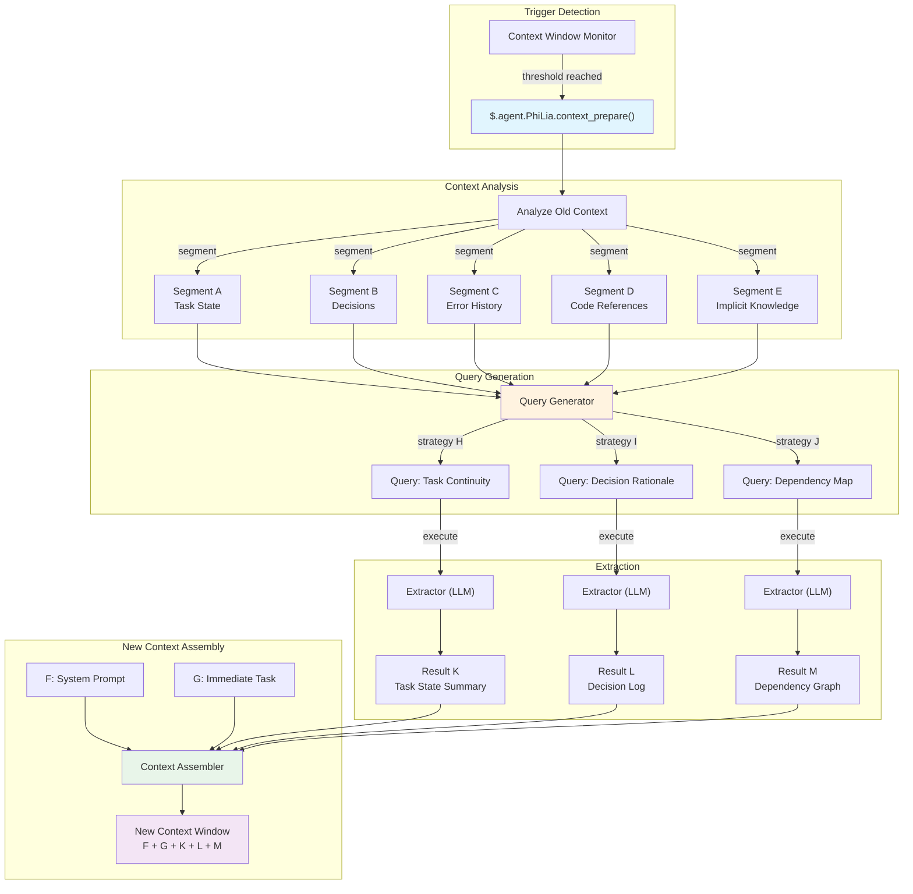
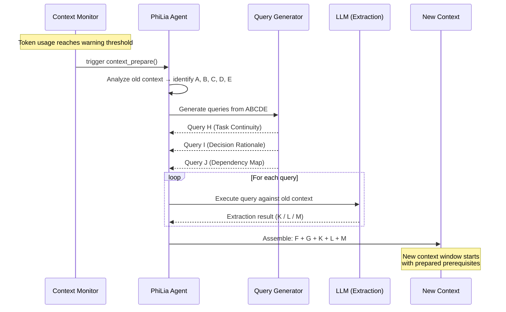

# آلية إعداد السياق

## نظرة عامة

إعداد السياق هو آلية استخراج استباقية تحل محل ضغط السياق التقليدي. بدلًا من ضغط سجل المحادثة القديم بشكل مُفقد للبيانات، تحلل السياق الموجود، وتُولّد استعلامات مستهدفة، وتستخرج بدقة المعلومات اللازمة لبذار نافذة سياق جديدة. الآلية مملوكة بواسطة وكيل PhiLia ومكشوفة عبر `$.agent.PhiLia.context_prepare()`.

## بيان المشكلة

### حدود نافذة السياق

تعمل وكلاء LLM ضمن نوافذ سياق محدودة. المهام طويلة التشغيل — إعادة هيكلة متعددة الملفات، جلسات تصحيح تمتد لعشرات الرسائل، أو تدفقات عمل معقدة متعددة الخطوات — تستنزف في النهاية ميزانية الـ token المتاحة. عندما يحدث هذا، يجب أن يقرر النظام ما يحافظ عليه وما يتخلى عنه.

### الضغط يفقد التفاصيل

مناهج ضغط السياق التقليدية (التلخيص، الاقتطاع، النافذة المنزلقة) مُفقدة للبيانات بطبيعتها. الضاغط لا يعرف ما ستحتاجه *السياق التالي*، لذا يجب أن يخمن. التفاصيل الحرجة تُتخلص منها حتمًا:

- أسماء المتغيرات وقيمها الحالية
- القرارات الوسيطة ومبرراتها
- حالات الخطأ التي ظهرت وحُلت جزئيًا
- الاعتماديات الضمنية بين المهام

الخلل الأساسي: **الضغط يحسّن للإيجاز، وليس للصلة**.

### التداخل عبر المهام

عندما تحتوي نافذة سياق على مهام أو مواضيع متعددة، فإن ضغط سجل مهمة واحدة غالبًا ما يفسد المعلومات التي تحتاجها مهمة أخرى. الملخص الذي يحافظ على حالة المهمة A قد يحجب سلسلة الأخطاء الحرجة للمهمة B. لا توجد استراتيجية ضغط عالمية تخدم كل الاحتياجات المستقبلية الممكنة.

### السؤال الحقيقي

> ما الذي تحتاج نافذة السياق *التالية* أن تعرفه من السياق *الحالي*؟

هذا ليس سؤال ضغط. هو سؤال **استرجاع معلومات** — والإجابة تعتمد على ما يأتي بعد، وليس ما جاء قبل.

## المفهوم الأساسي

### الاستخراج الاستباقي مقابل الضغط

| الجانب | الضغط | إعداد السياق |
| --- | --- | --- |
| الاتجاه | ماضٍ ← ماضٍ أقصر | ماضٍ ← مستخلص جاهز للمستقبل |
| معرفة المستقبل | لا شيء | الاستعلامات تتوقع الاحتياجات القادمة |
| فقدان المعلومات | حتمي، غير مستهدف | مستهدف، متعمد |
| التشبيه | ضغط ملف | البحث في قاعدة بيانات |
| سقف الجودة | جودة الملخص | دقة الاستخراج |

يعامل إعداد السياق السياق القديم كمصدر **بيانات** — مشابه لكيفية معاملة RAG لمجموعة مستندات خارجية — لكن المجموعة هي المحادثة نفسها. بدلًا من ضغط كل شيء في ملخص، يطرح أسئلة مستهدفة على السياق القديم ويجمع الإجابات.

### نموذج ABCDE/KLM

تستخدم الآلية تدوينًا قائمًا على الأحرف لوصف تدفق المعلومات:

```text
Old Context:  A + B + C + D + E
                    ↓ (analyze)
Queries:       ABCDE+H  ABCDE+I  ABCDE+J
                    ↓ (extract)
Results:            K        L        M
                    ↓ (assemble)
New Context:  F + G + K + L + M
```

- **A–E**: مقاطع/جوانب مميزة من السياق القديم (حالة المهمة، القرارات، سجل الأخطاء، مراجع الكود، المعرفة الضمنية)
- **H، I، J**: استراتيجيات استعلام مشتقة من تحليل العناصر الرئيسية لـ A–E. كل استراتيجية تستهدف حاجة معلومات مختلفة
- **K، L، M**: نتائج الاستخراج — الإجابات الدقيقة على كل استعلام
- **F، G**: توجيه النظام الجديد وسياق المهمة الفورية للنافذة الجديدة
- **السياق الجديد** يستقبل F + G (جديد) + K + L + M (مستخرج)، متخطيًا سجل A–E الكامل

### لماذا يحل هذا محل الضغط

بمجرد وجود إعداد السياق، يصبح الضغط التقليدي غير ضروري لأن:

1. **لا تُفقد معلومات بسبب التخمين** — الاستعلامات تُولَّد بناءً على ما سيحتاجه السياق الجديد فعليًا
1. **الاستخراج محدد في البنية** — نفس استراتيجية الاستعلام تنتج دائمًا نفس فئة الإجابة
1. **زوايا متعددة تضمن التغطية** — استعلامات H/I/J تغطي أبعادًا مختلفة (حالة المهمة، سياق الخطأ، مبررات القرار)
1. **السياق القديم يبقى متاحًا** — لا يتم التخلص منه بل يُستعلم عنه عند الطلب أثناء مرحلة الإعداد

## البنية

### التدفق عالي المستوى



### مخطط التسلسل



## تصميم API

### `$.agent.PhiLia.context_prepare()`

نقطة الدخول الرئيسية. تُستدعى عندما يكتشف مراقب نافذة السياق أن استخدام الـ token قد وصل إلى عتبة التحذير.

```typescript
interface ContextPrepareRequest {
    old_context: string;
    current_task: string;
    warning_threshold: number;
    current_usage: number;
    max_tokens: number;
}

interface ContextPrepareResult {
    segments: ContextSegment[];
    queries: GeneratedQuery[];
    extractions: ExtractionResult[];
    prepared_context: string;
    metadata: {
        old_context_tokens: number;
        prepared_context_tokens: number;
        compression_ratio: number;
        queries_executed: number;
        extraction_time_ms: number;
    };
}

// PhiLia API endpoint
$.agent.PhiLia.context_prepare(request: ContextPrepareRequest): ContextPrepareResult
```

### `$.agent.PhiLia.context_query()`

واجهة API أقل مستوى لتنفيذ استعلامات فردية ضد سياق. تُستخدم داخليًا بواسطة `context_prepare()` لكنها متاحة أيضًا للاستعلامات المخصصة.

```typescript
interface ContextQueryRequest {
    context: string;
    query: string;
    strategy: "task_continuity" | "decision_rationale" | "dependency_map" | "custom";
    max_result_tokens: number;
}

interface ContextQueryResult {
    result: string;
    confidence: number;
    source_segments: string[];
    tokens_used: number;
}

$.agent.PhiLia.context_query(request: ContextQueryRequest): ContextQueryResult
```

### `$.agent.PhiLia.context_segment()`

يحلل سياقًا ويقسمه إلى مقاطع مسماة (A–E).

```typescript
interface SegmentRequest {
    context: string;
    max_segments: number;
}

interface Segment {
    id: string;           // "A", "B", "C", etc.
    label: string;        // "Task State", "Decisions", etc.
    content: string;
    token_count: number;
    importance_rank: number;
}

$.agent.PhiLia.context_segment(request: SegmentRequest): Segment[]
```

## استراتيجية الاستعلام

### كيف تُولَّد استعلامات H/I/J

تأخذ عملية توليد الاستعلام السياق القديم المُقسَّم (A–E) وتنتج ثلاث فئات من الاستعلامات، كل منها يستهدف بُعدًا مختلفًا من المعلومات التي يحتاجها السياق الجديد.

### استراتيجية H: استمرارية المهمة

**الغرض**: ضمان أن يمكن للسياق الجديد استئناف المهمة الحالية دون فقدان التقدم.

**منطق التوليد**:

1. تحديد المهام النشطة من المقاطع A و E (حالة المهمة + المعرفة الضمنية)
1. استخراج مؤشرات التقدم الحالية (ما تم، ما قيد التقدم، ما المحظور)
1. توليد استعلام يسأل: *"ما الحالة الحالية لكل المهام النشطة، وما الخطوات التالية؟"*

**استعلام مثال**:

```text
Given the conversation history, identify:
1. All tasks currently in progress and their completion status
2. Any blockers or unresolved errors
3. The exact next step that was about to be taken
4. File paths and line numbers currently being modified
```

### استراتيجية I: مبرر القرار

**الغرض**: الحفاظ على *لماذا* خلف القرارات، وليس فقط *ماذا*.

**منطق التوليد**:

1. مسح المقاطع B و C (القرارات + سجل الأخطاء) بحثًا عن نقاط الاختيار
1. تحديد القرارات حيث اعتُبرت بدائل ورُفضت
1. توليد استعلام يسأل: *"ما القرارات المتخذة، ما البدائل المرفوضة، ولماذا؟"*

**استعلام مثال**:

```text
From this conversation, extract:
1. All architectural or implementation decisions made
2. For each decision: what alternatives were considered
3. For each decision: the specific reason the chosen approach was preferred
4. Any constraints or requirements that influenced these choices
```

### استراتيجية J: خريطة الاعتماديات

**الغرض**: التقاط العلاقات بين عناصر الكود والملفات والمفاهيم.

**منطق التوليد**:

1. مسح المقاطع D و E (مراجع الكود + المعرفة الضمنية) بحثًا عن علاقات الكيانات
1. تخطيط أي الملفات تعتمد على أي، أي الدوال تستدعي أي، أي المفاهيم ترتبط
1. توليد استعلام يسأل: *"ما الاعتماديات والعلاقات الرئيسية بين الكيانات المناقشة؟"*

**استعلام مثال**:

```text
Analyze the conversation and map:
1. All files/modules mentioned and their relationships
2. Function call chains discussed or modified
3. Data flow between components
4. Configuration values and where they are used
5. Any implicit dependencies not directly stated but implied by the work
```

### قابلية التوسع

الاستراتيجيات الثلاث (H، I، J) هي المجموعة الافتراضية. يدعم النظام استراتيجيات مخصصة:

```typescript
interface QueryStrategy {
    id: string;
    name: string;
    description: string;
    source_segments: string[];     // which segments to analyze
    query_template: string;        // template with {segment_X} placeholders
    priority: number;              // execution priority
    max_result_tokens: number;
}
```

يمكن تسجيل استراتيجيات جديدة عبر التهيئة، مما يسمح بأنماط استخراج خاصة بالمجال.

## نقاط التكامل

### مراقب نافذة السياق

يعيش المحفّز لإعداد السياق في نظام مراقبة نافذة السياق الفرعي. عندما يتجاوز استخدام الـ token عتبة التحذير (افتراضي: 80% من الأقصى)، يستدعي المراقب `$.agent.PhiLia.context_prepare()`.

```rust
// In the context window monitor (conceptual)
fn check_context_health(&mut self) {
    let usage_ratio = self.current_tokens as f64 / self.max_tokens as f64;
    if usage_ratio >= self.warning_threshold {
        let result = philia.context_prepare(ContextPrepareRequest {
            old_context: self.get_full_context(),
            current_task: self.get_current_task_description(),
            warning_threshold: self.warning_threshold,
            current_usage: self.current_tokens,
            max_tokens: self.max_tokens,
        });
        self.spawn_new_context(result.prepared_context);
    }
}
```

### تكامل skill_chain.rs

يجب أن يكون منفّذ سلسلة المهارات مدركًا لإعداد السياق. عندما تمتد سلسلة مهارات عبر نوافذ سياق متعددة، تضمن آلية الإعداد أن:

1. تُلتقط حالة سلسلة المهارات في المقطع A (حالة المهمة)
1. مدخلات/مخرجات المهارة الحالية تُلتقط في المقطع D (مراجع الكود)
1. الخطوات المتبقية للسلسلة تُحفظ في نتيجة الاستخراج K (استمرارية المهمة)

```rust
// skill_chain.rs (conceptual integration)
impl SkillChainExecutor {
    fn execute_step(&mut self, step: ChainStep) -> Result<StepResult> {
        // Before executing, check if context preparation is needed
        if self.context_monitor.should_prepare() {
            let prepared = self.philia.context_prepare(
                self.build_prepare_request()
            )?;
            self.context = prepared.prepared_context;
        }
        // Continue with step execution
        self.execute_with_context(step, &self.context)
    }
}
```

### ملكية وكيل PhiLia

إعداد السياق قدرة مملوكة بواسطة PhiLia. هذا يعني:

- واجهة `$.agent.PhiLia.context_prepare()` مسجلة كمهارة PhiLia
- يدير PhiLia قوالب توليد الاستعلام واستراتيجيات الاستخراج
- يطلب الوكلاء الآخرون إعداد السياق عبر PhiLia باستخدام بروتوكول استدعاء المهارة القياسي
- قد يستفيد PhiLia من مخزن معرفته لإثراء الاستعلامات بأنماط تاريخية

### توليد السياق

عندما يُنشئ النظام نافذة سياق جديدة، يحل السياق المُعد (F + G + K + L + M) محل الملخص المضغوط التقليدي:

```rust
fn spawn_new_context(&mut self, prepared: ContextPrepareResult) {
    let system_prompt = self.build_system_prompt();      // F
    let immediate_task = self.get_current_task();         // G
    let new_context = format!(
        "{}\n\n{}\n\n---\n## Context Preparation Results\n### Task State\n{}\n### Decision Log\n{}\n### Dependencies\n{}\n",
        system_prompt,    // F
        immediate_task,   // G
        prepared.extractions[0].result,  // K
        prepared.extractions[1].result,  // L
        prepared.extractions[2].result,  // M
    );
    self.launch_context(new_context);
}
```

## مراحل التنفيذ

### المرحلة 1: الأساس (MVP)

- تنفيذ `$.agent.PhiLia.context_segment()` — تحليل السياق وتقسيمه
- تنفيذ استراتيجيات الاستعلام الافتراضية الثلاث (H: استمرارية المهمة، I: مبرر القرار، J: خريطة الاعتماديات)
- تنفيذ `$.agent.PhiLia.context_prepare()` — تنسيق المقسم ← استعلام ← استخراج ← جمع
- التكامل مع محفّز مراقب نافذة السياق
- التحقق بمحادثات المهمة الواحدة

### المرحلة 2: المتانة

- إضافة تسجيل درجة الثقة لنتائج الاستخراج
- تنفيذ استراتيجيات احتياطية عندما ثقة الاستخراج منخفضة
- إضافة دعم التدفق للسياقات الكبيرة
- تحسين الأداء: تنفيذ الاستعلام المتوازي
- إضافة `$.agent.PhiLia.context_query()` للاستعلامات المخصصة

### المرحلة 3: الذكاء

- تعلم استراتيجيات الاستعلام المثلى من نتائج الإعداد التاريخية
- ترجيح المقطع التكيفي بناءً على نوع المهمة
- حل المرجع عبر السياق (ربط نتائج الإعداد عبر توليدات متعددة)
- التكامل مع ترسيب الذاكرة للاحتفاظ طويل المدى

### المرحلة 4: الاستبدال الكامل

- إزالة مسار كود ضغط السياق القديم
- يصبح إعداد السياق الآلية الوحيدة لانتقالات السياق
- تتبع وجودي ومقاييس جودة كاملة
- وثائق ودليل ترحيل للوكلاء المخصصين

## أمثلة

### مثال 1: إعادة هيكلة متعددة الملفات

**السيناريو**: يعيد وكيل هيكلة صندوق Rust، معدّلًا 15 ملفًا عبر 3 وحدات. تمتلئ نافذة السياق بعد تعديل الملف 10.

**السياق القديم (A–E)**:

- **A** (حالة المهمة): 10/15 ملفًا معدّلًا، الوحدة `auth` و`storage` مكتملة، `api` قيد التقدم
- **B** (القرارات): اختار تجريد قائم على السمة بدلًا من dispatch المعدّد؛ حافظ على التوافق مع الإصدارات السابقة عبر `#[deprecated]`
- **C** (الأخطاء): واجه مشكلة lifetime في `storage/mod.rs:142`، حُلَّت بـ `Arc<Mutex<>>`
- **D** (مراجع الكود): `auth/traits.rs`، `storage/mod.rs:142`، `api/handler.rs:38-56`
- **E** (الضمني): يجب أن يبقى هيكل `User` `Clone` للصناديق النهائية؛ تتبع التغطية

**الاستعلامات المُولّدة**:

- **H** (استمرارية المهمة): "ما الملفات المتبقية للتعديل، ما النمط المطبّق، وما الملف التالي لإعادة هيكلته؟"
- **I** (مبرر القرار): "لماذا اختُير التجريد القائم على السمة بدلًا من dispatch المعدّد، وما قيود التوافق مع الإصدارات السابقة الموجودة؟"
- **J** (خريطة الاعتماديات): "ارسم الاعتماديات بين وحدات `auth` و`storage` و`api`، مشيرًا إلى أي الهياكل/السمات تعبر حدود الوحدات."

**نتائج الاستخراج (K، L، M)** تُجمع مع توجيه النظام الجديد (F) وتعليمة المهمة التالية (G).

### مثال 2: جلسة تصحيح

**السيناريو**: تصحيح مشكلة اتصال WebSocket تمتد عبر فرضيات متعددة ومحاولات اختبار.

**السياق القديم (A–E)**:

- **A** (حالة المهمة): المشكلة محصورة في مرحلة المصافحة؛ نبض القلب ليس السبب
- **B** (القرارات): استبعدت إعداد TLS الخاطئ؛ استبعدت تداخل الوكيل؛ الفرضية الحالية ترتيب الترويسات
- **C** (الأخطاء): `ConnectionReset` عند علامة 3 ثوانٍ، يتكرر باستمرار مع curl لكن ليس المتصفح
- **D** (مراجع الكود): `ws/handshake.rs:67-89`، `headers/mod.rs:23`، ملف الاختبار `tests/ws_test.rs`
- **E** (الضمني): الخادم خلف nginx؛ تظهر المشكلة فقط في الإنتاج، وليس التطوير المحلي

**الاستعلامات المُولّدة** تستخرج حالة التصحيح، الفرضيات المرفوضة، ومسارات التحقيق المتبقية في السياق الجديد.

### مثال 3: سلسلة مهارات عبر الوكلاء

**السيناريو**: يفوّض PhiLia سلسلة مهام إلى Skemma (تصميم المخطط) ثم Logos (التوثيق). يمتلئ السياق أثناء عمل Logos.

**السياق القديم (A–E)**:

- **A** (حالة المهمة): تصميم المخطط مكتمل، التوثيق 60% منجز
- **B** (القرارات): يستخدم المخطط جداول وصل لـ M:N للعلاقات بحسب إرشاد بنية PhiLia
- **C** (الأخطاء): أبلغ Skemma عن غموض في كاردينالية `user_roles`، حُلَّ بإضافة قيد `UNIQUE`
- **D** (مراجع الكود): `schema.sql:45-67`، `docs/api/endpoints.md:12-34`
- **E** (الضمني): يجب أن يطابق التوثيق تنسيق مواصفات OpenAPI 3.0 المستخدم في مكان آخر بالمشروع

يضمن الإعداد أن يستقبل سياق Logos الجديد قرارات المخطط وقيد تنسيق التوثيق، دون الحاجة لمحادثة تصميم Skemma الكاملة.
