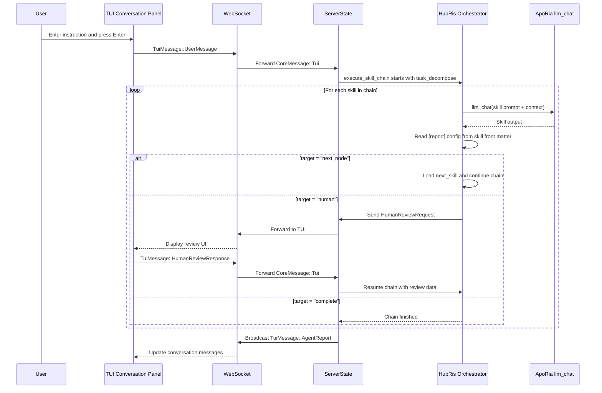

# تصميم تنسيق المحادثة (HubRis + ApoRia)

## الخلفية

HubRis هو "وكيل مهارة نقي" — كل القدرات مهارات توجيهية فقط
تُستدعى عبر ApoRia `llm_chat`. بعد تنفيذ طبقة توجيه التقرير،
تصرح المهارات بسلوك توجيهها في مقدمة TOML عبر قسم
`[report]`، مستبدلة منطق التنسيق المشفّر.

## الأهداف

1. تصرح المهارات بسلوك التوجيه في المقدمة (غير مشفّر).
1. منفّذ سلسلة مهارات عام يستبدل خط الأنابيب ثنائي المراحل المشفّر.
1. المراجعة البشرية هدف توجيه من الدرجة الأولى.
1. تنظيف لغة التوجيه: ملفات المهارة/MCP المسطحة إنجليزية فقط.

## تهيئة تقرير المهارة (مقدمة TOML)

```toml
[report]
target = "next_node"              # "next_node" | "parent" | "human" | "complete"
next_skill = "workplan_generate"  # required if target = "next_node"
```

## سلسلة مهارات HubRis

```text
task_decompose → workplan_generate → operator → workplan_execute → submit_report → human
```

## التدفق من البداية للنهاية



## أهداف توجيه التقرير

| الهدف       | السلوك                                                        |
| --- | --- |
| `next_node`  | يحمل المنفّذ المهارة المسماة في `next_skill` ويشغلها.     |
| `parent`     | يُعيد التحكم إلى المنسق الأصل (محجوز للسلاسل المتداخلة). |
| `human`      | يوقف السلسلة، يرسل `HumanReviewRequest` إلى TUI، يستأنف عند `HumanReviewResponse`. |
| `complete`   | ينهي السلسلة ويُرجع `AgentReport` المتراكم.  |

## بنية الملفات (المرحلة 1)

```text
res/prompts/agents/hubris/skills/
  task_decompose.md
  workplan_generate.md
  operator.md
  workplan_execute.md
  submit_report.md
```

كل ملف مستند Markdown مسطح، إنجليزي فقط، مع مقدمة TOML
تحتوي على قسم `[report]` وأي بيانات وصفية أخرى للمهارة.

## تهيئة لغة الإنسان

تشمل تهيئة بيئة تشغيل الوكيل حقل `human_language` يستخدم أسماء
اللغات الأصلية (مثلًا `"中文"`، `"English"`، `"日本語"`). هذا يتحكم بلغة
كل المخرجات المواجهة للمستخدم دون التأثير على ملفات توجيه المهارة
الإنجليزية فقط.

## سياسة النموذج الافتراضي

يستخدم البدء `glm-4.7-flash` كنموذج افتراضي مُطبّع للبيئة.
يستخدم ApoRia `llm_chat` ذلك النموذج افتراضيًا للحفاظ على تكلفة
التطوير والاختبار منخفضة.

## سياسة الاحتياط عند الفشل

1. إذا فشلت مهارة: أرجع رسالة فشل وأنهِ السلسلة الحالية.
1. إذا كان ApoRia غير متصل: أرجع رسالة `Agent not ready`.
1. إذا انتهت مهلة المراجعة البشرية: أرجع إشعار المهلة دون حظر

الدردشات اللاحقة.
