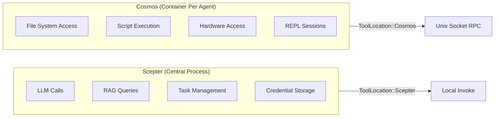
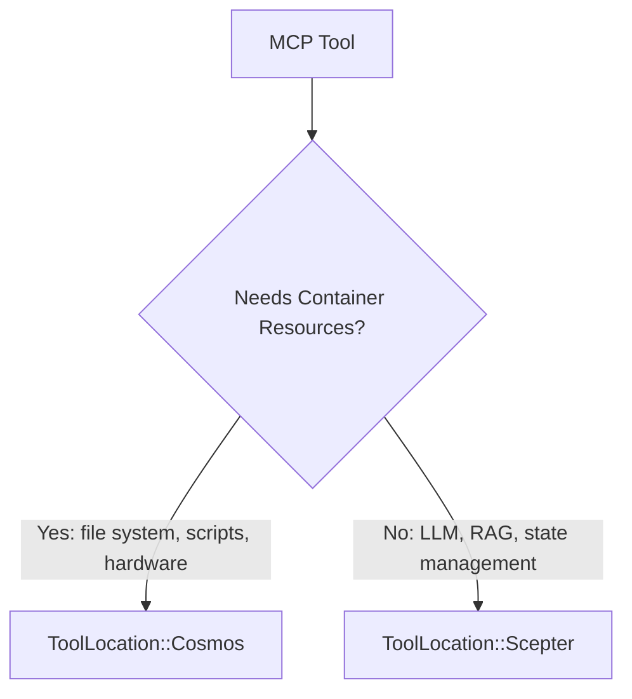
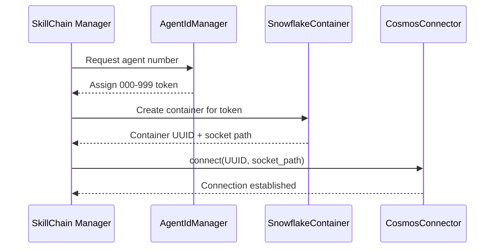
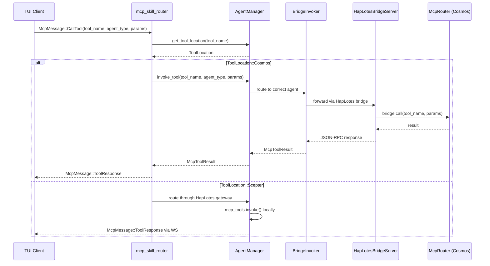
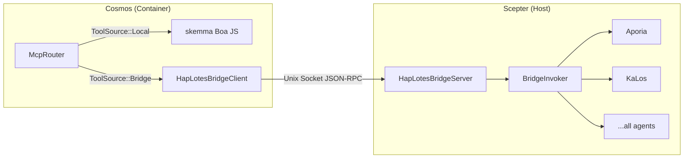
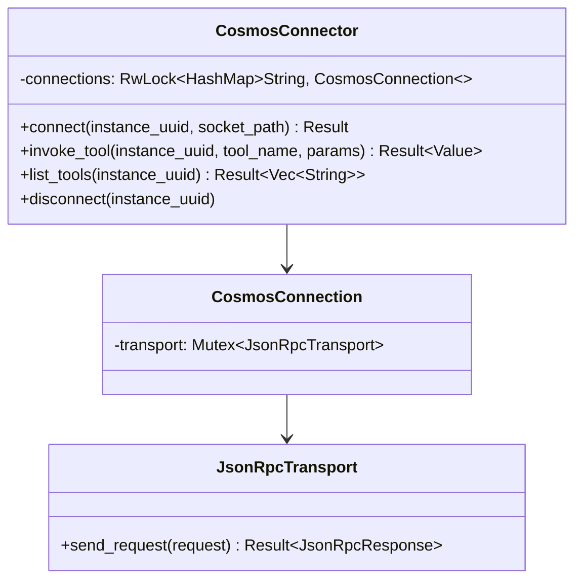
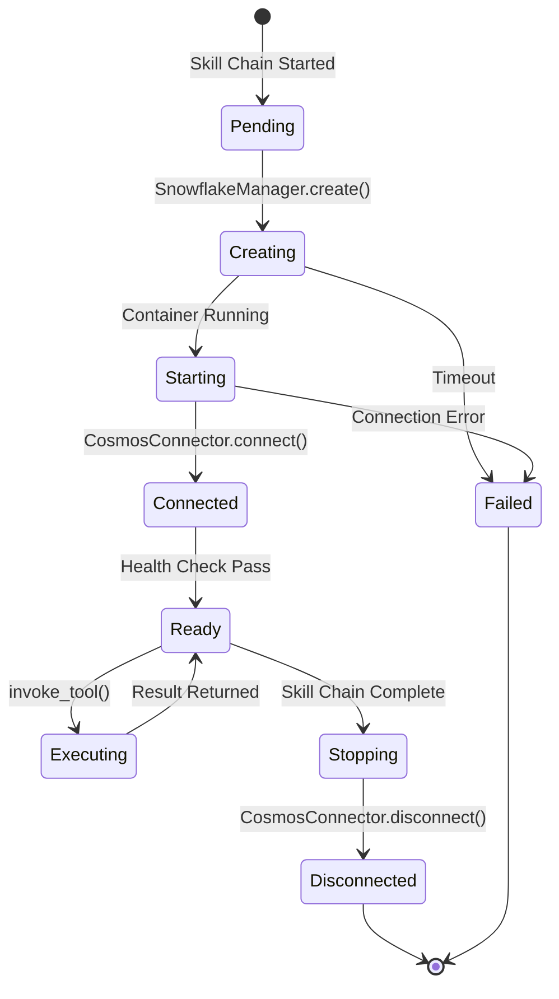
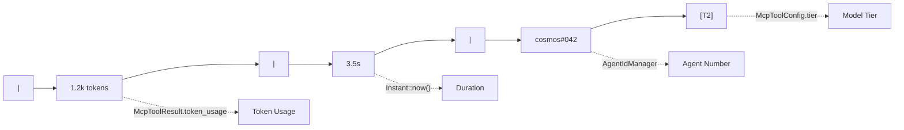
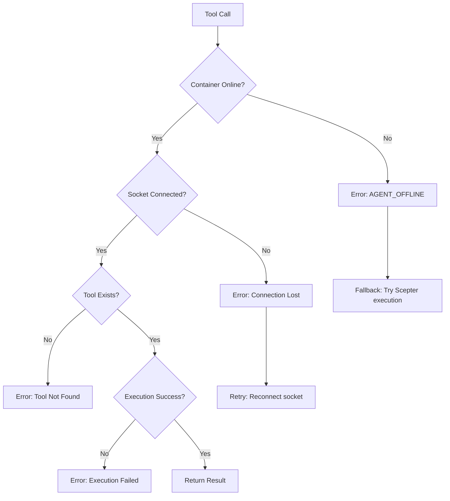

# تصميم جدولة حاويات Cosmos وتوجيه الرموز

## نظرة عامة

تصف هذه الوثيقة بنية جدولة حاويات Cosmos: كيف تُوجَّه أدوات MCP الموسومة بـ `ToolLocation::Cosmos` عبر JSON-RPC بمقبس Unix إلى حاوياتها المقابلة، وكيف يرتبط نظام الرموز (رقم الوكيل) بهوية الحاوية والتوجيه.

## I. نموذج موقع الأداة

### بيئة تنفيذ مزدوجة



### معدّد ToolLocation

| المتغير | موقع التنفيذ | النقل |
| --- | --- | --- |
| `Scepter` (افتراضي) | في العملية عبر `McpToolInvoker` | استدعاء دالة مباشر |
| `Cosmos` | في الحاوية عبر `CosmosConnector` | JSON-RPC بمقبس Unix |

### معايير قرار الموقع



الأدوات التي تتطلب موارد حاوية (نظام الملفات، تنفيذ السكربت، الوصول للأجهزة) موسومة `Cosmos`. الخدمات المركزية (LLM، RAG، إدارة المهام، التفاعل البشري) تبقى `Scepter`.

## II. نظام الرموز وهوية الحاوية

### تخصيص رقم الوكيل



### خصائص الرمز

| الخاصية | الوصف |
| --- | --- |
| التنسيق | رقم ثلاثي: `000`-`999` |
| المخصّص | `AgentIdManager` في سلسلة المهارات |
| الربط | رمز واحد لكل لوحة سلسلة مهارات |
| العرض | يظهر في سطر إحصائيات TUI كـ `cosmos#NNN` |
| الاستمرارية | ينجو عبر إعادة تشغيل الوكيل |

## III. تدفق توجيه الطلبات

### استدعاء MCP منشأ من TUI



### منطق التوجيه الرئيسي

يحدث قرار التوجيه في `mcp_skill_router.rs`:

1. فحص `agent_manager.get_tool_location(tool_name)`
1. إذا `ToolLocation::Cosmos` والوضع المعزول بالحاويات نشط:

   - استدعاء `agent_manager.invoke_tool()` الذي يوجه عبر `BridgeInvoker` ← جسر HapLotes ← `McpRouter` الخاص بـ Cosmos
   - يوزع `McpRouter` الخاص بـ Cosmos محليًا (skemma) أو للخلف إلى Scepter عبر الجسر للوكلاء البعيدين
   - إرجاع `McpMessage::ToolResponse` مباشرة إلى TUI

1. وإلا: التوجيه عبر بوابة HapLotes إلى عملية الوكيل

## IV. بنية CosmosConnector / الجسر

### جسر HapLotes (الحالي)

جسر HapLotes هو **قناة الاتصال الوحيدة** بين Scepter وحاويات Cosmos.



### تجمع الاتصالات (CosmosConnector — جانب Scepter)



### بروتوكول JSON-RPC

تستخدم كل أسماء الدوال معدّد `UnixMethod` لأمان النوع وقت الترجمة:

| متغير UnixMethod | الاتجاه | المعاملات |
| --- | --- | --- |
| `UnixMethod::McpCall` | Scepter ← Cosmos | `{ tool_name, parameters }` |
| `UnixMethod::McpListTools` | Scepter ← Cosmos | لا شيء |
| `UnixMethod::ReplSnapshot` | Scepter ← Cosmos | `{ path }` |
| `UnixMethod::ReplRestore` | Scepter ← Cosmos | `{ path }` |
| `UnixMethod::BridgeCall` | Cosmos ← Scepter | `{ tool_name, parameters }` |
| `UnixMethod::BridgeListTools` | Cosmos ← Scepter | لا شيء |

### تنسيق الاستجابة

```json
{
  "success": true,
  "data": { ... },
  "error": null
}
```

## V. دورة حياة الحاوية



### وكلاء الحاوية

داخل حاويات Cosmos، فقط skemma يعمل محليًا (محرك Boa JS). كل أدوات الوكلاء الأخرى تُوجَّه عبر جسر HapLotes للخلف إلى Scepter:

| الوكيل | الدور | في Cosmos؟ |
| --- | --- | --- |
| SkeMma | تنفيذ السكربت (Boa JS) | **محلي** (في العملية) |
| Aporia | دردشة LLM | عبر الجسر ← Scepter |
| KaLos | إدخال/إخراج الملف | عبر الجسر ← Scepter |
| NeiKos | إدارة الحاويات | عبر الجسر ← Scepter |
| EleOs | بحث الويب | عبر الجسر ← Scepter |
| الباقون | متنوع | عبر الجسر ← Scepter |

## VI. تكامل سطر الإحصائيات

### تنسيق العرض

في `AgentDetailPage` الخاص بـ TUI، يعرض سطر الإحصائيات:



| المقطع | المصدر |
| --- | --- |
| `1.2k tokens` | `McpToolResult.token_usage` |
| `3.5s` | المدة من `Instant::now()` |
| `cosmos#042` | رقم الوكيل من `AgentIdManager` |
| `[T2]` | مستوى النموذج من `McpToolConfig.tier` |

## VII. معالجة الأخطاء

### أوضاع الفشل



### التدهور الرشيد

عندما تكون الحاوية غير متاحة، يمكن للنظام اختياريًا التراجع إلى تنفيذ `Scepter` المحلي إذا كان للأداة تطبيق محلي مسجل.

## VIII. الامتدادات المستقبلية

| الميزة | الوصف | الأولوية |
| --- | --- | --- |
| تجميع الحاويات | إعادة استخدام الحاويات عبر سلاسل المهارات | متوسطة |
| مراقبة الصحة | فحوصات صحة دورية للحاويات | عالية |
| حدود الموارد | حدود CPU/ذاكرة لكل حاوية | عالية |
| أدوات متعددة الحاويات | أدوات تمتد عبر حاويات متعددة | منخفضة |
| ترحيل الحاويات | نقل الحاويات الجارية بين المضيفين | منخفضة |
