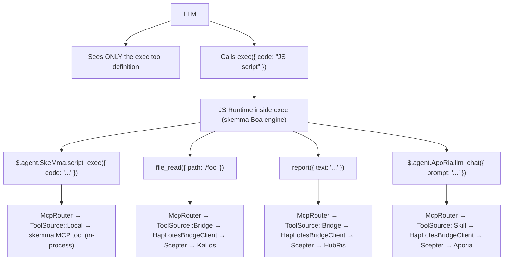
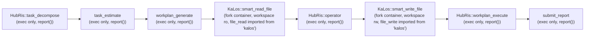
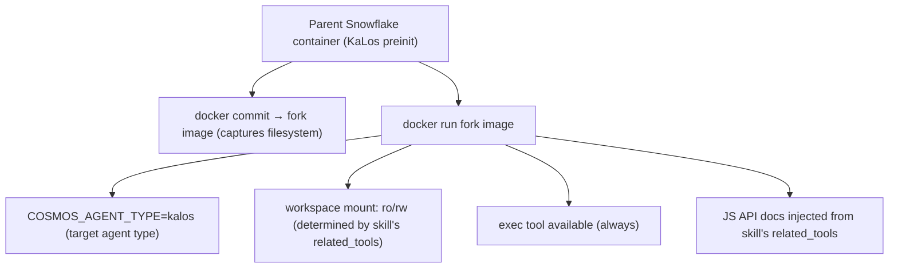

# بنية توجيه المهارات عبر الوكلاء

## المشكلة

تستخدم سلسلة المهارات (`execute_skill_chain`) بنية نواة دقيقة تنفيذية فقط. يرى LLM فقط ثلاث أدوات: `exec`، `write_to_var`، `write_to_var_json` — لا قوائم بيضاء لأدوات لكل وكيل، لا تعريفات أدوات لكل مهارة. كل استدعاء أداة MCP يحدث داخل بيئة تشغيل TypeScript (محرك IEPL) عبر استيراد وحدات ES وواجهات TS عبر الوكلاء مثل `file_read()`.

## مبادئ التصميم

1. **نواة دقيقة تنفيذية فقط** — لا يُعطى LLM تعريفات أدوات MCP مباشرة أبدًا. لديه ثلاث أدوات: `exec`، `write_to_var`، و`write_to_var_json`. كل استدعاءات الأدوات تحدث داخل بيئة تشغيل TS لمحرك IEPL.
1. **`related_tools` تقود كل شيء** — تصرح المهارات بـ `related_tools` في مقدمة TOML الخاصة بها. تصبح هذه الأسماء توثيق واجهة TS محقونًا في توجيه LLM (مثلًا `file_read()`، `report()`).
1. **التوجيه عبر TS API ← McpRouter** — داخل بيئة تشغيل `exec` الخاصة بـ IEPL، يوجّه استيراد وحدات ES إلى تطبيق أداة MCP الصحيح عبر `McpRouter`. الاستدعاءات عبر الوكلاء مثل `file_read()` تحل إلى تطبيق `file_read` الخاص بوكيل KaLos.
1. **عزل الحاويات** — ترث الحاويات الفرعية نظام ملفات الأصل عبر تفريع `docker commit`. تُحمّل مساحات العمل للقراءة فقط أو قراءة-كتابة بناءً على `related_tools` الخاصة بالمهارة.
1. **`related_tools` تحدد وضع القراءة/الكتابة** — يفحص `skill_needs_write_access()` `related_tools` بحثًا عن أسماء أدوات الكتابة (`file_write`، `file_edit`، إلخ) ليقرر وضع التحميل لحاوية التفريع.

## البنية

### تدفق النواة الدقيقة التنفيذية فقط



### تدفق تنفيذ سلسلة المهارات



### آلية تفريع الحاوية



## تفاصيل التنفيذ

### المكوّنات الأساسية

| المكوّن | الملف | المسؤولية |
| --- | --- | --- |
| `skill_to_agent_name()` | `skill_chain.rs` | يبحث عن اسم الوكيل الذي يملك مهارة معينة |
| `skill_needs_write_access()` | `skill_chain.rs` | يفحص `related_tools` بحثًا عن أسماء أدوات الكتابة لتحديد وضع تحميل حاوية التفريع |
| `fork_for_sub_skill()` | `snowflake_manager.rs` | ينفّذ `docker commit` + `docker run`؛ يحمّل مساحة العمل كـ ro/rw بناءً على `skill_needs_write_access()` |
| `find_by_agent_type()` | `snowflake_manager.rs` | يبحث بترتيب عكسي، مُرجعًا أحدث حاوية تفريع |
| `McpRouter` | `packages/cosmos/src/bin/cosmos/mcp_router.rs` | يوجّه استدعاءات استيراد وحدات ES: `ToolSource::Local` ← skemma، `ToolSource::Bridge` ← HapLotes |
| `HapLotesBridgeClient` | `packages/agents/haplotes/src/bridge/client.rs` | جسر Cosmos ← Scepter: `bridge_call()`، `bridge_list_tools()` |
| `BridgeInvoker` | `packages/scepter/src/agent_manager/bridge_invoker.rs` | جانب Scepter: يوجّه استدعاءات الأدوات إلى الوكيل المسجل الصحيح |
| `build_js_api_docs()` | `skill_chain.rs` | يُولّد توثيق JS API من `related_tools` الخاصة بالمهارة لحقن التوجيه |
| `build_skill_user_prompt(agent_name, ...)` | `skill_chain.rs` | يجمع توجيه المهارة مع توثيق JS API المحقون |

### كيف يُولَّد توثيق JS API

تصرح مقدمة TOML للمهارة بـ `related_tools`:

```toml
# smart_read_file.md
related_tools = ["file_read", "file_list", "file_exists"]
```

يحل النظام كل أداة إلى وكيلها المالك ويُولّد توثيق TS API من إعلانات `.d.ts`:

```typescript
// Injected into the LLM prompt as available APIs (with type declarations from .d.ts):
file_read({ path: string }): Promise<string>
file_list({ dir: string }): Promise<string[]>
file_exists({ path: string }): Promise<boolean>
report({ text: string }): Promise<void>
```

يستدعي LLM هذه الواجهات داخل كود `exec` الخاص به؛ يوزع McpRouter إلى تطبيق أداة MCP الصحيح للوكيل.

### دورة حياة التفريع

1. **الإنشاء**: `docker commit` حاوية الأصل ← صورة تفريع ← `docker run` حاوية فرعية
1. **الاتصال**: `CosmosConnector` يتصل بمقبس Unix للحاوية الفرعية
1. **الجسر**: `HapLotesBridgeClient` داخل حاوية التفريع يتصل بـ `HapLotesBridgeServer` الخاص بـ Scepter
1. **التنفيذ**: يستدعي LLM `exec` بكود JS؛ تستخدم بيئة تشغيل JS McpRouter ← الجسر ← وكلاء Scepter
1. **التنظيف**: عند انتهاء السلسلة، `snowflake.remove()` تدمر الحاوية + `docker rmi` ينظف الصورة

### استراتيجية تحميل مساحة العمل

| نوع المهارة | خاصية `related_tools` | تحميل مساحة العمل |
| --- | --- | --- |
| للقراءة فقط (smart_read_file) | فقط file_read، file_list، file_exists | `:ro` (للقراءة فقط) |
| كتابة (smart_write_file) | تتضمن file_write، file_edit، file_delete | `:rw` (قراءة-كتابة) |

### توجيه الأدوات عبر الوكلاء

داخل بيئة تشغيل `exec` الخاصة بـ JS، يحل McpRouter استدعاءات الأدوات عبر جسر HapLotes:

```mermaid
flowchart TB
    subgraph Bridge["Bridge Call"]
        A1["exec({ code: &quot;file_read({path:'/foo'})&quot; })"] --> B1["McpRouter resolves &quot;kalos&quot; + &quot;file_read&quot;"]
        B1 --> C1["tool_to_source → ToolSource::Bridge"]
        C1 --> D1["HapLotesBridgeClient → bridge.call(&quot;kalos.file_read&quot;, params)"]
        D1 --> E1["Scepter's HapLotesBridgeServer → BridgeInvoker"]
        E1 --> F1["routes to KaLos agent → file_read MCP tool"]
    end
    subgraph Local["Local Call"]
        A2["exec({ code: &quot;$.agent.SkeMma.script_exec({code:'1+1'})&quot; })"] --> B2["McpRouter resolves &quot;skemma&quot; + &quot;script_exec&quot;"]
        B2 --> C2["tool_to_source → ToolSource::Local"]
        C2 --> D2["invokes skemma MCP tool directly (in-process Boa engine)"]
    end
```



### كشف وصول الكتابة

```rust
fn skill_needs_write_access(skill: &Skill) -> bool {
    const WRITE_TOOLS: &[&str] = &["file_write", "file_edit", "file_delete", "file_rename"];
    skill.related_tools.iter().any(|t| WRITE_TOOLS.contains(&t.as_str()))
}
```

تقرأ هذه الدالة `related_tools` للمهارة من مقدمة TOML الخاصة بها. إذا كانت أي أداة كتابة موجودة، تُحمّل مساحة عمل حاوية التفريع للقراءة-الكتابة.

## التهيئة

### مقدمة TOML للمهارة

```toml
# smart_read_file.md
+++
related_tools = ["file_read", "file_list", "file_exists"]

[[next_action]]
agent = "hubris"
name = "operator"
+++

# smart_write_file.md
+++
related_tools = ["file_write", "file_edit"]

[[next_action]]
agent = "hubris"
name = "workplan_execute"
+++
```

### سلسلة next_action (TOML المهارة)

```toml
# workplan_generate.md
[[next_action]]
agent = "kalos"
name = "smart_read_file"

# smart_read_file.md
[[next_action]]
agent = "hubris"
name = "operator"

# operator.md
[[next_action]]
agent = "kalos"
name = "smart_write_file"

# smart_write_file.md
[[next_action]]
agent = "hubris"
name = "workplan_execute"
```

## مرجع JS API للمهارة

| المهارة | الوكيل | واجهات JS API (من `related_tools`) | الحالة |
| --- | --- | --- | --- |
| `smart_read_file` | KaLos | `file_read()`، `file_list()`، `file_exists()` | ✅ منفّذة |
| `smart_write_file` | KaLos | `file_write()`، `file_edit()` | ✅ منفّذة |
| `exec_script` | SkeMma | `$skeMma.script_exec()` | معلّقة |
| `smart_command` | SkoPeo | `$skoPeo.smart_command_execute()` | معلّقة |

## المخاطر والاعتبارات

1. **موارد الحاويات** — كل تفريع ينشئ حاوية Docker جديدة؛ تُنظف الحاويات تلقائيًا عند انتهاء السلسلة.
1. **تكلفة الـ token** — كل تفريع لديه سياق LLM مستقل خاص به؛ توثيق JS API يضيف عبئًا متواضعًا لكل مهارة.
1. **عمق سلسلة التفريع** — حاليًا لا حد للعمق؛ تحدث التفريعات فقط عندما `step_index > 1`.
1. **تمرير السياق** — الأصل ← الفرع يمر عبر محتوى التقرير؛ قد تكون هناك حاجة لاستراتيجيات اقتطاع.
1. **أمان التوازي** — عندما تفصّل سلاسل متعددة بشكل متزامن نفس نوع الوكيل، يضمن البحث بالترتيب العكسي أن كل واحدة تستخدم أحدث تفريع لها.
1. **التحكم في سطح API** — يمكن لـ LLM استدعاء فقط واجهات JS API المذكورة في التوثيق المحقون؛ يرفض McpRouter أسماء الأدوات غير المعروفة.
