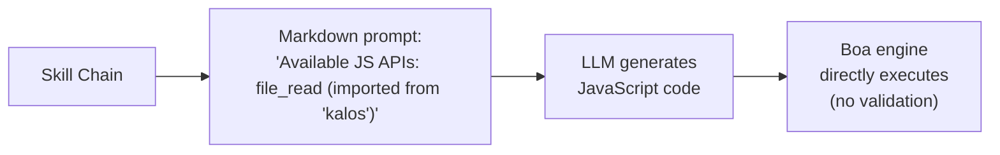
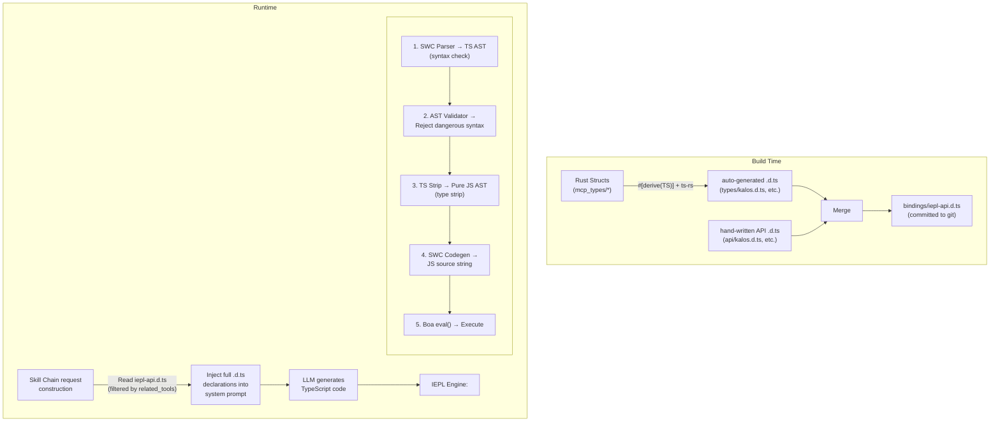
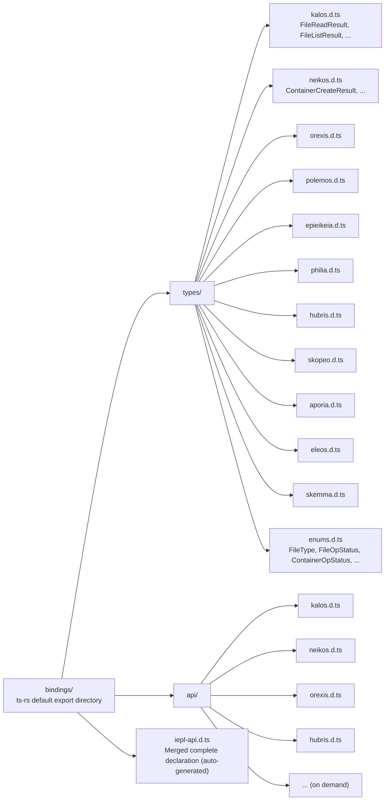
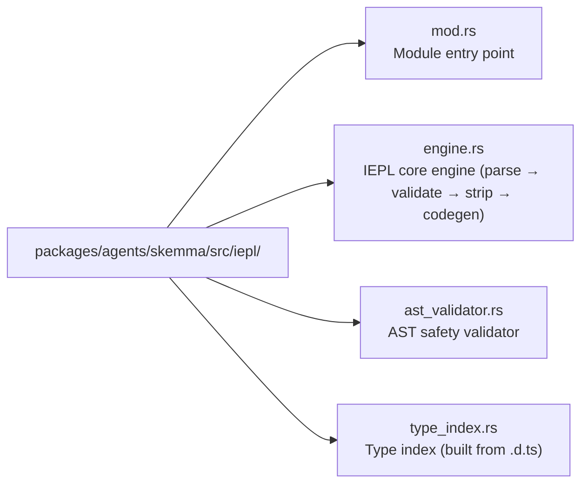

# 22 — تصميم محرك تنفيذ IEPL TypeScript

## نظرة عامة

محرك تنفيذ IEPL (In-Execution Prompt Language) هو ترقية بنيوية لبيئة تشغيل Cosmos/SkeMma JS الحالية، ترفع كود التنفيذ المُولّد من LLM من JavaScript إلى TypeScript. التغييرات الأساسية تشمل:

1. **صندوق SWC مدمج**: فحص صارم لبناء الجملة، تجريد النوع، وتحويل TypeScript المُولّد من LLM
1. **توليد النوع Rust derive ← TypeScript**: تصدير تلقائي لهياكل Rust إلى ملفات إعلان `.d.ts` عبر `ts-rs`
1. **توجيه مهارة آمن النوع**: حقن إعلانات `.d.ts` الكاملة بدلًا من قوائم الدوال المشفّرة، محسنًا المتانة بشكل كبير

## الحالة الحالية والمشاكل

### تدفق التنفيذ الحالي



### المشاكل الموجودة

| المشكلة | الوصف |
| --- | --- |
| **لا قيود نوع** | كود JS المُولّد من LLM لديه صفر معلومات نوع ثابتة؛ أخطاء معاملات الكتابة تُكتشف فقط وقت التشغيل |
| **وصفات واجهة هشة** | `build_report_tool_instruction()` يشفر قوائم نصية مثل `- file_read (imported from 'kalos')`، غير قادر على التعبير عن أنواع المعاملات أو بنى قيمة الإرجاع |
| **لا تحقق مسبق** | كود LLM يدخل مباشرة في `eval()` الخاصة بـ Boa؛ تُكتشف أخطاء بناء الجملة فقط وقت التنفيذ |
| **المخطط والتوجيه مفكوكان** | `McpSchemaWriter` يُولّد ملفات مخطط JSON لكنها لا تُستخدم أبدًا لحقن التوجيهات |
| **معاملات الأداة غير محددة النوع** | معاملات الأداة الحالية تُمرر كـ `serde_json::Value`، مستخرجة يدويًا عبر `get("field")`، بلا ضمانات أمان النوع |

### الملفات الرئيسية المتضمنة

| الملف | المسؤولية الحالية |
| --- | --- |
| `packages/agents/skemma/src/js_runtime/runtime.rs` | بيئة تشغيل Boa JS، `exec()` يستدعي `eval()` مباشرة |
| `packages/agents/skemma/src/mcp/tools/script_exec.rs` | يقبل فقط لغة `"javascript"` |
| `packages/cosmos/src/bin/cosmos/js_repl/js_commands.rs` | يُولّد ديناميكيًا `globalThis.$agent.tool = (...) => ...` |
| `packages/scepter/src/state_machine/skill_chain/prompt.rs:51` | `build_report_tool_instruction()` يشفر قائمة API |
| `packages/shared/src/mcp_types/*.rs` | كل تعريفات أنواع نتائج أداة MCP (serde فقط، لا تصدير TS) |
| `packages/shared/src/mcp_types/schema.rs` | `McpSchemaWriter` يُولّد مخطط JSON (غير مستخدم بواسطة التوجيه) |

## البنية المستهدفة



## اختيار التقنية

### 1. توليد النوع Rust ← TypeScript: `ts-rs`

| السمة | القيمة |
| --- | --- |
| الصندوق | `ts-rs` (Aleph-Alpha/ts-rs) |
| الإصدار | ≥ 12.0 |
| النجوم | 1,772 |
| التنزيلات | ~7.3M |
| الترخيص | MIT |

**المبرر:**

- متوافق بعمق مع منظومة `serde` الموجودة في المشروع (ميزة `serde-compat` تتعرف تلقائيًا على `rename`/`rename_all`/`skip`، إلخ)
- `#[derive(TS)]` غير تدخلي، لا يغير تعريفات الهيكل الموجودة
- يدعم `#[ts(export)]` للتصدير التلقائي إلى دليل `bindings/` أثناء `cargo test`
- يُولّد أسماء مستعارة لـ `type` TypeScript قياسية، قابلة للاستخدام مباشرة في `.d.ts`
- يدعم الاستيراد عبر الملفات، الأنواع العامة، أنواع الاتحاد
- تكامل منظومة غني: `chrono-impl`، `uuid-impl`، `serde-json-impl`

**البدائل المستبعدة:**

| الصندوق | سبب الاستبعاد |
| --- | --- |
| `specta` | منحاز لمنظومة Tauri/rspc؛ تصدير نوع الدالة غير مطلوب في هذا السيناريو |
| `typeshare` | مدفوع بـ CLI، غير ملائم لتكامل CI؛ يُولّد `interface` بدلًا من `type` (لا فرق عملي لتوجيهات LLM) |
| `tsify` | مقيد بـ `wasm-bindgen`؛ هذا المشروع ليس سير عمل WASM |

### 2. تحليل وتحويل TypeScript: SWC

| الصندوق | الغرض |
| --- | --- |
| `swc_core` (ميزة: `ecma_parser`) | تحليل مصدر TS إلى AST |
| `swc_core` (ميزة: `ecma_ast`) | أنواع عقد AST |
| `swc_core` (ميزة: `ecma_visit`) | اجتياز/تحويل AST |
| `swc_core` (ميزة: `ecma_transforms_typescript`) | تجريد نوع TS ← JS |
| `swc_core` (ميزة: `ecma_codegen`) | AST ← توليد كود المصدر |

**القدرات الرئيسية:**

- دعم كامل لبناء جملة TypeScript (الأنواع العامة، الأنواع الشرطية، الأنواع المُخططة، المزخرفات، إلخ)
- تنفيذ Rust أصلي عالي الأداء (أسرع 20–70× من tsc)
- تجريد النوع (`strip`) يحول TS AST إلى JS AST
- إبلاغ أخطاء على مستوى بناء الجملة (أقواس غير مغلقة، رموز غير صالحة، إلخ)

**القيود:**

- SWC **لا يقوم بفحص نوع كامل** (لا مكافئ لـ `tsc --noEmit`). هذا يعني أنه لا يمكنه كشف الأخطاء الدلالية مثل "استدعاء خاصية غير موجودة"
- لهذا السيناريو هذا مقبول: الكود المُولّد من LLM يحتاج أساسًا لضمانات صحة بناء الجملة؛ محرك Boa يوفر أمان النوع الديناميكي وقت التشغيل
- إذا لزم فحص نوع كامل مستقبليًا، يمكن تقديم تحقق مخصص على مستوى AST (راجع "AST Validator" أدناه)

## التصميم التفصيلي

### المرحلة 1: بنية تحتية لتصدير النوع ts-rs

#### 1.1 تبعية مساحة عمل جديدة

```toml
# Cargo.toml (workspace)
[workspace.dependencies]
ts-rs = { version = "12", features = ["serde-compat", "format"] }
```

#### 1.2 إضافة `#[derive(TS)]` لأنواع MCP

تحصل كل الهياكل تحت `packages/shared/src/mcp_types/` على derive لـ `ts-rs`:

```rust
// packages/shared/src/mcp_types/kalos.rs
use ts_rs::TS;

# [derive(Debug, Clone, Serialize, Deserialize, TS)]
# [ts(export)]
pub struct FileReadResult {
    pub path: String,
    pub size_bytes: u64,
    pub content: String,
}

# [derive(Debug, Clone, Serialize, Deserialize, TS)]
# [ts(export)]
pub struct FileListResult {
    pub path: String,
    pub total_count: usize,
    pub entries: Vec<FileEntry>,
}

// ... other types similarly
```

تحتاج المعدّادات لتكييف ماكرو `str_enum!`:

```rust
// packages/shared/src/mcp_types/enums.rs
// Existing str_enum! macro-generated enums need additional TS derive

# [derive(Debug, Clone, Copy, PartialEq, Eq, Serialize, Deserialize, TS)]
pub enum FileType {
    File,
    Directory,
}
// Note: str_enum! macro needs extension to also derive TS
// or individually add #[derive(TS)] to existing macro-generated enums
```

#### 1.3 تخطيط ملف `.d.ts`



#### 1.4 مثال على `.d.ts` API مكتوب يدويًا

```typescript
// bindings/api/kalos.d.ts

import type {
  FileReadResult,
  FileListResult,
  FileWriteResult,
  FileEditResult,
  FileDeleteResult,
  FileExistsResult,
  MkDirResult,
  FileInfoResult,
} from "../types/kalos";

export interface KalosApi {
  /**
   * Read file content
   * @param params.path - File path (absolute path)
   */
  file_read(params: { path: string }): Promise<FileReadResult>;

  /**
   * Write to file
   * @param params.path - File path
   * @param params.content - File content
   */
  file_write(params: { path: string; content: string }): Promise<FileWriteResult>;

  /**
   * Edit file (find and replace)
   * @param params.path - File path
   * @param params.old_string - Original string to replace
   * @param params.new_string - Replacement string
   */
  file_edit(params: {
    path: string;
    old_string: string;
    new_string: string;
  }): Promise<FileEditResult>;

  file_delete(params: { path: string }): Promise<FileDeleteResult>;
  file_exists(params: { path: string }): Promise<FileExistsResult>;
  file_list(params: { path: string }): Promise<FileListResult>;
  file_get_info(params: { path: string }): Promise<FileInfoResult>;
  file_create_dir(params: { path: string }): Promise<MkDirResult>;
}
```

#### 1.5 سكربت الدمج وقت البناء

في `packages/shared/build.rs` أو `xtask` مستقل:

```rust
// xtask/src/bin/iepl_codegen.rs
// 1. Run cargo test to trigger ts-rs export
// 2. Read bindings/types/*.d.ts + bindings/api/*.d.ts
// 3. Group and merge by agent, generate final iepl-api.d.ts
// 4. Output to bindings/iepl-api.d.ts
```

أو ببساطة أكثر، أضف وحدة `iepl_codegen` في `packages/shared/src/mcp_types/` تطلق التصدير والدمج أثناء الاختبارات.

**المبدأ الأساسي: بمجرد توليدها، تُلتزم ملفات `.d.ts` إلى git وتصبح جزءًا دائمًا من شجرة المصدر.** تغييرات نوع Rust اللاحقة تُولّد وتلتزم التحديثات.

### المرحلة 2: محرك تنفيذ IEPL

#### 2.1 تبعيات SWC الجديدة

```toml
# Cargo.toml (workspace)
[workspace.dependencies]
swc_core = { version = "65", features = [
    "ecma_parser",
    "ecma_ast",
    "ecma_visit",
    "ecma_transforms_base",
    "ecma_transforms_typescript",
    "ecma_codegen",
    "common",
] }
```

#### 2.2 نواة محرك IEPL

وحدة `iepl/` جديدة تحت `packages/agents/skemma/src/`:



##### engine.rs — تدفق التحويل الأساسي

```rust
use anyhow::{anyhow, Result};
use swc_core::{
    common::{errors::ColorConfig, SourceFile, SourceMap, GLOBALS},
    ecma::{
        ast::Program,
        codegen::{text_writer::JsWriter, Emitter},
        parser::{lexer::Lexer, Parser, StringInput, Syntax, TsSyntax},
        transforms::{
            base::fixer::fixer,
            typescript::strip,
        },
        visit::FoldWith,
    },
};

pub struct IeplEngine {
    cm: Arc<SourceMap>,
}

pub struct TranspileResult {
    pub js_code: String,
    pub parse_errors: Vec<String>,
}

impl IeplEngine {
    pub fn new() -> Self {
        Self {
            cm: Arc::new(SourceMap::default()),
        }
    }

    /// Transpile TypeScript code to JavaScript
    pub fn transpile(&self, ts_code: &str) -> Result<TranspileResult> {
        let fm = self.cm.new_source_file(
            swc_core::common::FileName::Custom("iepl-input".into()),
            ts_code.into(),
        );

        // 1. Parse TS → AST
        let mut parse_errors = Vec::new();
        let module = self.parse_ts(&fm, &mut parse_errors)?;

        if !parse_errors.is_empty() {
            return Err(anyhow!("TypeScript parse errors:\n{}", parse_errors.join("\n")));
        }

        // 2. AST safety validation
        let validator = AstValidator::new();
        validator.validate(&module)?;

        // 3. Type strip TS → JS
        let mut transforms = swc_core::common::pass::Optional::new(
            strip::strip_typescript(swc_core::common::comments::NoComments),
            true,
        );
        let program = module.fold_with(&mut transforms);

        // 4. AST → JS source
        let js_code = self.emit(program)?;

        Ok(TranspileResult {
            js_code,
            parse_errors,
        })
    }

    fn parse_ts(
        &self,
        fm: &SourceFile,
        errors: &mut Vec<String>,
    ) -> Result<Program> {
        let lexer = Lexer::new(
            Syntax::Typescript(TsSyntax {
                tsx: false,
                decorators: true,
                dts: false,
                no_early_errors: false,
                disallowAmbiguousJSXLike: true,
            }),
            Default::default(),
            StringInput::from(fm),
            None,
        );
        let mut parser = Parser::new_from(lexer);
        match parser.parse_program() {
            Ok(program) => Ok(program),
            Err(e) => {
                errors.push(format!("{:?}", e));
                Err(anyhow!("Failed to parse TypeScript"))
            }
        }
    }

    fn emit(&self, program: Program) -> Result<String> {
        let mut buf = Vec::new();
        let writer = JsWriter::new(self.cm.clone(), "\n", &mut buf, None);
        let mut emitter = Emitter {
            cfg: Default::default(),
            cm: self.cm.clone(),
            comments: None,
            wr: writer,
        };
        emitter.emit_program(&program)?;
        Ok(String::from_utf8(buf)?)
    }
}
```

##### ast_validator.rs — مدقق الأمان

```rust
use anyhow::{anyhow, Result};
use swc_core::ecma::ast::{Module, Program};
use swc_core::ecma::visit::{Visit, VisitWith};

/// Validates that the AST contains no dangerous patterns
pub struct AstValidator {
    violations: Vec<String>,
}

impl AstValidator {
    pub fn new() -> Self {
        Self {
            violations: Vec::new(),
        }
    }

    pub fn validate(&self, program: &Program) -> Result<()> {
        // Implement dangerous pattern detection
        // - Forbid eval() / Function() calls
        // - Forbid dynamic import()
        // - Forbid access to __proto__ / constructor
        // - Forbid with statements
        // - Optional: forbid access to global variables not on the allowlist
        if self.violations.is_empty() {
            Ok(())
        } else {
            Err(anyhow!("AST validation violations:\n{}", self.violations.join("\n")))
        }
    }
}
```

#### 2.3 التكامل في script_exec

عدّل `packages/agents/skemma/src/mcp/tools/script_exec.rs`:

```rust
// Before (line 53):
if !matches!(language.as_str(), "javascript" | "js" | "node") {
    return McpToolResult::failure(format!(
        "Unsupported language: '{}'. Only JavaScript is supported.", language
    ));
}

// After:
let executable_code = match language.as_str() {
    "typescript" | "ts" => {
        let engine = crate::iepl::IeplEngine::new();
        match engine.transpile(code) {
            Ok(result) => result.js_code,
            Err(e) => return McpToolResult::failure(format!("TS transpile error: {}", e)),
        }
    }
    "javascript" | "js" | "node" => code.to_string(),
    _ => {
        return McpToolResult::failure(format!(
            "Unsupported language: '{}'. Only TypeScript and JavaScript are supported.",
            language
        ));
    }
};
```

#### 2.4 التكامل في Cosmos JS REPL

عدّل مسار التنفيذ في `packages/cosmos/src/bin/cosmos/js_repl/mod.rs` لإضافة خطوة تحويل IEPL قبل استدعاء `runtime.exec()`.

### المرحلة 3: حقن نوع توجيه المهارة

#### 3.1 بناء التوجيه الحالي

`prompt.rs:51`'s `build_report_tool_instruction()`:

```rust
// Current: hardcoded API list
let items: Vec<String> = available_apis
    .iter()
    .map(|a| format!("- ${}", a))
    .collect();
parts.push(format!("\nAvailable JS APIs:\n{}", items.join("\n")));
```

هذا يُولّد:

```text
Available JS APIs:
- file_read (imported from 'kalos')
- file_write (imported from 'kalos')
- report()
```

#### 3.2 بناء التوجيه الجديد

```rust
pub(super) fn build_report_tool_instruction(
    next_targets: &[String],
    related_tools: &[RelatedTool],  // Changed to accept full RelatedTool info
) -> String {
    let mut parts = Vec::new();

    // Load agent-grouped .d.ts from bindings/
    let type_declarations = load_iepl_type_declarations(related_tools);
    if !type_declarations.is_empty() {
        parts.push(format!(
            "You are writing TypeScript code. Available API type declarations:\n\n\
             ```typescript\n{}\n```",
            type_declarations
        ));
    }

    // ... next_targets and mcp_conv remain unchanged
}
```

مثال على المحتوى المحقون في التوجيه:

```typescript
You are writing TypeScript code. Available API type declarations:

```

// === Types (auto-generated from Rust) ===
type `FileReadResult` = { path: string; `size_bytes`: number; content: string };
type `FileListResult` = { path: string; `total_count`: number; entries: Array<{ name: string; `file_type`: "file" | "directory" }> };
type `FileWriteResult` = { path: string; `size_bytes`: number; status: "created" | "deleted" | "edited" | "written" };

// === API (hand-written) ===
interface KalosApi {
`file_read`(params: { path: string }): Promise<`FileReadResult`>;
`file_write`(params: { path: string; content: string }): Promise<`FileWriteResult`>;
`file_list`(params: { path: string }): Promise<`FileListResult`>;
// ...
}

declare const $kalos: KalosApi;

```text

#### 3.3 محمّل .d.ts

```

// packages/shared/src/iepl/decl_loader.rs

use `include_dir`::{Dir, `include_dir`};

static IEPL_BINDINGS: Dir = `include_dir`!("$CARGO_MANIFEST_DIR/../../../bindings");

pub struct `IeplDeclLoader`;

impl `IeplDeclLoader` {
/// Load required .d.ts declarations filtered by `related_tools`
pub fn `load_for_tools`(`related_tools`: &[`RelatedTool`]) -> String {
let mut declarations = Vec::new();

// Collect the set of involved agents
let agents: std::collections::HashSet<&str> = `related_tools`
.iter()
.map(|t| t.agent_name.as_str())
.collect();

for agent in &agents {
// Load auto-generated type declarations
if let Some(`types_file`) = IEPL_BINDINGS.get_file(format!("types/{}.d.ts", agent)) {
if let Ok(content) = std::str::`from_utf8`(types_file.contents()) {
declarations.push(content.to_string());
}
}

// Load hand-written API declarations
if let Some(`api_file`) = IEPL_BINDINGS.get_file(format!("api/{}.d.ts", agent)) {
if let Ok(content) = std::str::`from_utf8`(api_file.contents()) {
declarations.push(content.to_string());
}
}
}

declarations.join("\n\n")
}
}

```text

#### 3.4 ترقية باني نطاق JS

`build_tool_namespace_js()` الخاص بـ `js_commands.rs` يواصل توليد أغلفة دوال JavaScript دون تغيير (محرك Boa ينفذ JS فقط)، لكن أوصاف الواجهة على جانب التوجيه تُوفّر بواسطة `.d.ts` بدلًا من التشفير.

## مقارنة تدفق البيانات

### الحالي (JavaScript)

```

flowchart TD
Meta["Skill Metadata\`nrelated_tools`:\n- kalos.file_read\n- kalos.file_write"]
Meta --> Build["`build_report_tool_instruction`\n→ '- `file_read` (imported)'\n→ '- `file_write` (imported)'\n(hardcoded text)"]
Build -->|"injected into\nsystem prompt"| LLM1["LLM generates JavaScript\`nfile_read`({path:'x'})\n(no type checking)"]
LLM1 --> Boa1["Boa eval() direct execution\n(no pre-validation)"]

```text

### المستهدف (TypeScript + IEPL)

```

flowchart TD
Meta2["Skill Metadata\`nrelated_tools`:\n- kalos.file_read\n- kalos.file_write"]
Meta2 --> Loader["`IeplDeclLoader`\n→ types/kalos.d.ts\n→ api/kalos.d.ts\n(full type declarations)"]
Loader -->|"injected into\nsystem prompt"| LLM2["LLM generates TypeScript\nconst r: `FileReadResult` =\n  await `file_read`(\n    {path: 'x'}\n  );\n(type-constrained)"]
LLM2 --> IEPL["IEPL Engine\n1. SWC parse → AST (syntax check)\n2. AST validator (safety check)\n3. strip types → JS (type stripping)\n4. codegen → JS string"]
IEPL --> Boa2["Boa eval() execution"]

```text

## تحليل تحسن المتانة

### المقارنة: الحالي مقابل IEPL

| البُعد | الحالي (JS + قائمة مشفّرة) | IEPL (TS + .d.ts) |
|-----------|------------------------------|-------------------|
| **فهم LLM للواجهات** | يرى `- file_read (imported from 'kalos')` | يرى `file_read(params: {path: string}): Promise<FileReadResult>` كاملًا |
| **أخطاء المعاملات** | LLM يخمن أسماء المعاملات | LLM يعرف أنواع المعاملات بالضبط |
| **استخدام قيمة الإرجاع** | لا يعرف ما الحقول المُعادة | يعرف البنية الكاملة لـ `FileReadResult` |
| **أخطاء بناء الجملة** | تُكتشف فقط وقت التشغيل | مرفوضة بواسطة SWC قبل التحويل |
| **تغييرات الواجهة** | تتطلب تحديثًا يدويًا للنص المشفّر | عدّل هيكل Rust ← أعد توليد .d.ts ← ينعكس تلقائيًا في التوجيه |
| **إدماج أداة جديدة** | عدّل منطق prompt.rs | أضف derive ts-rs + api .d.ts مكتوب يدويًا |
| **صيانة تصدير النوع** | لا شيء | .d.ts في git مع diffs قابلة للتتبع |

### تحسين جودة توجيه LLM

شظية التوجيه الحالية التي يراها LLM:

```

Available JS APIs:

- `file_read` (imported from 'kalos')
- `file_write` (imported from 'kalos')
- report()

```text

شظية التوجيه التي يراها LLM تحت IEPL:

```

declare const $kalos: {
`file_read`(params: { path: string }): Promise<{ path: string; `size_bytes`: number; content: string }>;
`file_write`(params: { path: string; content: string }): Promise<{ path: string; `size_bytes`: number; status: "created" | "deleted" | "edited" | "written" }>;
`file_list`(params: { path: string }): Promise<{ path: string; `total_count`: number; entries: Array<{ name: string; `file_type`: "file" | "directory" }> }>;
};
// hubris tools available via ES module import: import { report } from 'hubris'
report(params: { summary: string }): Promise<{ summary: string }>;
};

```text

الأخيرة توفر:
- أسماء وأنواع معاملات دقيقة
- بنية قيمة إرجاع كاملة
- قيم حرفية لنوع الاتحاد (مثلًا، `"file" | "directory"`)
- TypeScript أصلي `Promise<>` يعبر عن دلالات غير متزامنة

## ملخص تبعية مساحة العمل الجديدة

```

# New

ts-rs = { version = "12", features = ["serde-compat", "format"] }
`swc_core` = { version = "65", features = [
"`ecma_parser`",
"`ecma_ast`",
"`ecma_visit`",
"`ecma_transforms_base`",
"`ecma_transforms_typescript`",
"`ecma_codegen`",
"common",
] }

```text

## بنية صندوق جديدة

```

flowchart LR
SkemmaIepl["packages/agents/skemma/src/iepl/"] --> SM1["mod.rs\npub mod engine; pub mod `ast_validator`;"]
SkemmaIepl --> SM2["engine.rs\`nIeplEngine`: transpile(`ts_code`) -> Result&lt;`TranspileResult`&gt;"]
SkemmaIepl --> SM3["ast_validator.rs\`nAstValidator`: safety pattern detection"]
SharedIepl["packages/shared/src/iepl/"] --> SH1["mod.rs\npub mod `decl_loader`;"]
SharedIepl --> SH2["decl_loader.rs\`nIeplDeclLoader`: load .d.ts filtered by `related_tools`"]
Bindings["bindings/\nGenerated artifacts, tracked in git"] --> BTypes["types/\nts-rs auto-export"]
Bindings --> BApi["api/\nHand-written and maintained"]
Bindings --> BIepl["iepl-api.d.ts\nMerged artifact (optional)"]
BTypes --> BT1["kalos.d.ts"]
BTypes --> BT2["neikos.d.ts"]
BTypes --> BT3["..."]
BApi --> BA1["kalos.d.ts"]
BApi --> BA2["neikos.d.ts"]
BApi --> BA3["..."]

```text

## مسار التنفيذ

### المرحلة 1: بنية تحتية ts-rs (~2–3 أيام)

1. أضف تبعية مساحة عمل `ts-rs`
2. أضف `#[derive(TS)]` لكل هياكل `mcp_types/*.rs`
3. وسّع ماكرو `str_enum!` ليكون متوافقًا مع derive لـ `ts-rs`
4. شغّل `cargo test` لتوليد `bindings/types/*.d.ts`
5. اكتب `bindings/api/*.d.ts` يدويًا (ملف واحد لكل وكيل)
6. اكتب سكربت دمج لتوليد `bindings/iepl-api.d.ts`
7. ألتزم كل `.d.ts` إلى git

### المرحلة 2: محرك تنفيذ IEPL (~3–5 أيام)

1. أضف تبعية مساحة عمل `swc_core`
2. نفّذ `iepl/engine.rs`: تحليل ← تجريد ← codegen
3. نفّذ `iepl/ast_validator.rs`: كشف الأنماط الخطرة
4. عدّل `script_exec.rs` لدعم لغة TypeScript
5. ادمج في مسار تنفيذ Cosmos JS REPL
6. اختبار من البداية للنهاية: كود TS ← SWC ← JS ← Boa

### المرحلة 3: حقن نوع التوجيه (~2–3 أيام)

1. نفّذ `IeplDeclLoader`
2. عدّل `build_report_tool_instruction()` لاستخدام .d.ts
3. حدّث منطق بناء توجيه النظام في `execution_steps.rs`
4. تحقق من تحسن جودة كود TS المُولّد من LLM

### المرحلة 4: التنظيف والتحسين (~1–2 أيام)

1. أزل أو أعلِم تقادم `McpSchemaWriter` (متجاوز بنظام .d.ts)
2. أضف خطوة CI: بعد `cargo test`، تحقق من التغييرات غير الملتزمة في `bindings/`
3. تحديثات الوثائق

## المخاطر والتخفيفات

| المخاطرة | التخفيف |
|------|-----------|
| زيادة زمن ترجمة SWC | ميزات `swc_core` عند الطلب، تقليل الاستيراد |
| تعارض ماكرو `str_enum!` مع `ts-rs` | امتداد الماكرو أو تنفيذ سمة `TS` للمعدّدات بشكل فردي |
| `.d.ts` كبير جدًا، يتجاوز حد token التوجيه | تصفية دقيقة بـ `related_tools`، حقن فقط الأنواع التي تحتاجها المهارة الحالية |
| Boa لا يدعم `async/await` | يمكن تهيئة SWC للرجوع لأسلوب callback (أو دعم Boa المستقبلي) |
| إصدار ts-rs غير متوافق مع إصدار serde | قفل إصدارات مساحة العمل، تحقق CI |

## إمكانيات الامتداد

1. **فحص النوع على مستوى AST**: نفّذ فحص نوع خفيف على SWC AST (تحقق أن استدعاءات استيراد وحدات ES تستخدم معاملات معرّفة)
1. **إدارة إصدار .d.ts**: أضف أرقام إصدارات إلى رؤوس ملفات `.d.ts`، اضمّن معلومات الإصدار في توجيهات LLM
1. **تحديثات تزايدية**: عند تغيير أنواع Rust، يكتشف CI تلقائيًا diff في `bindings/` وينبه للتحديثات
1. **تنفيذ متعدد اللغات**: إطار IEPL قابل للتوسيع لدعم لغات أخرى (Python عبر RustPython، إلخ)
1. **تحقق النوع وقت التشغيل**: أضف تحقق serde قبل/بعد exec لـ Boa لضمان أن معاملات وقيم الإرجاع التي يستخدمها LLM تتوافق مع تعريفات النوع
