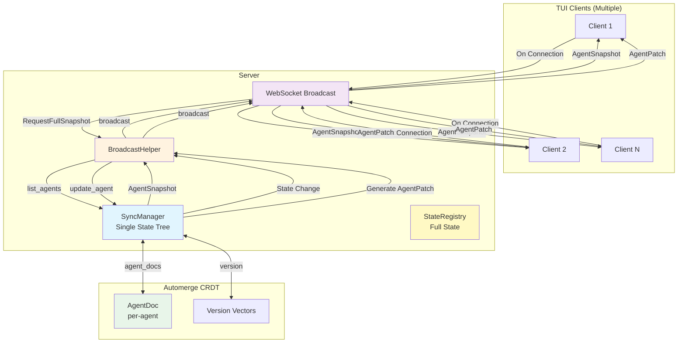
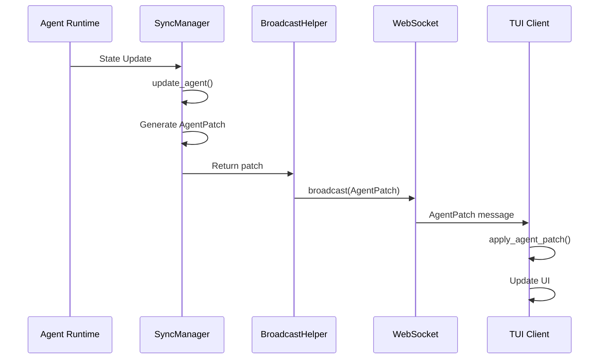
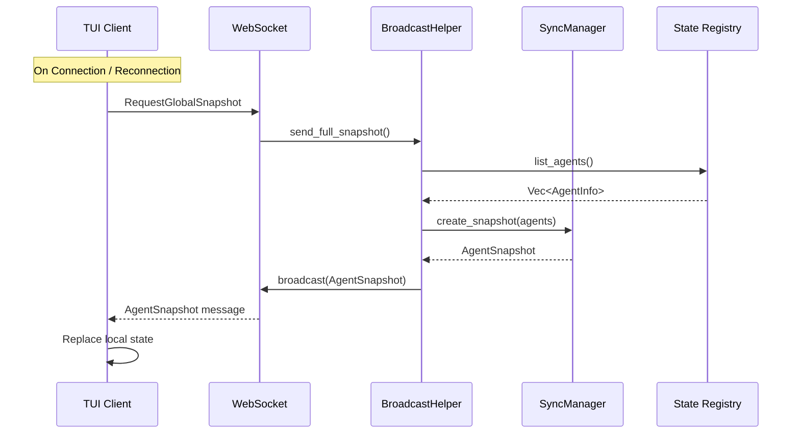
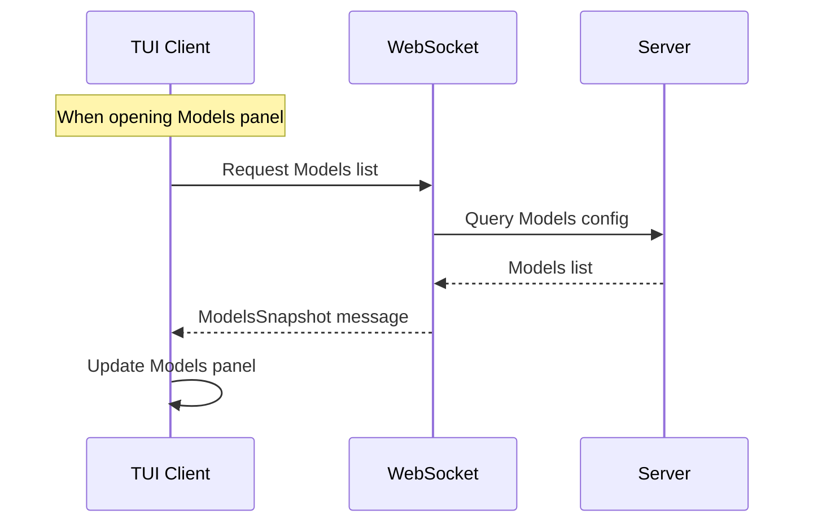
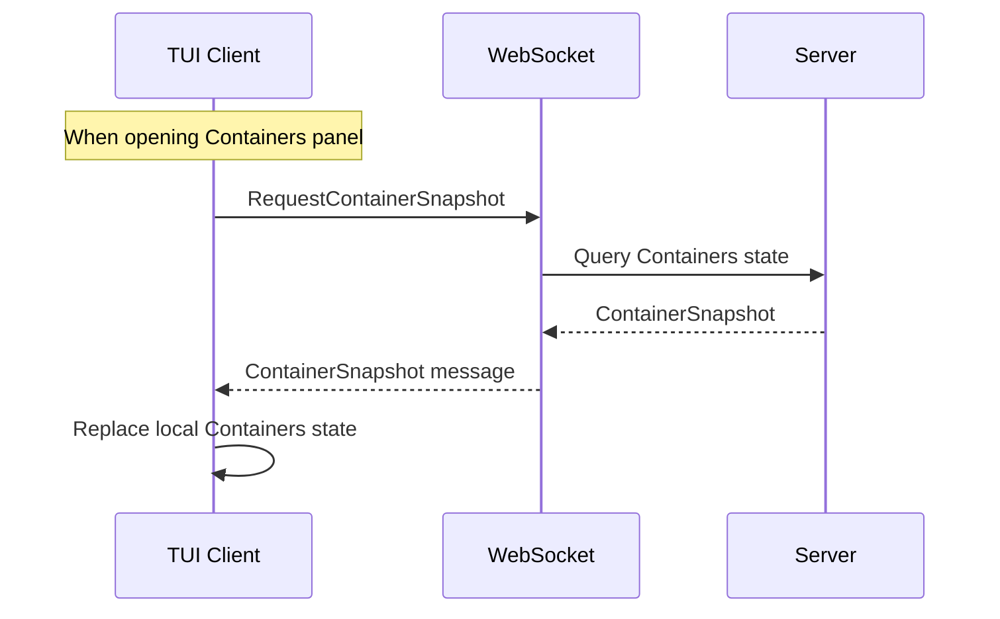
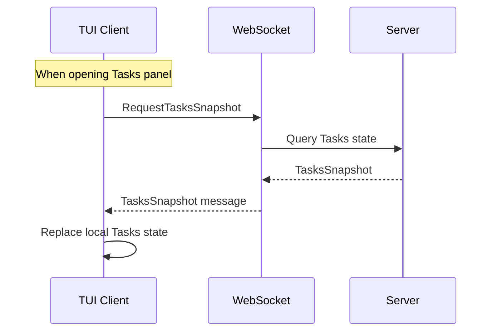

# هندسة المزامنة التزايدية

## نظرة عامة

آلية مزامنة تزايدية لحالة متعددة العملاء مبنية على Automerge CRDT، تدعم التحديثات التزايدية في الوقت الفعلي والمزامنة الكاملة عند الاتصال/إعادة الاتصال، وتغطي جميع لوحات TUI.

## مخطط الهندسة المعمارية



## مصفوفة استراتيجية المزامنة

| اللوحة | طريقة المزامنة | المحفّز | التكرار | أنواع الرسائل |
| --- | --- | --- | --- | --- |
| **الجدول الزمني للوكلاء** | تزايدية + كاملة | مزامنة عند الاتصال + دفع في الوقت الفعلي | عند الاتصال / وقت حقيقي | `AgentPatch` / `GlobalSnapshot` |
| **الحاويات** | تزايدية + كاملة | مزامنة عند الاتصال + دفع في الوقت الفعلي | عند الاتصال / وقت حقيقي | `ContainerPatch` / `GlobalSnapshot` |
| **المهام** | تزايدية + كاملة | مزامنة عند الاتصال + دفع في الوقت الفعلي | عند الاتصال / وقت حقيقي | `TaskPatch` / `GlobalSnapshot` |
| **قائمة النماذج** | كاملة | طلب نشط من العميل | عند فتح اللوحة | `ModelsSnapshot` |
| **تكوين المزودين** | كاملة | طلب نشط من العميل | عند فتح اللوحة | `ProvidersSnapshot` |

## تدفق الرسائل

### تدفق التحديث التزايدي (الوكلاء)



### تدفق المزامنة الكاملة



### تدفق مزامنة قائمة النماذج



### تدفق المزامنة الكاملة للحاويات



### تدفق المزامنة الكاملة للمهام



## هياكل البيانات

### AgentPatch (تحديث تزايدي)

```rust
pub struct AgentPatch {
    pub agent_id: String,
    pub version: u64,
    pub llm_working_changed: Option<bool>,
    pub work_status: Option<String>,
    pub current_model: Option<String>,
    pub token_usage_delta: Option<(u32, u32)>,
    pub token_usage_absolute: Option<(u32, u32)>,
    pub request_state: Option<RequestState>,
    pub cpu_usage: Option<f64>,
    pub memory_mb: Option<u64>,
}
```

### AgentSnapshot (لقطة كاملة)

```rust
pub struct AgentSnapshot {
    pub version: u64,
    pub timestamp: i64,
    pub agents: Vec<TuiAgentInfo>,
}
```

### GlobalSnapshot (لقطة شاملة)

```rust
pub struct GlobalSnapshot {
    pub version: u64,
    pub timestamp: i64,
    pub agents: Vec<TuiAgentInfo>,
    pub models: Vec<ModelInfo>,
    pub providers: Vec<ProviderInfo>,
    pub active_tasks: Vec<TaskInfo>,
}
```

### ModelsSnapshot (قائمة النماذج)

```rust
pub struct ModelsSnapshot {
    pub models: Vec<ModelInfo>,
}
```

### ContainerPatch (تزايدي حالة الحاويات)

```rust
pub struct ContainerPatch {
    pub container_id: String,
    pub version: u64,
    pub status_changed: Option<String>,
    pub cpu_usage_changed: Option<f64>,
    pub memory_usage_changed: Option<u64>,
}
```

### ContainerSnapshot (كامل حالة الحاويات)

```rust
pub struct ContainerSnapshot {
    pub version: u64,
    pub timestamp: i64,
    pub containers: Vec<ContainerInfo>,
}
```

### TaskPatch (تزايدي حالة المهام)

```rust
pub struct TaskPatch {
    pub task_id: Uuid,
    pub version: u64,
    pub status_changed: Option<String>,
    pub progress_changed: Option<u8>,
}
```

### TasksSnapshot (كامل حالة المهام)

```rust
pub struct TasksSnapshot {
    pub version: u64,
    pub timestamp: i64,
    pub tasks: Vec<TaskInfo>,
}
```

## استراتيجية المزامنة

| النوع | الاتجاه | المحفّز | التكرار |
| --- | --- | --- | --- |
| تحديث تزايدي للوكلاء | الخادم ← العميل | تغيير الحالة | وقت حقيقي |
| مزامنة كاملة للوكلاء | الخادم ← العميل | عند الاتصال | عند الاتصال / إعادة الاتصال |
| تزايدي الحاويات | الخادم ← العميل | تغيير الحالة | وقت حقيقي |
| مزامنة كاملة للحاويات | الخادم ← العميل | عند الاتصال | عند الاتصال / إعادة الاتصال |
| تزايدي المهام | الخادم ← العميل | تغيير الحالة | وقت حقيقي |
| مزامنة كاملة للمهام | الخادم ← العميل | عند الاتصال | عند الاتصال / إعادة الاتصال |
| قائمة النماذج | العميل ← الخادم | طلب نشط | عند فتح اللوحة |
| تكوين المزودين | العميل ← الخادم | طلب نشط | عند فتح اللوحة |

## الميزات الرئيسية

- **شجرة حالة واحدة**: يحافظ الخادم على `SyncManager` واحد، جميع العملاء يستقبلون نفس تحديثات الحالة
- **حل تعارض CRDT**: حل تعارض تلقائي مبني على Automerge
- **تحديثات تزايدية**: نقل الحقول المتغيرة فقط لتقليل حركة الشبكة
- **اتساق نهائي**: تضمن المزامنة الكاملة عند الاتصال الاتساق النهائي
- **سحب عند الطلب**: تُطلب النماذج والمزودون عند الطلب عند فتح لوحاتهم لتجنب النقل الشبكي غير الضروري
- **مزامنة الصفحة الرئيسية**: تُزامن الوكلاء والحاويات والمهام عند الاتصال لأنها مرئية على الصفحة الرئيسية

## حالة التنفيذ

- ✅ مزامنة تزايدية/كاملة للوكلاء
- ✅ مزامنة قائمة النماذج
- ✅ مزامنة تكوين المزودين
- ✅ مزامنة تزايدية/كاملة للحاويات
- ✅ مزامنة تزايدية/كاملة للمهام
- ✅ استمرار الحالة (تخزين /tmp، إعادة تحميل عند إعادة التشغيل)
