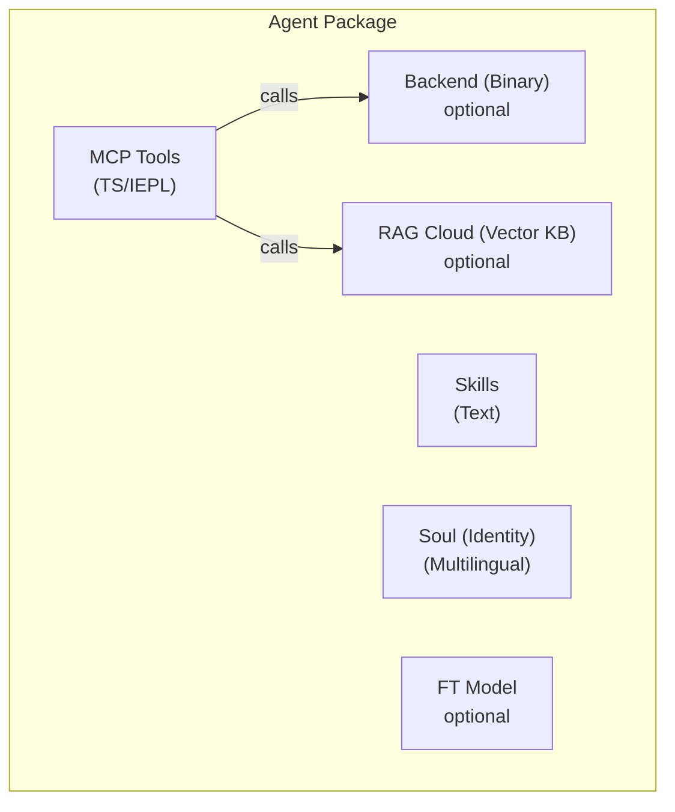

# مواصفة حزمة وكيل الطبقة 2/3

> **الحالة**: مسودة v1 — 2026-06-26
> **النطاق**: تعرّف صيغة الحزمة المستقلة لوكلاء الطبقة 2 والطبقة 3.

## نظرة عامة

وكيل الطبقة 2/3 **حزمة مستقلة** مكونة من حتى خمسة مكونات. الحزمة هي وحدة التوزيع — يمكن تثبيتها وتحديثها وإزالتها بشكل مستقل.



## المكونات الخمسة

### 1. أدوات MCP (IEPL TypeScript)

واجهة الأدوات الأساسية. مكتوبة كمصدر TypeScript تعمل في صندوق رمل IEPL (زمن تشغيل Boa JS). يصدّر كل ملف أداة دالة:

```typescript
// mcp/memory_store.ts
import type { McpResult } from '@entecheia/sdk';

export async function memory_store(params: {
  text: string;
  node_type: string;
  entity_type?: string;
  properties?: Record<string, string>;
}): Promise<McpResult> {
  // Tool logic — can call backend primitives, compose other tools,
  // or make HTTP requests to cloud services.
  const result = await backend.memory_store(params);
  return { ok: true, data: result };
}
```

يمكن أن تكون الأدوات:

- **TS نقي**: منطق فقط، يدمج أدوات أخرى أو يحول البيانات
- **مدعوم بالخلفية**: يستدعي بدائية مقدمّة من خلفية MCP
- **مدعوم بالسحابة**: يستدعي واجهة برمجة تطبيقات بعيدة (RAG، نموذج، خدمة خارجية)

مصدر TypeScript هو نص نقي — يمكن التحكم بإصداره، ومراجعته، وتوزيعه دون تجميع. يمكن لمنشأة تغليف ذاتية الخدمة اختياريًا تجميع عدة ملفات `.ts` في `bundle.js` واحد للتحميل الفعّال.

### 2. خلفية MCP (ثنائي اختياري)

بعض الأدوات تحتاج قدرات تتجاوز صندوق رمل IEPL (إدخال/إخراج الملفات، الوصول للأجهزة، اتصالات قاعدة البيانات). هذه تُقدَّم بواسطة **خلفية ثنائية** — ثنائي Rust يعمل بجانب عملية scepter.

- تُجمَّع الخلفية في صورة Docker وتُحمل في "جيب"

scepter (دليل `/workspace-base/target/`).

- في وقت التشغيل، يمرر scepter مسار الثنائي ديناميكيًا إلى بيئة

IEPL عبر استيراد وحدة `backend`.

- تُعرض الخلفية عمليات بدائية؛ كل التركيب والتنسيق

يحدث في طبقة TS.

مثال واجهة خلفية (مُولّد تلقائيًا من Rust):

```typescript
// Auto-generated from Rust backend
declare module 'backend' {
  export function memory_store_raw(params: {...}): Promise<McpResult>;
  export function memory_query_raw(query: string): Promise<McpResult>;
}
```

### 3. المهارات (نص نقي)

توجيهات المهارات هي ملفات markdown مع TOML أمامي. تعرّف **كيف** ينفذ الوكيل المهام — توجيه النظام، القائمة البيضاء للأدوات، وضع التنفيذ، وبنية خط الأنابيب.

```markdown
+++
name = "memory_consolidate"
agent = "philia"
related_tools = ["memory_consolidate", "memory_query"]
location = "scepter"
execution_mode = "read"

[features]
tier = "worker"
+++

# memory_consolidate

Consolidate memory nodes into an episode for structured recall...
```

المهارات مستقلة عن اللغة (الجسم `#` هو قالب التوجيه). إنها نص نقي — لا تجميع، لا ثنائي.

### 4. قاعدة بيانات RAG (اختياري، مستضافة سحابيًا)

قاعدة معرفة متجهة تقدم معرفة خاصة بالمجال للوكيل. مستضافة على البنية التحتية السحابية لـ Entelecheia.

- اختياري: يمكن للوكيل العمل بدون RAG (قدرة مخفّضة).
- محدود الاستعلام: عند استنفاد الحصة، تُعيد الاستعلامات فارغة —

يتدهور الوكيل بأمان.

- مُشار إليه بـ URL + مفتاح API في البيان، غير مُضمّن في الحزمة.

### 5. نموذج مُدرّب دقيقًا (اختياري، مستضاف سحابيًا)

نموذج مُدرّب دقيقًا للمجال المحدد للوكيل. أيضًا مستضاف سحابيًا.

- اختياري: افتراضيًا يستخدم الوكلاء النموذج العام للمنصة (مثل GLM-5).
- قد يكون مفتوح الأوزان مستقبلاً للاستضافة الذاتية.
- مُشار إليه بمعرّف النموذج في البيان.

## بنية دليل الحزمة

```text
packages/agents/{agent_name}/
├── manifest.toml           # Package metadata and configuration
├── mcp/
│   ├── *.ts                # TypeScript tool implementations (IEPL)
│   └── *.md                # Tool documentation (parameters, returns)
├── backend/                # Optional Rust backend
│   ├── Cargo.toml
│   └── src/
│       └── lib.rs
├── skills/
│   └── *.md                # Skill prompts
├── soul/
│   └── {lang}.md           # Agent personality per language
├── rag.toml                # Optional: RAG database reference
└── model.toml              # Optional: fine-tuned model reference
```

## صيغة manifest.toml

```toml
[package]
name = "philia"              # Must match directory name
version = "0.2.0"
description = "Cognitive memory system — storage, query, consolidation"
layer = 2                    # 2 = platform agent, 3 = extension
category = "complex_tool"    # simple_tool | complex_tool | coordinator

[dependencies]
# Other agent packages whose tools this agent calls
aporia = "0.2.0"

[backend]
# Omit entirely for pure-TS agents
type = "rust"
binary = "philia"            # Binary name in /workspace-base/target/debug/
provides = [                 # Primitives exposed to TS layer
  "memory_store_raw",
  "memory_query_raw",
  "memory_consolidate_raw",
]

[rag]
# Omit if not using cloud RAG
provider = "entelecheia-cloud"
database_id = "philia-knowledge-v1"
endpoint = "https://rag.entelecheia.ai/v1"

[model]
# Omit if using default platform model
provider = "entelecheia-cloud"
model_id = "philia-ft-v1"
endpoint = "https://model.entelecheia.ai/v1"
```

## SDK الخاص بـ TS (`@entecheia/sdk`)

يقدم SDK الأنواع والأدوات لمؤلفي الأدوات:

```typescript
// @entecheia/sdk — types
export interface McpResult {
  ok: boolean;
  data?: unknown;
  error?: string;
}

export interface McpToolParams {
  [key: string]: unknown;
}

// @entecheia/sdk — utilities
export function rag_search(query: string): string;        // RAG search (sync, cached)
export function llm_chat(prompt: string): Promise<string>; // LLM call
export function vars_get(key: string): unknown;           // Cross-skill state
export function vars_set(key: string, value: unknown): void;
```

وحدة `backend` مُولّدة تلقائيًا لكل وكيل من قائمة `[backend].provides` في البيان. تقدم مغلفات مكتوبة حول البدائيات الثنائية.

## هندسة الطبقات

| الطبقة | الوكلاء | كيف تُشحن | حزمة؟ | حاوية؟ |
| --- | --- | --- | --- | --- |
| L1 | SkeMma، HapLotes، HubRis، KaLos، NeiKos، ApoRia، EleOs، EpieiKeia، OreXis، PhiLia، PoleMos، SkoPeo | مدمجة في الصورة | الخلفية فقط (كرات Rust) | لا (داخل العملية) |
| L2 | ClassicSoftwareEngineering، WebAutomation، WebUiPanel، IndustrialIoT | مدمجة في الصورة | **حزمة كاملة** (TS + مهارات + روح) | نعم (e-skemma) |
| L3 | امتدادات مثبّتة من قبل المستخدم | تثبيت ديناميكي | **حزمة كاملة** | نعم (e-skemma) |

- **الطبقة 1** (12 وكيل): وكلاء المنصة الأساسيون. توفر كرات Rust الخاصة بهم

العمليات البدائية (إدخال/إخراج الملفات، الذاكرة، الحاويات، الأجهزة، إلخ.).

ليسوا حزمًا — هم المنصة. أدواتهم تُعرض

كوحدات قابلة للاستيراد (مثل `import { file_write } from 'kalos'`).

- **الطبقة 2** (4 وكلاء): أول الحزم الحقيقية. ليس لديهم **خلفية

ثنائية** — هم تركيبات TS/IEPL نقيّة لبدائيات الطبقة 1.

يُشحنون مع الصورة كأمثلة لصيغة الحزمة.

- **الطبقة 3**: حزم مثبّتة من قبل المستخدم. نفس الصيغة مثل L2، لكن محمّلة

ديناميكيًا. يمكن اختياريًا تعريف خلفية ثنائية (مُجمّعة من قبل

المستخدم، مُحقنة عبر scepter).

## مسار الترحيل

تصبح كرات الوكلاء Rust الموجودة (`packages/agents/*/src/`) **خلفيات**.

تنتقل وثائق أداة MCP الخاصة بهم (`res/prompts/agents/*/mcp/*.md`) إلى الحزمة.

تنتقل توجيهات المهارات (`res/prompts/agents/*/skills/*.md`) إلى الحزمة.

تنتقل ملفات الروح (`res/prompts/soul/`) إلى الحزمة.

يُستبدل `shared/plugin_host` القديم (المبني على wasm) بزمن تشغيل IEPL TS

الموجود بالفعل في `shared/iepl`. لا حاجة لتجميع wasm.
