# تصميم نظام تهيئة المزودين TOML

## نظرة عامة

نظام تهيئة المزودين TOML يهاجر كل تهيئة مزود LLM من قيم مشفّرة إلى ملفات تهيئة TOML، محققًا فصل التهيئة عن الكود، وتحسين قابلية الصيانة والتوسع.

## الأهداف الأساسية

| الهدف | الوصف |
| --- | --- |
| قابلية الصيانة | التهيئة مفصولة عن الكود، لا حاجة لإعادة الترجمة للتغييرات |
| قابلية التوسع | إضافة مزود جديد يتطلب فقط إضافة ملف TOML |
| قابلية القراءة | ملفات التهيئة واضحة وسهلة الفهم |
| إعادة الاستخدام | يمكن مشاركة التهيئة عبر بيئات مختلفة |

## تصميم البنية

### عملية تحميل التهيئة

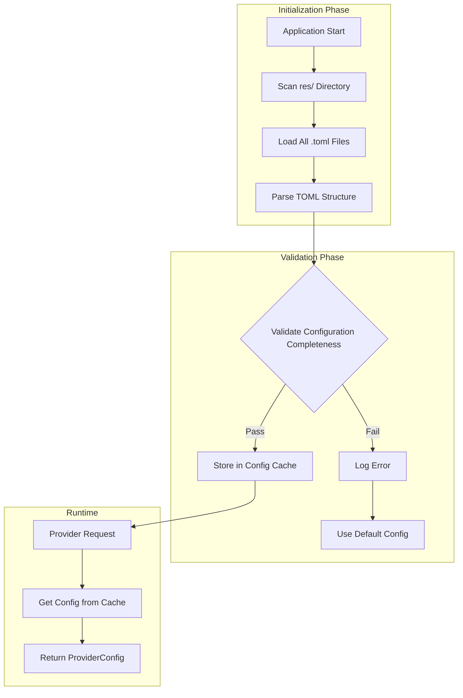

### هرمية التهيئة

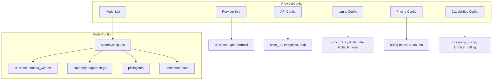

## أولوية التهيئة

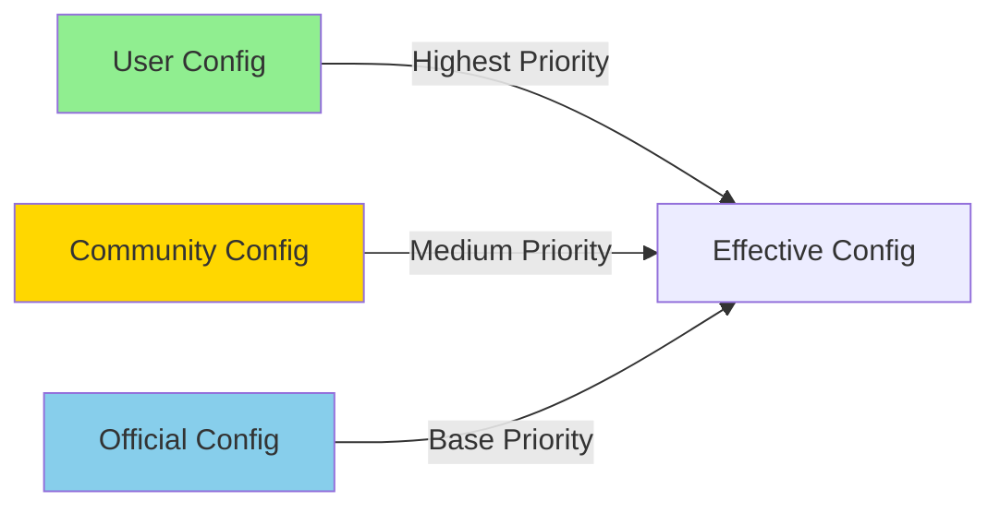

### قواعد دمج الأولوية

| الطبقة | المصدر | الوصف |
| --- | --- | --- |
| 1 | التهيئة الرسمية | بيانات وثائق المزود الرسمية، كافتراضات أساسية |
| 2 | تهيئة المجتمع | تهيئة محسّنة يساهم بها المجتمع، تتجاوز البيانات الرسمية |
| 3 | تهيئة المستخدم | تهيئة معرّفة من قبل المستخدم، الأولوية الأعلى |

## نماذج التسعير

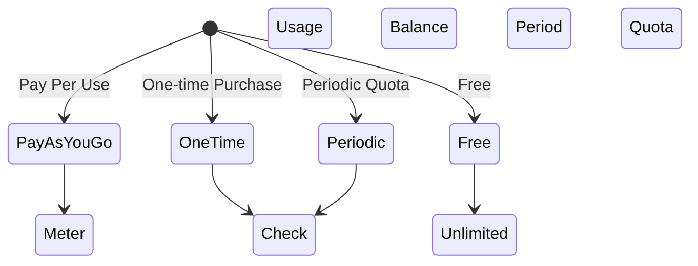

### مقارنة نماذج التسعير

| النموذج | السيناريوهات القابلة للتطبيق | الخصائص |
| --- | --- | --- |
| PayAsYouGo | OpenAI، Anthropic | دفع لكل token، خصم فوري |
| OneTime | باقات مدفوعة مسبقًا | شراء حصة مسبقًا، الاستخدام حتى النفاد |
| Periodic | GLM China، إلخ | إعادة تعيين الحصة الدورية |
| Free | نماذج Ollama المحلية | لا حدود للتكلفة |

## تصنيف نوع المزود

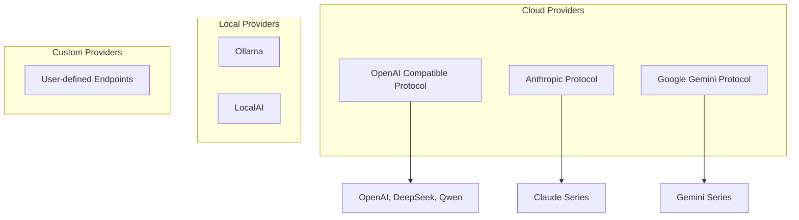

## آلية إعادة التحميل الساخن

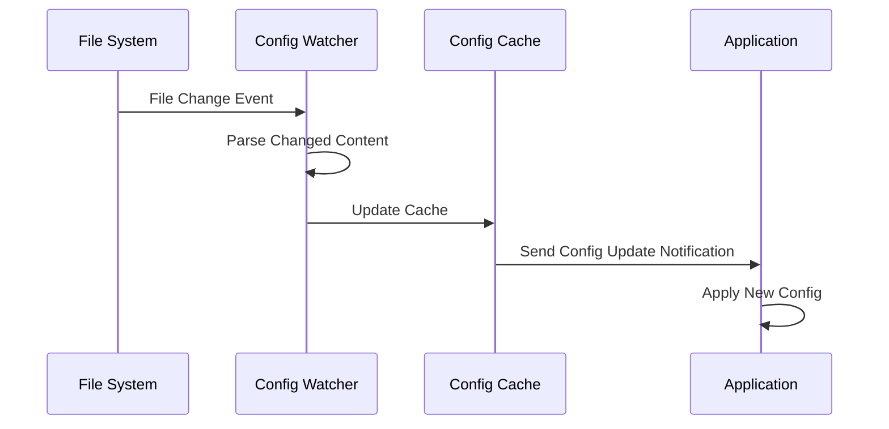

## استراتيجية معالجة الأخطاء

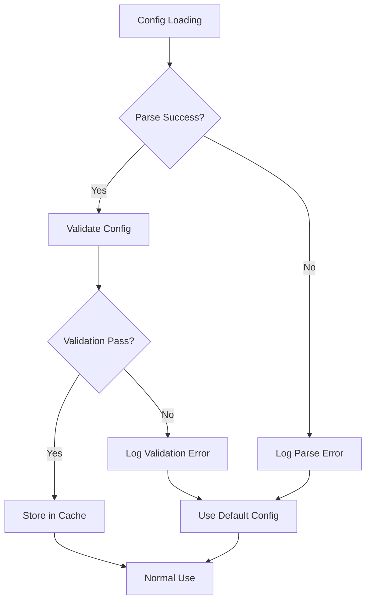

## تصميم قابلية التوسع

### إضافة مزود جديد

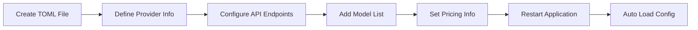

### قواعد التحقق من التهيئة

| الحقل | قاعدة التحقق | معالجة الأخطاء |
| --- | --- | --- |
| provider.id | غير فارغ، فريد | رفض التحميل، تسجيل الخطأ |
| api.base_url | تنسيق URL صالح | استخدام القيمة الافتراضية |
| models[].id | غير فارغ | تخطي ذلك النموذج |
| pricing.model | فحص قيمة المعدّد | افتراضي PayAsYouGo |

## اعتبارات الأمان

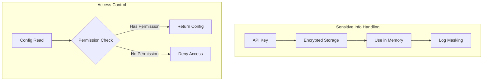

## الامتدادات المستقبلية

| الميزة | الوصف | الأولوية |
| --- | --- | --- |
| إعادة التحميل الساخن للتهيئة | تحميل ملفات تهيئة خارجية وقت التشغيل | عالية |
| التحقق من التهيئة | التحقق من اكتمال التهيئة عند البدء | عالية |
| دمج التهيئة | تهيئة المستخدم تتجاوز التهيئة الافتراضية | متوسطة |
| استيراد/تصدير التهيئة | دعم استيراد/تصدير ملف التهيئة | متوسطة |
| تحديث الوكيل | تحديث تلقائي للتهيئة من الوثائق الرسمية | منخفضة |

# تصميم إدارة البيانات الوصفية للمزودين

## نظرة عامة

نظام إدارة البيانات الوصفية للمزودين مسؤول عن جلب معلومات التهيئة ديناميكيًا من وثائق مزود LLM الرسمية، مما يتيح التحديثات والتحقق المؤتمت من بيانات التهيئة.

## المشكلة الأساسية

التنفيذ الحالي يحتوي على إحصائيات استخدام مشفّرة ويفتقر إلى دعم بيانات المزود الديناميكية. يجب إنشاء آلية مؤتمتة للحصول على البيانات الوصفية وإدارتها.

## تصميم البنية

### بنية تدفق البيانات

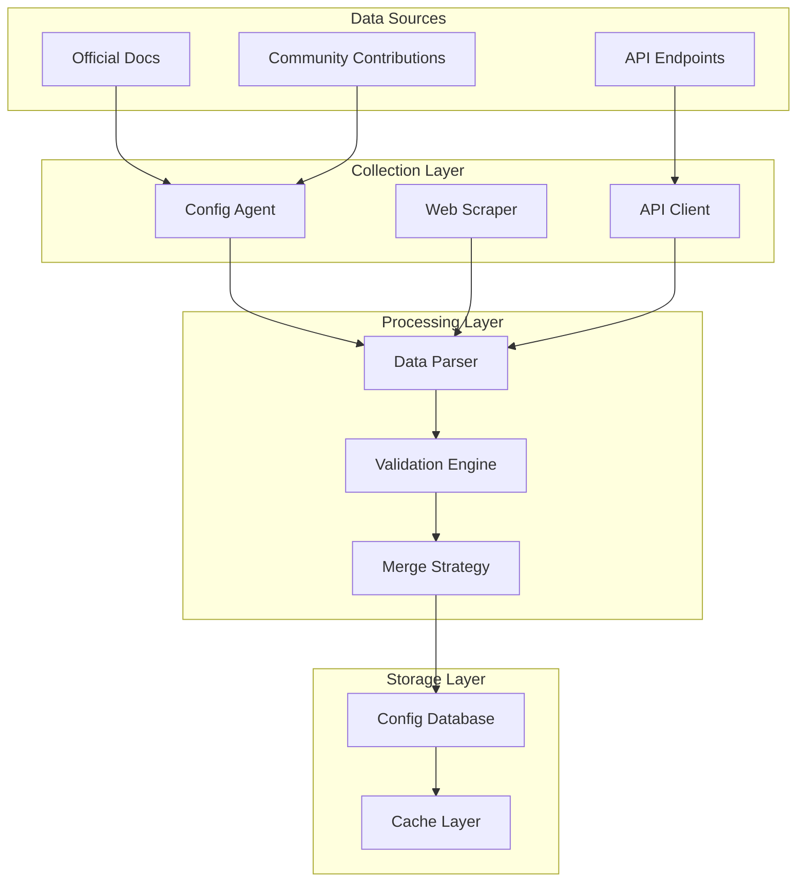

### نموذج أولوية التهيئة

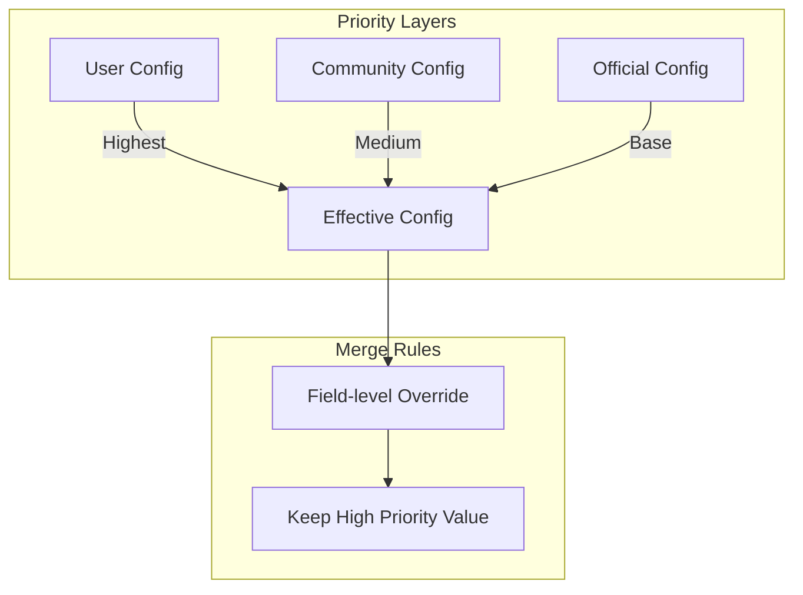

## بنية البيانات الوصفية

### هرمية تهيئة المزود

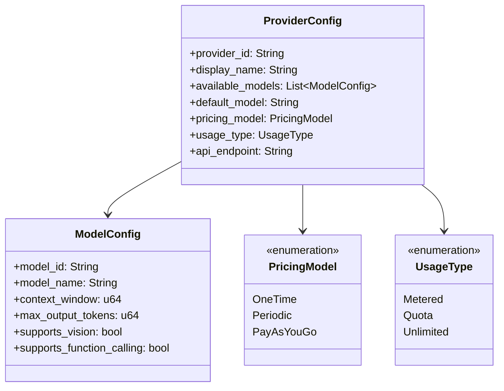

### تصنيف مصدر التهيئة

| نوع المصدر | الوصف | الموثوقية | تكرار التحديث |
| --- | --- | --- | --- |
| رسمي | وثائق المزود الرسمية | عالية | دوري تلقائي |
| مجتمع | بيانات يساهم بها المجتمع | متوسطة | تحديث يدوي |
| تجاوز المستخدم | مخصص من قبل المستخدم | الأعلى | فوري |

## نظام جمع الوكلاء

### عملية الجمع

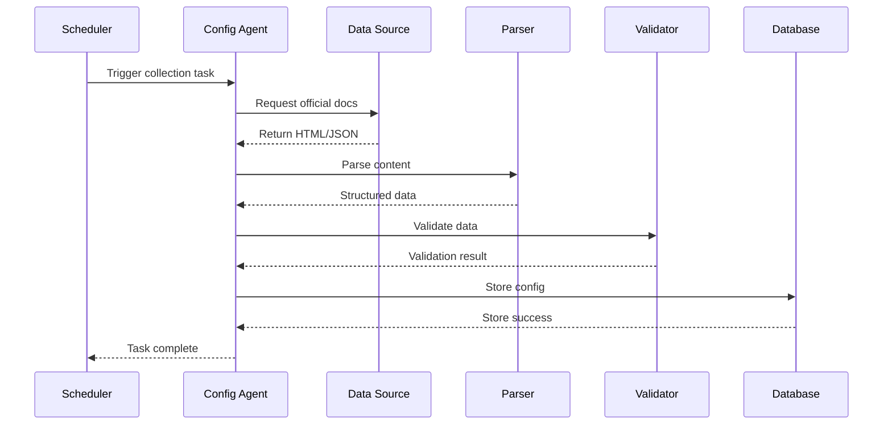

### مسؤوليات وكيل المزود

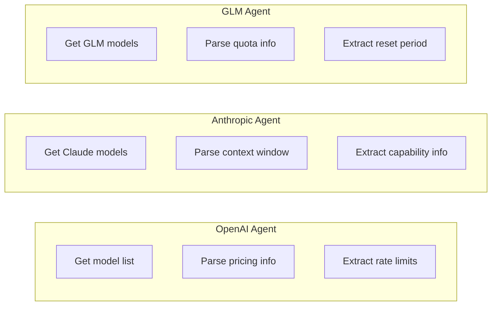

## آلية التحقق من البيانات

### عملية التحقق

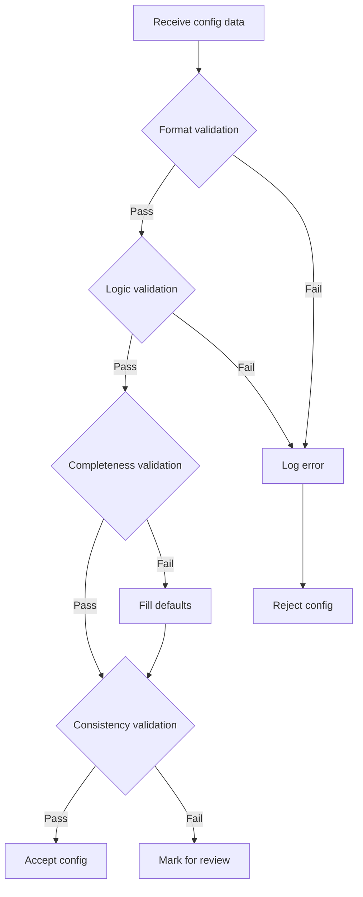

### قواعد التحقق

| نوع التحقق | محتوى الفحص | معالجة الفشل |
| --- | --- | --- |
| التحقق من التنسيق | أنواع البيانات، تنسيقات الحقول | رفض وتسجيل |
| التحقق المنطقي | نطاقات القيم، قيم المعدّدات | استخدام القيم الافتراضية |
| التحقق من الاكتمال | الحقول المطلوبة موجودة | ملء القيم الافتراضية |
| التحقق من الاتساق | العلاقات بين الحقول صحيحة | وضع علامة للمراجعة |

## استراتيجية دمج التهيئة

### الدمج على مستوى الحقل

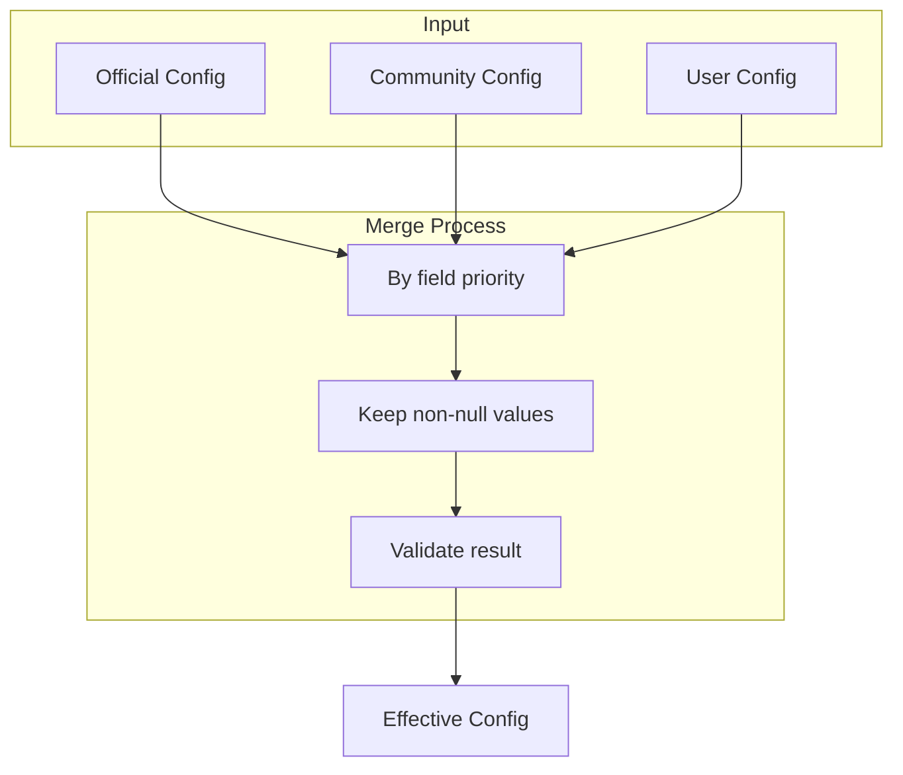

### مثال على الدمج

| الحقل | القيمة الرسمية | قيمة المجتمع | قيمة المستخدم | القيمة النهائية |
| --- | --- | --- | --- | --- |
| context_window | 128000 | - | 64000 | 64000 |
| max_concurrent | 100 | 50 | - | 50 |
| pricing_model | PayAsYouGo | - | - | PayAsYouGo |

## واجهة تهيئة المستخدم

### بنية ملف التهيئة

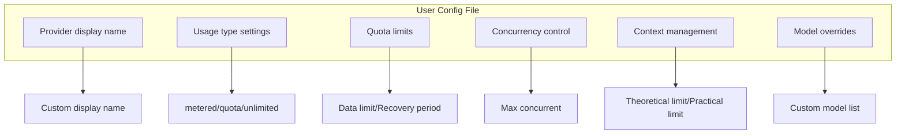

## آلية التحديث المجدول

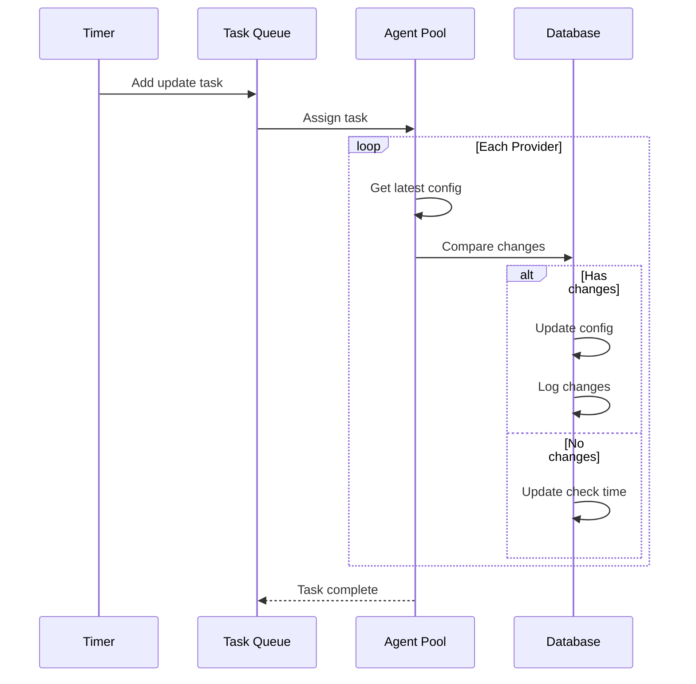

## معالجة الأخطاء

### معالجة فشل الجمع

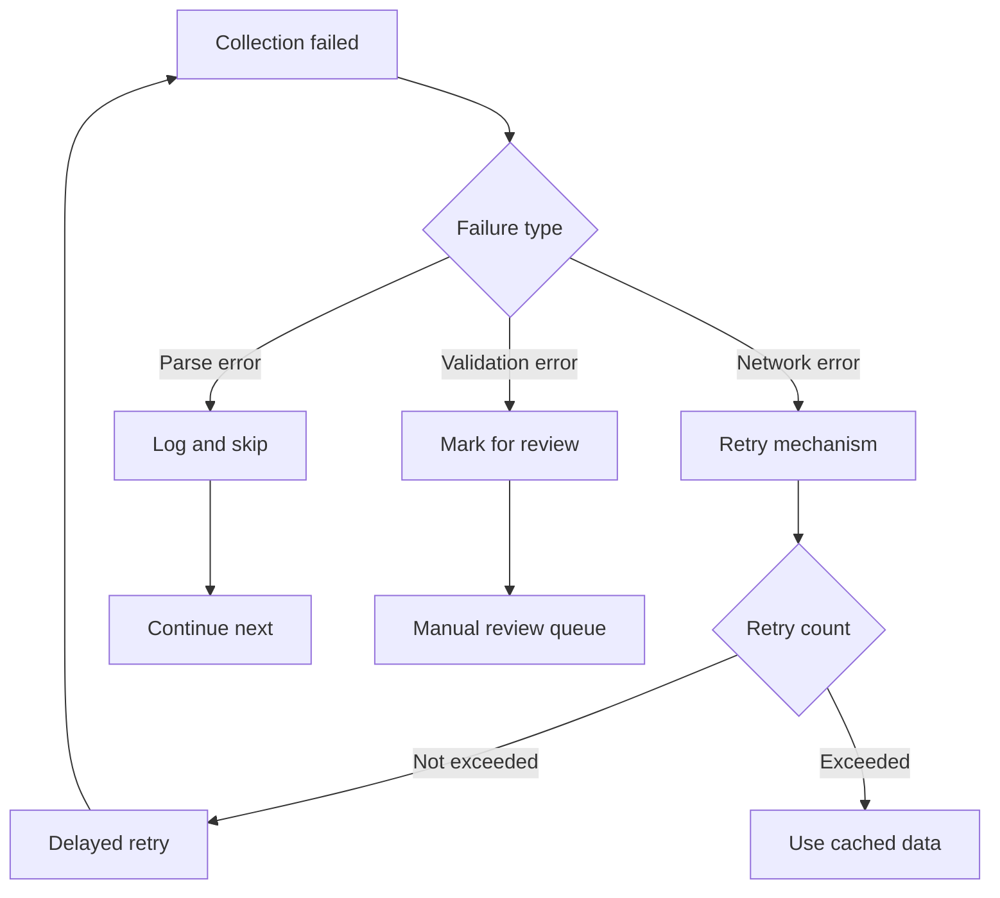

## تصميم قابلية التوسع

### إضافة مزود جديد

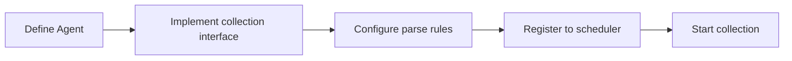

### نقاط الامتداد

| نوع الامتداد | الوصف | التنفيذ |
| --- | --- | --- |
| مزود جديد | إضافة مصدر تهيئة جديد | تنفيذ واجهة Provider Agent |
| حقل جديد | توسيع بنية التهيئة | تحديث نموذج البيانات وقواعد التحقق |
| قاعدة تحقق جديدة | إضافة منطق تحقق | إضافة تطبيق مدقق |

## تنفيذ وكيل Layer3

### وكيل ProviderScratch

`ProviderScratch` هو أول وكيل Layer3 رسمي، يعمل كمثال تنفيذ لمرافق الكشط.

```mermaid
flowchart TB
    subgraph ProviderScratch Agent
        A[Agent Entry] --> B{Execution Mode}
        B -->|TUI Mode| C[Interactive Interface]
        B -->|CI Mode| D[Automated Execution]

        C --> E[Select Provider]
        D --> F[Read env vars]

        E --> G[Call Skill]
        F --> G

        G --> H[Scrape docs]
        H --> I[Parse data]
        I --> J[Generate TOML]

        J --> K{Confirm commit?}
        K -->|Yes| L[Write to workspace]
        K -->|No| M[Discard changes]

        L --> N[Request user commit]
    end
```

### بنية المهارة

يقابل كل مزود مهارة مستقلة:

```mermaid
graph LR
    subgraph Skills
        A[openai]
        B[anthropic]
        C[glm]
        D[deepseek]
        E[qwen]
        F[gemini]
    end

    subgraph Shared Components
        G[Doc Scraper]
        H[Data Parser]
        I[TOML Generator]
    end

    A --> G
    B --> G
    C --> G
    D --> G
    E --> G
    F --> G

    G --> H
    H --> I
```

### بنية الدليل

```mermaid
flowchart LR
    Root[".amphoreus/provider_scratch/"]
    AT["agent.toml"]
    OV["overview/"]
    SK["skills/"]
    Root --> AT
    Root --> OV
    Root --> SK
    OV --> ZH["zhs.md"]
    SK --> OA["openai/"]
    SK --> AN["anthropic/"]
    SK --> GL["glm/"]
    SK --> DS["deepseek/"]
    SK --> QW["qwen/"]
    SK --> GE["gemini/"]
    OA --> OAP["prompt.md"]
    AN --> ANP["prompt.md"]
    GL --> GLP["prompt.md"]
    DS --> DSP["prompt.md"]
    QW --> QWP["prompt.md"]
    GE --> GEP["prompt.md"]
```

### أتمتة CI

```mermaid
flowchart LR
    A[Scheduled trigger] --> B[Checkout code]
    B --> C[Run ProviderScratch]
    C --> D{Detect changes}
    D -->|Has changes| E[Create branch]
    E --> F[Commit changes]
    F --> G[Create PR]
    G --> H[Wait for review]
    D -->|No changes| I[Complete]
```

### متغيرات البيئة

| اسم المتغير | الوصف |
| --- | --- |
| `AMPHOREUS_PROVIDER_SCRATCH_PROVIDERS` | قائمة المزودين للكشط |
| `AMPHOREUS_PROVIDER_SCRATCH_OUTPUT_DIR` | مسار دليل الإخراج |
| `AMPHOREUS_PROVIDER_SCRATCH_GIT_BRANCH` | فرع Git المستهدف |
| `AMPHOREUS_PROVIDER_SCRATCH_DRY_RUN` | تشغيل تجريبي فقط |

## الخطط المستقبلية

| الميزة | الوصف | الأولوية |
| --- | --- | --- |
| تحكم إصدار التهيئة | تتبع تاريخ تغيير التهيئة | عالية |
| إشعار التغيير | إشعار المستخدمين بتحديثات التهيئة | متوسطة |
| تراجع التهيئة | دعم التراجع إلى الإصدارات التاريخية | متوسطة |
| توصيات ذكية | توصية التهيئات بناءً على أنماط الاستخدام | منخفضة |
| GitHub巡回 Agent | إنشاء PRs تلقائيًا لتحديث التهيئات | عالية |
