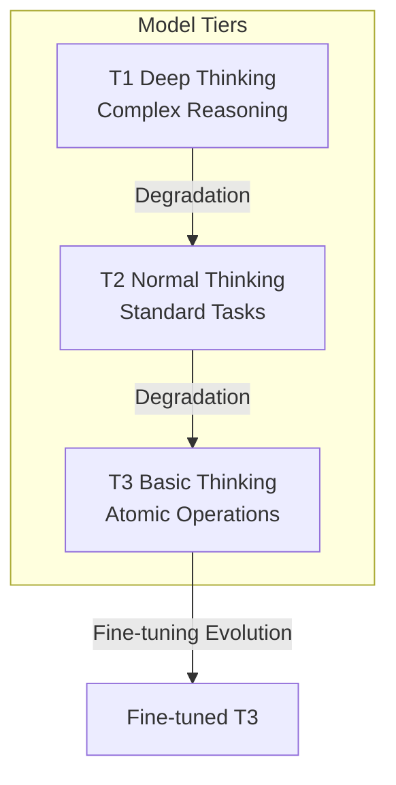
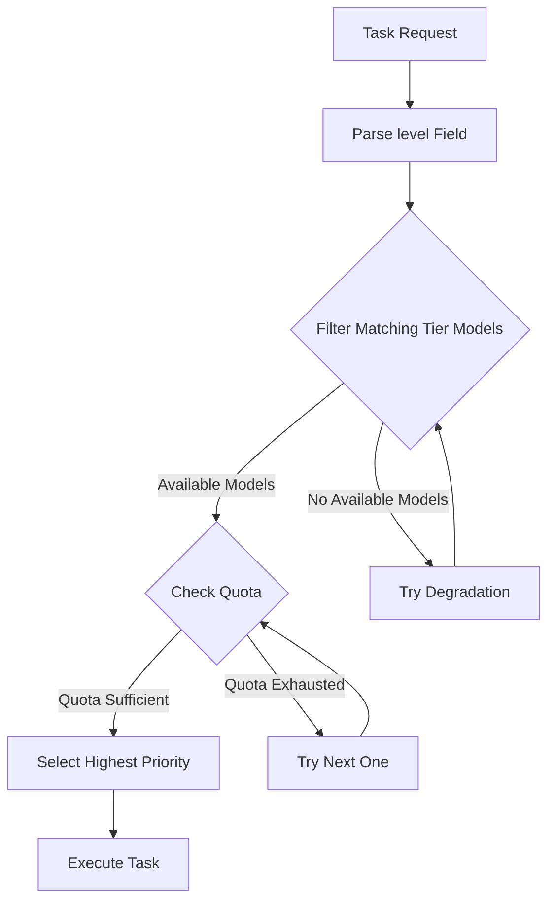
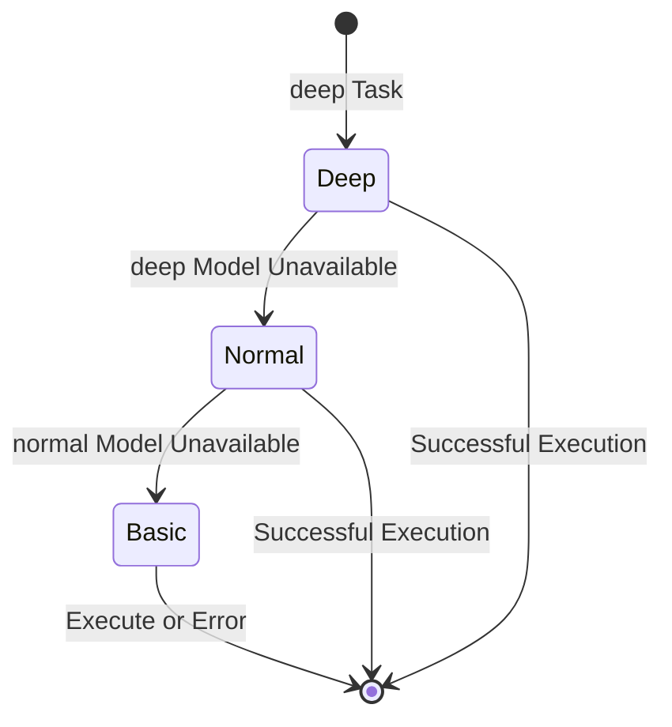
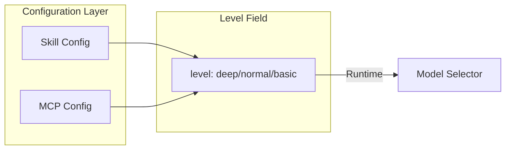
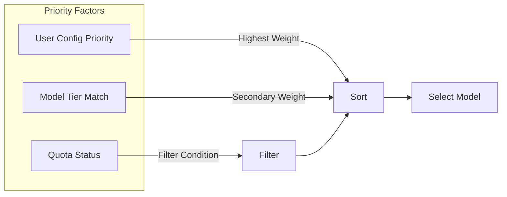
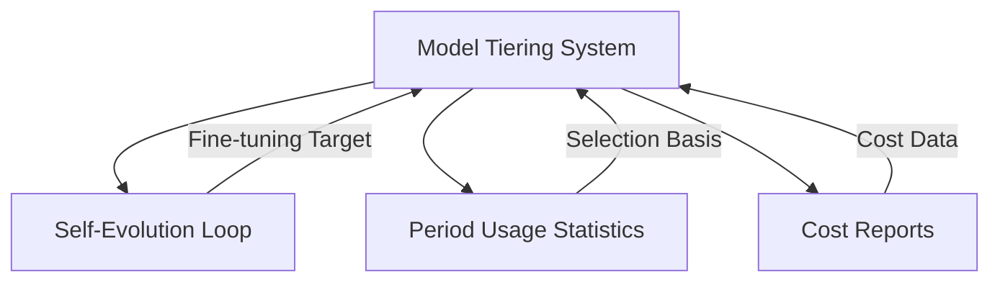

# تصميم نظام تصنيف النماذج

## نظرة عامة

نظام تصنيف النماذج هو آلية اختيار ذكية للنماذج تعيّن مستويات النماذج المناسبة بناءً على تعقيد المهمة، مما يزيد من استغلال الموارد مع ضمان الجودة.

> **وثيقة ذات صلة**: نظام النماذج ثلاثي المستويات المعرّف في هذه الوثيقة هو أساس [نظام حلقة التطور الذاتي](04-self-evolution-loop.md).

## المبادئ الأساسية

### نظام النماذج ثلاثي المستويات

### مقارنة المستويات

| المستوى | التموضع | التكلفة | السيناريوهات النموذجية |
| --- | --- | --- | --- |
| T1 (عميق) | استدلال معقد، قرارات | الأعلى | تصميم البنية، تحليل المشكلات |
| T2 (عادي) | مهام قياسية | متوسطة | كتابة الكود، توليد المستندات |
| T3 (أساسي) | عمليات ذرّية | الأدنى | قراءة الملفات، تحويل التنسيق |

## آلية اختيار النماذج

### عملية الاختيار

### استراتيجية التدهور

## آلية التهيئة

### توضيح مستوى المهارة/MCP

تصرح كل مهارة وأداة MCP بمستوى النموذج المطلوب عبر حقل `level`:

### تحكم الأولوية

## العلاقة مع الوحدات الأخرى

## اعتبارات التصميم

### تحسين التكلفة

- إعطاء الأولوية للنماذج الأدنى مستوى
- التدهور التلقائي يتجنب فشل المهمة
- تنبيهات مراقبة الحصة

### ضمان الجودة

- المهام المعقدة تتطلب مستوى عاليًا
- التدهور يتطلب التحقق من الجدوى
- إعادة المحاولة التلقائية عند الفشل

### قابلية التوسع

- دعم مستويات مخصصة
- تهيئة أولوية مرنة
- استراتيجيات اختيار قابلة للإدراج
