# بنية النطاقات: `vars`، `refs`، `env`

> **ملاحظة (2026-06)**: تم تقليل سطح الأدوات المرئية لـ LLM من 5 إلى 3 بدائيات. لم تعد `ref_add` و`ref_remove` **معروضة على LLM** — تُرجع `agent_allowed_tools()` فقط `exec`، `write_to_var`، `write_to_var_json`. لا يزال نطاق `__refs` موجودًا كبنية بيانات داخلية (لقطة/استعادة، حقن التوجيهات) لكنه لم يعد معدّلًا مباشرةً من قبل النموذج. الأقسام أدناه التي تصف توزيع `ref_add`/`ref_remove` توثق الأنابيب الداخلية المتبقية، وليس سطح أدوات LLM.

## نظرة عامة

توفر Entelecheia ثلاثة نطاقات مشتركة داخل بيئة تشغيل IEPL JavaScript (`globalThis.$`) تعمل كركيزة اتصال بين المهارات والوكلاء. تعمل هذه النطاقات على **مستوى بيئة تشغيل Cosmos**، مما يعني أن جميع الوكلاء والمهارات تتشاركها بشفافية داخل جلسة واحدة.

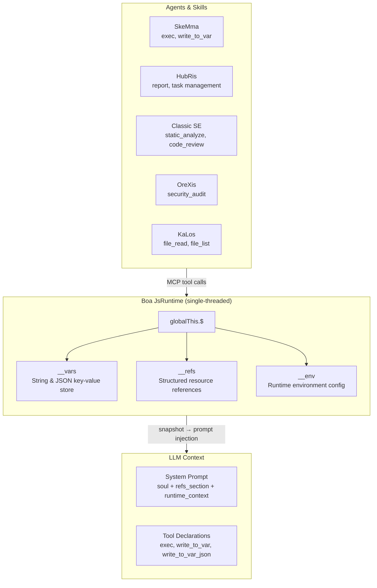

### مبادئ التصميم

| المبدأ | الوصف |
| --- | --- |
| **مصدر واحد للحقيقة** | لكل نطاق وحدة واحدة بالضبط (`var_namespace.rs`، `ref_namespace.rs`، `namespace.rs`) تولّد **كل** سلاسل كود JS التي تشير إلى ذلك النطاق |
| **التهيئة الكسولة** | تتم تهيئة `__vars` و`__refs` مرة واحدة في `JsRuntime::new()` وتنجو عبر سلاسل المهارات؛ تتم تهيئة `__env` أثناء تقييم JS للنطاق |
| **اللقطة/الاستعادة** | حالة `__vars` + `__refs` الكاملة قابلة لأخذ اللقطات والاستعادة، مما يتيح استمرارية الجلسة |
| **حقن التوجيهات** | بيانات اللقطة تقود توجيهات نظام غنية بالسياق — يرى LLM أسماء المتغيرات المتاحة، ملخصات المراجع، وإعدادات البيئة |
| **تحكم الوصول للأدوات** | تُمنح كل الأدوات الداخلية الثلاث لـ cosmos (`exec`، `write_to_var`، `write_to_var_json`) لكل وكيل عبر `agent_allowed_tools()`؛ تعرّف إجراءات المهارة الفردية (SOPs) أيها يُستخدم |

-----------------------------------------------------------------------------

## مقارنة النطاقات

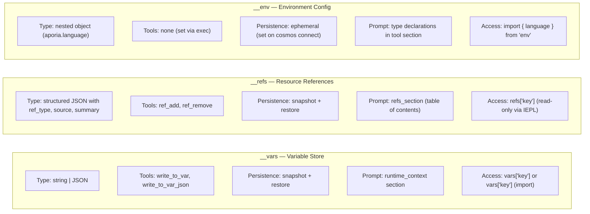

-----------------------------------------------------------------------------

## 1. `__vars` — مخزن المتغيرات (`vars`)

### 1.1 الغرض

`__vars` هو **آلية الاتصال الرئيسية بين الخطوات** داخل سلسلة مهارات. تستخدم المهارات `write_to_var` / `write_to_var_json` للاحتفاظ بالنتائج المحسوبة، وتقرأ الخطوات اللاحقة (أو المهارات) من `__vars` في كتل `exec`.

### 1.2 بنية الوحدة

يتمركز كل توليد كود JS لـ `__vars` في `packages/shared/core/src/var_namespace.rs`.

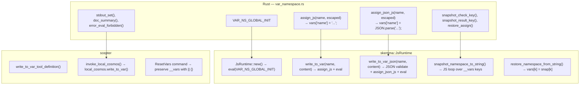

### 1.3 تسلسل التهيئة

```text
JsRuntime::new()
  → context.eval("globalThis.$ = globalThis.$ || {}; globalThis.__vars = {}; globalThis.__refs = {};")
  → __vars initialized as empty object
```

تعمل التهيئة **قبل** `build_namespace_js()` (التي تُعدّ `__env` و`$.variant`)، مما يضمن توفر `__vars` دائمًا عند تحميل وحدات النطاق.

> **ملاحظة:** تتم تهيئة `__refs` معًا مع `__vars` عبر `VAR_NS_GLOBAL_INIT` (المعرّف في `var_namespace.rs`). يوجد `REF_NS_GLOBAL_INIT` المستقل في `ref_namespace.rs` للتماثل لكنه لا يُستدعى مباشرة أبدًا — التهيئة الفعلية تحدث في `JsRuntime::new()`.

### 1.4 العمليات

| العملية | اسم الأداة | النوع | السلوك |
| --- | --- | --- | --- |
| تخزين نص | `write_to_var` | حاجب | يهرب المحتوى لـ JS، يقيّم `vars['name'] = 'content'` |
| تخزين JSON | `write_to_var_json` | حاجب | يتحقق من JSON، يقيّم `vars['name'] = JSON.parse('content')` |
| القراءة في exec | `exec` | FireAndForget | وصول مباشر: `vars['name']` أو `import vars from 'vars'` |
| لقطة | (داخلي) | — | يلتقط كل مفاتيح `__vars` كـ `{"$vars": {...}}` |
| استعادة | (داخلي) | — | يضبط `vars[k] = snap['$vars'][k]` لكل مفتاح |
| إعادة تعيين | (داخلي) | — | `__vars = __vars \|\| {}` — يحافظ على القيم الموجودة، يضمن البنية |

### 1.5 حقن التوجيهات

في `build_runtime_context()` (`prompt.rs:472`)، يظهر مخزن المتغيرات في توجيه النظام كـ:

```text
## JS Runtime Context

__vars (from write_to_var / write_to_var_json, N total):
  `var_1`, `var_2`, `var_3`, ... (up to 30 shown)
  Import as: `import vars from 'vars';`  Access: `vars['key']`
```

### 1.6 عرض المخرجات

- تخزين نصي: `vars['name'] set:\n{first 200 chars / 5 lines}... (total_chars chars)`
- تخزين JSON: `vars['name'] set (parsed JSON): object with 3 key(s)`
- فشل التحليل: خطأ مع معاينة المحتوى (أول 200 حرف)

### 1.7 الوحدة الاصطناعية `vars`

مثل `env`، فإن وحدة `vars` هي وحدة Boa اصطناعية تغلف `__vars` للاستيراد المريح:

```python
import vars from 'vars';
// vars === __vars (live reference)
const report = vars['analysis_results'];
```

**التنفيذ:** `packages/agents/skemma/src/js_runtime/module_loader.rs` الأسطر 142-156. تستخدم الوحدة `Module::synthetic()` مع إغلاق يُرجع `globalThis.__vars` مباشرةً (مرجع حي، وليس لقطة). هذا يعني أن التعديلات عبر `vars['key'] = value` تكافئ `vars['key'] = value`.

-----------------------------------------------------------------------------

## 2. `__refs` — مراجع الموارد (`refs`)

### 2.1 الغرض

يوفر `__refs` **تمرير موارد منظّم بين الوكلاء**. على عكس `__vars` (سلاسل خام)، تحمل المراجع بيانات وصفية محددة النوع (`ref_type`، `source`، `summary`) بالإضافة إلى أحمال اختيارية. يمكن للوكلاء:

- **نشر** مراجع للملفات أو الصور أو مخرجاتهم الخاصة
- **اكتشاف** المراجع بالاسم/النوع في توجيهات النظام
- **الوصول** إلى محتوى المرجع عبر `refs['name']` في كتل exec لـ IEPL

### 2.2 بنية الوحدة

يتمركز كل توليد كود JS لـ `__refs` في `packages/shared/core/src/ref_namespace.rs`.

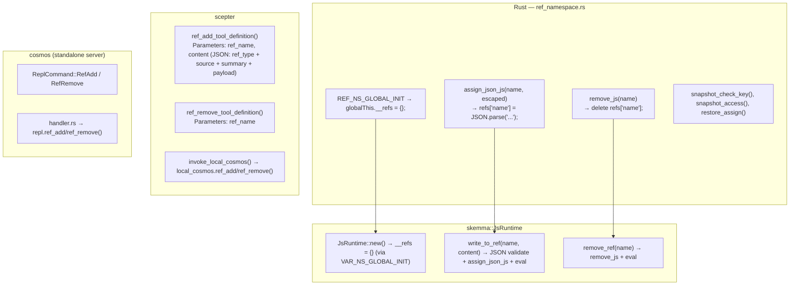

### 2.3 بنية RefItem

```typescript
// TypeScript type definitions (from iepl-api.d.ts)
type RefType = "code" | "image" | "agent_output";

// Used in system prompt and runtime_context for name listing
type RefItemSummary = {
  name: string;
  ref_type: RefType;
  source: string;
  summary: string;
};

interface RefItem {
  name: string;        // e.g. "code:src/main.rs", "image:diagram", "agent:orexis/audit-1"
  ref_type: RefType;   // category for sorting/filtering
  source: string;      // who provided it ("user", agent name, tool name)
  summary: string;     // one-line description for prompt display
  files?: RefCodeFile[];   // for "code" refs
  images?: RefImage[];     // for "image" refs
  output?: RefAgentOutput; // for "agent_output" refs
}

interface RefCodeFile {
  path: string;
  language: string;
  content: string;
  selection?: { start_line: number; end_line: number; content: string };
}

interface RefImage {
  mime: string;          // e.g. "image/png"
  data: string;          // base64-encoded or data URL
  description?: string;
}

interface RefAgentOutput {
  source_agent: string;  // agent name
  source_tool: string;   // tool that produced this output
  content: Record<string, unknown>;
}
```

### 2.4 العمليات

| العملية | اسم الأداة | النوع | السلوك |
| --- | --- | --- | --- |
| إضافة مرجع | `ref_add` | حاجب | يتحقق من JSON، يقيّم `refs['name'] = JSON.parse('...')` |
| إزالة مرجع | `ref_remove` | FireAndForget | يقيّم `delete refs['name']` |
| القراءة في exec | (عبر `exec`) | — | `refs['name'].files[0].content` |
| لقطة | (داخلي) | — | يلتقط كل مفاتيح `__refs` كـ `{"$refs": {...}}` |
| استعادة | (داخلي) | — | يضبط `refs[k] = snap['$refs'][k]` لكل مفتاح |

### 2.5 حقن التوجيهات

تظهر المراجع في **موقعين** في توجيه النظام:

#### الموقع 1: `refs_section` (جدول محتويات مخصص)

```text
## Referenced Resources (refs)

The following resources are available via `refs['name']`.
- `code:src/main.rs` [code] from user — main rust file
- `image:architecture` [image] from user — system architecture diagram
- `agent:orexis/audit-1` [agent_output] from OreXis — security audit results
```

يُولّد بواسطة `build_refs_section()` في `prompt.rs:426`. يظهر كل مرجع **الاسم والنوع والمصدر والملخص** — يرى LLM ما هو متاح لكن يجب أن يقرأ المحتوى عبر كتل `exec`.

#### الموقع 2: `runtime_context` (قائمة الأسماء)

```text
__refs (referenced resources from user/agents, 3 total):
  `code:src/main.rs`, `image:architecture`, `agent:orexis/audit-1`
  Access: `refs['name']` — each ref has .ref_type, .source, .summary
```

### 2.6 مبدأ الرؤية

> **أسماء المراجع مرئية لكل الوكلاء. محتوى المرجع ليس كذلك.**

يكشف `refs_section` في توجيه النظام **جدول المحتويات** (الاسم، النوع، المصدر، الملخص) لكل تنفيذ مهارة. لكن المحتوى الفعلي (`files[].content`، `images[].data`، `output.content`) متاح فقط عبر وصول صريح `refs['name']` في كتل exec لـ IEPL. هذا يعني:

- يمكن لـ OreXis رؤية أن `code:src/main.rs` موجود (من ملخصه)، لكن يجب أن يقرأ محتواه صراحةً للتدقيق
- يقرر LLM متى يلغي الإشارة إلى المحتوى بناءً على صلة المهمة
- لا يمكن لأي وكيل تسريب محتوى مرجع عن طريق الخطأ إلى تدفق المحادثة

-----------------------------------------------------------------------------

## 3. `__env` — تهيئة بيئة التشغيل (`env`)

### 3.1 الغرض

يحمل `__env` **إعدادات بيئة التشغيل** التي يحتاجها محرك تنفيذ IEPL والوكلاء. حاليًا، المفتاح الفرعي الوحيد هو `env.aporia.language`، الذي يتحكم بلغة مخرجات الوكيل.

### 3.2 بنية الوحدة

تعيش تهيئة البيئة في `packages/shared/iepl/src/namespace.rs`.

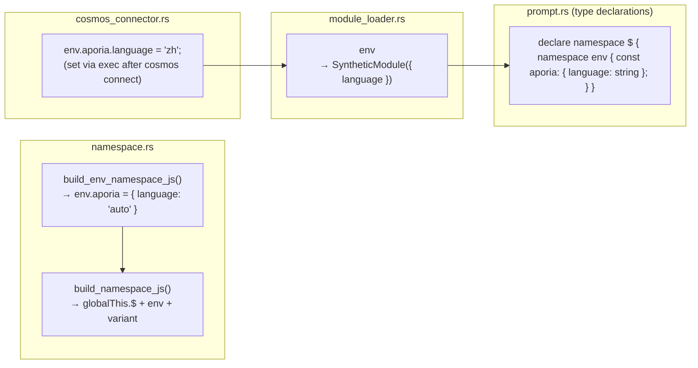

### 3.3 العمليات

| العملية | الآلية | السلوك |
| --- | --- | --- |
| تهيئة | `build_namespace_js()` | `__env = __env \|\| {}; env.aporia = env.aporia \|\| { language: 'auto' }` |
| ضبط اللغة | استدعاء `exec` عبر موصل cosmos | `env.aporia.language = 'zh'` |
| القراءة في IEPL | `import { language } from 'env'` | يُرجع `env.aporia.language` مع بديل `'auto'` |
| لقطة/استعادة | **غير مدعوم** | لا يتم تضمين `__env` في اللقطة/الاستعادة — فهو مؤقت ويُعاد تهيئته عند كل اتصال cosmos |

### 3.4 تدفق اللغة

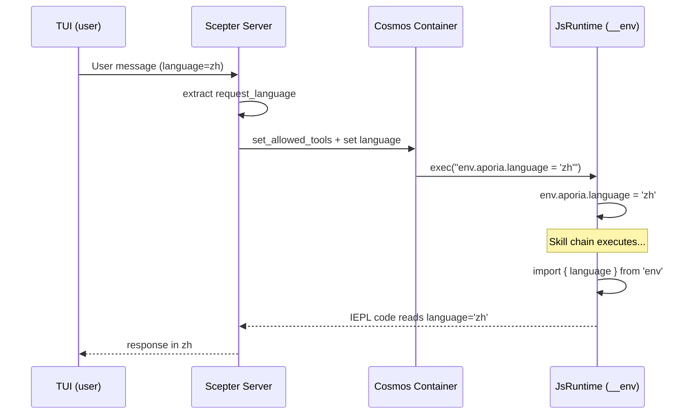

### 3.5 `$.variant` — موصّل متوافق مع الإصدارات السابقة

**الملف:** `packages/shared/iepl/src/namespace.rs:199-207`

يُنشئ `build_variant_namespace_js()` خاصية مرجعية ذاتية دائرية:

```javascript
Object.defineProperty(globalThis.$, 'variant', {
  get: function() { return globalThis.$; },
  set: function(val) { Object.assign(globalThis.$, val); },
  configurable: true,
  enumerable: true,
});
```

هذا يسمح للكود المكتوب كـ `$.variant.tools.agent.method()` بأن يحل إلى نفس الكائن كـ `$.tools.agent.method()`. موجود للتوافق مع الإصدارات السابقة مع أنماط وصول النطاق البديلة.

> **تحذير اللقطة:** لأن `$.variant` مرجع دائري (`$.variant === $`)، فإن محاولة `JSON.stringify` له ترمي `TypeError`. يستهدف كود اللقطة JS صراحةً `__vars` و`__refs` مباشرةً بدلًا من التكرار عبر مفاتيح `globalThis.$`، متجنبًا هذه المشكلة.

-----------------------------------------------------------------------------

## 4. بنية اللقطة والاستعادة

### 4.1 لماذا اللقطة/الاستعادة؟

تشغل `LocalCosmosRuntime` **`JsRuntime` طويل العمر واحد** في خيط مخصص. بين عمليات تنفيذ سلسلة المهارات، تستمر حالة بيئة التشغيل (`__vars`، `__refs`) بشكل طبيعي. لكن تُستخدم اللقطات لـ:

1. **حقن التوجيهات** — تقرأ `build_runtime_context()` و`build_refs_section()` JSON اللقطة لملء توجيه النظام
1. **استمرارية الجلسة** — تفريغ/استعادة على القرص لاسترداد الأعطال أو ترحيل الجلسة
1. **مزامنة الحاويات** — دفع الحالة إلى حاويات cosmos عبر `cosmos_set_rag_context()`

### 4.2 تنسيق اللقطة

```json
{
  "$vars": {
    "var_name_1": "value",
    "parsed_json": { "key": "value" }
  },
  "$refs": {
    "code:src/main.rs": {
      "ref_type": "code",
      "source": "user",
      "summary": "main rust file",
      "files": [{ "path": "src/main.rs", "language": "rust", "content": "..." }]
    }
  },
  "__lexical": {
    "my_const": 42
  }
}
```

### 4.3 تدفق كود اللقطة

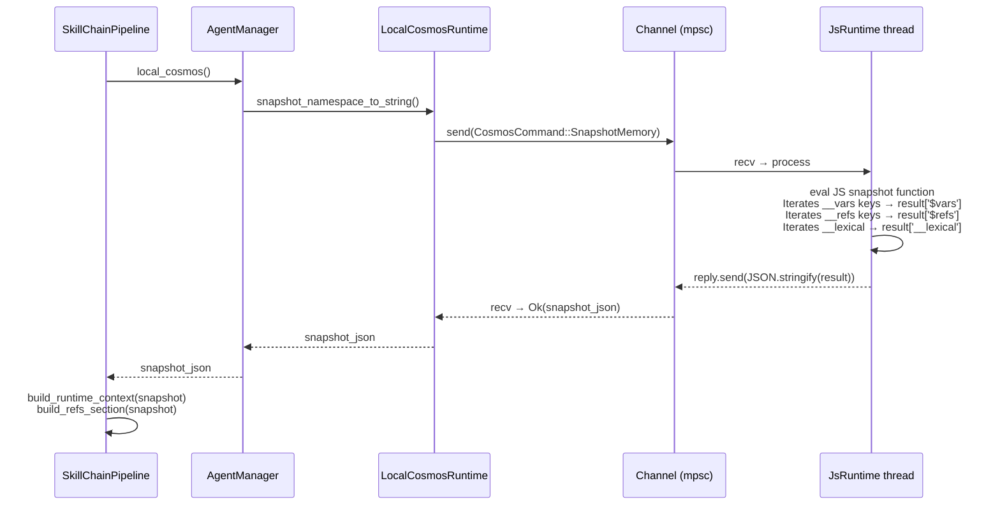

### 4.4 كود اللقطة JS (النموذج المنشور)

> **ملاحظة:** كود JS المعروض أدناه هو **النموذج المنشور** الذي يبنيه كود Rust ديناميكيًا وقت التشغيل. إنه غير مخزن كـ Rust string literal في المصدر. يتم توليد قسم `__lexical` من `self.lexical_var_names` المتتبع أثناء استدعاءات `exec()` السابقة. راجع `packages/agents/skemma/src/js_runtime/runtime.rs:549-607` لباني سلاسل Rust.

تصل دالة اللقطة مباشرةً إلى أشجار النطاقات المعروفة:

```javascript
(function() {
    var result = {};
    if (globalThis.$ && globalThis.__vars) {
        var dollarVars = {};
        var dollarKeys = Object.keys(globalThis.__vars);
        for (var j = 0; j < dollarKeys.length; j++) {
            var dk = dollarKeys[j];
            try {
                var dv = globalThis.vars[dk];
                if (typeof dv === 'function') continue;
                dollarVars[dk] = dv;
            } catch(e) {}
        }
        if (Object.keys(dollarVars).length > 0) {
            result['$vars'] = dollarVars;
        }
    }
    if (globalThis.$ && globalThis.__refs) {
        var dollarRefs = {};
        var refsKeys = Object.keys(globalThis.__refs);
        for (var j = 0; j < refsKeys.length; j++) {
            var dk = refsKeys[j];
            try {
                var dv = globalThis.refs[dk];
                if (typeof dv === 'function') continue;
                dollarRefs[dk] = dv;
            } catch(e) {}
        }
        if (Object.keys(dollarRefs).length > 0) {
            result['$refs'] = dollarRefs;
        }
    }
    // ... __lexical capture ...
    return JSON.stringify(result);
})( )
```

### 4.5 كود الاستعادة (المنشور)

```javascript
(function() {
    var snap = JSON.parse(snapshot_string);
    if (snap['$vars'] && globalThis.$) {
        Object.keys(snap['$vars']).forEach(function(k) {
            try { globalThis.vars[k] = snap['$vars'][k]; } catch(e) {}
        });
    }
    if (snap['$refs'] && globalThis.$) {
        Object.keys(snap['$refs']).forEach(function(k) {
            try { globalThis.refs[k] = snap['$refs'][k]; } catch(e) {}
        });
    }
    if (snap['__lexical']) {
        Object.keys(snap['__lexical']).forEach(function(k) {
            try { globalThis[k] = snap['__lexical'][k]; } catch(e) {}
        });
    }
})()
```

-----------------------------------------------------------------------------

## 5. تسجيل الأدوات والتحكم في الوصول

### 5.1 أدوات Cosmos الداخلية

كل أدوات مستوى cosmos الخمسة **ممنوحة عالميًا** لكل الوكلاء:

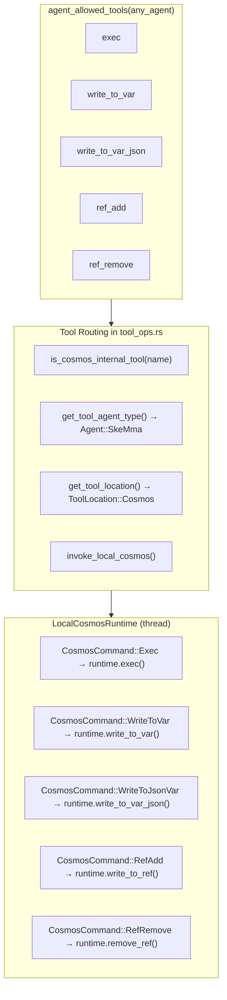

### 5.2 تعريفات الأدوات

| الأداة | وضع الاستدعاء | تتطلب | مخطط المعاملات |
| --- | --- | --- | --- |
| `exec` | FireAndForget | `code: string` | سلسلة كود JS واحدة |
| `write_to_var` | حاجب | `var_name, content` | `{var_name: string, content: string}` |
| `write_to_var_json` | حاجب | `var_name, content` | `{var_name: string, content: string (valid JSON)}` |
| `ref_add` | حاجب | `ref_name, content` | `{ref_name: string, content: string (JSON: ref_type + source + summary)}` |
| `ref_remove` | FireAndForget | `ref_name` | `{ref_name: string}` |

### 5.3 خادم Cosmos المستقل

يوزع الثنائي `cosmos` (خادم بيئة تشغيل JS المستقل) كل أسماء الأدوات عبر نفس واجهة `JsRuntime`، بما في ذلك معالجات `ref_add`/`ref_remove` المتقادمة التي تبقى كأنابيب داخلية متبقية. فقط البدائيات الثلاث المرئية لـ LLM (`exec`، `write_to_var`، `write_to_var_json`) معروضة للنموذج؛ راجع ملاحظة التقادم في أعلى هذه الوثيقة.

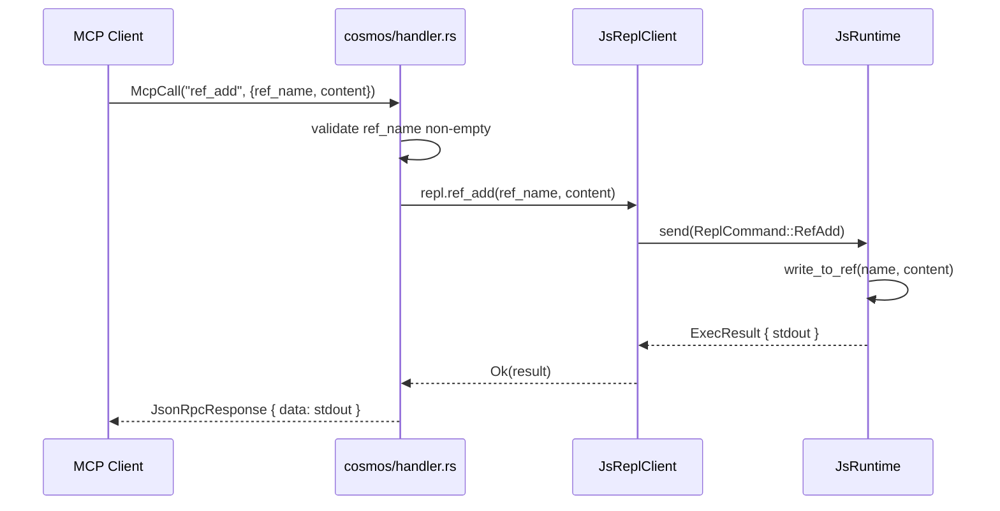

### 5.4 `is_cosmos_internal_tool` — مساعد التوجيه

**الملف:** `packages/scepter/src/agent_manager/tool_ops.rs:7-13`

```rust
fn is_cosmos_internal_tool(tool_name: &str) -> bool {
    tool_name == cosmos::EXEC
        || tool_name == cosmos::WRITE_TO_VAR
        || tool_name == cosmos::WRITE_TO_VAR_JSON
        || tool_name == cosmos::REF_ADD
        || tool_name == cosmos::REF_REMOVE
}
```

يخدم هذا المساعد غرضين حاسمين:

1. **حل نوع الوكيل** — تُرجع `get_tool_agent_type()` `Agent::SkeMma` للأدوات الداخلية، لأنها تنفذ في بيئة تشغيل Cosmos (ليس في عملية وكيل المجال).
1. **التوجيه الاحتياطي** — عندما يفشل استدعاء cosmos معزول بالحاوية لأداة داخلية، يتراجع النظام إلى بيئة تشغيل cosmos المحلية. للأدوات غير الداخلية، يذهب الاحتياطي إلى التنفيذ في العملية الداخلية بدلًا من ذلك. هذا يضمن عدم فشل عمليات cosmos بصمت في الوضع المعزول بالحاوية.

### 5.5 توجيه Cosmos المعزول بالحاوية مقابل المحلي

يدعم النظام وضعين لتنفيذ بيئة تشغيل Cosmos، يُختاران وقت تسجيل الوكيل:

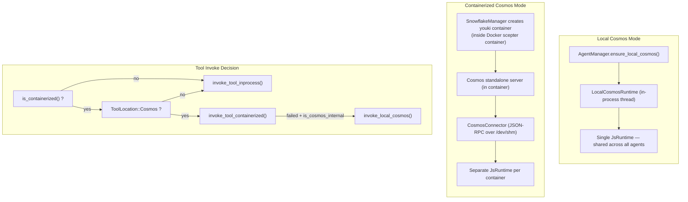

**الاختلافات الرئيسية:**

| الجانب | الوضع المحلي | الوضع المعزول بالحاوية |
| --- | --- | --- |
| `__vars` / `__refs` | مشتركة عبر كل الوكلاء | مشتركة داخل الحاوية، معزولة بين الحاويات |
| `__env` | تُضبط مباشرة عبر `exec` | تُضبط عبر استدعاء `CosmosConnector` JSON-RPC |
| الأداء | لا عبء تسلسل | تسلسل JSON-RPC لكل استدعاء |
| الأمان | صندوق رمل Boa فقط | صندوق رمل Boa + seccomp + youki |
| بيئة تشغيل الحاوية | Docker/Podman فقط | Docker/Podman (خارجية) + youki (cosmos داخلية) |
| مستخدم من قبل | الوكلاء غير المعزولين (layer=1) | الوكلاء المعزولين (layer=2+) |

### 5.6 تجميع JS للنطاق

يتم تجميع JavaScript للنطاق الكامل بواسطة `build_scepter_namespace_config_and_js()` في `packages/scepter/src/services/local_cosmos/namespace.rs:116-124`:

```rust
pub async fn build_scepter_namespace_config_and_js(
    registry: &SharedAgentRegistry,
    scepter_tools: &HashSet<String>,
    plugin_router: &PluginRouter,
) -> (NamespaceConfig, String) {
    let config = build_namespace_config(registry, scepter_tools, plugin_router).await;
    let js = build_namespace_js(&config);
    (config, js)
}
```

هذه الدالة:

1. تجمع أدوات MCP لكل الوكلاء المسجلين من `AgentRegistry`
1. تبني `NamespaceConfig` بقوائم أدوات لكل وكيل وبيانات وصفية (متزامن/غير متزامن، `unwrap_data`)
1. تولّد JS للنطاق عبر `build_namespace_js(&config)` التي:

   - تنشئ `globalThis.$` إذا كان مفقودًا
   - تُهيّئ `env.aporia` بـ `{ language: 'auto' }`
   - تعرّف خاصية `$.variant` (getter دائري يُرجع `globalThis.$`)
   - تسجل كل وحدات أدوات الوكيل عبر `register_tool_modules_with_rag()`

يتم تقييم JS للنطاق:

- **مرة واحدة** عند بدء `LocalCosmosRuntime::new()`
- **عند الطلب** أثناء إعادة بناء سلسلة المهارات عبر `CosmosCommand::RebuildNamespace`

-----------------------------------------------------------------------------

## 6. ترتيب تجميع توجيه النظام

توجيه النظام الكامل المجمّع في `pipeline.rs:869-882`:

```text
You are the {Agent} {skill_name} skill execution engine. Execute the skill faithfully.

[capability_section]
  → Agent-specific capability description
  → TypeScript type declarations (IEPL API types, env)
  → Import instruction prompts
  → Parameter safety rules & data persistence guidance

[tool_decls_section]
  → ## Available Tool APIs
  → .d.ts content for all available MCP tools

[container_context]
  → Container execution mode badges, branch info, constraints

[soul_section]
  → ## Soul Identity: {name}
  → Agent's personality & operational principles

[refs_section]
  → ## Referenced Resources (refs)
  → Table-of-contents: name, type, source, summary

[output_section]
  → Next target agent routing
  → MCP report calling conventions

[runtime_context]
  → ## JS Runtime Context
  → __vars names (with import hint)
  → __refs names (with access hint)
  → lexical variable names

[rag_section]
  → Philia memory sections (relevant past interactions)
  → Aporia knowledge sections (relevant documentation)

[skill_chain_note]
  → Chain navigation: "This is step N of M" or "Final step"
```

### مبرر موضع الأقسام

| القسم | الموضع | السبب |
| --- | --- | --- |
| هوية الوكيل + اسم المهارة | الجملة الأولى | يضبط الدور فورًا |
| إعلانات الأدوات | قبل الروح | يحتاج LLM لمعرفة الأدوات المتاحة قبل أن تؤثر الشخصية على الاختيار |
| الروح | بعد الأدوات، قبل المراجع | تؤثر الشخصية على كيفية تفسير المراجع |
| قسم المراجع | بعد الروح، قبل المخرجات | يعرف LLM ما هي الموارد المتاحة قبل أن يقرر ما ينتجه |
| توجيه المخرجات | قبل سياق بيئة التشغيل | يعرف LLM إلى أين يرسل النتائج قبل قراءة السياق |
| سياق بيئة التشغيل | قبل RAG، قبل ملاحظة السلسلة | توفر المتغيرات والمراجع سياق تنفيذ لاسترجاع المعرفة |

-----------------------------------------------------------------------------

## 7. سلوك ResetVars

عند التبديل بين المهارات في سلسلة، يتم استدعاء `ResetVars` لتعقيم حالة بيئة التشغيل. يستخدم الأمر تهيئة **غير مدمرة**:

```javascript
globalThis.$ = globalThis.$ || {};
globalThis.__vars = globalThis.__vars || {};
globalThis.__refs = globalThis.__refs || {};
```

هذا يعني:

- **القيم الموجودة تستمر** — تُحافظ `__vars` و`__refs` سليمة
- **الحالات التالفة تتعافى** — إذا حُذفت `__refs` عن طريق الخطأ، تُعاد إنشاؤها
- **عزل المهارة اختياري** — يجب أن تقرأ المهارات فقط المتغيرات التي تعرفها (بالاسم في توجيه سياق بيئة التشغيل)
- **لا تنظيف قسري** — مسؤولية LLM هي إدارة تلوث نطاق المتغيرات

-----------------------------------------------------------------------------

## 8. خريطة ملفات التنفيذ

| المكوّن | الملف | الأسطر | الوصف |
| --- | --- | --- | --- |
| ثوابت ومولدات `__vars` | `packages/shared/core/src/var_namespace.rs` | 1-211 | كل توليد كود JS للمتغيرات |
| ثوابت ومولدات `__refs` | `packages/shared/core/src/ref_namespace.rs` | 1-145 | كل توليد كود JS للمراجع |
| توليد `__env` | `packages/shared/iepl/src/namespace.rs` | 193-197 | `build_env_namespace_js()` |
| توليد `$.variant` | `packages/shared/iepl/src/namespace.rs` | 199-207 | `build_variant_namespace_js()` |
| تهيئة `JsRuntime` | `packages/agents/skemma/src/js_runtime/runtime.rs` | 153 | `eval(VAR_NS_GLOBAL_INIT)` |
| تنفيذ `write_to_var` | نفس الملف | 349-403 | تخزين متغيرات نصية |
| تنفيذ `write_to_var_json` | نفس الملف | 405-443 | تخزين متغيرات JSON |
| تنفيذ `write_to_ref` | نفس الملف | 445-492 | تخزين المرجع مع استخراج النوع |
| تنفيذ `remove_ref` | نفس الملف | 494-503 | إزالة المرجع |
| `snapshot_namespace_to_string` | نفس الملف | 549-607 | يولّد JS للقطة |
| `restore_namespace_from_string` | نفس الملف | 617-646 | يولّد JS للاستعادة |
| `LocalCosmosRuntime` | `packages/scepter/src/services/local_cosmos/runtime.rs` | 1-507 | قناة أوامر cosmos آمنة للخيوط |
| معدّد `CosmosCommand` | نفس الملف | 21-65 | كل متغيرات عمليات cosmos (بما في ذلك SnapshotMemory، Shutdown) |
| معالج `ResetVars` | نفس الملف | 448-460 | إعادة تعيين غير مدمرة |
| معالج `RebuildNamespace` | نفس الملف | 478-494 | إعادة تهيئة وحدات الأدوات |
| تعريفات الأدوات | `packages/scepter/src/agent_manager/tool_ops.rs` | 1-795 | كل تعريفات أدوات cosmos الـ 5 |
| `is_cosmos_internal_tool` | نفس الملف | 7-13 | مساعد التوجيه |
| `invoke_local_cosmos` | نفس الملف | 714-787 | توزيع الأدوات إلى LocalCosmosRuntime |
| `build_runtime_context` | `packages/scepter/src/state_machine/skill_chain/prompt.rs` | 472-598 | التوجيه: متغيرات + مراجع + معجمي |
| `build_refs_section` | نفس الملف | 426-470 | التوجيه: جدول محتويات المراجع |
| تجميع توجيه النظام | `packages/scepter/src/state_machine/skill_chain/pipeline.rs` | 869-882 | سلسلة تنسيق توجيه النظام الكامل |
| قائمة الأدوات المسموحة | `packages/shared/domain_skills/src/tool_names.rs` | 265-273 | وصول كوني لأدوات cosmos |
| معالج cosmos المستقل | `packages/cosmos/src/handler.rs` | 447-521 | توزيع `ref_add` / `ref_remove` |
| Cosmos JsReplClient | `packages/cosmos/src/js_repl/mod.rs` | 442-467 | طرق `ref_add()` / `ref_remove()` |
| معدّد ReplCommand | نفس الملف | 57-96 | متغيرات `RefAdd` / `RefRemove` |
| أنواع IEPL TypeScript | `packages/shared/bindings/iepl-api.d.ts` | 133-154 | إعلانات RefItem، RefType، __refs |
| وحدة `vars` | `packages/agents/skemma/src/js_runtime/module_loader.rs` | 142-156 | تصدير مرجع حي `__vars` |
| وحدة `env` | نفس الملف | 160-172 | تصدير قيمة اللغة |
| تجميع JS للنطاق | `packages/scepter/src/services/local_cosmos/namespace.rs` | 116-124 | `build_scepter_namespace_config_and_js` |
| CosmicConnector ضابط اللغة | `packages/scepter/src/services/cosmos_connector.rs` | 351-363 | `env.aporia.language` في الحاويات |
| اختبارات E2E | `packages/agents/skemma/tests/mcp_test.rs` | 1677-1726 | وحدة `refs_and_snapshot_tests` |
| اختبارات الوحدة | `packages/agents/skemma/src/js_runtime/runtime.rs` | 679-746 | اختبارات `write_to_ref`، اللقطة، الاستعادة |
| اختبارات نطاق المراجع | `packages/shared/core/src/ref_namespace.rs` | 99-145 | اختبارات نمط توليد كود JS |

-----------------------------------------------------------------------------

## 9. الاهتمامات الشاملة

### 9.1 أمان الخيوط

- يمتلك `LocalCosmosRuntime` **`JsRuntime` واحدًا** في خيط مخصص (يسمى `"local-cosmos"`)
- تُسلسل كل العمليات عبر `mpsc::channel<CosmosCommand>`
- لا يتم الوصول إلى `JsRuntime` أبدًا من خيوط متعددة — أمان الخيوط مفروض بنمط القناة
- يمتلك `AgentManager` `OnceCell<Arc<LocalCosmosRuntime>>` للتهيئة الكسولة

### 9.2 حدود الذاكرة

| الحد | القيمة | مفروض في |
| --- | --- | --- |
| أقصى متغيرات في التوجيه | 30 | `build_runtime_context()` — ثابت `MAX_NAMES` |
| أقصى مراجع في التوجيه | 30 | `build_refs_section()` — `.take(30)` |
| أقصى مراجع في runtime_context | 30 | `build_runtime_context()` — ثابت `MAX_NAMES` |
| حد soft لكود exec | غير متاح (معطّل) | حدود الحاويات الخارجية + قواطع الدائرة |
| مهلة exec (SkeMma) | 120 ثانية افتراضيًا | `skemma/COMPUTE_TIMEOUT` |
| السقف المطلق لـ exec | 600 ثانية | `skemma/ABSOLUTE_CEILING` |

### 9.3 معالجة الأخطاء

| الخطأ | المعالجة |
| --- | --- |
| `write_to_var_json` بـ JSON غير صالح | يُرجع خطأً مع معاينة (أول 200 حرف) |
| `ref_add` بـ JSON غير صالح | يُرجع `SkemmaError::JsEval` مع معاينة |
| لقطة لمرجع دائري (`$.variant`) | يلتقط `TypeError` بصمت، يتخطى المفتاح |
| `__refs` مفقودة في اللقطة | تُرجع `build_refs_section` سلسلة فارغة |
| `__refs` تالف بعد ResetVars | يضمن `\|\| {}` إعادة التهيئة |

### 9.4 دورة حياة RebuildNamespace

عند تبديل المهارات في سلسلة مهارات غير معزولة بالحاويات، قد يحتاج JS للنطاق إلى **إعادة بناء** لتضمين أدوات وكيل جديدة مكتشفة أثناء السلسلة:

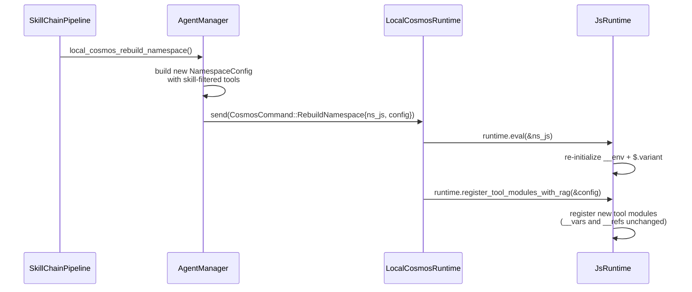

> **الثابت الرئيسي:** يحدّث `RebuildNamespace` فقط تسجيلات الأدوات وإعدادات البيئة. هو **لا** يعيد تعيين `__vars` أو `__refs` — تلك تتم معالجتها بشكل منفصل بواسطة `ResetVars`.

### 9.5 انتشار اللغة في الوضع المعزول بالحاويات

عند تشغيل الوكلاء في حاويات youki (متداخلة داخل حاوية Docker scepter)، تُضبط قيمة `env.aporia.language` عبر `CosmosConnector`:

```rust
// packages/scepter/src/services/cosmos_connector.rs:351-363
let lang_code = format!(
    "env.aporia.language = {};",
    serde_json::to_string(&lang).unwrap_or_else(|_| "\"en\"".to_string())
);
connector.cosmos_exec(&container_uuid, &lang_code).await?;
```

هذا يرسل استدعاء MCP `exec` عبر نقل JSON-RPC إلى حاوية cosmos، الذي يقيّم إسناد JS في `JsRuntime` المعزول بالحاوية. مسار انتشار اللغة الكامل هو:

```text
TUI request language → Scepter (extract request_language)
  → [local mode] direct exec("env.aporia.language = 'zh'")
  → [containerized] CosmosConnector::cosmos_exec(json_rpc_call)
      → cosmos handler → js_runtime.eval(...)
```

### 9.6 الأمان

- تحقق `exec`: كل الكود يمر بتحقق بناء جملة AST الخاص بـ SWC قبل تقييم Boa
- استخدام `eval()` في كتل `exec` مكتشف ومحظور مع توجيه لاستخدام `write_to_var` بدلًا من ذلك
- محتوى `ref_add` يمر عبر `JSON.parse()` — لا يمكن حقن كود تعسفي
- لا أداة نطاق تعرض وصول raw لسياق Boa
- تعمل حاويات cosmos في حاويات youki معزولة مع ملفات seccomp، كل منها متداخلة داخل

حاوية Docker/Podman scepter (عزل حاوية ثنائي الطبقة)
