# تصميم نظام إحصائيات فترة الاستخدام

## نظرة عامة

يدير نظام إحصائيات فترة الاستخدام ويتتبع استخدام LLM للـ token بناءً على الفترات الزمنية، ويدعم أنواع فترات متعددة (5 ساعات، 7 أيام، 30 يومًا، مخصص)، مما يوفر أساس بيانات للتحكم في التكلفة وإدارة الحصة.

## المبادئ الأساسية

### تجميع النافذة الزمنية

يستخدم النظام آلية تجميع النافذة المنزلقة لحساب إحصائيات الاستخدام في الوقت الفعلي لأي نطاق زمني عبر عروض قاعدة البيانات:

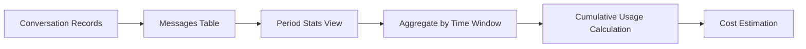

### تدفق البيانات

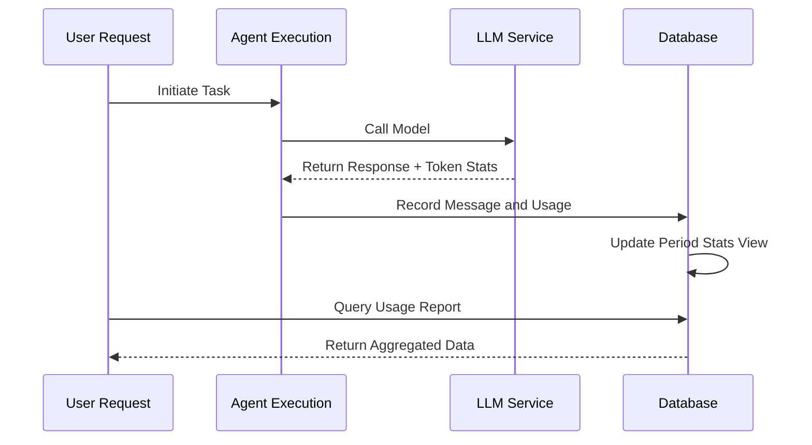

## أنواع الفترات

| نوع الفترة | المدة | الاستخدام النموذجي |
| --- | --- | --- |
| قصيرة المدى | 5 ساعات | تطوير تكراري سريع |
| متوسطة المدى | 7 أيام | تحكم حصة أسبوعي |
| طويلة المدى | 30 يومًا | محاسبة تكلفة شهرية |
| مخصص | أي | احتياجات أعمال مرنة |

## تصميم البنية

### بنية تجميع العرض

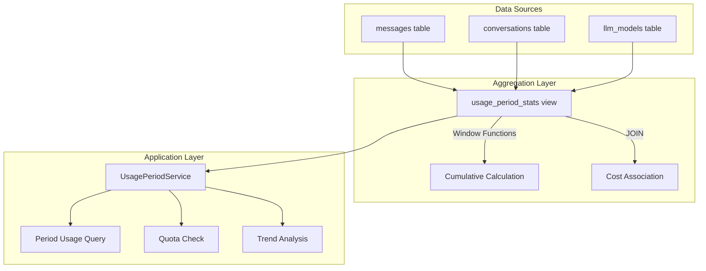

### منطق الحساب الأساسي

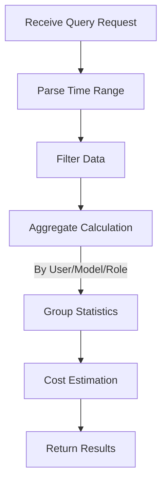

## آلية التحكم في الحصة

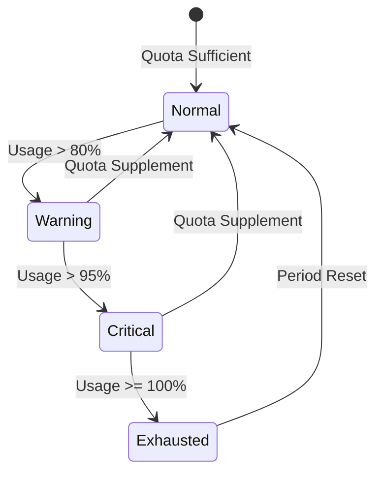

## العلاقة مع الوحدات الأخرى

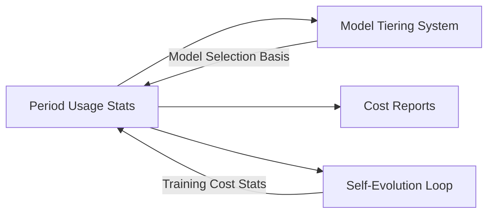

## اعتبارات التصميم

### تحسين الأداء

- استخدام عروض قاعدة البيانات للتجميع المسبق
- دوال النافذة تتجنب الحسابات المكررة
- فهارس الوقت تسرع الاستعلامات النطاقية

### قابلية التوسع

- دعم أنواع فترات جديدة
- أبعاد تجميع قابلة للتوسع
- نماذج حساب تكلفة مرنة

### اتساق البيانات

- العروض للقراءة فقط تضمن سلامة البيانات
- الطوابع الزمنية تستخدم UTC بشكل موحد
- المعاملات تضمن ذرية الكتابة

# تصميم تدفق تهيئة LLM

## نظرة عامة

تصف هذه الوثيقة التدفق الكامل للمستخدمين لتهيئة مزودي LLM، بما في ذلك تفاعل واجهة التهيئة، نقل البيانات، المعالجة من جانب الخادم، واستخدام المحادثة.

## بنية تدفق التهيئة

### التدفق العام

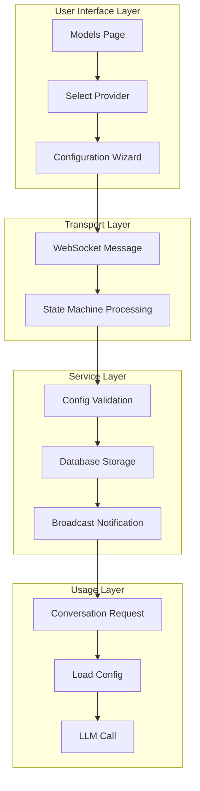

## تدفق تهيئة المزود

### تسلسل خطوات التهيئة

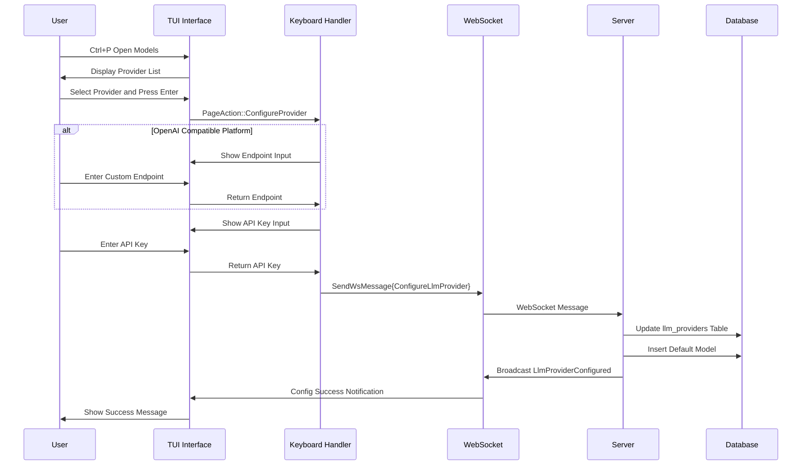

### آلة حالة التهيئة

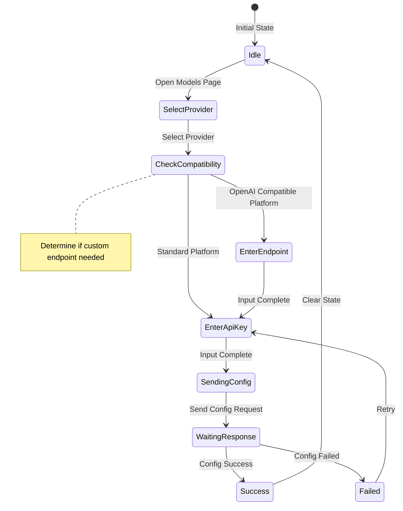

## تدفق استخدام المحادثة

### تسلسل استدعاء LLM

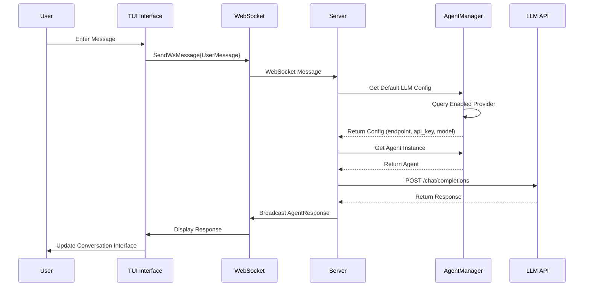

## قرارات التصميم الرئيسية

### تدفق تهيئة من خطوتين

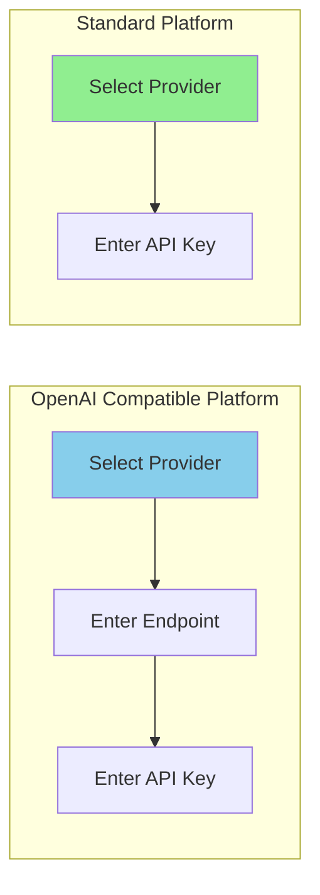

| نوع المنصة | خطوات التهيئة | السبب |
| --- | --- | --- |
| متوافق OpenAI | نقطة نهاية + مفتاح API | يحتاج نقطة نهاية خدمة مخصصة |
| منصة قياسية | مفتاح API فقط | يستخدم نقطة نهاية رسمية |

### إدارة حالة التهيئة

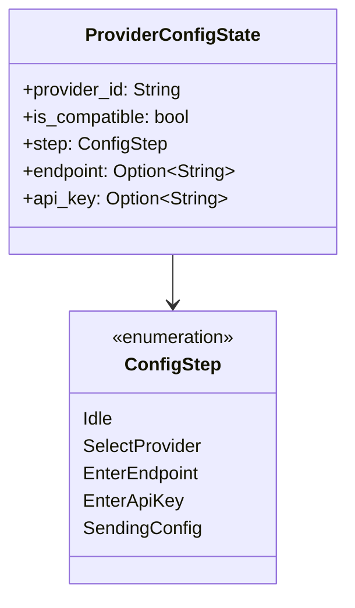

### إدراج النموذج الافتراضي تلقائيًا

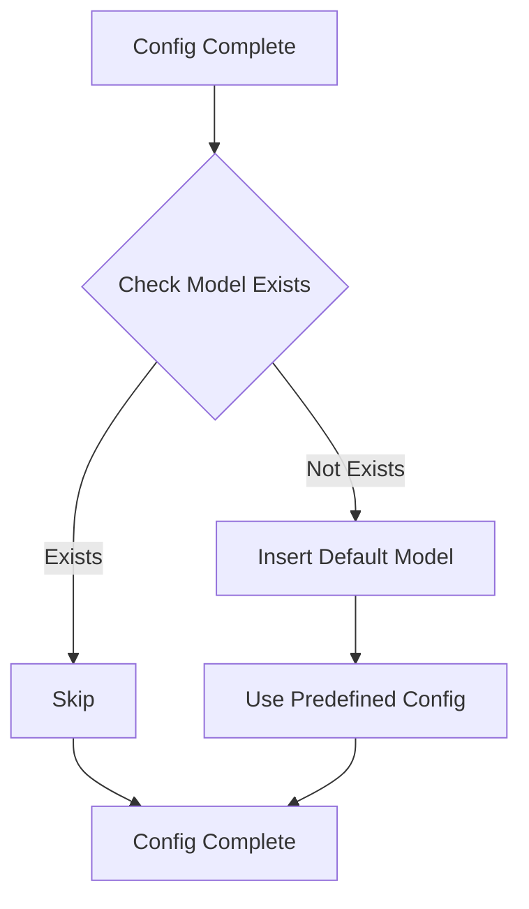

## تحسين الأداء

### استراتيجية التخزين المؤقت للتهيئة

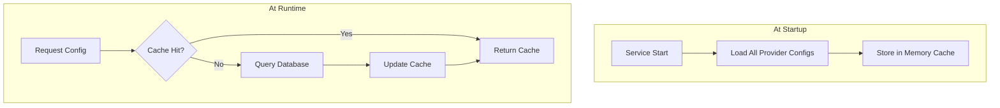

### إدارة تجمع الاتصالات

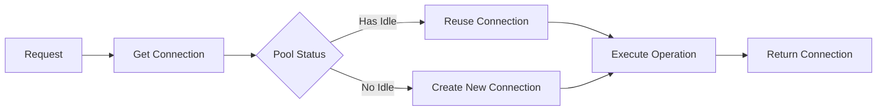

## معالجة الأخطاء

### التحقق من مدخلات المستخدم

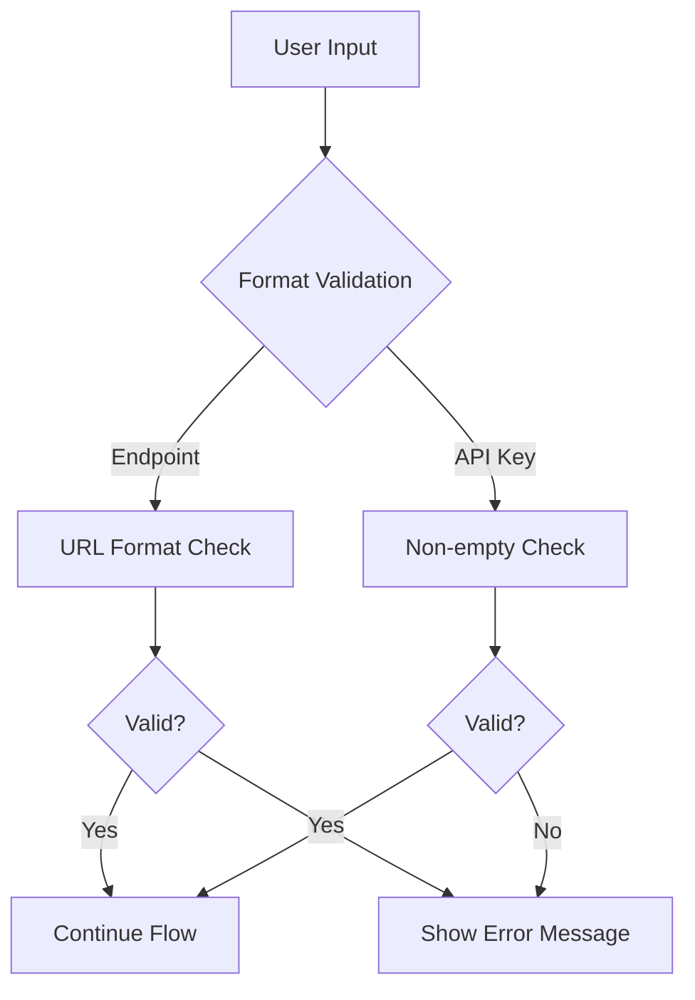

### معالجة أخطاء الشبكة

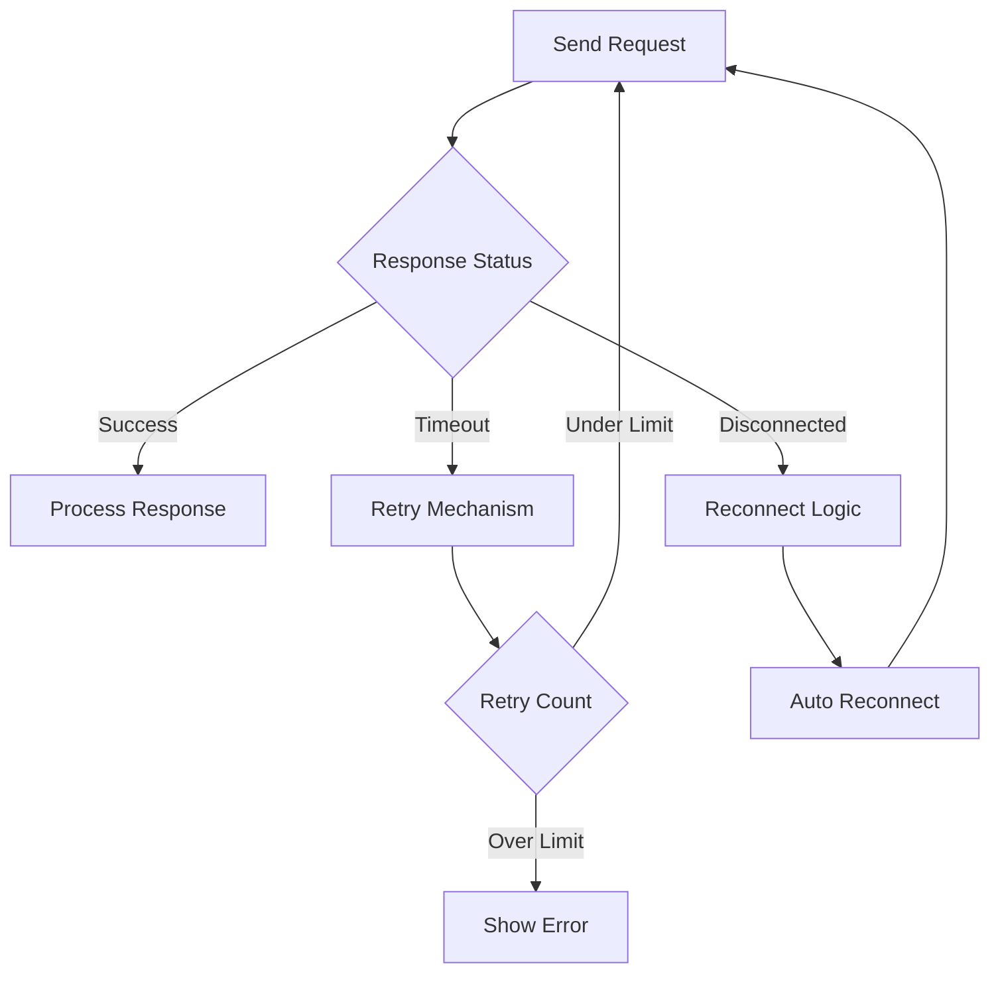

## اعتبارات الأمان

### حماية مفتاح API

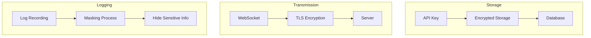

### إجراءات الأمان

| المرحلة | الإجراء | الوصف |
| --- | --- | --- |
| التخزين | تخزين مشفّر | تشفير مفتاح API في قاعدة البيانات |
| النقل | تشفير TLS | يستخدم WebSocket قناة مشفّرة |
| التسجيل | إخفاء | عدم تسجيل المفتاح كنص واضح |
| الإدخال | استعلامات معاملاتية | منع حقن SQL |

## تصميم قابلية التوسع

### إضافة مزود جديد

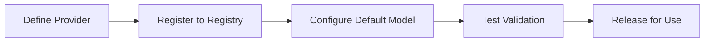

### دعم متعدد المزودين

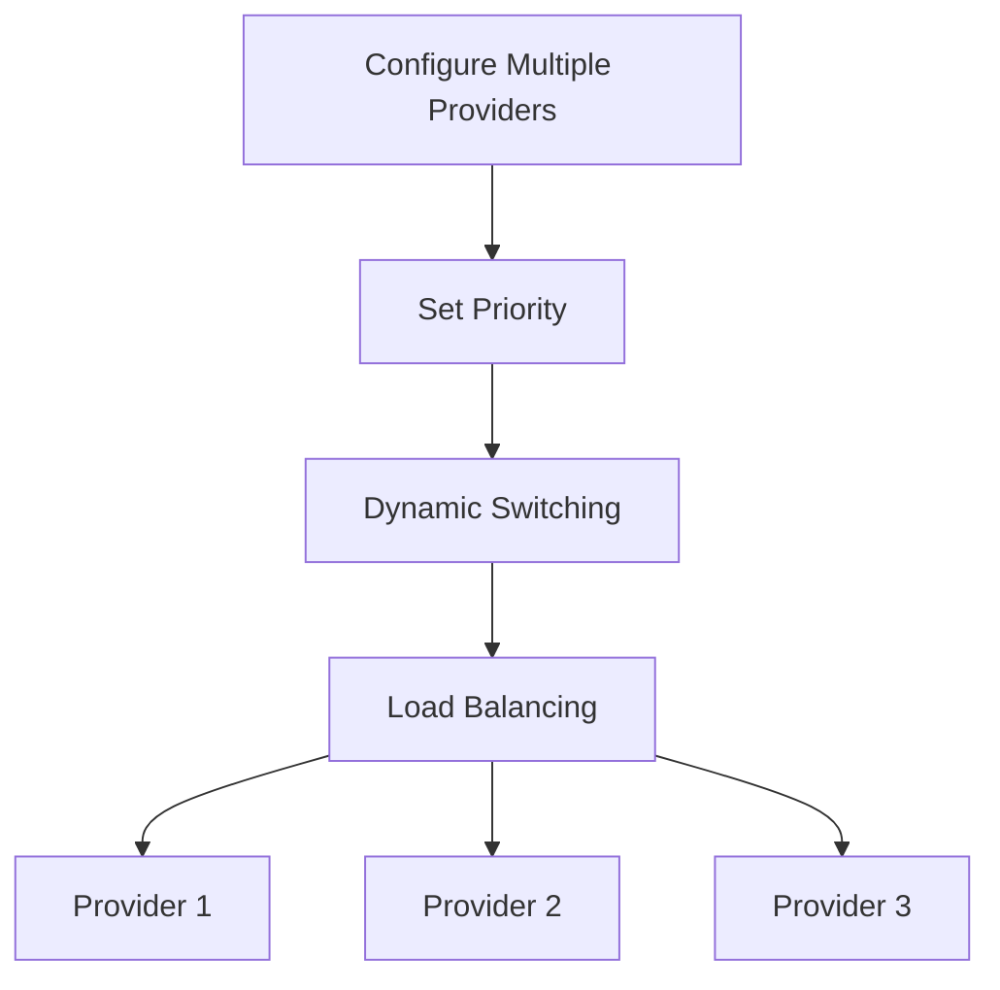

## تعريف نوع الرسالة

### رسائل WebSocket

| نوع الرسالة | الاتجاه | الوصف |
| --- | --- | --- |
| ConfigureLlmProvider | TUI ← الخادم | طلب تهيئة |
| LlmProviderConfigured | الخادم ← TUI | نتيجة التهيئة |
| UserMessage | TUI ← الخادم | محادثة المستخدم |
| AgentResponse | الخادم ← TUI | استجابة الوكيل |

## التخطيط المستقبلي

| الميزة | الوصف | الأولوية |
| --- | --- | --- |
| استيراد/تصدير التهيئة | دعم ترحيل ملف التهيئة | عالية |
| فحص صحة المزود | كشف دوري لتوافر المزود | متوسطة |
| تجاوز الفشل التلقائي | تبديل تلقائي عند عدم توفر المزود | متوسطة |
| تكامل إحصائيات الاستخدام | الربط بنظام إحصائيات الاستخدام | منخفضة |

# آلية حقن توجيه MCP وضغط السياق

## نظرة عامة

تصف هذه الوثيقة تصميمين بنيويين رئيسيين: آلية حقن التوجيه الإلزامي لأداة MCP وآلية ضغط السياق القائمة على علامة Todo. تعمل هاتان الآليتان معًا لتوحيد سلوك الوكيل وتحسين إدارة السياق في سيناريوهات المحادثة الطويلة.

## I. حقن توثيق أداة MCP (تنفيذ فقط)

### المفهوم الأساسي

تحت بنية النواة الدقيقة التنفيذية فقط، يستقبل LLM **ثلاثة تعريفات أدوات** فقط: `exec`، `write_to_var`، و`write_to_var_json`. أدوات MCP هي واجهات API داخلية تُستدعى عبر بيئة تشغيل JS الخاصة بـ exec. يُحقن توثيق أداة MCP في توجيه المهارة كتوثيق JS API عبر آلية `related_tools` — وليس كتعريفات أدوات منفصلة تُرسل إلى LLM.

```mermaid
flowchart LR
    A[Skill related_tools] --> B[McpToolDocLoader]
    B --> C[Read TOML params + MD description]
    C --> D[Format as JS API docs]
    D --> E[Inject into system prompt]

    style D fill:#90EE90
```

### الخصائص الرئيسية

| الخاصية | الوصف |
| --- | --- |
| سطح تنفيذي فقط | يرى LLM فقط `exec`، `write_to_var`، `write_to_var_json`؛ أدوات MCP لا تُعرض أبدًا كتعريفات أدوات |
| محدد بالمهارة | توثيق الأدوات يُحقن لكل مهارة عبر `related_tools`، وليس بشكل شامل |
| تنسيق JS API | التوثيق منسّق كـ `مرجع واجهة استيراد وحدة ES — الوصف` |
| توجيه داخلي | McpToolRegistry لكل وكيل لكن مستخدم فقط للتوزيع الداخلي |

### دافع التصميم

```mermaid
flowchart TB
    subgraph Problem Scenarios
        A[Too many tool definitions bloat context]
        B[Per-tool prompt injection is fragile]
        C[LLM confused by tool proliferation]
    end

    subgraph Solutions
        D[Three-tool surface: exec, write_to_var, write_to_var_json]
        E[MCP docs as JS API references]
        F[Skill-scoped related_tools injection]
    end

    A --> D
    B --> E
    C --> F
```

### تدفق الحقن

```mermaid
sequenceDiagram
    participant Skill as Skill (related_tools)
    participant Loader as McpToolDocLoader
    participant MCP as MCP Tool Config (TOML + MD)
    participant Prompt as System Prompt

    Skill->>Loader: List of related tool names
    Loader->>MCP: Read TOML params + MD description
    MCP-->>Loader: Tool metadata

    Loader->>Loader: Format as ES module import API reference — description
    Loader->>Prompt: Inject into skill section of system prompt

    Note over Prompt: LLM sees only exec tool<br/>MCP docs appear as JS API references
```

### تنسيق الحقن

يُنسَّق توثيق كل أداة MCP كمرجع JS API:

$agent.todo_list_view() — View the current todo tree structure
$agent.todo_create({ title: String, description: String }) — Create a new todo item
$agent.todo_update_status({ `todo_id`: String, status: String }) — Update the status of a todo item

### مثال التهيئة

```mermaid
flowchart TB
    subgraph Skill related_tools
        A[Skill TOML: related_tools field]
        A --> A1["[tool_name]"]
        A1 --> B[todo_list_view]
        A1 --> C[todo_create]
        A1 --> D[todo_update_status]
    end

    subgraph McpToolDocLoader
        E[Read TOML params]
        F[Read MD description]
        G[Format as JS API doc]
    end

    B --> E
    C --> E
    D --> E
    E --> F --> G
```

### مستويات الصلاحيات

يمكن لكل إدخال `[[related_tools]]` أن يصرح اختياريًا بـ `access_mode`:

[[`related_tools`]]
`agent_name` = "polemos"
`tool_name` = "`node_execute`"
`access_mode` = "read"       # Skill only needs read-level access (default: "read")

تفحص بوابة التخويل المزدوج أن:

1. `ToolCapability` المصرّح بها للأداة تدعم `access_mode` المطلوب
1. `TrustLevel` للعقدة المستهدفة تسمح بالعملية
1. للعقد الخارجية، ينطبق تحديد إضافي على مستوى المخاطر

راجع `docs/design/en/22-mcp-tool-permission-model.md` للتفاصيل الكاملة.

### المزايا والمقايضات

```mermaid
graph TB
    subgraph Advantages
        A[Minimal tool surface]
        B[Skill-scoped documentation]
        C[Consistent API format]
        D[Internal routing flexibility]
    end

    subgraph Trade-offs
        E[LLM must construct JS calls]
        F[Debugging requires exec tracing]
        G[related_tools must be maintained]
    end
```

## II. آلية ضغط السياق القائمة على علامة Todo

### المفهوم الأساسي

يعتمد الضغط التقليدي على تلخيص النص، مما يفقد التفاصيل الرئيسية. الآلية الجديدة تغير إلى تعليم عناصر Todo الرئيسية، حافظةً على التفاصيل الأصلية كمدخل مستخدم، متابعةً تنفيذ المهارة الأصلي مباشرة.

```mermaid
flowchart LR
    subgraph Traditional Way
        A1[Context] --> B1[Summary Text]
        B1 --> C1[New Conversation]
        C1 --> D1[Possible Detail Loss]
    end

    subgraph Todo Marker Way
        A2[Context] --> B2[Mark Key Todo]
        B2 --> C2[Preserve Original Details]
        C2 --> D2[No Information Loss]
    end
```

### مقارنة دافع التصميم

| مشاكل الطريقة التقليدية | مزايا علامة Todo |
| --- | --- |
| فقدان المعلومات | الحفاظ على الأصل |
| الانجراف الدلالي | قابل للتتبع |
| غير قابل للتحقق | قابل للتحقق |
| إبطال المهارة | استمرارية المهارة |

### تدفق الضغط

```mermaid
sequenceDiagram
    participant User as User
    participant Agent as Original Agent
    participant Marker as Todo Marker
    participant NewAgent as New Agent
    participant TodoMCP as Todo MCP

    User->>Agent: Request Context Compression
    Agent->>Marker: Get Key Todo Items

    Note over Marker: Apply Marking Strategy

    Marker-->>Agent: Marked Item List
    Agent->>TodoMCP: Batch Get Details
    TodoMCP-->>Agent: Todo Details

    Agent->>NewAgent: Start New Session

    Note over NewAgent: System prompt = Original Skill<br/>User input = Todo details

    NewAgent->>TodoMCP: View Todo Tree
    Note over NewAgent: Find details already in input<br/>Continue directly
```

### استراتيجيات التعليم

```mermaid
flowchart TB
    subgraph Strategy Types
        A[Manual Marking]
        B[AutoCritical Critical Path]
        C[AutoUnfinished Unfinished Tasks]
        D[Hybrid Strategy]
    end

    A --> A1[User Selects Key Items]
    B --> B1[Auto Identify Main Task Chain]
    C --> C1[Mark All Unfinished Items]
    D --> D1[Combine Multiple Strategies]
```

### مقارنة الاستراتيجيات

| الاستراتيجية | المحتوى المعلّم | السيناريوهات القابلة للتطبيق |
| --- | --- | --- |
| يدوي | محدد بواسطة المستخدم | تحكم دقيق |
| AutoCritical | سلسلة المهام الرئيسية + المهام الحاجبة | المهام المعقدة |
| AutoUnfinished | كل المهام غير المنجزة | استرداد بسيط |
| هجين | مُجمّعة + علامات المستخدم | السيناريوهات العامة |

### بنية العنصر المعلّم

```mermaid
classDiagram
    class MarkedTodoItem {
        +todo_id: String
        +include_depth: u32
        +include_ancestors: bool
        +include_artifacts: bool
    }

    class MarkerStrategy {
        <<enumeration>>
        Manual
        AutoCritical
        AutoUnfinished
        Hybrid
    }

    class TodoMarker {
        +marked_items: List~MarkedTodoItem~
        +marker_strategy: MarkerStrategy
        +mark_critical_todos()
    }

    TodoMarker --> MarkedTodoItem
    TodoMarker --> MarkerStrategy
```

## III. تعاون الآليتين

### تدفق التعاون

```mermaid
sequenceDiagram
    participant User as User
    participant OldAgent as Old Agent
    participant Marker as Todo Marker
    participant Loader as McpToolDocLoader
    participant NewAgent as New Agent

    Note over OldAgent: Context near limit

    User->>OldAgent: Compress Context
    OldAgent->>Marker: Mark Key Todo
    Marker-->>OldAgent: Marked Item List

    OldAgent->>NewAgent: Create New Session

    Note over NewAgent: System prompt = Soul + Skill<br/>related_tools loaded by McpToolDocLoader

    NewAgent->>Loader: Load tool docs for related_tools
    Loader-->>NewAgent: Formatted JS API docs

    Note over NewAgent: System prompt contains:<br/>1. Soul identity<br/>2. Skill template + related_tools docs<br/>3. Three tools: exec, write_to_var, write_to_var_json

    NewAgent->>NewAgent: Execute via exec JS runtime
    Note over NewAgent: MCP tools are internal APIs<br/>Find details already in input

    NewAgent-->>User: Seamless Task Continuation
```

### نقاط التعاون الرئيسية

```mermaid
flowchart TB
    subgraph Collaboration Mechanism
        A[McpToolDocLoader injects JS API docs]
        B[Marker Provides Complete Context]
        C[Soul + Skill Prompt Preserved]
    end

    A --> D[Skill has JS API references for MCP tools]
    B --> E[Sufficient complete info provided]
    C --> F[Behavioral consistency maintained]

    D --> G[Seamless Task Continuation]
    E --> G
    F --> G
```

## IV. خارطة طريق التنفيذ

```mermaid
flowchart LR
    subgraph Phase 1 High Priority
        A[MCP Prompt Injection]
        A --> A1[Data Structure]
        A --> A2[Injection Logic]
        A --> A3[Config Management]
    end

    subgraph Phase 2 Medium Priority
        B[Todo Marker Mechanism]
        B --> B1[Marking Strategy]
        B --> B2[Compression Recovery]
        B --> B3[Manual Marking]
    end

    subgraph Phase 3 Low Priority
        C[Smart Strategy]
        C --> C1[AutoCritical]
        C --> C2[Hybrid]
        C --> C3[Smart Suggestions]
    end
```

## V. تقييم المخاطر والتخفيف

### مصفوفة المخاطر

| المخاطرة | التأثير | إجراءات التخفيف |
| --- | --- | --- |
| عبء الـ token كبير جدًا | تدهور الأداء | تحديد العدد المعلّم، تهيئة مستوى الضغط |
| التوجيه صارم جدًا | تقليل المرونة | توفير آلية تجاوز، إرشادات معالجة الاستثناءات |
| استراتيجية التعليم غير دقيقة | حذف المعلومات | تجاوز يدوي، تأكيد بصري |

### تدفق معالجة الأخطاء

```mermaid
flowchart TB
    A[Operation Failed] --> B{Failure Type}
    B -->|Token Exceeded| C[Trim Non-critical Items]
    B -->|Strategy Failed| D[Fallback to Manual Mode]
    B -->|Injection Failed| E[Use Default Behavior]

    C --> F[Retry Operation]
    D --> F
    E --> F
```

## VI. تكامل التهيئة

### بنية التهيئة العامة

```mermaid
flowchart TB
    subgraph Skill Config
        A[related_tools]
        B[tool_names list]
    end

    subgraph Compression Config
        C[enabled]
        D[default_strategy]
        E[trigger_threshold]
    end

    subgraph Strategy Config
        F[include_critical_path]
        G[include_unfinished]
        H[max_marked_items]
    end

    A --> I[JS API Doc Generation]
    C --> J[Compression Control]
    F --> K[Marking Rules]
```

## VII. الامتدادات المستقبلية

| الميزة | الوصف | الأولوية |
| --- | --- | --- |
| توليد توجيه ديناميكي | تعديل القيود بناءً على تعقيد المهمة | متوسطة |
| مشاركة متعددة الجلسات | وكلاء متعددون يتشاركون علامات Todo | متوسطة |
| اقتراحات تعليم ذكية | توصية العناصر المعلّمة تلقائيًا | منخفضة |
| أداة تعليم مرئية | واجهة تعليم رسومية | منخفضة |

## VIII. حقن سياق RAG التكميلي (v2.1+)

يوفر حقن أداة MCP الموصوف في الأقسام I-VII لـ LLM **مراجع API** — يخبر LLM *كيف* يستدعي الأدوات. آلية تكميلية، حقن سياق RAG، توفر لـ LLM **معرفة محسوبة مسبقًا** — تُحقن *نتائج* استعلامات RAG مباشرة في توجيه النظام.

| الجانب | حقن أداة MCP | حقن سياق RAG |
| --- | --- | --- |
| ما يستقبله LLM | توثيق مرجع API (استيراد وحدات ES) | محتوى معرفي فعلي (عقد ذاكرة، وثائق مساحة العمل) |
| متى يُحقن | لكل مهارة، بناءً على `related_tools` | لكل خطوة مهارة، بناءً على سياق المهارة |
| مشاركة LLM | يجب على LLM استدعاء الأداة | لا مشاركة LLM — محسوب مسبقًا |
| تأثير الكمون | N رحلة ذهاب-وإياب (واحدة لكل استدعاء) | 1 حساب مسبق لكل خطوة مهارة |
| وحدات IEPL | `{agent}` (توزيع MCP) | `rag/{philia,aporia}` (قراءة المخزن المؤقت) |

كلتا الآليتين تتعايشان: أدوات MCP تبقى متاحة كبديل للاستعلامات التي لا يغطيها السياق المحسوب مسبقًا. راجع `docs/design/en/26-rag-context-injection.md` للتصميم الكامل.

# تصميم الهوية المزدوجة للوكيل وحدود الرؤية

## الأهداف

- فصل كامل بين نسخ تنفيذ المهارة المرئية وموفري أدوات MCP/LLM الداخليين.
- السماح فقط باستدعاءات المهارة بإنشاء وكلاء مؤقتين مرئيين بشارات من 3 أرقام.
- إسناد استخدام نموذج/token الخاص بـ MCP/LLM إلى نسخة المهارة المرفقة بدلًا من إنشاء وكلاء مرئيين إضافيين.
- الاحتفاظ بهوية UUID لبيئة التشغيل للتدقيق، التاريخ، وإعادة التشغيل دون تسريبها إلى جدول TUI الزمني.

## طبقات الهوية

- `agent_number`: الشارة المواجهة لواجهة المستخدم والمفتاح المستقر لعقد الجدول الزمني المرئية.
- `agent_uuid`: UUID بيئة التشغيل المستخدم للتسجيل، التدقيق، والتاريخ.
- `agent_id`: حقل توافق.
  - في حمولات TUI المرئية، يجب أن يطابق `agent_id` الـ `agent_number` المواجه للوحة.
  - في السجلات الداخلية ومسارات تنفيذ MCP، قد يبقى `agent_id` بأسلوب UUID.

## قواعد الرؤية والنسخ

- فقط استدعاءات المهارة تنشئ نسخ وكيل مرئية مؤقتة.
- يجب ألا ينشئ موفرو SimpleTool/MCP وكلاء مرئيين إضافيين لمجرد استدعاء إحدى أدواتهم.
- عندما تستخدم مهارة أدوات MCP أو استدعاء `llm_chat` داخلي، تبقى تلك الاستدعاءات تنفيذًا تابعًا تحت تلك نسخة المهارة.
- مثال: إذا استدعى HubRis ApoRia `llm_chat`، يبقى ApoRia منفّذًا داخليًا ويجب ألا يظهر كعقدة مرئية ثانية في الجدول الزمني العلوي الأيمن.

## قواعد إسناد MCP و LLM

- إذا كان استدعاء MCP/LLM ينتمي إلى نسخة مهارة مرئية، يجب إسناد اسم النموذج واستخدام الـ token إلى تلك نسخة المهارة.
- قد يحتفظ الموفرون الداخليون بتدقيق حسابهم أو محاسبتهم العالمية، لكن تلك الإحصاءات الداخلية يجب ألا تطلق إنشاء عقد TUI.
- سجلات MCP والسياق يجب أن تحافظ على:
  - `agent_number`
  - `agent_uuid`
  - `tool_name`
  - `phase` (`start`/`finish`)
  - `success` و`error`

## عقد تصيير TUI

- ينشئ TUI عقد الجدول الزمني فقط لمعرفات اللوحات الصريحة من 3 أرقام.
- الحمولات بدون `agent_number` مرئي قد تُحدّث إحصاءات النموذج/token العامة فقط ويجب ألا تنشئ عقد وكيل مرئية.
- يجب ألا تستمد أبدًا تسميات العرض ومفاتيح العقد شارة مرئية من UUIDs أو أرقام عشوائية موجودة داخل `agent_id`.
- للعقد المرئية:
  - يُستخدم `agent_number` للعرض والتفاعل.
  - يُحتفظ بـ `agent_uuid` فقط للتدقيق، التاريخ، والتصحيح.

## تخصيص الشارة ودورة الحياة

- يُخصّص `agent_number` عشوائيًا من تجمع `000`-`999` المتاح بدلًا من الإسناد التسلسلي.
- الأرقام المُحرّرة قابلة لإعادة الاستخدام.
- عندما تكون كل الـ 1000 شارة نشطة، قد يتراجع المخصّص إلى إعادة استخدام عشوائية؛ يجب أن يعتمد التمييز التاريخي حينها على `agent_uuid`.
- تنظيف النسخة المرئية واستعادة الشارة يُعالَجان بواسطة مدير دورة حياة المهارة.

## قيود التوافق

- الحمولات القديمة التي تحمل `agent_id` فقط قد تُحل داخليًا، لكن يجب ألا تولّد واجهة المستخدم المرئية عقدًا جديدة من معرفات بأسلوب UUID.
- عندما يكون كل من `agent_number` و`agent_uuid` موجودين، يطبق نموذج الهوية المزدوجة:
  - `agent_number` للعرض والتفاعل.
  - `agent_uuid` للتدقيق والتاريخ.

# بنية تزامن الطلبات

## نظرة عامة

يدير Scepter طبقتي تزامن مستقلتين:

```mermaid
flowchart LR
    User["User Requests"] --> Semaphore["Request Semaphore"]
    Semaphore --> Cosmos["Cosmos Containers"]
    Cosmos --> Queue["Tier Queue (RequestPool)"]
    Queue --> LLM["LLM API"]
```

## التشبيه

فكر في مطعم:

- **الزبائن** (طلبات المستخدم) يصلون ويقدمون الطلبات في وقت واحد
- **الطاولات** (حاويات Cosmos) تُنشأ لكل طلب — كل واحدة تحصل على مساحة عملها الخاصة
- **محطات المطبخ** (تزامن مزود LLM) محدودة — ربما 3 إجمالًا
- **نظام البطاقات** (طابور طبقة `RequestPool`) يدير ترتيب FIFO لكل طبقة

يمكن لـ 30 زبونًا الطلب في وقت واحد (يقبل scepter طلبات متعددة)، لكن المطبخ يمكنه طبخ 3 أطباق فقط في كل مرة (حد معدل API LLM).

## الطبقة 1: إشارة الطلب

**الموقع**: `state_machine/domains/control_domain.rs` — `concurrent_request_semaphore`

تتحكم في عدد طلبات المستخدم التي يقبلها scepter بشكل متزامن. كل طلب ينشئ حاوية Cosmos مستقلة بمقبض LLM خاص بها.

```mermaid
flowchart LR
    User1["User Message"] -->|"N = sum of all model max_concurrent"| Semaphore["Semaphore(N)"]
    User2["User Message"] --> Semaphore
    User3["User Message"] --> Semaphore
    Semaphore --> Container1["Cosmos container + LLM handle"]
    Semaphore --> Container2["Cosmos container + LLM handle"]
    Semaphore --> Container3["Cosmos container + LLM handle"]
```

N = إجمالي الخانات المتزامنة عبر كل النماذج المُفعّلة. إذا النماذج A (3 خانات) + B (2 خانة) = 5 طلبات متزامنة.

سابقًا كان هذا `AtomicBool` (N=1)، الآن `Semaphore(N)`.

## الطبقة 2: طابور الطبقة (RequestPool)

**الموقع**: `infra/request_pool.rs` — `RequestPool`

طابور FIFO لكل طبقة مع إشارات لكل نموذج. ضمن طبقة:

1. تدخل طلبات LLM الواردة طابور الطبقة
1. تحاول الحصول على خانة على النموذج ذو الأولوية الأعلى أولًا
1. إذا مشغول، جرب النموذج التالي بترتيب الأولوية
1. إذا الكل مشغول، انتظر في طابور FIFO — أي نموذج يحرر خانة أولًا يخدم الطلب التالي

```mermaid
flowchart TB
    subgraph Tier["Tier: 'normal'"]
        direction TB
        Queue["FIFO Queue: req1 → req2 → req3 → req4"]
        MA["Model A (priority 10): Semaphore(3) ■■□"]
        MB["Model B (priority 5):  Semaphore(2) □□"]
        MC["Model C (priority 1):  Semaphore(1) ■"]
        Queue -->|"req1 → Model A (available)"| MA
        Queue -->|"req2 → Model B (available, A busy)"| MB
        Queue -->|"req3 → wait... Model A frees → serve"| MA
        Queue -->|"req4 → wait... Model C frees → serve"| MC
    end
```

### الخصائص الرئيسية

- **عزل لكل مزود**: `max_concurrent` لكل نموذج مستقل
- **ترتيب الأولوية**: تُفضّل النماذج ذات الأولوية الأعلى عند التوفر
- **الاحتياط**: إذا النموذج ذو الأولوية العالية مشبع، تخدم النماذج ذات الأولوية الأقل فورًا
- **عدالة FIFO**: الطلبات المنتظرة تُخدم بترتيب الوصول

### التهيئة

\# provider_config.toml
[[models]]
id = "gpt-5.4"
tier = "normal"
priority = 10
`max_concurrent` = 3        # 3 simultaneous API calls to this model

[[models]]
id = "gpt-4o-mini"
tier = "normal"
priority = 5
`max_concurrent` = 5        # 5 simultaneous API calls

[[models]]
id = "deepseek-v3"
tier = "deep"
priority = 8
`max_concurrent` = 2

مع هذه التهيئة:

- طبقة `normal`: النموذج A (3 خانات) + النموذج B (5 خانات) = 8 استدعاءات LLM متزامنة بطبقة normal
- طبقة `deep`: النموذج C (2 خانة) = 2 استدعاءات LLM متزامنة بطبقة deep
- إشارة الطلب: 3 + 5 + 2 = 10 طلبات مستخدم متزامنة

## التدفق: رسالة المستخدم ← استجابة LLM

```text
    1. يرسل المستخدم رسالة عبر TUI/CLI/socket
    1. `handle_user_message`():

a. `try_acquire`() على إشارة الطلب (الطبقة 1)

          - إذا لا خانات: أرجع خطأ "busy"
          - كل خانة ← حاوية Cosmos مستقلة

b. `execute_skill_chain`() → `invoke_aporia_llm_chat`()

    1. `invoke_aporia_llm_chat`():

a. `acquire_tier`("normal", `excluded_models`) على `RequestPool` (الطبقة 2)

          - جرب كل نموذج بترتيب الأولوية (غير حاجب)
          - إذا الكل مشغول: انتظر في FIFO حتى تحرر أي خانة نموذج
          - يُرجع TierPermit { `model_id`, `display_name` }

b. `chat_loop` → llm_backend.chat() → LlmService::`chat_with_tools`()

          - يستخدم النموذج المختار لاستدعاء API

c. إسقاط TierPermit ← تحرير خانة الإشارة

    1. `finish_handling`():

a. إرجاع تصريح إشارة الطلب
b. يمكن تنظيف حاوية Cosmos (أو إعادة استخدامها)

```

## اختبار E2E

تستخدم الاختبارات مهلة الخمول (وليس الموعد النهائي المطلق). يُعاد ضبط المؤقت عند كل حدث ذي معنى:

\# Activity resets the idle timer — chain can run indefinitely as long as it stays active
ACTIVE_METHODS = {
"Tui.`OrchestrationStatus`",
"Tui.`McpToolResult`",
"Tui.`AgentReport`",
"Tui.`AgentStreamingChunk`",
"Tui.`TaskStatusUpdate`",
"Tui.`AskHumanRequest`",
"Tui.AgentPatch",
"Tui.`ContainerSnapshot`",
}

هذا يضمن:

- مهلة خمول قصيرة (120s) تلتقط السلاسل العالقة حقًا
- السلاسل طويلة التشغيل لكن النشطة (متعددة المهارات المعقدة) لا تُقتل قبل الأوان أبدًا

# قاعدة بيانات التطوير المضمّنة وعزل الإنتاج المُحجوب بالميزة

## نظرة عامة

يستخدم entelecheia [pglite-oxide](https://crates.io/crates/pglite-oxide) كـ PostgreSQL مضمّن لغرضين:

1. **التطوير المحلي**: عندما لا تُهيّأ `DATABASE_URL`، يبدأ scepter تلقائيًا PostgreSQL داخل العملية (PG 17.5 عبر WASM/wasmer) مع دعم pgvector.
1. **اختبارات التكامل**: تستخدم اختبارات تكامل PG pglite-oxide بدلًا من Docker/testcontainers.

في الإنتاج (Docker)، تُستثنى ميزة `embedded-db`، ويتصل scepter بحاوية PostgreSQL حقيقية.

## دافع التصميم

سابقًا، تطلب التطوير المحلي إما Docker Compose أو تثبيت PostgreSQL يدويًا. اعتمدت اختبارات التكامل على `testcontainers`، مضيفة تعقيد Docker-in-Docker في CI. يُلغي pglite-oxide كلا المتطلبين — `cargo run` "يعمل فحسب" للتطوير المحلي، و`cargo test` يعمل بدون Docker.

## بنية بوابة الميزة

```mermaid
flowchart TB
    Cargo["scepter Cargo.toml<br/>[features] default = ['all-agents', 'embedded-db']  ← dev<br/>embedded-db = ['dep:pglite-oxide']<br/>[dependencies] pglite-oxide = { workspace = true, optional = true }"]

    Cargo -->|"cargo build (default)"| Dev["pglite-oxide + wasmer WASM<br/>included"]
    Cargo -->|"Dockerfile<br/>--no-default-features<br/>--features all-agents"| Prod["No pglite, no wasmer<br/>(production)"]
```

| سياق البناء | الأمر | pglite-oxide | wasmer | DATABASE_URL |
| --- | --- |  ---  |  ---  | --- |
| `cargo run` (تطوير محلي) | الميزات الافتراضية | ✓ | ✓ | اختياري — يبدأ PG مضمّن تلقائيًا إذا مفقود |
| `cargo test` (اختبارات) | الميزات الافتراضية | ✓ | ✓ | يُبدأ تلقائيًا بواسطة هارنس الاختبار |
| `just build` (إصدار) | `--no-default-features --features all-agents` | ✗ | ✗ | مطلوب |
| Docker `Dockerfile` | `--no-default-features --features all-agents` | ✗ | ✗ | مطلوب (يشير إلى حاوية PG) |

## ترتيب حل قاعدة البيانات وقت التشغيل

```rust
// packages/scepter/src/app/setup.rs
let `db_url` = if let Ok(url) = std::env::var("DATABASE_URL") {
// 1. Environment variable (production: Docker PG, dev: .env file)
url
} else if !user_config.database.url.is_empty() {
// 2. User config file (~/.config/entelecheia/config.toml)
user_config.database.url.clone()
} else {
// 3. Embedded pglite-oxide (feature-gated)
#[cfg(feature = "embedded-db")]
{
let server = `PgliteServer`::builder()
.extension(`pglite_oxide`::extensions::VECTOR)  // pgvector support
.start()?;
let url = server.database_url();
std::mem::forget(server);  // keep alive for process lifetime
url
}
#[cfg(not(feature = "embedded-db"))]
{
return Err(/* "no DATABASE_URL configured" */);
}
};

```

## نمط هارنس الاختبار

```no_run
// tests/pg_integration/auth_test.rs
static PG: OnceCell<(String, PgliteServer)> = OnceCell::const_new();

# [test]
fn pg_integration_tests() {
    let rt = tokio::Runtime::new().unwrap();
    rt.block_on(async {
        let url = ensure_pg_url().await;
        let db = connect_db(&url).await;  // max_connections=1
        pg_user_crud(&db).await;
        pg_unique_username(&db).await;
        pg_rbac_role_persistence(&db).await;
        pg_rbac_audit_log(&db).await;
    });
    std::process::exit(0);  // bypass sqlx pool hang
}
```

## الجداول المُنشأة

كل الـ 23 جدولًا + 1 جدول محدد بالنطاق + 4 عروض تُنشأ عبر ترحيلات SeaORM:

**الأساسية**: `users`، `rbac_user_roles`، `rbac_audit_log`، `agents`، `conversations`، `messages`، `tasks`
**الأهداف**: `goals`، `tracks`، `goal_tasks`
**المعرفة**: `knowledge_bases`، `knowledge_documents` (تضمينات pgvector)، `rag_subscriptions`
**التوافق**: `consensus_records`، `consensus_references`، `consensus_verifications`
**البنية التحتية**: `credentials`، `ssh_credentials`، `container_snapshots`، `model_usage_stats`
**مساحة العمل**: `workspace_registry`، `todo_items`، `workspace_bindings`
**التسجيل**: `log.entries` (نطاق `log` منفصل)
**العروض**: `usage_period_stats`، `usage_model_stats`، `usage_role_stats`، `usage_session_stats`

## قيود PGlite

```text
| القيد | التأثير | التخفيف |
| --- | --- | --- |
| `max_connections=1` | تجمع واحد فقط في كل مرة | اتصال DB مشترك عبر الاختبارات الفرعية؛ لا `db.close()` بين الاختبارات |
| تحويل نوع صارم | `uuid = text` يفشل | مرر دائمًا قيم محددة النوع (مثلًا، `Uuid` وليس `String` لأعمدة UUID) |
| لا وصول متزامن | يجب أن تكون الاختبارات متسلسلة | مشغل `#[test]` واحد بكل الاختبارات الفرعية مضمّنة |
| مهام خلفية لتجمع sqlx | `close()` يعلق إلى الأبد | `std::process::exit(0)` بعد إكمال كل الاختبارات |
```
## تقوية بناء Docker

كل Dockerfiles الإنتاجية تستبعد embedded-db:

\# Dockerfile
RUN cargo build --release -p scepter \
--no-default-features --features all-agents

هذا يضمن صفر كود wasmer/pglite في صور الإنتاج، إبقاء حجم الثنائي أدنى وتقليل سطح الهجوم.
