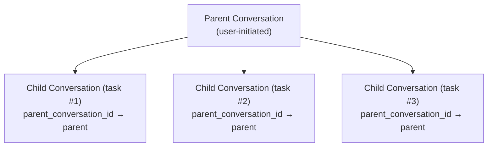

# ADR-004: إدارة دورة حياة تخزين الجلسات

> **الحالة**: مقبول (2026-06-10)
> **السياق**: entelecheia + shittim-chest
> **مستوحى من**: [opencode #16101](https://github.com/anomalyco/opencode/issues/16101)

## السياق

جمع opencode (وكيل برمجة AI مماثل) 9 جيجابايت من قاعدة بيانات سجل الدردشة في شهرين فقط مع استهلاك ~30 مليار token. تجاوز استخدام الذاكرة 30 جيجابايت بانتظام مع ~10 مشاريع محمّلة فقط. كان السبب الجذري هو غياب إدارة دورة حياة الجلسات: لا TTL، لا تنظيف تلقائي، لا حد للتخزين، ولا استعادة بعد الدمج.

يواجه entelecheia وshittim-chest نفس المشكلة الأساسية إذا تُركت دون معالجة:

- **entelecheia**: جداول `conversations` و`messages` في قاعدة البيانات موجودة لكن لم تُكتب إليها أبدًا؛ الدردشة الفعلية كانت مخزنة كملفات سجل TOML غير محدودة؛ كان جدول `dialogue_events` لديه كود CRUD لكن لا ترحيل؛ حدود التهيئة (`MAX_DIALOGUE_HISTORY_LEN`، `MAX_DIALOGUE_RECORDS`، `DIALOGUE_TIMEOUT_MS`) كانت معرّفة لكن غير مفروضة أبدًا.
- **shittim-chest**: لديه استمرارية محادثة/رسائل عاملة لكن لا تنظيف مؤتمت لجلسات المصادقة المنتهية، جلسات مساحة العمل البالية، سجل الكرويز، أو سجلات تسليم webhook.

## القرار

تنفيذ نظام موحد لإدارة دورة حياة التخزين بهذه المبادئ:

### 1. المحادثات لها دورة حياة، وليست مجرد ميلاد

- **TTL**: المحادثات غير النشطة بعد `CONVERSATION_TTL_DAYS` (افتراضي 90 يومًا) مؤهلة للتنظيف بعد الأرشفة.
- **أرشفة قبل الحذف**: يجب أرشفة المحادثات (`is_archived = TRUE`) قبل أن يزيلها تنظيف TTL.
- **الجلسات الفرعية**: تُتتبع علاقات المحادثة الأصل-الفرع عبر `parent_conversation_id`. يمكن أرشفة المحادثات الفرعية بشكل مستدام وتنظيفها بعد `CHILD_SESSION_RETENTION_DAYS` (افتراضي 7 أيام).

### 2. التنظيف تلقائي، وليس يدويًا

- **مهام الخلفية**: يعمل التنظيف الدوري على فواصل زمنية قابلة للتهيئة (`CLEANUP_INTERVAL_MINUTES`، افتراضي 60).
- **استراتيجية مختلطة**: فحص البدء + مؤقت دوري. لا يتطلب تدخل المستخدم.
- **متساوي الفاعلية**: يمكن تشغيل مهام التنظيف عدة مرات بأمان.

### 3. الدمج يتيح استعادة التخزين

- الرسائل الموسومة بـ `is_compacted = TRUE` تم تلخيص محتواها. يمكن تنظيف محتواها التفصيلي بعد فترة الاحتفاظ.
- محافظ افتراضيًا: امسح فقط محتوى الرسائل المدمجة، احافظ على البيانات الوصفية (اسم الأداة، الطوابع الزمنية، عدّادات token).

### 4. التهيئة مركزية

كل معاملات دورة الحياة تعيش في `StorageLifecycleConfig` (entelecheia) و`CleanupConfig` (shittim-chest)، محمّلة من متغيرات البيئة مع افتراضات معقولة.

### 5. السجلات القائمة على الملفات ثانوية

- `CHAT_LOG_ENABLED` افتراضي `false`. ملفات سجل TOML الدردشة لأغراض التصحيح فقط.
- عند التفعيل، تُنظف ملفات السجل بعد `CHAT_LOG_RETENTION_DAYS` (افتراضي 7).

## تغييرات المخطط

### جدول conversations (entelecheia)

أعمدة مضافة:

- `parent_conversation_id UUID REFERENCES conversations(conversation_id)` — تتبع الجلسة الفرعية
- `is_archived BOOLEAN NOT NULL DEFAULT FALSE` — علم الأرشفة
- `archived_at TIMESTAMPTZ` — متى أُرشفت
- `metadata JSONB NOT NULL DEFAULT '{}'` — بيانات وصفية قابلة للتوسع

### جدول messages (entelecheia)

أعمدة مضافة:

- `is_compacted BOOLEAN NOT NULL DEFAULT FALSE` — يوسم الرسائل المدمجة المؤهلة لتنظيف المحتوى
- `metadata JSONB NOT NULL DEFAULT '{}'` — بيانات وصفية قابلة للتوسع

### جدول dialogue_events (entelecheia)

كان لديه سابقًا كود CRUD لكن لا ترحيل `CREATE TABLE`. الآن مُضمّن في `baseline_tables.sql`.

### جدول rbac_sessions (entelecheia)

جدول جديد لاستمرارية جلسة kirino (خلفية SQL).

## مراحل التنفيذ

| المرحلة | الوصف | الحالة |
| --- | --- | --- |
| 0.1 | إصلاحات ترحيل المخطط (dialogue_events، ترقية conversations/messages) | منجز |
| 1.2 | نطاق تهيئة موحد (`StorageLifecycleConfig`) | منجز |
| 0.2 | `ConversationStore` بطرق CRUD + تنظيف | منجز |
| 2.1 | بنية تحتية عامة `CleanupScheduler` | منجز |
| 2.2 | مهام تنظيف entelecheia موصولة في scepter `setup.rs` | منجز |
| 2.3 | مهام تنظيف shittim-chest | أُزيلت (الحزمة غير موجودة) |
| 1.3 | `PgSessionManager` لـ kirino (خلفية جلسة SQL) | منجز |
| 3.1 | فرض حدود الحوار الموجودة (`max_dialogue_records`، `enforce_max_conversations`) | منجز |
| 3.2 | سجل الدردشة افتراضي مغلق + تنظيف TTL | منجز |
| 4.1 | أوامر إدارة CLI (`session stats`، `session purge`) | منجز |
| 5 | تتالي الجلسة الفرعية + دورة حياة اليتيم | منجز |

## النتائج

### إيجابية

- يمنع نمو التخزين غير المحدود الذي ابتُلي به opencode
- للمحادثات دورة حياة صريحة: نشطة ← مؤرشفة ← منظّفة
- التنظيف في الخلفية لا يتطلب تدخل المستخدم
- مدفوع بالتهيئة مع افتراضات معقولة
- تستعيد PostgreSQL VACUUM مساحة القرص بعد الحذف (على عكس SQLite التي يستخدمها opencode)

### سلبية

- مهام الخلفية الإضافية تستهلك CPU/ذاكرة ضئيلة
- المحادثات المؤرشفة تفقد المحتوى التفصيلي بعد TTL (بالتصميم)
- تتطلب مراقبة لضمان تشغيل مهام التنظيف

### مخاطر مخفّفة

- **فقدان البيانات**: توفر الأرشفة-قبل-الحذف فترة سماح. التنظيف يزيل فقط المحادثات المؤرشفة بالفعل.
- **تأثير الأداء**: يعمل التنظيف على فواصل قابلة للتهيئة، يستخدم استعلامات مفهرسة على `updated_at`/`created_at`.
- **يتم الجلسات الفرعية اليتيمة**: `parent_conversation_id` يتتبع العلاقات؛ TTL اليتيم أقصر (30 يومًا مقابل 90 يومًا).

## تصميم دورة حياة الجلسة الفرعية (المرحلة 5)

### المشكلة

كشف opencode issue #16101 أن 86% من الجلسات هي جلسات فرعية مُولّدة بواسطة `task()`، تمثل 75% من التخزين. تتراكم هذه الجلسات الفرعية دون إدارة دورة حياة مستقلة.

### البنية



### قواعد دورة الحياة

1. **الإنشاء**: عندما تُولّد سلسلة مهارات مهمة فرعية، تُنشأ محادثة جديدة مع `parent_conversation_id` مضبوطًا على `conversation_id` الخاص بالأصل.

1. **الأرشفة المستقلة**: يمكن أرشفة الفرعية بشكل مستقل عن الأصل. عندما تكتمل مهمة فرعية، تُؤرشف تلقائيًا بعد `CHILD_SESSION_RETENTION_DAYS` (افتراضي 7 أيام).

1. **التتالي عند أرشفة الأصل**: عندما يُؤرشف الأصل، تُؤرشف كل الفروع. عندما يُحذف الأصل، تُحذف كل الفروع.

1. **معالجة اليتيم**: تُعامَل المحادثات ذات `parent_conversation_id` الذي يشير إلى أصل محذوف/غير موجود كيتامى وتُنظف بعد `ORPHAN_CONVERSATION_TTL_DAYS` (افتراضي 30 يومًا).

1. **أهلية الدمج**: المحادثات الفرعية مؤهلة لدمج الرسائل فورًا بعد الأرشفة (لا فترة سماح)، حيث يحتفظ الأصل بالملخص.

### استعلامات التنظيف

```sql
-- Archive children whose parent is archived
UPDATE conversations SET is_archived = TRUE, archived_at = NOW()
WHERE parent_conversation_id IN (
    SELECT conversation_id FROM conversations WHERE is_archived = TRUE
) AND is_archived = FALSE;

-- Delete children whose parent is deleted
DELETE FROM conversations WHERE parent_conversation_id IS NOT NULL
    AND parent_conversation_id NOT IN (SELECT conversation_id FROM conversations);

-- Delete archived children older than retention
DELETE FROM conversations WHERE is_archived = TRUE
    AND archived_at < NOW() - (CHILD_SESSION_RETENTION_DAYS || ' days')::interval
    AND parent_conversation_id IS NOT NULL;
```

### حالة التنفيذ

- عمود `parent_conversation_id` موجود في جدول `conversations` (المرحلة 0.1)
- يعالج `ConversationStore.cleanup_expired_conversations()` التنظيف القائم على TTL (المرحلة 0.2)
- `StorageLifecycleConfig.child_session_retention_days` و`orphan_conversation_ttl_days` مُهيّآن (المرحلة 1.2)
- استعلامات التتاري منفّذة في `ConversationStore`:
  - `cascade_archive_children()` — يؤرشف الفروع عند أرشفة الأصل
  - `cascade_delete_orphaned_children()` — يحذف الفروع التي حُذف أصلها
  - `cleanup_expired_child_conversations()` — تنظيف قائم على TTL للفروع المؤرشفة
  - `cleanup_orphan_conversations()` — تنظيف الفروع ذات الأصل المفقود
  - `enforce_max_dialogue_records()` — حد صلب على عدد `dialogue_events`
  - `enforce_max_conversations()` — حد صلب على عدد المحادثات النشطة
- كلها مسجلة كمهام تنظيف دورية في scepter `setup.rs`
