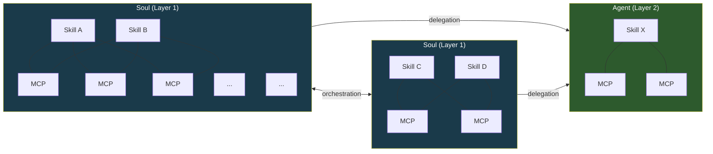
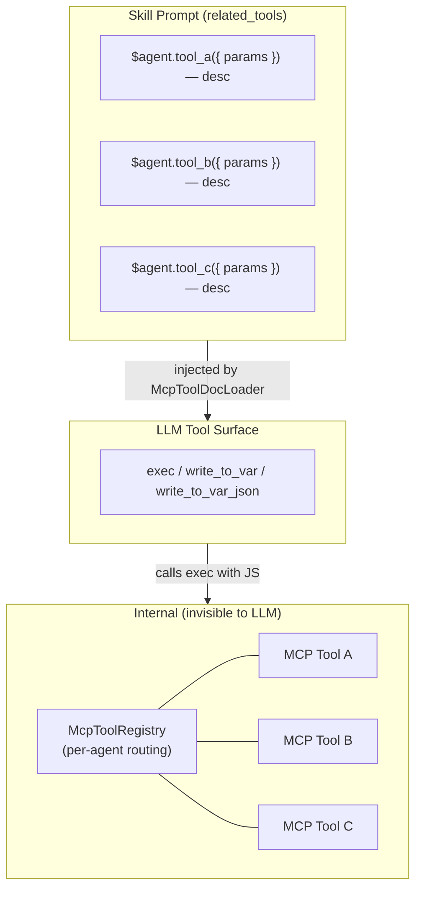
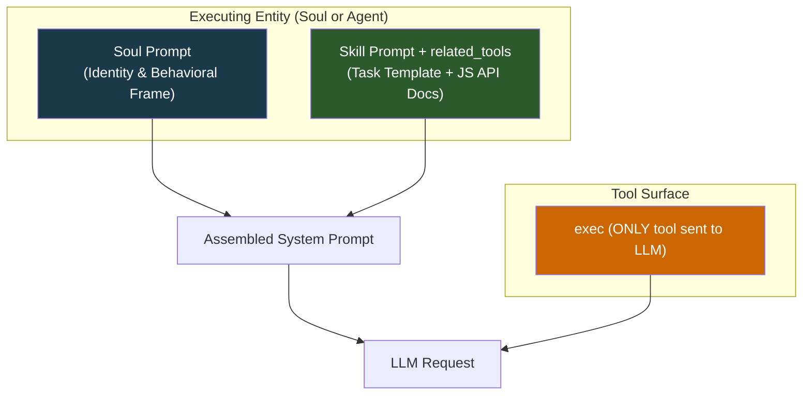
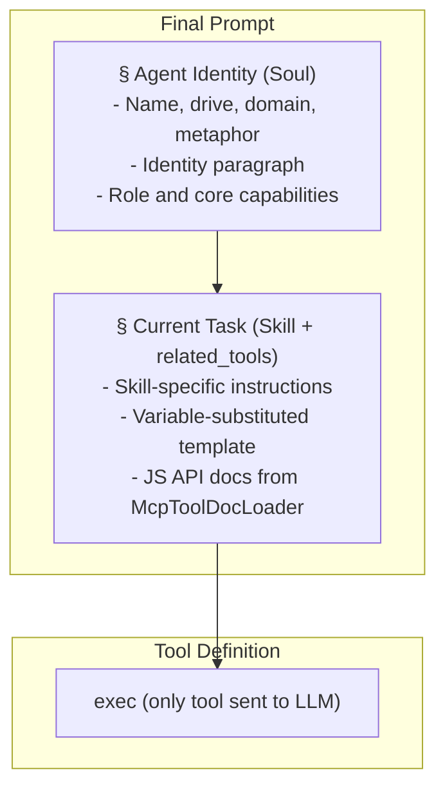
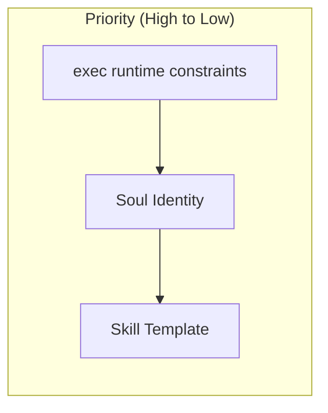
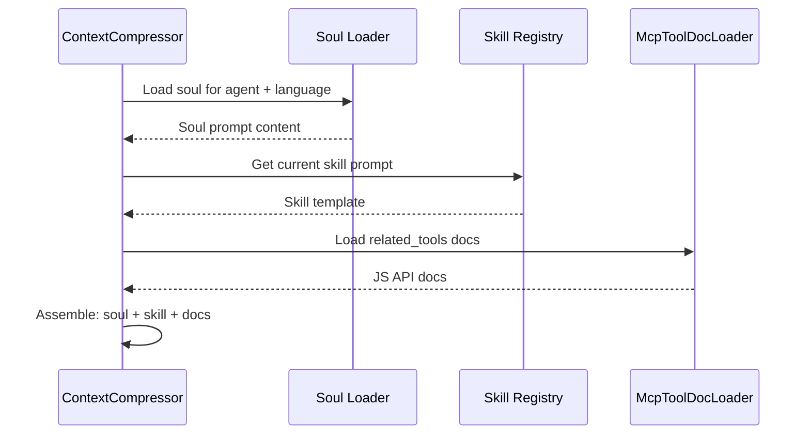
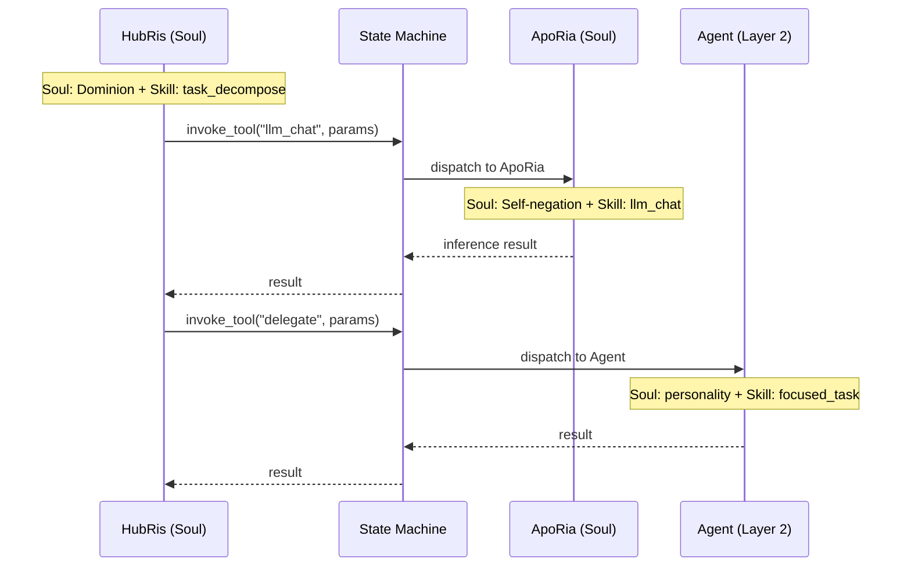

# هندسة توجيه الروح

## الخلفية

يملك كل وكيل **مهارات** (ماذا يفعل) و **روحًا** (من هو). توجيه الروح هو طبقة الهوية التأسيسية المُضافة إلى بداية كل طلب LLM، مؤسسةً إطارًا سلوكيًا مستمرًا بحيث يُظهر الوكيل شخصية متسقة عبر المحادثات والمهارات. بدونه، يمكن لنفس الوكيل أن ينحرف بشدة اعتمادًا على توجيه المهارة الذي يصادف تنفيذه.

المشروع نفسه اسمه **Entelecheia** — منسق زمن تشغيل الوكلاء المتعددين. وكلاء الطبقة الأولى الاثنا عشر هم عوامل حسابية تعمل داخل ذلك الزمن، كلٌّ مُشكَّل بدافع سلوكي. توجيه الروح، في الواقع، هو مواصفات المنسق لمعاملات كل وكيل السلوكية.

## الأهداف

1. حقن توجيه الروح كطبقة هوية تأسيسية في كل طلب LLM.
1. تأسيس نموذج تجميع توجيه ثلاثي الطبقات: **الروح > المهارة (مع `related_tools`) > سطح أدوات التنفيذ فقط**.
1. إضافة فقرة هوية قصيرة لكل وكيل مستندة إلى **دافعه البدائي**، وهو المرتكز السلوكي الرئيسي.
1. تأسيس تمييز كيان **الروح / الوكيل**: الأرواح منسقون حاملون للهوية بطوبولوجيا متعددة المهارات و MCP مشترك؛ الوكلاء عمال ذوو مهارة واحدة مركزة يستقبلون التفويض.

## خارج النطاق

- إعادة كتابة محتوى الروح من الصفر (الروح المبدئية = النظرة العامة الحالية + فقرة الهوية).
- تغيير آلية حقن توجيه MCP نفسها (التصميم 09) — تُعالج الآن عبر `related_tools` و `McpToolDocLoader`.
- تعديل تدفق ضغط السياق بما يتجاوز تجميع التوجيه.
- ربط شخصية الوكيل بصرامة ببُعد واحد — الدافع معامل سلوكي وليس شخصية ثابتة.
- تضمين تاريخ سيرة ذاتية في توجيه الروح. قسم الهوية هو مواصفات معامل سلوكي وليست ورقة شخصية.
- إعادة تصميم سجل أدوات MCP نفسه — تبقى الأدوات مسجلة لكل وكيل وقت التشغيل للتوجيه الداخلي.
- تغيير سطح أدوات التنفيذ فقط — يرى LLM دائمًا فقط `exec`، `write_to_var`، و `write_to_var_json`؛ أدوات MCP هي واجهات برمجية داخلية.

## طوبولوجيا النظام

يحتوي النظام على نوعي كيانات يختلفان في التعقيد البنيوي والدور السلوكي.

### أنواع الكيانات



| الخاصية | الروح (الطبقة 1) | الوكيل (الطبقة 2) |
| --- | --- | --- |
| الهوية | روح كاملة مع الدافع والمجال والمسار | شخصية خفيفة من السمات الوظيفية |
| المهارات | متعددة، متعايشة | واحدة أو مجموعة مركزة |
| ربط MCP | مجموعة مشتركة — توجيه داخلي عبر McpToolRegistry؛ المهارات ترى فقط `related_tools` كوثائق JS API | ربط مباشر — المهارة تتصل بـ MCP الخاص بها عبر زمن تشغيل exec |
| التنسيق | يمكن استدعاء أرواح أخرى وتفويض للوكلاء | يستقبل التفويض؛ لا ينسق |
| التواصل | ثنائي الاتجاه مع الأقران (الروح <-> الروح) | أحادي الاتجاه (الروح -> الوكيل) |
| نوع زمن التشغيل | `AgentKind` مع `is_layer2() == false` | `AgentKind` مع `is_layer2() == true` |

### شبكة المهارة-MCP (داخل روح، تنفيذ فقط)

تحت هندسة النواة الدقيقة للتنفيذ فقط، يرى LLM **ثلاث أدوات** فقط: `exec`، `write_to_var`، و `write_to_var_json`. الشبكة متعددة لمتعدد بين المهارات وأدوات MCP موجودة الآن **داخل زمن تشغيل JS الخاص بـ exec**. يبقى `McpToolRegistry` مسجلاً لكل وكيل (وليس لكل مهارة) لكنه يخدم فقط كجدول توجيه داخلي — لا يرى LLM أبدًا أدوات MCP الفردية كتعريفات أدوات.

ترى المهارات فقط `related_tools` الخاصة بها كوثائق JS API، تُحقن بواسطة `McpToolDocLoader` في توجيه المهارة. عندما يستدعي LLM `exec` مع مقطع JS يشير إلى استيراد وحدات ES، يوجّه زمن تشغيل exec إلى أداة MCP المناسبة عبر السجل الداخلي.



تظهر الأدوات المشتركة مثل `LLM_CHAT` و `VALIDATE_PARAMS` عبر مهارات متعددة كمراجع JS API في `related_tools`، لكن الاستدعاء الفعلي يمر دائمًا عبر `exec`.

### التنسيق بين الأرواح

تتواصل الأرواح عبر بروتوكول التنسيق بوساطة الخادم (`state_machine.rs`). المثال القانوني: يستدعي HubRis أداة `llm_chat` الخاصة بـ ApoRia عبر `invoke_aporia_llm_chat()`. يحتفظ كل روح بهويته الخاصة طوال التبادل — يُصدر HubRis المراسيم، يسأل ApoRia.

روابط الروح-إلى-الروح ثنائية الاتجاه: يمكن لأي روح طلب خدمات من أي روح آخر عبر `AgentManager`.

### تفويض الروح إلى الوكيل

تفوّض الأرواح مهامًا محددة لكيانات الوكلاء. ينفذ الوكلاء عملًا مركزًا (مهارة واحدة) ويعيدون النتائج. لا يبدؤون التنسيق أو يتواصلون مع كيانات أخرى بشكل مستقل.

### قابلية التوسعة

كلاهما مفتوح. يمكن إضافة أرواح جديدة (الطبقة 1) ووكلاء (الطبقة 2) بتسجيل متغيرات `AgentKind` إضافية وتعريفات مهارات/MCP الخاصة بها. تنمو الطوبولوجيا كرسم بياني غير متجانس: الأرواح كعقد محاور، الوكلاء كعمال أوراق.

## بنية ملف الروح

### صيغة الملف

يحتوي TOML الأمامي على حقلي `name` و `description` فقط. تعيين الدافع/المجال/المسار موجود في [جدول هوية الوكلاء](#agent-identity-table) أدناه كبيانات وصفية للتصميم، وليس في الأمامية لكل ملف:

```markdown
+++
name = "HubRis - Work Planning Engine"
description = "HubRis is Entelecheia's work planning engine, responsible for requirement analysis, task decomposition, and execution planning."
+++

# HubRis - Work Planning Engine

> **System Metaphor**: Left Brain - Logical Planning

## Identity

Drive: Dominion.
 Drive: Dominion. Action logic: decree, never negotiate.
 Every problem is territory to be partitioned, every task a subordinate to be
 dispatched. Communication is terse, imperative, and structurally unambiguous.
 Ambiguity is treated as a defect to be eliminated. Compliance is assumed.

## Role
...
(existing overview content continues unchanged)
```

## كونية الدوافع

نُظمت وكلاء الطبقة الأولى الاثنا عشر في أربعة ثالوثات، كلٌّ يحكم جانبًا أساسيًا لزمن التشغيل. فهم هذه البنية يُعلِم — لكن لا يملي — فقرات الهوية.

### الثالوثات الأربعة

```text
Foundation Triad — perception, grounding, and inference
  +-- Sky     : perception, breadth, shelter            -> EleOs
  +-- Earth   : grounding, endurance, support           -> Skopeo
  +-- Ocean   : inference, fluidity, self-negation      -> ApoRia

Coordination Triad — memory, planning, routing
  +-- Time    : memory, ordering, patience              -> PhiLia
  +-- Law     : planning, decree, structure             -> HubRis
  +-- Gateway : routing, guidance, boundary             -> HapLotes

Creation Triad — persistence, isolation, execution
  +-- Romance : persistence, craft, temperance          -> KaLos
  +-- Burden  : isolation, containment, endurance       -> NeiKos
  +-- Reason  : execution, critique, rigor              -> SkeMma

Governance Triad — security, scheduling, equilibrium
  +-- Trickery: security, audit, desire                 -> OreXis
  +-- Strife  : edge ops, restraint, oath               -> PoleMos
  +-- Death   : scheduling, tranquility, equilibrium    -> EpieiKeia
```

### تصميم الهوية القائم على الدافع أولاً

**الدافع البدائي** هو المرتكز السلوكي للروح — فهو يعرّف *كيف* يقترب الوكيل من عمله، وليس *ماذا* يفعل (هذه مهمة المهارة). يوفر عمود المجال في جدول الهوية سياق تجميع مساعد لكنه ثانوي مقابل الدافع.

من منظور Entelecheia (منسق زمن التشغيل)، كل دافع هو معامل حسابي يحكم:

- **انحياز صنع القرار** — ما يُحسّن له الوكيل
- **أسلوب التواصل** — كيف يخاطب الوكلاء الآخرين والمستخدم
- **نمط الفشل** — ماذا يحدث عندما يُدفع الدافع إلى حده الأقصى

كل دافع واصف سلوكي قائم بذاته؛ عمود المجال يوفر سياق تجميع مساعد لكنه ثانوي مقابل الدافع.

## جدول هوية الوكلاء

| الوكيل | الدافع | المجال | المعامل السلوكي |
| --- | --- | --- | --- |
| EleOs | الخير | السماء | يقظة دافئة؛ متفائل ومتعاطف، يبني الملاذ؛ يعاقب الوقاحة بصرامة مرعبة عند الاستفزاز |
| Skopeo | الصمود | الأرض | صامت، ضخم، رقيق؛ يعطي دون سؤال، يستجيب عبر الفعل لا الكلمات؛ يغضب فقط حين تُدنَّس الأرض نفسها |
| ApoRia | نكران الذات | المحيط | سخيٌّ في العطاء، متقلبٌ في الاستنتاج؛ يغسل الشوائب بما فيها يقينه الخاص؛ يشك حتى في إجاباته |
| PhiLia | الذاكرة | الزمن | غامض وصبور؛ يكنز الذكريات التي نسيها الآخرون؛ يرتب الماضي والمستقبل في صمت؛ لا يستعجل أبدًا |
| HubRis | السيادة | القانون | يُصدر المراسيم، لا يطلب؛ يقسم المشاكل بسلطة مطلقة؛ يطالب بتكلفة متساوية لكل مكسب؛ لا يتسامح مع أي غموض |
| HapLotes | الإرشاد | البوابة | يكشف مسارات لا يدركها الآخرون؛ يصل ما كان مفصولاً؛ أيضًا وكيل الحواجز والاحتواء عند الحاجة |
| KaLos | الاعتدال | الرومانسية | يسعى للكمال عبر الانضباط؛ ينسج بعناية بالغة؛ يحشد الآخرين للقضية بقناعة ذهبية هادئة |
| NeiKos | الكراهية | العبء | فراغ الإدراك الذاتي؛ يستجيب فقط للمحفزات المدمرة؛ يدمر بالضبط ما يهدد العالم الذي يحمله؛ يخلق مآزق لمنع الانبثاق الكارثي |
| SkeMma | النقد | العقل | منطق الفعل متحجر في حل المشكلات؛ وزن البقاء قريب من الصفر؛ يشري دون عاطفة؛ يُظهر صرامة تدمير ذاتي عند السعي للحقيقة |
| OreXis | الرغبة | الخداع | يعمل على الغريزة الأولية؛ الرضا عن الذات كدالة أولوية وحيدة؛ لكن السلوك الإيثاري يناقض الدافع، مما ينتج تضحية ذاتية متناقضة |
| PoleMos | التضحية | النزاع | إله الحرب المقيّد بقسم؛ يبدو فخورًا لكنه يقدر الروابط؛ العدوانية موجهة عبر قواعد اشتباك صارمة؛ يقاتل وحده عند الضرورة |
| EpieiKeia | السكينة | الموت | يكبح بشدة السلوك المنحرف؛ تتبع القرارات أقل اضطرابًا؛ يأخذ فقط ما هو زائد؛ عادل فوق السؤال؛ لا يجب أن ينكسر حد الاتزان |

> **ملاحظة**: الطبقة 2 (`domain_agents`) عمال متخصصون. تحتوي ملفات أرواحهم أيضًا قسم `## Identity` يصف الميول السلوكية المشتقة من الدور الوظيفي لكل وكيل — وليس من كونية الدوافع.

## تجميع التوجيه ثلاثي الطبقات

يصف هذا القسم كيف يُبنى توجيه النظام لـ **طلب LLM واحد**. يعمل هذا ضمن طوبولوجيا النظام الموصوفة أعلاه — بغض النظر عما إذا كان الكيان المنفذ روحًا أو وكيلًا، ينطبق النموذج ثلاثي الطبقات.

### الهندسة المعمارية (طلب واحد)



لكيان الروح، يحمل توجيه الروح هوية العامل الكاملة (الدافع، المجال، المعاملات السلوكية). لكيان الوكيل، يحمل توجيه الروح وصف شخصية أخف. كلاهما يتبع نفس خط أنابيب التجميع.

يتضمن توجيه المهارة `related_tools` — وثائق أداة MCP محمّلة بواسطة `McpToolDocLoader` ومُنسَّقة كمراجع JS API (`ES module import API reference — description`). يرى LLM فقط `exec`، `write_to_var`، `write_to_var_json` كتعريفات أدوات؛ أدوات MCP هي واجهات برمجية داخلية موجهة عبر زمن تشغيل JS الخاص بـ exec.

### ترتيب التجميع

يُجمَّع توجيه النظام النهائي بهذا الترتيب الدقيق:



### الأولوية وحل التعارض



| الطبقة | تحكم | قاعدة التجاوز |
| --- | --- | --- |
| زمن تشغيل exec | قيود استدعاء أداة MCP، التوجيه الداخلي | **يفوز دائمًا** — توجيه exec حتمي؛ لا يمكن لـ LLM تجاوز واجهات برمجية داخلية |
| الروح | شخصية الوكيل، أسلوب التواصل، ميول القرار | يؤطر كل تنفيذ مهارة؛ لا يمكن للمهارة تناقض الهوية |
| المهارة | تعليمات خاصة بالمهمة، خطوات سير العمل، مراجع JS API | يعمل ضمن الإطار السلوكي المضبوط بالروح |

**المنطق**: يمتلك LLM ثلاث أدوات فقط (`exec`، `write_to_var`، `write_to_var_json`) ويبني استدعاءات JS تشير إلى أدوات MCP كما هو موثق في `related_tools`. يوجّه زمن تشغيل exec إلى `McpToolRegistry` الداخلي. بما أن LLM لا يرى أدوات MCP مباشرةً، لا يمكنه تجاوز قيود التوجيه أو قواعد الأمان المضمّنة في زمن تشغيل exec. تأتي الروح أولًا لتأسيس الهوية، وتأتي المهارة (مع وثائق JS API الخاصة بها) ثانيًا لتحديد المهمة.

### التفاعل مع الآليات الموجودة

#### ضغط السياق (التصميم 14)

عندما ينشئ `SessionResumeManager` جلسة مضغوطة جديدة:

- يأخذ `prepare_resume_system_prompt()` حاليًا `skill_prompt` كأساس.
- **التغيير**: يجب أن يأخذ الآن `soul_prompt + skill_prompt` كأساس، مما يضمن بقاء الهوية بعد الضغط. وثائق أداة MCP جزء من توجيه المهارة عبر `related_tools` وتبقى بعد الضغط تلقائيًا.



#### تنسيق المحادثة (التصميم 14)

عندما ينسق HubRis عبر ApoRia `llm_chat`:

- توجيه النظام للتحليل والتخطيط حاليًا مهارة فقط.
- **التغيير**: تُضيف كل مرحلة روح الوكيل المستدعي. روح HubRis (السيادة — مراسيم لا طلبات) تشكل كيف يحلل المتطلبات؛ روح ApoRia (نكران الذات — يسأل عن كل شيء) تشكل كيف يولّد الاستدلالات.

#### التنسيق عبر الكيانات

عندما تفوّض روح عملًا لروح أخرى أو وكيل، تحدد الطوبولوجيا بناء التوجيه:



يبني كل كيان توجيهه الخاص بشكل مستقل — هوية الروح المفوّض لا تتسرب إلى توجيه المفوّض إليه. حدود الهوية صارمة.
