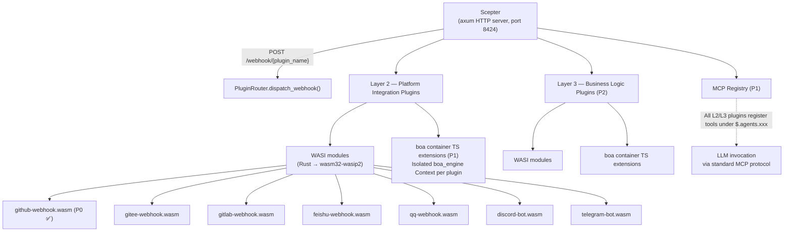
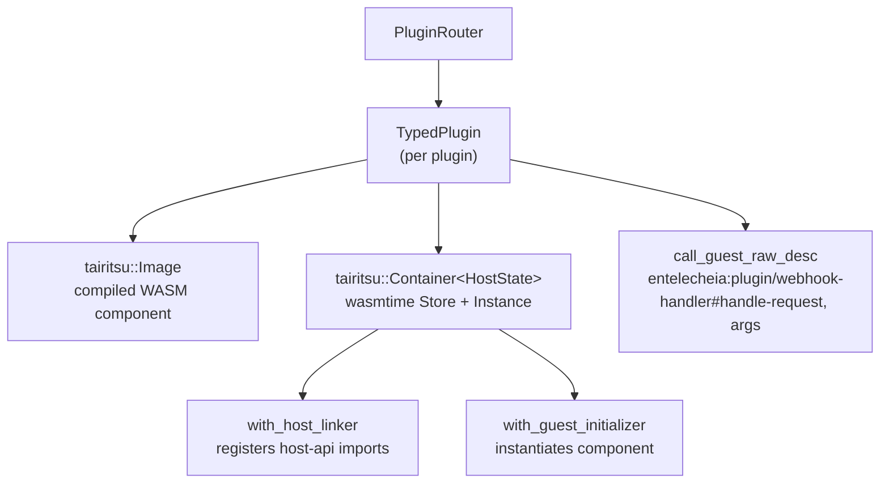

# 25 — تصميم نظام إضافات WASI

## نظرة عامة

يستبدل نظام إضافات WASI سقالة webhooks السابقة بـ Python/TypeScript بإضافات **نموذج مكوّن WASM**، مقدّمًا تكاملات منصة معزولة ومستقلة عن اللغة (الطبقة 2) وامتدادات منطق أعمال (الطبقة 3). أهداف التصميم الرئيسية:

1. **آلية امتداد مزدوجة**: الطبقة 2 (تكامل المنصة) والطبقة 3 (منطق الأعمال) كلاهما يدعم وحدات WASI وإضافات boa TS.
1. **تسجيل MCP موحد**: جميع الإضافات تسجل الأدوات تحت `$.agents.xxx` بغض النظر عن لغة التنفيذ.
1. **إدخال/إخراج يُدار بالخادم**: يتعامل الخادم (خادم Scepter axum) مع توجيه HTTP، و WebSocket، والاتصالات طويلة الأمد؛ الإضافات تعالج المنطق فقط.
1. **عزل قوي**: تعمل وحدات WASM تحت wasmtime مع حدود وقود ومقاطعة حقبة.

## الهندسة المعمارية



## تعريفات واجهة WIT

موجودة في `packages/shared/plugin_host/wit/plugin.wit`:

```wit
package entelecheia:plugin;

interface host-api {
    http-request:  func(method: string, url: string, headers: string, body: string) -> result<string, string>;
    forward-event: func(event-json: string) -> result<_, string>;
    query-ai:      func(message: string, context: option<string>) -> result<string, string>;
    log:           func(level: string, message: string);
    config-get:    func(key: string) -> option<string>;
    kv-get:        func(key: string) -> option<string>;
    kv-set:        func(key: string, value: string) -> result<_, string>;
    register-mcp-tool: func(tool-name: string, description: string, schema: string) -> result<_, string>;
}

interface webhook-handler {
    name: func() -> string;
    handle-request: func(method: string, path: string, headers: string, body: string) -> result<string, string>;
}

interface bot-handler {
    name: func() -> string;
    on-message: func(platform: string, message: string) -> result<option<string>, string>;
}

world layer2-plugin {
    import host-api;
    export webhook-handler;
}

world layer2-bot {
    import host-api;
    export bot-handler;
}
```

### تسجيل API من جانب الخادم

يسجل الخادم جميع دوال `host-api` باستخدام `component::Linker::func_wrap` الخاص بـ wasmtime قبل إنشاء المكوّن:

```rust
let mut instance = linker.root().instance("entelecheia:plugin/host-api")?;

instance.func_wrap("http-request",
    |_: StoreContextMut<'_, HostState>,
     (method, url, headers, body): (String, String, String, String)| {
        Ok::<(Result<String, String>,), wasmtime::Error>(
            (api.http_request(method, url, headers, body),)
        )
    }
)?;
```

### روابط جانب الضيف

تستخدم الإضافات `wit_bindgen::generate!()` لتوليد روابط جانب الضيف:

```rust
wit_bindgen::generate!({
    path: "wit",
    world: "layer2-plugin",
});

struct GithubWebhookPlugin;
impl exports::entelecheia::plugin::webhook_handler::Guest for GithubWebhookPlugin {
    fn name() -> String { "github-webhook".to_string() }
    fn handle_request(method: String, path: String, headers: String, body: String)
        -> Result<String, String> { /* ... */ }
}
export!(GithubWebhookPlugin);
```

## هندسة مضيف الإضافات

### الكرات: `_shared_plugin_host` (`packages/shared/plugin_host/`)

| الوحدة | الدور |
| --- | --- |
| `plugin_state.rs` | `HostFunctions` — ينفذ جميع دوال `host-api` (HTTP، KV، التكوين، الأحداث) |
| `plugin_loader.rs` | `TypedPlugin` — يبني حاويات wasmtime، يسجل استيرادات الخادم، يستدعي تصديرات الضيف عبر `call_guest_raw_desc` ديناميكي |
| `plugin_router.rs` | `PluginRouter` — يدير الإضافات المحمّلة، يوجّه طلبات webhook/bot، يمسح دليل `plugins/` تلقائيًا |
| `host_functions.rs` | يعيد تصدير `HostFunctions` وسمة `HostApiProvider` |

### رصة زمن التشغيل



### أسماء تصدير الضيف

بما أن `wit_bindgen::generate!` على جانب الضيف يصدر الدوال تحت اسم واجهة WIT، يستخدم الخادم أسماء مؤهلة بالكامل للاستدعاء الديناميكي:

```text
entelecheia:plugin/webhook-handler#name
entelecheia:plugin/webhook-handler#handle-request
entelecheia:plugin/webhook-handler#on-message
```

### جسر غير متزامن

دوال الخادم متزامنة (متطلب wasmtime) لكن التنفيذات تحتاج غير متزامن (HTTP، قاعدة بيانات). يستخدم الجسر `tokio::task::block_in_place` + `Handle::block_on`:

```rust
instance.func_wrap("kv-get",
    move |_: StoreContextMut<'_, HostState>, (key,): (String,)| {
        let result = tokio::task::block_in_place(|| {
            let handle = tokio::runtime::Handle::current();
            handle.block_on(api.kv_get(&key))
        });
        Ok::<(Option<String>,), wasmtime::Error>((result,))
    }
)?;
```

يستخدم معالج webhook الخاص بـ Scepter `tokio::task::spawn_blocking` لاستدعاء طرق WASM المتزامنة من معالجات axum غير المتزامنة.

## تكامل Scepter

### تسجيل المسارات

`packages/scepter/src/app/setup.rs` — أُضيفت إلى موجّه axum:

```rust
.merge(crate::api::plugin_webhook::create_plugin_webhook_routes())
```

### معالج Webhook

`packages/scepter/src/api/plugin_webhook.rs`:

- `POST /webhook/{plugin_name}` — يستخرج المسار، الترويسات، الجسم
- يستدعي `PluginRouter::dispatch_webhook()` داخل `tokio::task::spawn_blocking`
- يعيد استجابة الإضافة أو خطأً

### التحميل التلقائي للإضافات

عند بدء التشغيل، ينشئ Scepter `PluginRouter` ويمسح `plugins/` (أو `$PLUGIN_DIR`) بحثًا عن ملفات `.wasm`:

```rust
let plugin_dir = std::path::PathBuf::from(
    std::env::var("PLUGIN_DIR").unwrap_or_else(|_| "plugins".to_string()),
);
router.scan_and_load_dir(&plugin_dir)?;
```

## دليل تطوير الإضافات

### إنشاء إضافة WASI

1. مهّد كرات جديدًا تحت `plugins/`:

```toml
# plugins/my-platform/Cargo.toml
[package]
name = "plugin-my-platform"
version = "0.1.0"
edition = "2024"

[lib]
crate-type = ["cdylib", "rlib"]

[dependencies]
wit-bindgen = "0.57"
serde = { version = "1", features = ["derive"] }
serde_json = "1"
```

1. انسخ ملف WIT:

```text
plugins/my-platform/wit/plugin.wit  ← symlink or copy from packages/shared/plugin_host/wit/
```

1. نفّذ سمة `Guest`:

```rust
// plugins/my-platform/src/lib.rs
wit_bindgen::generate!({ path: "wit", world: "layer2-plugin" });

use exports::entelecheia::plugin::webhook_handler::Guest;

struct MyPlatformPlugin;

impl Guest for MyPlatformPlugin {
    fn name() -> String { "my-platform".to_string() }
    fn handle_request(method: String, path: String, headers: String, body: String)
        -> Result<String, String> {
        // Use host-api functions: log(), http-request(), kv-get(), etc.
        log("info", &format!("received {} request", method));
        Ok(r#"{"status":"ok"}"#.to_string())
    }
}

export!(MyPlatformPlugin);
```

1. اضبط `.cargo/config.toml`:

```toml
[target.wasm32-wasip2]
rustflags = ["--cfg=unstable_wasi_extension", "--cfg=unstable_wasi_export_wasi_reactor"]
```

1. ابنِ:

```bash
cargo build --target wasm32-wasip2 --release -p plugin-my-platform --lib
```

1. انشر: انسخ ملف `.wasm` إلى دليل `plugins/` (أو اضبط `PLUGIN_DIR`).

## مرجع دوال الخادم

| الدالة | التوقيع | الوصف |
| --- | --- | --- |
| `http-request` | `(method, url, headers, body) → result<string, string>` | إجراء طلبات HTTP (للرد على المنصات الخارجية) |
| `forward-event` | `(event-json) → result<_, string>` | توجيه أحداث منظمة إلى Scepter |
| `query-ai` | `(message, context?) → result<string, string>` | استعلام خط أنابيب الذكاء الاصطناعي (غير متصل بعد) |
| `log` | `(level, message)` | إصدار سجل منظّم عبر tracing الخاص بـ Scepter |
| `config-get` | `(key) → option<string>` | قراءة تكوين الإضافة |
| `kv-get` | `(key) → option<string>` | تخزين KV دائم (رموز OAuth، إلخ.) |
| `kv-set` | `(key, value) → result<_, string>` | الكتابة إلى تخزين KV الدائم |
| `register-mcp-tool` | `(name, description, schema) → result<_, string>` | تسجيل أداة MCP (P1) |

## نموذج الأمان

| الآلية | التنفيذ |
| --- | --- |
| **صندوق الرمل** | صندوق رمل نموذج مكوّن wasmtime — لا نظام ملفات، لا وصول شبكة افتراضيًا |
| **حدود الموارد** | عدّاد الوقود (محاسبة لكل تعليمة) + مقاطعة حقبة (مهلة) عبر باني حاوية tairitsu |
| **إدخال/إخراج الخادم فقط** | كل الإدخال/الإخراج يمر عبر دوال الخادم؛ لا يمكن للإضافات فتح مقابس أو ملفات |
| **عزل الإضافات** | كل إضافة نسخة wasmtime منفصلة بذاكرتها الخاصة، لا مشاركة بين الإضافات |
| **صندوق رمل TS (P1)** | سياق boa_engine مع COMPUTE_TIMEOUT (120ث) / ABSOLUTE_CEILING (600ث) من skemma |

## حالة التنفيذ

| المرحلة | المكوّن | الحالة |
| --- | --- | --- |
| **P0** | إضافة GitHub webhook WASI | ✅ تم |
| **P0** | PluginRouter + تكامل Scepter | ✅ تم |
| **P0** | HostFunctions (جميع دوال host-api الثمانية) | ✅ تم |
| **P1** | بنية تحتية لإضافات boa TS | غير مبدوء |
| **P1** | تسجيل أداة MCP عبر `$.agents.xxx` | غير مبدوء |
| **P2** | إضافات المنصات المتبقية (Gitee، GitLab، Feishu، QQ، Discord، Telegram) | غير مبدوء |
| **P2** | إضافات منطق أعمال الطبقة 3 | غير مبدوء |

## الملفات الرئيسية

| الملف | الغرض |
| --- | --- |
| `packages/shared/plugin_host/Cargo.toml` | wasmtime 43، زمن تشغيل tairitsu، reqwest |
| `packages/shared/plugin_host/wit/plugin.wit` | تعريف واجهة WIT القانوني |
| `packages/shared/plugin_host/src/plugin_state.rs` | HostFunctions، سمة HostApiProvider |
| `packages/shared/plugin_host/src/plugin_loader.rs` | TypedPlugin، تسجيل دوال الخادم |
| `packages/shared/plugin_host/src/plugin_router.rs` | PluginRouter، توجيه، scan_and_load_dir |
| `packages/scepter/src/api/plugin_webhook.rs` | معالج مسار webhook الخاص بـ Axum |
| `packages/scepter/src/app/setup.rs` | تسجيل المسارات + تهيئة PluginRouter |
| `plugins/github-webhook/` | تنفيذ مرجعي |
| `plugins/github-webhook/src/lib.rs` | إضافة GitHub webhook (المسائل، PR، الدفع، التعليقات) |
