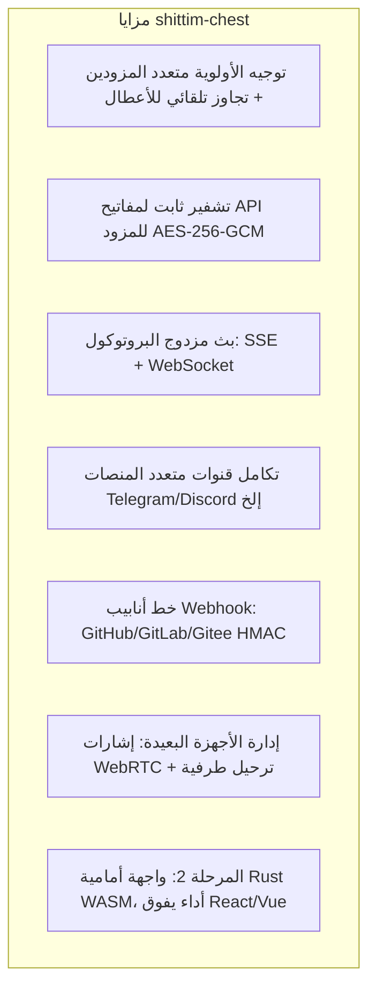

# تحديد موقع المنتج والمشهد التنافسي

## نظرة عامة

shittim-chest هي منصة WebUI لنموذج لغة كبير LLM مقترنة بشكل غير محكم، ومنافسوها المباشرون هم Open WebUI و LobeChat وما شابهها. تكاملها مع entelecheia هو ميزة اختيارية، وليس متطلبًا معماريًا مسبقًا.

## تحديد الموقع الأساسي

| البُعد | الوصف |
| --- | --- |
| الجوهر | WebUI محادثة LLM متعدد المزودين مستقل |
| المنافسون | Open WebUI، LobeChat، NextChat |
| العلاقة مع entelecheia | مقترن بشكل غير محكم: تكامل اختياري موصول عبر وكيل JWT |
| الاستقلالية | يوفر تجربة محادثة كاملة بدون entelecheia |

## التمايز عن Open WebUI

## الحد مع entelecheia

| shittim-chest | entelecheia |
| --- | --- |
| مصادقة المستخدم (argon2 + JWT) | هوية المستخدم + الصلاحيات (RBAC) |
| إدارة الجلسات | تنسيق الوكلاء (scepter) |
| بيانات المحادثة (محادثات/رسائل) | وقت تشغيل حاويات Cosmos |
| إدارة مزودي LLM + تشفير المفاتيح | محرك تنفيذ IEPL TypeScript |
| دخول Webhook (تحقق HMAC + إعادة توجيه) | استدعاء أدوات الوكلاء |
| العرض الأمامي (arona) | قناة وكلاء WebSocket |
| جلسات الأجهزة البعيدة + ترحيل الإشارات | وكيل أجهزة polemos |
| إعدادات القنوات متعددة المنصات | — |

**المبدأ الرئيسي**: يحتفظ shittim-chest فقط ببيانات "جانب المستخدم"؛ ويحتفظ entelecheia فقط ببيانات "جانب الوكيل". يتواصل الاثنان عبر HTTP/WebSocket موثق بـ JWT، دون الوصول إلى قواعد بيانات بعضهما البعض أبدًا.

## خارطة طريق التطور المعماري

| المرحلة | الحالة | المحتوى |
| --- | --- | --- |
| P1-P6 | مكتمل | محادثة مستقلة، مصادقة، إدارة المزودين، Webhooks، جسر الوكيل، إدارة الأجهزة |
| P7 | مخطط | إدخال/إخراج صوتي (حاوية STT Docker + وكيل TTS) |
| P8 | مخطط | PWA محمول + Tauri Mobile |
| P9 | مخطط | ترحيل الواجهة الأمامية Rust WASM (arona → Tairitsu) |

## فلسفة التصميم

1. **المستقل أولًا**: لا تعتمد جميع الميزات الأساسية على entelecheia. متغيرات البيئة `LLM_DEFAULT_PROVIDER_*` كافية لإطلاق المحادثة بشكل مستقل.
1. **تكامل مقترن بشكل غير محكم**: تكامل entelecheia هو طبقة وكيل اختيارية. يمكن للمستخدمين اختيار استخدام محادثة LLM فقط، أو تمكين تنسيق الوكلاء عبر entelecheia.
1. **WASM التدريجي**: تُسلَّم الواجهة الأمامية Vue 3 أولًا كـ "مواصفات حية"؛ للترحيل إلى WASM عتبات قرار واضحة (نضج الإطار، تغطية النظام البيئي، عرض النطاق التطويري).
1. **Docker أصلي**: تُدار جميع المكونات من جانب الخادم عبر bollard Docker API، دون اعتماد على docker-compose.
