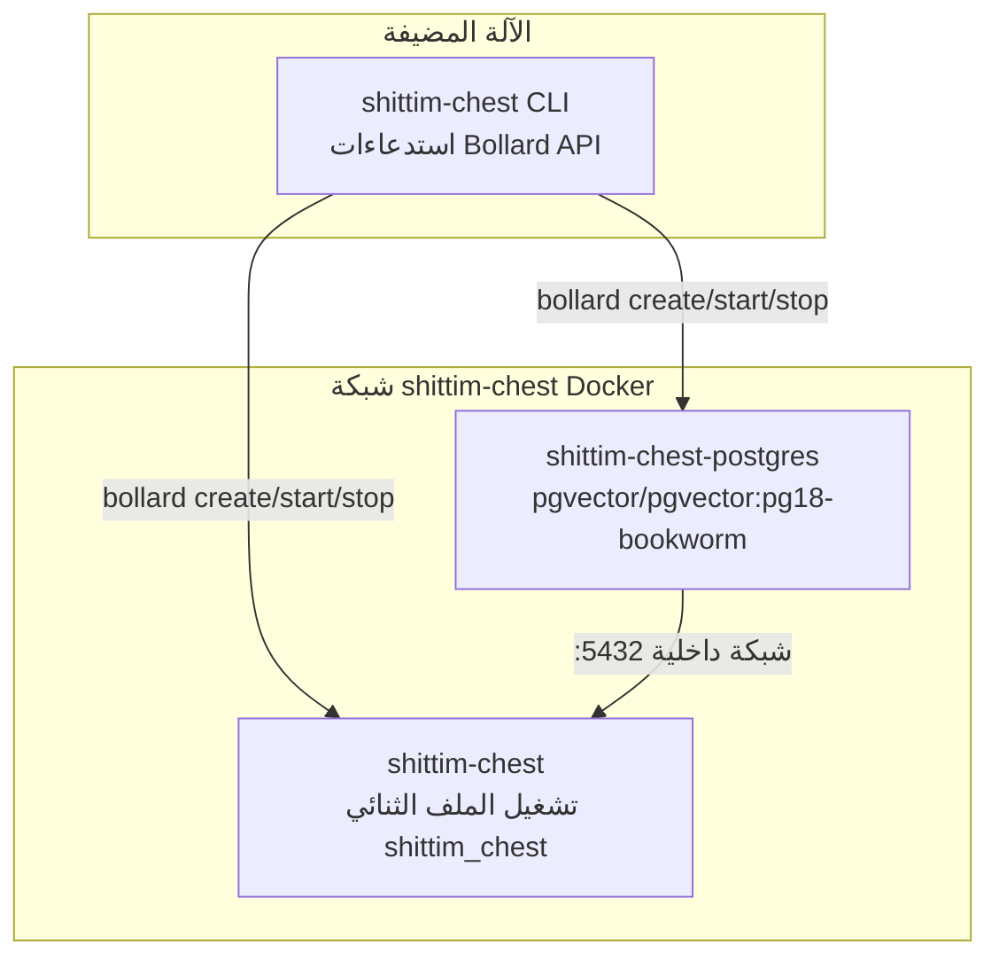

# بنية غلاف CLI: تنسيق Docker المبني على Bollard

## نظرة عامة

`packages/cli/` هو ملف Rust ثنائي يدير دورات حياة الحاويات مباشرة عبر Bollard Docker API، مستبدلًا بالكامل docker-compose وسكريبتات الصدفة. يعمل CLI على الآلة المضيفة، بينما يعمل الملف الثنائي للخادم (`shittim_chest`) داخل الحاويات.

## لماذا لا docker-compose

| البُعد | docker-compose | bollard (النهج الحالي) |
| --- | --- | --- |
| الاعتمادية | يتطلب تثبيت docker-compose مستقل | يعيد استخدام Docker Engine API |
| القابلية للبرمجة | YAML تصريحي، منطق محدود | Rust أصلي، تدفق تحكم تعسفي |
| فحوصات الصحة | depends_on + condition قائم على الأحداث | استطلاع نشط؛ كشف الموت دون مهلات |
| معالجة الأخطاء | خروج الحاوية = فشل | إعادة المحاولة + جمع السجلات + معلومات أخطاء مفصلة |
| تنظيف الموارد | `down -v` الكل أو لا شيء | تنظيف دقيق حسب الحاوية/الشبكة/المجلد |
| التكامل | أداة خارجية | مضمّن كمكتبة، قابل للتوسعة بمنطق أكثر |

## طوبولوجيا الحاويات



## تسمية الحاويات والموارد

| الثابت | القيمة | الغرض |
| --- | --- | --- |
| `NET` | `shittim-chest` | شبكة Docker bridge |
| `PG` | `shittim-chest-postgres` | اسم حاوية PostgreSQL |
| `APP` | `shittim-chest` | اسم حاوية التطبيق |
| `VOL` | `shittim-chest-pgdata` | مجلد بيانات PG |
| `PG_IMG` | `pgvector/pgvector:pg18-bookworm` | صورة PG |
| `RUNTIME_IMG` | `debian:bookworm-slim` | صورة وقت تشغيل وضع التطوير |
| `BUILD_IMG` | `shittim-chest` | صورة بناء وضع الإصدار |

## تعيين الأوامر

| الأمر | السلوك |
| --- | --- |
| `dev [--clean]` | بدء تشغيل لمرة واحدة: بيئة → شبكة → مجلد → PG → cargo build → migrate → إطلاق → بث السجلات |
| `up` | وضع الإصدار: docker build image → migrate → إطلاق في الخلفية (restart=unless-stopped) |
| `down [--clean]` | إيقاف الحاويات (تنظيف اختياري للمجلد + الشبكة) |
| `migrate` | تشغيل db-migrate في حاوية لمرة واحدة (إعادة محاولة حتى 5 مرات، فاصل 2 ثانية) |
| `logs` | متابعة بث سجلات حاوية التطبيق |
| `status` | فحص حالة تشغيل حاويات PG والتطبيق + حالة فحص الصحة |
| `build` | بناء صورة Docker الكاملة (`docker build -t shittim-chest`) |

## انتشار متغيرات البيئة

```text
.env file → dotenvy::from_path_iter → HashMap<String, String>
→ Merge SHITTIM_CHEST_HOST / PORT / DATABASE_URL
→ Vec<String> = ["KEY=VALUE", ...]
→ bollard Config::env()
```

لا يقرأ CLI إعداداته الخاصة من `.env` — فهو فقط يمرر محتوى `.env` الكامل إلى عملية `shittim_chest` داخل الحاوية. تُقرأ كلمات المرور والمنافذ عبر المفتاحين المحددين `SHITTIM_CHEST_DB_PASSWORD` و `SHITTIM_CHEST_PORT`.

## اصطلاحات التسجيل

تُخرج سجلات CLI مباشرة إلى stderr، باستخدام نفس صيغة entelecheia:

- `tracing-subscriber` + `ShortTimer` (صيغة HH:MM:SS)
- وضع مدمج `.compact()`
- `.with_target(false)` إخفاء مسارات الوحدات
- معامل CLI `--log-level` (افتراضي `info`)

## مبادئ التصميم

1. **لا ينفذ CLI منطق الأعمال**: جميع منطق الأعمال يقيم في الملف الثنائي `shittim_chest` داخل الحاوية
1. **الحاويات وحدات غير قابلة للتغيير**: ينشئ CLI/يدمر الحاويات، ولا يعدل الحاويات قيد التشغيل أبدًا
1. **عزل الشبكة**: منفذ PG غير مكشوف للمضيف، يمكن الوصول إليه فقط داخل شبكة Docker الداخلية
1. **استطلاع سلبي لفحوصات الصحة**: لا يعتمد على أحداث Docker (غير موثوقة)؛ يستطلع نتائج inspect مباشرة
