# مسارات النشر مزدوج الأوضاع: التطوير مقابل الإصدار

## نظرة عامة

يدعم shittim-chest وضعين للنشر: التطوير (تكرار سريع محلي، بدون Node، بدون بناء الصور) والإصدار (صورة Docker كاملة مع ملفات ثابتة أمامية مضمنة). يتشارك الوضعان نفس طوبولوجيا الحاويات والشبكة.

## دافع التصميم

يستغرق بناء صورة Docker كاملة (بناء الواجهة الأمامية Node + ترجمة Rust + `embedded-frontend`) أكثر من 30 ثانية، وهو غير مناسب للتكرار اليومي في التطوير. يستفيد وضع التطوير من ذاكرة الترجمة التزايدية Rust على الآلة المضيفة، موصولًا ثنائيًا بالتحميل الربطي في حاوية وقت تشغيل مصغرة لأوقات إعادة تشغيل دون الثانية.

## مقارنة المسار

```mermaid
flowchart TB
    subgraph Dev[مسار التطوير]
        D1[cargo build -p shittim_chest] --> D2[الثنائي: target/debug/shittim_chest]
        D2 --> D3[تحميل ربطي في debian:bookworm-slim]
        D3 --> D4[حاوية قيد التشغيل]
    end
    subgraph Release[مسار الإصدار]
        R1[docker build -t shittim-chest] --> R2[بناء متعدد المراحل]
        R2 --> R3[Node:22-slim بناء الواجهة الأمامية]
        R3 --> R4[Rust:1.85-slim ترجمة + embedded-frontend]
        R4 --> R5[debian:bookworm-slim وقت التشغيل]
        R5 --> R6[حاوية قيد التشغيل]
    end
```



| البُعد | وضع التطوير (`just dev`) | وضع الإصدار (`just up`) |
| --- | --- | --- |
| الواجهة الأمامية | مبنية بواسطة Vite، تُخدم بواسطة الخلفية عبر `just dev` | مضمنة في الثنائي (ميزة `embedded-frontend`) |
| يتطلب Node | نعم (لبناء Vite) | نعم (داخل Docker) |
| مصدر الثنائي | `cargo build` محلي | مُترجم داخل Docker |
| الصورة الأساسية للحاوية | `debian:bookworm-slim` | `debian:bookworm-slim` (نتيجة بناء متعدد المراحل) |
| سرعة إعادة التشغيل | < 5 ثوانٍ (بعد الترجمة التزايدية) | 30-60 ثانية (بناء كامل) |
| حالة الاستخدام | التطوير اليومي، تصحيح الأخطاء | نشر CI/الإنتاج |
| طريقة إطلاق الحاوية | `Config.cmd = ["shittim_chest"]` | الصورة تتضمن ENTRYPOINT |

## تفاصيل تنفيذ وضع التطوير

### الترجمة المحلية

```rust
async fn cargo_build() -> Result<()> {
    Command::new("cargo")
        .args(["build", "-p", "shittim_chest"])
        .status().await?;
}
```

مسار مخرجات الترجمة مثبت عند `$PWD/target/debug/shittim_chest` (ملف تعريف تصحيح debug، مع الاحتفاظ برموز التصحيح).

### إطلاق التحميل الربطي

```rust
let config = Config::<String> {
    image: Some("debian:bookworm-slim".into()),   // وقت تشغيل مصغر
    cmd: Some(vec!["shittim_chest".to_string()]),
    host_config: Some(HostConfig {
        binds: Some(vec![
            format!("{bin_path}:/usr/local/bin/shittim_chest:ro")
        ]),
        network_mode: Some(NET.into()),
        port_bindings: ...,
        ..
    }),
    env: Some(container_env(password, port)),
    ..
};
```

النقاط الرئيسية:

- الثنائي موصول للقراءة فقط (`:ro`) لمنع التعديل العرضي داخل الحاوية
- موقع الثنائي هو `/usr/local/bin/shittim_chest`، يُنفذ مباشرة داخل الحاوية
- الصورة الأساسية `debian:bookworm-slim` توفر وقت تشغيل glibc المطلوب

### تنفيذ التهجير

تُنفذ التهجرات عبر حاوية لمرة واحدة:

```bash
docker run --rm --network shittim-chest \
  -v $PWD/target/debug/shittim_chest:/usr/local/bin/shittim_chest:ro \
  -e SHITTIM_CHEST_DATABASE_URL=... \
  debian:bookworm-slim \
  shittim_chest db-migrate
```

يعيد المحاولة تلقائيًا حتى 5 مرات (فاصل ثانيتين) للتعامل مع الحالة التي لا يكون فيها PG جاهزًا بالكامل بعد.

## تفاصيل تنفيذ وضع الإصدار

### بناء Dockerfile متعدد المراحل

```dockerfile
# المرحلة 1: الواجهة الأمامية → Node:22-slim + pnpm → pnpm build:all → /app/dist/
# المرحلة 2: builder  → Rust:1.85-slim + COPY dist/ → cargo build --features embedded-frontend
# المرحلة 3: runtime  → debian:bookworm-slim + ca-certificates + COPY binary
```

### ميزة embedded-frontend

```rust
# [cfg(feature = "embedded-frontend")]
{
    static FRONTEND_DIR: Dir<'_> = include_dir!("$CARGO_MANIFEST_DIR/../dist");
    // موصولة على Axum Router في مسارات /static/*
}
```

تستخدم هذه الميزة الماكرو `include_dir!` لتضمين مخرجات بناء الواجهة الأمامية في الثنائي وقت الترجمة. في وضع الإصدار، يمكن تقديم SPA كامل بدون وكيل عكسي إضافي.

## تسمية دوال التهجير والإطلاق

لتجنب الالتباس، يميز الكود بوضوح مجموعتين من الدوال:

| مسار التطوير | مسار الإصدار |
| --- | --- |
| `run_migrate_dev()` | `run_migrate_release()` |
| `start_app_dev()` | `start_app_release()` |
| `cargo_build()` | `build_image()` |

## تطوير الواجهة الأمامية

في وضع التطوير، يعيد `dev.py` بناء أصول الواجهة الأمامية عند تغير الملفات. يخدم الخلفية كلًا من الملفات الثابتة و API على نفس المنفذ (:3000 للتطوير، :80 للإنتاج).
