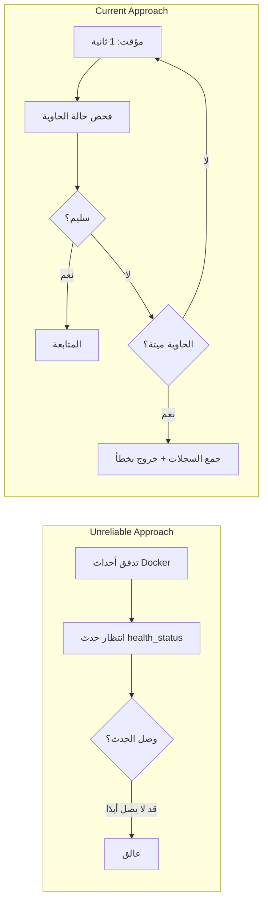

# استراتيجية فحص صحة PostgreSQL

## نظرة عامة

يجب أن يضمن غلاف CLI جاهزية PostgreSQL قبل بدء حاوية التطبيق. يحدد هذا المستند قرارات التصميم وراء استراتيجية فحص الصحة بالاستطلاع السلبي — رفض أحداث Docker (غير موثوقة) والمهلات الثابتة (غير مرنة).

## لماذا لا أحداث Docker



في تدفقات أحداث Docker، مرشح `container` غير موثوق لأحداث `health_status` — خاصة بعد إعادة تشغيل حاوية PG. عمليًا، قد لا تُطلق الأحداث أبدًا، مما يجعل CLI ينتظر إلى ما لا نهاية.

## استراتيجية الاستطلاع

```text
while true:
    sleep 1s
    state = docker.inspect_container(PG)
    if state.health.status == HEALTHY:
        break
    if !state.running:
        bail!(collect_logs(PG))
```

| المعامل | القيمة | المبرر |
| --- | --- | --- |
| فترة الاستطلاع | 1 ثانية | استجابة كافية، لا عبء على inspect |
| المهلة | لا شيء | لا مهلة صارمة؛ قد يكون لدى PG بدء تشغيل بارد |
| كشف الموت | كل استطلاع | غياب الحاوية → خطأ فوري وتفريغ آخر 50 سطرًا من السجلات |

## إعدادات صحة حاوية PostgreSQL

```rust
HealthConfig {
    test:        ["CMD-SHELL", "pg_isready -U shittim_chest"],
    interval:    5_000_000_000,   // 5 ثوانٍ (نانوثانية)
    timeout:     5_000_000_000,   // 5 ثوانٍ
    retries:     10,
    start_period: 30_000_000_000, // 30 ثانية فترة سماح أولية
}
```

| المعامل | القيمة | المبرر |
| --- | --- | --- |
| `pg_isready` | مستوى المستخدم | أكثر موثوقية من كشف منفذ TCP؛ يضمن قبول PG للاتصالات بالكامل |
| `interval: 5s` | معتدل | يتجنب إعادة المحاولات المتكررة وضجيج السجلات |
| `retries: 10` | عالية | التهجير و initdb قد يستغرقان وقتًا؛ محاولات وفيرة |
| `start_period: 30s` | طويلة | يمكن أن يكون بدء تشغيل pg18 initdb الأول بطيئًا |

## مسار تحميل مجلد البيانات

```rust
Mount {
    target: "/var/lib/postgresql",     // مسار pg18 الجديد
    source: "shittim-chest-pgdata",
    typ: MountTypeEnum::VOLUME,
}
```

غيّر pg18 مجلد البيانات من `/var/lib/postgresql/data` إلى `/var/lib/postgresql`. استخدام المسار الخاطئ يتسبب في فشل PG في العثور على البيانات بعد بدء التشغيل.

## إعادة محاولات التهجير

لتهجرات قاعدة البيانات منطق إعادة محاولة مستقل من 5 محاولات:

```text
for retry in 0..5:
    execute docker run --rm ... shittim_chest db-migrate
    if success: break
    sleep 2s
```

حتى بعد عودة `wait_healthy`، قد تفشل التهجرات لأن PG لا يزال ينهي الاسترداد. تعالج إعادة المحاولات القصيرة هذه النافذة الحرجة.

## جمع السجلات

عند تعطل حاوية، تُجمع آخر 50 سطرًا من السجلات تلقائيًا:

```rust
async fn collect_logs(docker: &Docker, name: &str) -> String {
    docker.logs(name, LogsOptions { tail: "50", stdout: true, stderr: true, .. })
}
```

هذا ضروري لتصحيح فشل بدء تشغيل PG — أخطاء initdb، ومشاكل الأذونات، وتعارضات المنافذ، إلخ، تظهر فقط في سجلات الحاوية.
