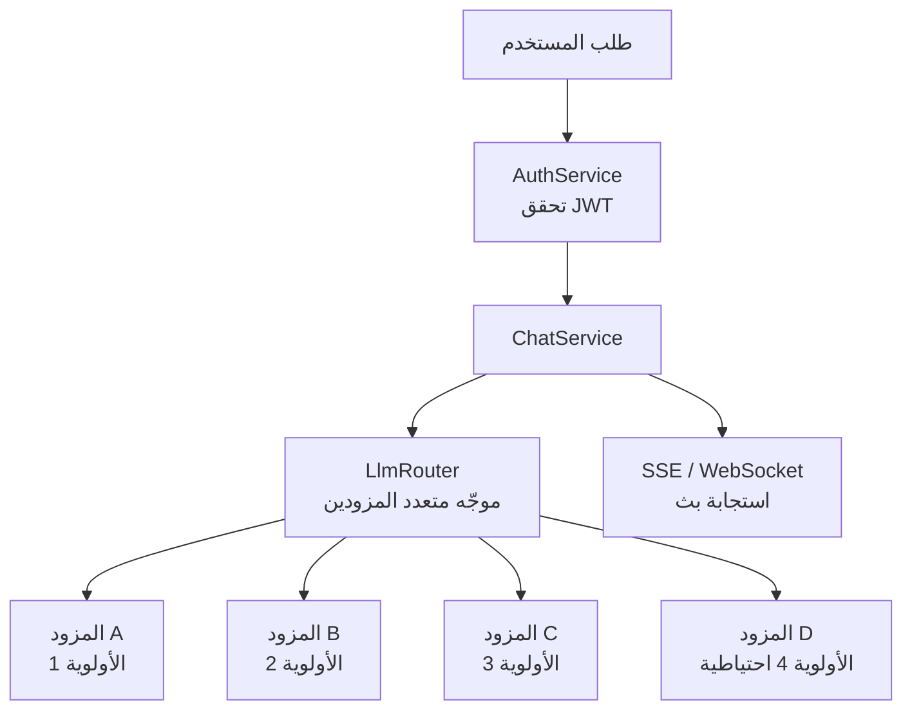
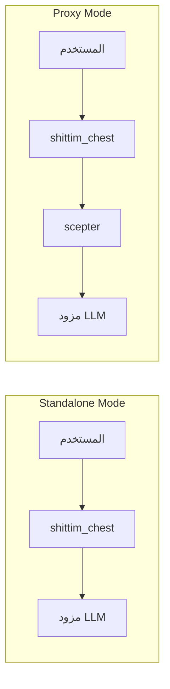

# بنية LLM المستقلة

## نظرة عامة

يملك shittim-chest طبقة توجيه LLM مستقلة بالكامل لا تعتمد على entelecheia. يمكن للمستخدمين إعداد عدة مزودي LLM، ويختار الموجّه المدمج تلقائيًا بناءً على الأولوية والتوفر. هذه هي قدرة التمايز الأساسية لـ shittim-chest ضد Open WebUI.

## البنية



## القدرات الأساسية

### 1. توجيه الأولوية متعدد المزودين

```text
يملك كل مزود حقل أولوية (رقم أقل = أولوية أعلى).
تُجرّب الطلبات من الأعلى إلى الأقل أولوية:
  → المزود A (priority=1) متاح → استخدم
  → غير متاح → المزود B (priority=2) متاح → استخدم
  → غير متاح → ... → أعد خطأ
```

### 2. التجاوز التلقائي

عندما يعيد مزود أعلى أولوية خطأ (مهلة، حد معدل، غير قابل للوصول)، يحول الموجّه تلقائيًا إلى المزود المتاح التالي، بشفافية للمستخدم.

### 3. التخزين المشفر لمفاتيح API

تُشفّر جميع مفاتيح API للمزودين بشكل ثابت بـ AES-256-GCM وتُخزّن في `shittim_chest_db`. يُوفَّر مفتاح التشفير عبر متغير البيئة `ENCRYPTION_KEY`. حتى لو اخترقت قاعدة البيانات، تبقى مفاتيح API غير قابلة للقراءة.

### 4. البث مزدوج البروتوكول

| البروتوكول | النقطة النهائية | حالة الاستخدام |
| --- | --- | --- |
| SSE | `/api/chat/stream` | بث HTTP بسيط، متوافق مع الوكيل، دعم أصلي للمتصفح |
| WebSocket | `/ws/chat/stream` | اتصال ثنائي الاتجاه، يدعم الإلغاء والتفاعل اللحظي |

### 5. توافق OpenAI

تتبع جميع واجهات المزود صيغة OpenAI `/v1/chat/completions`، مما يسمح بالتكامل مع أي خدمة متوافقة مع OpenAI API (DeepSeek، OpenAI، Ollama/LM Studio المحلي، إلخ).

## إدارة المزودين

### مصادر الإعداد

| الطريقة | حالة الاستخدام |
| --- | --- |
| متغيرات البيئة (`LLM_DEFAULT_PROVIDER_*`) | بدء سريع، سيناريوهات مزود واحد |
| CRUD قاعدة البيانات (`/api/providers/*`) | مزودون متعددون، إدارة ديناميكية |
| لوحة إدارة arona | إدارة رسومية |

### المزود البذري

عند بدء التشغيل الأول، إذا كانت متغيرات البيئة `LLM_DEFAULT_PROVIDER_*` مضبوطة، ينشئ `db-init` تلقائيًا مزودًا بذريًا. يمكن إضافة مزودين إضافيين لاحقًا عبر لوحة إدارة arona.

## الوضع المستقل مقابل وضع الوكيل



| الوضع | الشرط | السلوك |
| --- | --- | --- |
| مستقل | scepter غير مُعد (أو `Proxy: disabled`) | ينادي مزود LLM مباشرة |
| وكيل | عنوان scepter URL مُعد | يمرر عبر طبقة الوكيل إلى معالجة وكيل entelecheia |

يقدم الوضع المستقل تجربة محادثة كاملة بالكامل: إدارة المحادثات، استمرارية الرسائل، البحث، التصدير. يضيف وضع الوكيل قدرات تنسيق الوكلاء.

## التنفيذ التقني

- **الموجّه**: `packages/shittim_chest/src/llm/router.rs`، يدعم اختيار الأولوية + التجاوز
- **العميل**: `packages/shittim_chest/src/llm/client.rs`، مبني على `reqwest` + `rustls` (بدون اعتمادية OpenSSL)
- **CRUD المزود**: `packages/shittim_chest/src/api/providers.rs`، نقاط نهاية REST قياسية
- **التشفير**: كريت `aes-gcm`، متغير البيئة `ENCRYPTION_KEY`
