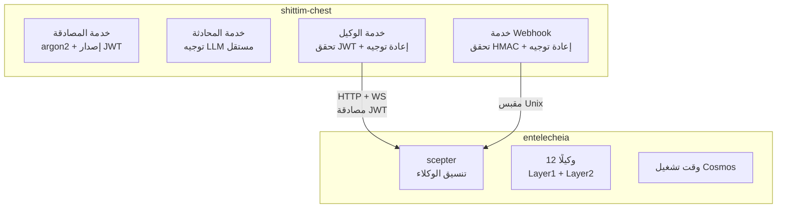

# الاقتران غير المحكم مع entelecheia

## نظرة عامة

يعتمد التكامل بين shittim-chest و entelecheia على جسر وكيل HTTP/WebSocket موثق بـ JWT. يسمح هذا التصميم لـ shittim-chest بالتشغيل بشكل مستقل تمامًا دون entelecheia، مع تمكين قدرات تنسيق الوكلاء عند الطلب عند الحاجة.

## تصميم الحد



## ملكية البيانات

| shittim_chest_db | entelecheia_db |
| --- | --- |
| auth_users (تجزئات كلمات المرور) | user_identities (user_id) |
| sessions (الجلسات النشطة) | groups |
| refresh_tokens | group_memberships |
| oauth_connections | role_assignments |
| api_keys (مفاتيح المزود المشفرة) | group_permissions (حصص المزود) |
| conversations | agent_configs |
| messages | cosmos_state |
| llm_providers (إعدادات المزود) | iepl_state |
| remote_devices (سجلات الأجهزة) | |
| device_sessions | |
| channel_configs | |
| webhook_logs (سجلات التسليم) | |

**المبدأ**: يحتفظ shittim-chest ببيانات "جانب المستخدم"؛ ويحتفظ entelecheia ببيانات "جانب الوكيل". `user_id` هو مفتاح الربط بين الجانبين.

## بروتوكول مصادقة JWT

### مشاركة المفتاح

يتشارك shittim-chest و scepter مفتاح توقيع JWT عبر نفس متغير البيئة `JWT_SECRET`. يمكن لكلا الجانبين التحقق بشكل مستقل من JWTs التي يصدرها الآخر.

### بنية الرمز

```json
{
  "sub": "user-uuid",
  "groups": ["admin", "developer"],
  "exp": 1710000000,
  "iat": 1709996400
}
```

| الحقل | الوصف |
| --- | --- |
| `sub` | UUID المستخدم (مشترك عبر كلتا القاعدتين) |
| `groups` | قائمة المجموعات التي ينتمي إليها المستخدم |
| `exp` | وقت الانتهاء (افتراضي ساعة واحدة) |
| `iat` | وقت الإصدار |

### تدفق تسجيل الدخول

```text
المستخدم → shittim_chest: POST /api/auth/login
shittim_chest: تحقق كلمة مرور argon2
shittim_chest → scepter: GET /api/user/{id}/permissions
scepter → entelecheia_db: استعلم المجموعات والصلاحيات
scepter → shittim_chest: { groups, permissions }
shittim_chest: أصدر JWT (وصول + تحديث)
shittim_chest → المستخدم: الرموز
```

## جسر الوكيل

### وكيل HTTP

```text
المتصفح → shittim_chest:80/api/proxy/chat (JWT في الترويسة)
shittim_chest: تحقق JWT
shittim_chest → scepter:8424/api/chat (أعد توجيه JWT)
scepter → وكيل → LLM → scepter → shittim_chest → المتصفح
```

### وكيل WebSocket

```text
المتصفح → shittim_chest:80/api/proxy/ws (JWT في الترويسة)
shittim_chest: تحقق JWT
shittim_chest ↔ scepter:8424/ws (إعادة توجيه ثنائية الاتجاه + JWT)
المتصفح ↔ scepter: تفاعل وكيل مزدوج الاتجاه بالكامل
```

### تحديد المعدل والمراقبة

في طبقة الوكيل، يكون shittim-chest مسؤولًا عن:

- تحديد المعدل (لكل مستخدم / لكل IP)
- تسجيل الاستخدام
- إدارة دورة حياة الاتصال
- إعادة الاتصال عند الانقطاعات غير الطبيعية

## خط أنابيب Webhook

```text
GitHub/GitLab/Gitee → POST /api/webhook/{source} → تحقق HMAC → تحليل الحدث → مقبس Unix → scepter
```

يتعامل shittim-chest مع تحقق HMAC وتحليل الأحداث؛ ويُطلّق scepter إجراءات الوكلاء بناءً على الأحداث (مثل مراجعة الكود الآلية).

## وضع التشغيل المستقل

عندما لا يكون عنوان scepter URL مُعدًا في متغيرات البيئة أو عندما يكون `SHITTIM_CHEST_SCEPTER_PROXY` مضبوطًا على `disabled`:

- نقاط النهاية `/api/proxy/*` تُعيد 503 (الخدمة غير متاحة)
- نقاط النهاية `/api/devices/*` تُعيد 503
- تستخدم المحادثة LlmRouter المدمج بالكامل
- تعمل جميع الميزات الأخرى (المصادقة، المحادثة، إدارة المزود، دخول webhook) بشكل طبيعي

يتيح هذا نشر shittim-chest كـ WebUI LLM مستقل كامل دون entelecheia.
