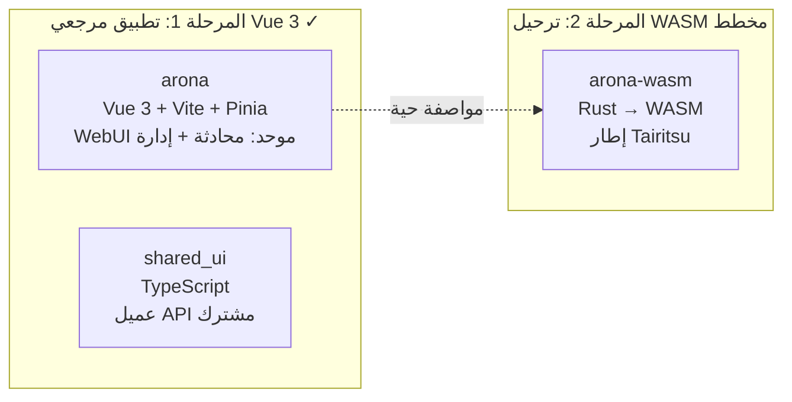
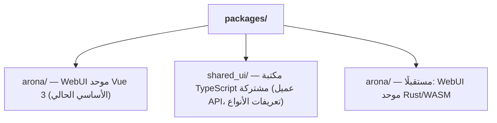

# استراتيجية ترحيل الواجهة الأمامية المزدوجة WASM

## نظرة عامة

يستخدم shittim-chest استراتيجية واجهة أمامية من مرحلتين "Vue 3 أولًا، WASM لاحقًا". تُسلَّم نسخة Vue 3 أولًا كتطبيق مرجعي بجودة الإنتاج، مع ترحيل نسخة Rust/WASM عند نضج الظروف. خلال الفترة التي تعمل فيها كلتا النسختين بالتوازي، يجب أن تنتج تفاعلات المستخدم المتطابقة نتائج متطابقة.

## تفصيل المراحل



## مقارنة حزمة التقنيات

| البُعد | المرحلة 1 (Vue 3) | المرحلة 2 (WASM) |
| --- | --- | --- |
| اللغة | TypeScript / Vue 3 SFC | Rust |
| الإطار | Vite + Pinia + Vue Router | Tairitsu (مطوَّر ذاتيًا) |
| مخرجات البناء | حزمة JS/CSS | ثنائي WASM |
| حجم الحزمة | أكبر | أصغر بكثير |
| أداء وقت التشغيل | جيد | ممتاز (سرعة قريبة من الأصلي) |
| تجربة المطور | HMR فوري | انتظار الترجمة |
| نضج النظام البيئي | ناضج | مرحلة مبكرة |

## مبدأ "المواصفة الحية"

نسخة Vue 3 ليست مجرد تنفيذ مؤقت؛ بل تعمل كـ **مواصفة قابلة للتنفيذ** لترحيل WASM:

1. **اكتمال الميزات**: يجب أن تتصرف كل ميزة في نسخة WASM بشكل مطابق لنسخة Vue 3
1. **عقد API**: تستخدم كلتا النسختين نفس REST API وبروتوكول WebSocket
1. **اتساق بصري**: تعرض كلتا النسختين نفس واجهة المستخدم في حالات متطابقة
1. **استبدال تدريجي**: يمكن ترحيل ميزات المحادثة والإدارة في arona إلى WASM بشكل مستقل

## عتبات قرار ترحيل WASM

لن يبدأ الترحيل إلى WASM قبل نضج الظروف. عتبات القرار:

| الشرط | الوصف |
| --- | --- |
| نضج إطار Tairitsu | يجب اكتمال مكتبة المكوّنات والتوجيه وإدارة الحالة و i18n والبنية التحتية الأخرى |
| تغطية نظام WASM البيئي | يجب أن يدعم `web-sys` / `wasm-bindgen` واجهات Web APIs المطلوبة |
| عرض النطاق التطويري | عدد كافٍ من الأشخاص للحفاظ على كلتا النسختين أثناء التقدم في الترحيل |
| متطلبات الأداء | تواجه نسخة Vue 3 اختناقات أداء في سيناريوهات العالم الحقيقي |

## بنية حزمة الواجهة الأمامية



يحتوي `shared_ui/` على كود الواجهة الأمامية المشترك:

- عميل API (المصادقة، المحادثة، إدارة المزود، إلخ)
- أدوات المصادقة (تخزين JWT، التحديث، المعترضات)
- تعريفات الأنواع (تعدادات النطاق، أنواع الطلب/الاستجابة)

## أوامر تطوير الواجهة الأمامية

```bash
just build-frontend  # بناء كلتا الواجهتين الأماميتين (pnpm build:all)
dev.py               # مراقبة + إعادة بناء تلقائية عند تغير الملفات
```

في وضع التطوير، يراقب `dev.py` الملفات المصدر ويشغل `pnpm build` عند التغييرات. تخدم الخلفية كلًا من الأصول الثابتة ونقاط نهاية API على نفس المنفذ — لا حاجة إلى خادم تطوير منفصل أو وكيل.

## مبادئ التصميم

1. **تسلّم Vue 3 الميزات أولًا**: لا تنتظر WASM. يمكن للمستخدمين استخدام واجهة محادثة وإدارة كاملة الميزات اليوم.
1. **WASM تحسين، لا استبدال**: لا يؤثر الترحيل على المستخدمين الحاليين — تستخدم كلتا النسختين نفس واجهة الخلفية API.
1. **خلفية مستقلة عن الإطار**: خلفية `shittim_chest` لا تدرك تنفيذ الواجهة الأمامية. يمكن لأي عميل HTTP/WS التكامل.
1. **Tairitsu اعتمادية، لا تطوير داخلي**: يعتمد بدء ترحيل WASM على نضج إطار Tairitsu الخارجي.
