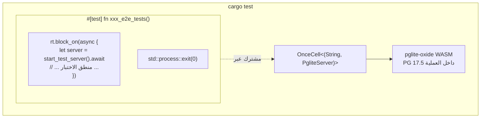

# قاعدة بيانات اختبار مضمنة (pglite-oxide)

## نظرة عامة

يستخدم shittim-chest [pglite-oxide](https://crates.io/crates/pglite-oxide) كـ PostgreSQL مضمن لجميع اختبارات التكامل و E2E. لا حاجة إلى Postgres خارجي أو Docker أو `testcontainers` — تعمل الاختبارات بأمر `cargo test` واحد على أي جهاز.

## دافع التصميم

سابقًا، اعتمدت اختبارات التكامل على `postgresql_embedded`، الذي يحمّل ثنائي PostgreSQL كاملًا (~100 ميجابايت) وقت التشغيل. تسبب هذا في بدء تشغيل بطيء، وفشل خاص بالمنصة، وتقلب في CI. يحزم pglite-oxide PostgreSQL 17.5 كوحدة WASM عبر وقت تشغيل wasmer — داخل العملية، محمول، وسريع (~96 مللي ثانية بدء تشغيل بارد).

## البنية



## القرارات الرئيسية

| القرار | المبرر |
| --- | --- |
| `pglite-oxide` (WASM) بدلًا من `postgresql_embedded` (ثنائي أصلي) | لا تحميل ~100 ميجابايت، لا ثنائي PG خاص بالمنصة، ~96 مللي ثانية بدء تشغيل |
| `pglite-oxide` بدلًا من `pglite-rust-bindings` | منشور على crates.io (v0.5.0)، بدء تشغيل أسرع، واجهة builder ناضجة مع دعم الامتدادات |
| `tower::ServiceExt::oneshot` بدلًا من `reqwest` | يتجنب جمود وقت تشغيل tokio بين مهام خلفية لتجمع sqlx وخادم hyper HTTP |
| مشغل `#[test]` واحد مع `std::process::exit(0)` | يُطلق تجمع `PgPool` في sqlx مهام خلفية مستمرة (منظف الخمول، فحوصات الصحة) تبقي وقت تشغيل tokio حيًا. يتجاوز `exit(0)` هذا التعليق |
| `max_connections=1` | قيد أساسي في PGlite — اتصال واحد فقط |
| `OnceCell<(String, PgliteServer)>` | مثيل PG مشترك عبر الاختبارات الفرعية في نفس تشغيل الثنائي؛ يجب أن يبقى `PgliteServer` حيًا (غير مُسقَط) |
| `pglite-oxide` في `[dev-dependencies]` فقط | يجب ألا يتسرب وقت تشغيل wasmer إلى بنيات الإنتاج |

## نمط هارنس الاختبار

```rust
// tests/common/mod.rs
static PG: OnceCell<(String, PgliteServer)> = OnceCell::const_new();

async fn ensure_pg_url() -> String {
    PG.get_or_init(|| async {
        let server = PgliteServer::builder()
            .start()
            .expect("Failed to start pglite-oxide");
        let url = server.database_url();
        // اتصال، تشغيل التهجرات، إغلاق الاتصال الأولي
        (url, server)
    }).await.0.clone()
}

pub async fn start_test_server() -> TestServer {
    let db_url = ensure_pg_url().await;
    let db = Database::connect(/* max_connections=1 */).await;
    // بناء AppState، Router، إعادة TestServer ملفوف حول tower oneshot
}
```

```rust
// tests/xxx_tests.rs
# [test]
fn xxx_e2e_tests() {
    let rt = tokio::runtime::Runtime::new().unwrap();
    rt.block_on(async {
        let mut server = common::start_test_server().await;
        // ... جميع الاختبارات الفرعية باستخدام server.request() ...
    });
    std::process::exit(0);
}
```

## الجداول المُنشأة

تُنشأ جميع الجداول الـ 13 عبر تهجرات SeaORM أثناء إعداد الاختبار:

`auth_users`, `sessions`, `api_keys`, `oauth_connections`, `channel_configs`, `channel_messages`, `channel_pairings`, `conversations`, `messages`, `llm_providers`, `remote_devices`, `device_sessions`, `system_settings`, `workspace_sessions`

## قيود PGlite

1. **اتصال واحد**: يجب أن يكون `max_connections` بقيمة 1. تجمعات متعددة إلى نفس مثيل PGlite ستعلق.
1. **تحويل صارم للأنواع**: PGlite أصرم من PostgreSQL القياسي. ستفشل استعلامات مثل `uuid_column = text_value` — حوّل صراحةً دائمًا.
1. **لا مشغلات اختبار متزامنة**: يجب أن تعمل جميع الاختبارات غير المتزامنة التي تتشارك مثيل PGlite واحدًا بشكل تسلسلي داخل دالة `#[test]` واحدة.
1. **تعليق التجمع عند الإسقاط**: قد يعلق `sqlx::PgPool::close()` إلى ما لا نهاية. استخدم `std::process::exit(0)` لإنهاء عملية الاختبار.
