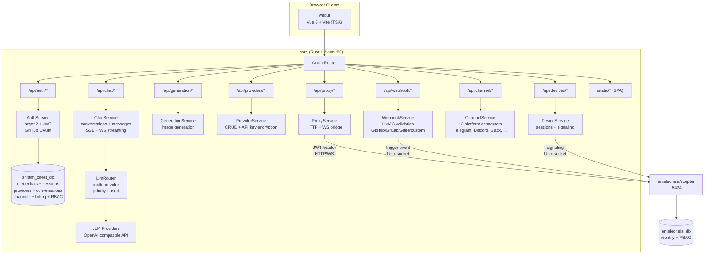
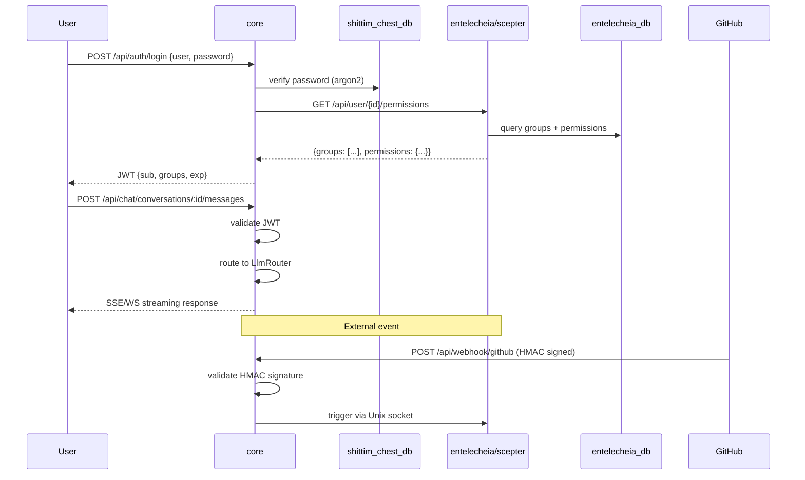

# الهندسة المعمارية

> **الإصدار**: 0.1.0 — تطوير نشط.
> **آخر تحقق**: 2026-06-14
> هذا المشروع هو الغلاف الموجّه للمستخدم لـ [entelecheia](https://github.com/celestia-island/entelecheia).

## النطاق

shittim-chest مستودع أحادي هجين Cargo + pnpm. يملك الطبقة الموجّهة للمستخدم التي تغلف نواة تنسيق الوكلاء في entelecheia. يتواصل المشروعان عبر HTTP/WebSocket بمصادقة JWT — لا يصل shittim-chest أبدًا مباشرةً إلى قاعدة بيانات entelecheia لعمليات الوكلاء.

| المكوّن | التقنية | الدور | الحالة |
| --- | --- | --- | --- |
| **core** | Rust + Axum | خلفية موحدة: مصادقة (JWT + OAuth)، توجيه LLM مستقل، واجهة برمجة تطبيقات دردشة، توليد صور، دخول webhook، وكيل scepter، إشارات الأجهزة البعيدة، تكاملات القنوات، الفوترة، RBAC، مساحات العمل | 🟢 مُنفّذ |
| **cli** | Rust | منسّق Docker: dev, up, down, migrate, logs, status | 🟢 مُنفّذ |
| **webui** | Vue 3 + Vite (TSX) | الواجهة الأمامية: سطح الدردشة، لوحة الإدارة (20+ عرض)، طوبولوجيا SCADA ثنائية الأبعاد، معاينة مجسمة ثلاثية الأبعاد | 🟡 جزئي |
| **أنواع البروتوكول** | Rust (كرات `arona`) + ts-rs | أنواع بروتوكول JSON-RPC 2.0 المقدّمة من كرات `arona` git الخارجي؛ روابط TS يستهلكها webui | 🟢 مُنفّذ |
| **إضافات IDE** | TS + Kotlin + Rust + Lua | VS Code، IntelliJ، Zed، Neovim، جسر LSP | 🟡 وظيفي |
| **تطبيقات Tauri** | Rust + Tauri | سطح المكتب، الجوال، DTOs مشتركة | 🟡 وظيفي |
| **harmony** | ArkTS | تطبيق HarmonyOS | 🟡 وظيفي |

## مخطط الهندسة المعمارية

### تفاصيل خلفية core



### التواصل عبر المشاريع



## وحدات الخلفية

تعيش جميع الوحدات تحت `packages/core/src/`. الخلفية حوالي 34 ألف سطر عبر 135 ملف Rust (138 بما فيها ملفات الاختبار).

### المصادقة (`packages/core/src/auth/`)

مُنفّذة بالكامل:

- تسجيل ودخول باسم المستخدم/كلمة المرور مع تجزئة argon2
- نظام رموز الوصول والتحديث JWT مع التدوير
- تكامل GitHub OAuth 2.0 (إعادة توجيه + استدعاء، ينشئ المستخدمين تلقائيًا)
- إدارة الجلسات (CRUD على جدول `sessions`)
- وسيط التحقق من الرمز المستخدم عبر جميع المسارات

### الدردشة (`packages/core/src/chat/`)

مُنفّذة بالكامل:

- CRUD المحادثات (إنشاء، قائمة، الحصول، تحديث، حذف)
- إرسال/استقبال الرسائل مع توجيه LLM
- استجابات SSE (Server-Sent Events) المتدفقة (`/api/chat/stream`)
- بث WebSocket (`/ws/chat/stream`)
- بحث الرسائل (`/api/chat/search?q=`) مع ILIKE
- تصدير المحادثات (`/api/chat/conversations/:id/export?format=json|md`)

### LLM (`packages/core/src/llm/`)

مُنفّذة بالكامل:

- عميل HTTP متوافق مع OpenAI للدردشة وتوليد الصور
- موجّه متعدد المزودين مع اختيار قائم على الأولوية
- CRUD المزودين مع تشفير مفاتيح API (AES-256-GCM)
- نقاط نهاية قائمة النماذج واختبار المزود
- مهلة الطلب وتكوين المخزن المؤقت المتدفق

### التوليد (`packages/core/src/generation/`)

مُنفّذة بالكامل:

- نقاط نهاية توليد الصور (`/api/generation/images`، `/api/generation/models`)
- يستخدم مزودي LLM المكوَّنين

### Webhook (`packages/core/src/webhook.rs`)

مُنفّذة بالكامل (~1000+ سطر):

- webhook GitHub مع تحقق HMAC-SHA256
- webhook GitLab مع تحقق الرمز
- webhook Gitee مع HMAC + احتياطي الرمز
- نقطة نهاية webhook مخصصة (`/api/webhook/custom/{name}`)
- كشف التسليم المكرر (ذاكرة تخزين مؤقت LRU، حتى 10,000 معرّف)
- سجل التسليم مع واجهة برمجة تطبيقات للقائمة
- نظام القائمة البيضاء لعناوين IP لمصادر webhook (ملف `webhook_ip_whitelist.rs` منفصل)
- توجيه المحفّزات إلى scepter عبر مقبس Unix

### الأجهزة (`packages/core/src/devices/`)

ترحيل الإشارات مُنفّذ (يتطلب scepter خارجيًا لمصافحة WebRTC):

- نقاط نهاية REST لقائمة الأجهزة، التفاصيل، CRUD الجلسات
- ترحيل إشارات WebSocket لـ WebRTC — يحوّل عروض SDP/مرشحي ICE إلى scepter عبر مقبس Unix؛ يجب أن تأتي إجابة SDP من scepter (`forward_sdp_to_scepter` يعيد سلسلة فارغة إذا كان scepter غير قابل للوصول)
- ترحيل الطرفية (عبر WebSocket إلى xterm.js) — يحوّل ضغطات المفاتيح إلى scepter
- ترحيل إطارات سطح المكتب
- خلفية متصفح ملفات SFTP
- قابل للتكوين: أقصى جلسات لكل مستخدم، حجم مخزن الإطار المؤقت، خوادم ICE
- إدارة نموذج الجهاز (وحدة `device_models/`)

> **الفجوة:** الترحيل حقيقي لكن لا يمكنه إكمال مصافحة WebRTC دون نسخة scepter قيد التشغيل. عندما يكون scepter معطّلًا، تكون إجابات SDP فارغة ويفشل WebRTC بأمان.

### القنوات (`packages/core/src/channel/`)

مُنفّذة بالكامل (22 ملف وحدة + `mod.rs`):

- 12 موصل منصة: Telegram، Discord، Slack، Lark/Feishu، QQ Bot، WeCom، IRC، Matrix، Mattermost، Google Chat، Microsoft Teams، LINE
- تنفيذات عميل API حقيقية لكل منصة
- ضوابط سياسة الرسائل المباشرة (`dm_policy.rs`)
- تحديد المعدل (`rate_limit.rs`)
- فحص الصحة (`health_check.rs`)
- اقتران القنوات (`pairing.rs`)
- نظام الإضافات (`plugin.rs`)
- تخزين بيانات اعتماد مشفّر (`crypto.rs`)
- سجل مركزي (`registry.rs`) ومسارات (`routes.rs`)

### وحدات خلفية إضافية

| الوحدة | الوصف |
| --- | --- |
| `proxy/` | جسر Scepter HTTP/WS (`ws_bridge.rs` هو أكبر ملف واحد في قاعدة الكود) |
| `rbac/` | التحكم في الوصول القائم على الأدوار |
| `workspace/` | إدارة مساحات العمل |
| `oauth.rs` | تكامل مزود OAuth |
| `billing.rs` | تكامل دفع Stripe (تحقق HMAC لـ webhook، أحداث الخروج/الاشتراك، إنفاذ الحصص، إلغاء تكرار الدفع) |
| `container/` | إدارة حاويات Docker |
| `cruise/` | دعم التحكم الآلي (Cruise) |
| `audio/` | دعم خدمة الصوت/الصوت |
| `skills.rs` | **كعب** — يعيد مصفوفة فارغة؛ لا دعم قاعدة بيانات أو تكامل scepter بعد |
| `tools.rs` | **كعب** — يعيد مصفوفة فارغة؛ لا دعم قاعدة بيانات أو تكامل scepter بعد |
| `system_settings.rs` | تكوين النظام |
| `trigger_forward.rs` | توجيه محفّزات الأحداث |
| `quota_guard.rs` / `resource_quotas.rs` | إنفاذ حصص الموارد |
| `avatar_platforms.rs` | تكامل منصة الصور الرمزية |

### قاعدة البيانات

PostgreSQL عبر SeaORM 1.x مع **5 ترحيلات** و **25 نموذج كيان**:

`auth_users`، `avatar_platforms`، `channel_configs`، `channel_messages`، `channel_pairings`، `channel_plugins`، `conversations`، `cruise_history`، `device_models`، `device_sessions`، `llm_providers`، `messages`، `oauth_connections`، `payment_events`، `projects`، `rbac_grants`، `rbac_groups`، `rbac_user_groups`، `remote_devices`، `scene_configs`، `sessions`، `system_settings`، `webhook_deliveries`، `workspace_alias_registry`، `workspace_sessions`

## الواجهة الأمامية

### webui (`packages/webui/`)

واجهة Vue 3 + Vite الأمامية مكتوبة بـ TSX (عبر `@vitejs/plugin-vue-jsx` — لا ملفات `.vue` SFC). حزمة npm: `@celestia-island/webui`. حوالي 31 ألف سطر.

#### العروض

| مجموعة العروض | الوصف |
| --- | --- |
| `demiurge/` | سطح الدردشة الرئيسي (DemiurgeView) — استجابات متدفقة، حالة الوكيل، استدعاءات الأدوات |
| `auth/` | LoginView، RegisterView، SetupView |
| `admin/` | 20+ عرض إداري: لوحة المعلومات، المزودون، الوكلاء، RBAC، Webhooks، القنوات، النظام، نماذج الأجهزة، إعدادات الأجهزة، المهارات، أدوات MCP، مزودو OAuth، استخدام الرموز، مساحات العمل، خدمة الصوت، حصة الموارد، إلخ. |
| `topology/` | طوبولوجيا SCADA ثنائية الأبعاد: TopologyOverview، TopologyBoxDetail، TopologyDeviceDetail. النقل حقيقي (WS JSON-RPC محوّل إلى scepter)؛ **بدون scepter، يتراجع TopologyOverview إلى `SIMULATED_DEVICES` المُشفر ثابتًا (19 جهاز تجريبي) وشرائح قياس صينية؛ يعرض TopologyBoxDetail حالة فارغة** |
| `holographic/` | معاينة مجسمة ثلاثية الأبعاد: HolographicOverview، HolographicBoxZoom، HolographicModelDetail. **تحميل نموذج ثلاثي الأبعاد حقيقي** (يحمّل ملفات GLB فعلية، مشاريع، تكوينات المشهد من الخلفية المحلية)؛ شرائح معاملات القياس تتطلب scepter، تتراجع إلى فارغة عند الفشل |

#### نظام المكوّنات

| الدليل | الوصف |
| --- | --- |
| `base/` | 50+ مكوّن نظام تصميم ببادئة `S` (SButton، SCard، SModal، STable، STabs، STimeline، STreeView، SMarkdownRenderer، SMorphingTabs، إلخ) |
| `chat/` | مكوّنات خاصة بالدردشة (ChatBubble، AgentStatusBar، FloatingChatBar، ThinkingDots، ReportViewer، NodeMinimap، إلخ) |
| `header/` | مكوّنات الترويسة (شريط فتات الخبز، تبديل الوضع) |
| `layout/` | غلاف التطبيق (SAppShell، SSidebar، SDrawer، SWallpaperRenderer، إلخ) |
| `preview/` | مكتبة رموز SCADA، طوبولوجيا، مكوّنات مجسمة |
| `cruise/` | مكوّنات سير عمل التحكم الآلي |
| `panels/`، `popups/`، `shared/` | واجهة مستخدم مساندة |

#### نظام الحركة

كل الحركة المدفوعة بـ CSS وأخذ العينات لكل إطار في webui تمر عبر **حلقة rAF مشتركة واحدة** يملكها `packages/webui/src/theme/animationBus.ts` — "سياق الحركة" المتوقع من كل مربع حوار، نافذة منبثقة، قائمة، درج، توست، وانتقال قائمة التسجيل معه. الناقل هو مفرد على مستوى العملية؛ يطفئ نفسه عند الخمول ويدور فقط عندما يكون هناك عمل قيد التنفيذ، لذا التبويب الخامل لا يحرق الإطارات.

يعرض الناقل أربعة واجهات تسجيل عمل بالإضافة إلى علمين قنوات جانبية:

| الواجهة | الغرض | نموذج الإطار |
| --- | --- | --- |
| `onFrame(cb, priority?)` | تسجيل استدعاء لكل إطار. `priority` ∈ `sync` / `normal` / `idle`. يعيد `{ disconnect() }`. | يُستدعى كل إطار (sync)، مُخفَّض إلى ميزانية ~30 Hz (normal)، أو ميزانية ~0.5 Hz (idle). |
| `onceFrame(cb)` | تشغيل استدعاء على الإطار التالي، ثم فصل تلقائي. أطلق وتنسَ (لا مقبض إلغاء). | طلقة واحدة. |
| `scheduleFrame(cb)` | تشغيل استدعاء على الإطار التالي؛ يعيد `{ disconnect() }` للإلغاء قبل إطلاقه. لنمط التخفيض "ادمج عدة استدعاءات في استدعاء واحد بعد الإطار" (يستبدل الصناعة اليدوية `if(rafId)cancel; rafId=rAF(cb)`). | طلقة واحدة (قابلة للإلغاء). |
| `reportTransition(durationMs)` | **تصريحي**: صرّح "انتقال CSS بمدة N قيد التنفيذ" دون استدعاء لكل إطار. يبقي الناقل حلقته حية للنافذة لكي لا يُعلَّق المراقبون الذين يأخذون عينات `onFrame` منتصف الانتقال. | صفر تكلفة لكل إطار؛ حالة فقط. |
| `notifyScrollStart()` | خلال نافذة تمرير 150 ms، كبح استدعاءات الأولوية `normal` (يوفر الطاقة؛ sync و idle غير متأثرين). | علم قناة جانبية. |
| `setReducedMotion(flag)` | يحترم `prefers-reduced-motion` للمستخدم / صنف `html.reduce-motion` — يوقف حلقة **الحركة** أثناء الضبط. الطلقات الواحدة (`onceFrame` / `scheduleFrame`) هي عمل مساعد (قياسات، تدفقات)، وليست حركة، لذا تستمر في التصريف على مُصفّر rAF منفصل ولا تتوقف أبدًا. | علم قناة جانبية. |

طبقة التركيب فوق الناقل هي `packages/webui/src/composables/useReportedTransition.ts`. **هذا هو السطح المفضل** لأي مكوّن يشغّل `transition` / `animation` بـ CSS باستخدام رموز `--duration-*` المشتركة. يلغي تلقائيًا عند إلغاء تحميل المكوّن ويدمج التبديلات السريعة. يتتبع الناقل الخط الزمني؛ تقوم CSS بالعمل البصري؛ يبقى الاثنين متزامنين عبر الرموز المشتركة.

```ts
// single-transition component (dialog opens OR closes — mutually exclusive)
const anim = useReportedTransition(300);
function onBeforeEnter() { anim.run(); }
function onAfterEnter()  { anim.cancel(); }

// overlapping transitions (e.g. a TransitionGroup whose items enter AND leave
// at the same time) — split by track so a leave's run() can't cancel an
// in-flight enter's report:
const anim = useReportedTransition(300);
const enter = anim.track("enter");
const leave = anim.track("leave");
//   onBeforeEnter={enter.run} onAfterEnter={enter.cancel}
//   onBeforeLeave={leave.run} onAfterLeave={leave.cancel}
```

ناقل DOM مفصول عمدًا عن **`packages/webui/src/composables/three/animationBus3D.ts`**، الذي يملك حلقة rAF الخاصة به لخط أنابيب عرض three.js. يجب ألا يؤثر توقيت إطار ثلاثي الأبعاد أبدًا على جدولة انتقال DOM والعكس صحيح؛ يمكن إيقاف أو تنقيح الاثنين بشكل مستقل. كلاهما يعرض نفس شكل `onFrame → { disconnect }`.

**رموز الحركة** (`packages/webui/src/theme/theme.scss`) هي المصدر الوحيد للحقيقة للمدة/التسهيل: `--duration-instant/short/normal/long` للحركة، `--duration-fade` لخفوت العتامة/اللون، و`--ease-spring/out-expo/in-expo/standard` للمنحنيات. `prefers-reduced-motion` / `html.reduce-motion` يطوي رموز الحركة إلى `0s` لكن **يحافظ متعمدًا على `--duration-fade` غير صفر** — كبح *الحركة* المُحفِّزة للدهليزي وليس خفوت عتامة تغيير الحالة هو السلوك الصحيح للوصول. استخدم دائمًا `reportTransition(--duration-*)` لكي يطابق خط زمني الناقل لانتقال CSS خط زمنه البصري.

**التغطية**: كل تأجيل rAF ثنائي الأبعاد-DOM في webui يمر الآن عبر الناقل — `onFrame` / `reportTransition` للحركة المستمرة، `onceFrame` / `scheduleFrame` لتأجيلات المساعدة أحادية الطلقة (قياسات، إعادة حسابات مُخفَّضة، تدفقات مجمّعة). مواقع استدعاء `requestAnimationFrame` الخام المتبقية الوحيدة هي خط أنابيب ثلاثي الأبعاد (`composables/three/*`، الذي يملك `animationBus3D.ts` الخاص به) وجدولة الحلقة الداخلية للناقل نفسه؛ كلاهما مقصود. يجب ألا يستدعي العمل الجديد `requestAnimationFrame` مباشرة — اختر واجهة الناقل المناسبة.

#### مسارات الاستيراد

يستهلك webui مصدر `src/` الخاص به عبر **اسمي مسار مستعار مميزين عمدًا** (كلاهما معلن في `vite.config.ts` + `tsconfig.json`)، وكل قاعدة الكود تطيع الانقسام:

| الاسم المستعار | يحل إلى | استخدمه لـ |
| --- | --- | --- |
| `@/<path>` | `src/*` | **الاستيرادات العميقة الداخلية** — الوصول إلى وحدة محددة مباشرةً (`@/api/client`، `@/composables/useReportedTransition`، `@/theme/animationBus`). ~600 موقع؛ لا يُستخدم أبدًا كبرميل عارٍ. |
| `@celestia-island/shared_ui` | `src/` (← برميل `src/index.ts`) | **سطح API العام المُختار فقط** — دائمًا المُحدِّد العاري، أبدًا مسار فرعي للكود. ~92 موقع. |

يفرض الانقسام حدًا عامًا/خاصًا (مثل خريطة `exports` للحزمة): البرميل (`src/index.ts`) هو الشيء الوحيد القابل للاستيراد "كحزمة"، بينما يتيح `@/` للكود الداخلي الوصول لوحدات التنفيذ. تعامل مع البرميل كعقد — أضف إلى `src/index.ts` عندما يكون الشيء مخصصًا للعلنية. أصول نظام التصميم المشتركة (`theme/*.scss`، `res/*`) قابلة للوصول أيضًا تحت نطاق أسماء `shared_ui`. الاسم المستعار القديم `@shared_ui` هو نسخة مكررة من `@celestia-island/shared_ui` لا يزال مُشارًا إليه بواسطة بعض عبارات `@use` في SCSS؛ الكود الجديد يجب أن يستخدم `@celestia-island/shared_ui`.

### أنواع البروتوكول (كرات `arona`)

أنواع بروتوكول JSON-RPC 2.0 والتعدادات المشتركة مقدّمة من كرات [`arona`](https://github.com/celestia-island/arona) Rust الخارجي، المصرّح عنه كاعتماد git في `Cargo.toml`. يشتق الكرات روابط `ts-rs` المُولَّدة في `packages/webui/src/types/arona/` ويستهلكها webui عبر اسم المسار المستعار `@celestia-island/arona`.

### لوحة الإدارة

تعيش عروض الإدارة داخل webui تحت مجموعة مسار `admin/`: لوحة المعلومات، المزودون (CRUD + معالج إضافة مزود)، الوكلاء، تفاصيل الوكيل، RBAC (مجموعات + منح)، Webhooks، القنوات، النظام، نماذج الأجهزة، إعدادات الأجهزة، المهارات، أدوات MCP، مزودو OAuth، استخدام الرموز، مساحات العمل، خدمة الصوت، حصة الموارد.

### التدويل (i18n)

يستخدم webui **`vue-i18n`** (وليس تنفيذًا مخصصًا) مع **11 لغة محلية مُصرَّح عنها**: العربية (`ar`)، الألمانية (`de`)، الإنجليزية (`en`)، الإسبانية (`es`)، الفرنسية (`fr`)، اليابانية (`ja`)، الكورية (`ko`)، البرتغالية (`pt`)، الروسية (`ru`)، الصينية المبسطة (`zhs`)، الصينية التقليدية (`zht`).

كل لغة محلية لديها **17 ملف JSON بمساحة أسماء** (admin, auth, chat, cmd, common, devices, errors, footer, help, logs, models, reports, skills, timeline, tokenUsage, tools, workspace). تبديل اللغة داخل التطبيق متاح عبر منتقي اللغة في الترويسة.

> **اكتمال الترجمة يختلف بشكل كبير** (مُدقَّق مقابل 950 مفتاح مرجعي إنجليزي):
> | الطبقة | اللغات المحلية | العبور الإنجليزي | فجوة المفاتيح |
> |------|---------|-------------------|---------|
> | مُترجمة جيدًا | `ja`، `ko`، `zhs`، `zht` | ~5% | `zhs` يفتقد 18 مفتاح؛ البقية يفتقدون 112 |
> | مُترجمة في الغالب | `de`، `fr`، `pt`، `es`، `ar` | ~9–14% | تفتقد كتلة 112 مفتاح المشتركة |
> | غير مُترجمة فعليًا | `ru` | **~76%** | تكافؤ مفاتيح كامل، لكن القيم إنجليزية حرفية |
> تغطي فجوة الـ 112 مفتاح المشتركة الميزات الأحدث: `admin.agents.*`، `admin.deviceModels.*`، `admin.projects.*`، `admin.rbac.*`، `admin.resourceQuota.*`، `auth.protocol.*`، `chat.cruise.*`، `chat.voice_*`.

## هندسة RBAC

### تقسيم البيانات

ملكية البيانات مقسومة بين المشروعين للحفاظ على حدود نظيفة:

| البيانات | قاعدة البيانات | المالك | المنطق |
| --- | --- | --- | --- |
| بيانات اعتماد المستخدم (تجزئة كلمة المرور، OAuth، مفاتيح API) | shittim_chest_db | shittim-chest | طبقة العرض تملك تدفق تسجيل الدخول |
| الجلسات النشطة، رموز التحديث | shittim_chest_db | shittim-chest | إدارة الجلسات اهتمام الواجهة الأمامية |
| المحادثات، الرسائل | shittim_chest_db | shittim-chest | بيانات الدردشة موجّهة للمستخدم |
| تكوينات مزود LLM | shittim_chest_db | shittim-chest | إدارة المزودين موجّهة للمستخدم |
| تكوينات القنوات، الفوترة، مساحات العمل | shittim_chest_db | shittim-chest | بيانات تشغيلية موجّهة للمستخدم |
| هوية المستخدم، المجموعات، تعيينات الأدوار | entelecheia_db | entelecheia | نواة التنسيق تنفّذ الصلاحيات |
| GroupPermissions (حصص المزودين، قوائم الوكلاء البيضاء) | entelecheia_db | entelecheia | سياسة مستوى الوكيل تعيش مع الوكلاء |

### تدفق المصادقة

1. يصادق المستخدم عبر core (كلمة المرور / OAuth)
1. يتحقق core من بيانات الاعتماد مقابل `shittim_chest_db` (argon2 لكلمات المرور)
1. يستعلم core عن entelecheia لصلاحيات مجموعة المستخدم (أو يقرأ من ذاكرة تخزين مؤقت TTL)
1. يُصدر core JWT مع `{ sub: user_id, groups: [...] }`
1. جميع الطلبات اللاحقة تحمل JWT ← يتحقق core ← يحوّل إلى scepter لمسارات الوكيل
1. يتحقق scepter من JWT (سر مشترك عبر متغير بيئة) وينفّذ صلاحيات مستوى المجموعة

## الاعتماديات عبر المشاريع

### كرات Rust

يعتمد shittim-chest على كراتين خارجيتين من منظومة celestia-island:

```toml
# External protocol crate — shared between shittim-chest and entelecheia
arona = { git = "https://github.com/celestia-island/arona.git", branch = "dev" }

# Versioned JSON serialization (migrate-on-read for JSON/JSONB columns)
hifumi = { path = "../hifumi/packages/types" }
```

يقدم كرات `arona` أنواع بروتوكول JSON-RPC والتعدادات المشتركة المستخدمة من قبل كلا المشروعين. يقدم كرات `hifumi` تسلسل JSON مُصدَّر لأعمدة قاعدة البيانات.

### حزم npm

يستهلك webui روابط TS الخاصة بكرات `arona` عبر اسم المسار المستعار `@celestia-island/arona`، الذي يشير إلى `packages/webui/src/types/arona/` (حيث يهبط مخرجات `ts-rs`). `@celestia-island/shared_ui` الخاص بـ webui هو اسم مستعار ذاتي إلى `packages/webui/src/` مستخدم للاستيرادات الداخلية.

## الفجوات الحالية

> **يوثق هذا القسم القيود المعروفة والمناطق غير المكتملة.**

### الميزات المعتمدة على Scepter

الميزات التالية لها تنفيذات حقيقية في shittim-chest لكنها تتطلب نسخة [entelecheia/scepter](https://github.com/celestia-island/entelecheia) قيد التشغيل للوظائف الكاملة:

| الميزة | ما يعمل | ما يحتاج scepter |
| --- | --- | --- |
| طوبولوجيا SCADA | نقل WS، عرض SVG، تنقل فتات الخبز | بيانات قياس حية (RPCs `topology.*` محوّلة إلى scepter) |
| مجسم ثلاثي الأبعاد | تحميل نموذج GLB، تكوين المشهد، تحكم الكاميرا | شرائح معاملات القياس |
| WebRTC للأجهزة | ترحيل الإشارات، مصادقة JWT، توجيه ICE | توليد إجابة SDP |
| لوحة التحكم الآلي | عرض المكوّنات، اشتراك WS | بيانات بث الوكيل الحية |
| وكيل Scepter | جسر HTTP/WS (`ws_bridge.rs`، 2K سطر) | كل عمليات الوكيل الموكّلة |

بدون scepter، تتراجع الطوبولوجيا إلى `SIMULATED_DEVICES` (بيانات تجريبية مُشفر ثابتًا)؛ شرائح المجسم و WebRTC للأجهزة تعرض حالات فارغة/فشل.

### فجوات i18n

راجع [قسم i18n](#i18n) أعلاه للتدقيق الكامل. الملخص: `ru` مكتمل بنيويًا لكن ~76% عبور إنجليزي؛ 8 لغات محلية تشترك في فجوة 112 مفتاح من الميزات الأحدث.

### تغطية الاختبارات

الخلفية لديها اختبارات تكامل للمصادقة، الدردشة، تحقق HMAC لـ webhook، الفوترة (8 اختبارات توقيع Stripe)، وواجهات برمجة تطبيقات مساحات العمل. الواجهة الأمامية لديها اختبارات وحدة للتركييب (`useToast`، `useConfirm`، `useSolarTime`، `useAsyncData`) والأدوات (التحقق، uuid، الأخطاء).

**مناطق غير مُختبرة:** معظم مسارات الإدارة CRUD، استدعاءات API لموصلات القنوات (كل ملفات الموصلات الـ 12 لديها صفر اختبار؛ فقط `crypto.rs` و `rate_limit.rs` مُختبَرة)، ترحيل إشارات الأجهزة، وحدة الصوت (940 سطر، صفر اختبار)، صفحات الطوبولوجيا/المجسم، أزمنة تشغيل إضافات IDE، تدفقات تطبيق Tauri/HarmonyOS. التغطية رفيعة مقارنةً بـ ~65 ألف سطر كود.

### كعبات الخلفية

نقاط نهاية REST الخاصة بـ `skills.rs` و `tools.rs` تظل كعبات احتياطية فقط (تعيد `[]`)، لكن **المسار الأساسي WS موصول بالكامل** عبر جسر الإشعار-الاستجابة المُعمَّم في `ws_bridge.rs`. يترجم الجسر طرق طلب-استجابة webui إلى أزواج إجراءات نمط الإشعار في scepter:

| طريقة WS | زوج Scepter | الحالة |
| --- | --- | --- |
| `skills.list` | `Skill.ListSkills` → `SkillsListResponse` | ✅ مُجسر (مخطط حقول) |
| `tools.list` | `Mcp.ListTools` → `ToolsListResponse` | ✅ مُجسر (مخطط حقول) |
| `layer2.agents.list` | `Tui.Layer2AgentList` → Response | ✅ مُجسر (الهوية) |
| `layer2.tools.list` | `Tui.Layer2AgentMcpTools` → Response | ✅ مُجسر (ارتباط لكل وكيل) |
| `layer2.skills.list` | `Tui.Layer2AgentSkills` → Response | ✅ مُجسر (ارتباط لكل وكيل) |

لإضافة طريقة مُجسَّرة جديدة، ألحق إدخالًا إلى `NOTIFICATION_BRIDGES` في `ws_bridge.rs` — لا حاجة لدوال معالج جديدة. لا تُصاد نقاط نهاية REST (`skills.rs`، `tools.rs`) إلا كاحتياطي HTTP عندما WS غير متاح.

يحول `chat.stop` الآن `request.cancel` إلى scepter (يُجهض سلسلة المهارات قيد التشغيل عبر `cancel_active_request()`)، وليس فقط مسح عرض التدفق من جانب العميل.

### الوهم الوهمي (Mock Mode)

الخلفية لديها علم بيئة `SHITTIM_CHEST_MOCK_MODE` (`config.rs`) يتخطى تحقق JWT وفحوصات HMAC للتطوير. هذا **تجاوز أمني** وليس طبقة محاكاة بيانات — يُصدر تحذيرات صاخبة ويجب ألا يُستخدم أبدًا في الإنتاج.

## الترخيص

| المعامل | القيمة |
| --- | --- |
| الترخيص التجاري | Business Source License 1.1 (BUSL-1.1) |
| الاستخدام غير التجاري | Synthetic Source License 1.0 (SySL-1.0) |
| منحة استخدام إضافية | يُسمح بالاستخدام الإنتاجي الداخلي، الأكاديمي، الحكومي، وغير التجاري |
| القيد | الخدمات المستضافة/المُدارة/إعادة البيع من طرف ثالث تتطلب ترخيصًا تجاريًا |
