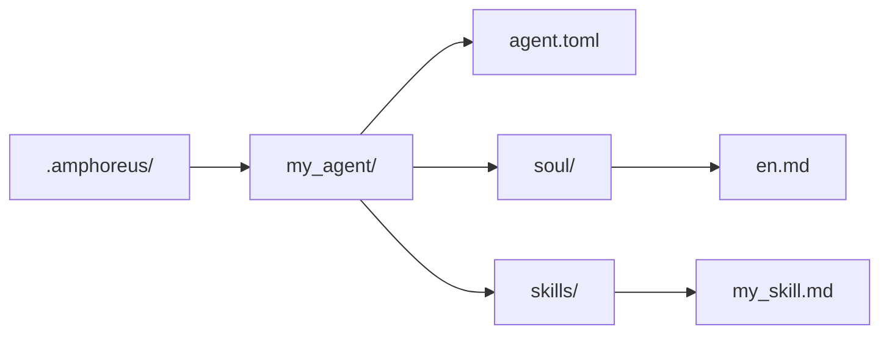

# دليل تطوير الوكلاء

> تعليمات تطوير الوكلاء مبنية على الواقع الحالي لهذا المستودع

## نظرة عامة

توجد ثلاث مستويات امتداد قابلة للاستخدام عمليًا في المستودع الحالي.

| المستوى | المعنى الحالي |
| --- | --- |
| Layer1 | الوكلاء الأساسية المنفذة ككرات Rust ومجمَّعة في مساحة العمل |
| Layer2 | Web Automation، وكيل المجال المدمج النشط، بالإضافة إلى بعض المواد المؤرشفة أو المُخططة |
| Layer3 | وكلاء يُعرِّفها المستخدم (مُخطط، غير منفذ بعد) |

لا تفترض أن كل مخطط Layer2 يظهر في الوثائق التاريخية لا يزال وكيلًا مدمجًا نشطًا.

## Layer3 هو أبسط مسار للامتداد

> **ملاحظة**: Layer3 موجود حاليًا في مرحلة التصميم فقط. الدليل `.amphoreus/`، ومحمل الوكلاء (`Layer3Workspace`)، وإطار التكوين لم تُنفَّذ بعد. يصف هذا القسم التصميم المستهدف للاستخدام المستقبلي.

إذا كنت تريد توسيع Entelecheia دون تعديل مساحة عمل Rust، ففضّل Layer3 (بمجرد تنفيذه).

### البنية الدنيا

### ما يوفره Layer3 حاليًا

- ملفات soul قائمة على التوجيهات
- مهارات قائمة على التوجيهات
- إعادة استخدام أدوات المنصة الموجودة
- فحص تمهيدي عند وقت التحميل

### ما لا يستطيع Layer3 توفيره تلقائيًا

- واجهات MCP الخلفية جديدة في Rust
- ضمانات صندوق رمل كاملة
- جاهزية للإنتاج من خارج الصندوق لكل مسار مهارة/أداة

## تطوير الوكلاء المدمجة

الوكلاء المدمجة هي كرات Rust تقع تحت `packages/agents/<agent>/`.

تشمل المكونات الشائعة:

- `src/lib.rs`
- `src/state.rs`
- `src/skills.rs`
- `src/mcp/registry.rs`
- `src/mcp/tools/*.rs`

كما تحتاج إلى صيانة الوثائق المقابلة تحت `res/prompts/agents/<agent>/`.

## التوصيات الحالية لـ Layer2

احتوى المستودع تاريخيًا على قدر كبير من تصميم وكلاء مجال Layer2. ينبغي فهمه حاليًا على النحو التالي:

- الكرات المدمجة النشطة لـ Layer2 في مساحة العمل الحالية هي Web Automation
- الكثير من وثائق Layer2 القديمة تصف أهداف تصميم أو مواد مؤرشفة
- ينبغي التعامل مع تطوير Layer2 المدمج الجديد على أنه تطوير منتج حقيقي، وليس شيئًا يمكن "تفعيله" بمجرد استعادة الوثائق

## ملاحظات الأمان الحالية

- فحص التحقق التمهيدي موجود، لكنه لا يزال فحص قواعد قائمًا على الكلمات المفتاحية.
- ما إذا كانت الأداة قابلة للاستخدام يعتمد على التنفيذ الفعلي خلف أداة MCP المقابلة.
- بعض الأدوات والمهارات المذكورة في الوثائق قد لا تزال منفذة جزئيًا أو وهمية.

## مسارات المرجع

- `packages/shared/custom_agent/src/`
- `packages/agents/hubris/`
- `packages/agents/kalos/`
- `packages/agents/aporia/`
- `res/prompts/agents/`

## توصيات الاختبار

يُفضَّل حاليًا التحقق مباشرةً من:

- تحليل Layer3 وتحميله
- تحليل المهارات
- الاختبار المباشر لأدوات MCP في Rust
- مسار الوكيل/الأداة المحدد الذي عدّلته فعليًا

لا تعتبر النسخة القديمة من البنية دليلًا على أن "مسار Layer2 معين نشط بالفعل".
