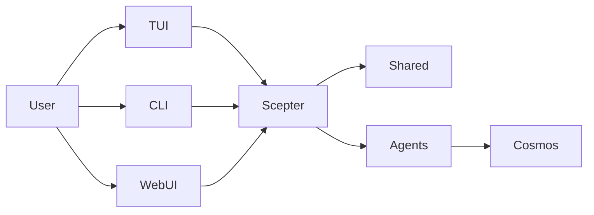

# البنية

> مبنية على بنية وقت التشغيل الحالية وليست على تصور الحالة المستهدفة

## نظرة عامة على وقت التشغيل

جوهر المنصة الحالي هو `packages/scepter` و`packages/shared` و`packages/tui`.

## الأجزاء الأكثر نضجًا حاليًا

- تنسيق Scepter من جهة الخادم
- التكوينات وأسماء الأدوات والتوجيهات وأنواع الحالة في Shared
- مسار المستخدم في TUI
- مسار التنفيذ القائم على الحاويات

## الأجزاء المنفذة جزئيًا فقط حاليًا

- تغطية أوامر CLI
- تكامل الذاكرة/RAG المتقدم
- معظم مخططات Layer2 الخاصة بالمجالات

## بنية الوكلاء النشطين حاليًا

### Layer1

تجمّع مساحة العمل حاليًا 12 وكيل Layer1، تغطي القدرات المتعلقة بتوجيه الرسائل، والتخطيط، والملفات، والحاويات، والبرمجيات النصية، والمعرفة، والبحث، والجدولة، والأمان، والذاكرة، والأجهزة.

### Layer2

تحتوي مساحة العمل الحالية على كريتَي Layer2 مدمجَين نشطَين: **Web Automation** (أتمتة المتصفح) و**Classical Software Engineering** (التحليل الثابت، ومراجعة الكود، ومقاييس الجودة، وإعادة الهيكلة، وتشخيصات LSP/الرموز/إعادة الهيكلة). الوكلاء المتخصصون الـ 11 المذكورون في الوثائق القديمة يصفون محتوى يتجاوز هذين الكريتَين وقد تمت أرشفته أو تخطيطه.

### Layer3

لا يزال Layer3 نقطة امتداد للوكلاء المخصصة قائمة على `.amphoreus/` (مرحلة التصميم، غير منفذة بعد).

## نموذج التنفيذ

### الأدوات المرئية للنموذج

عادةً ما يرى النموذج فقط:

- `exec`
- `write_to_var`
- `write_to_var_json`

يتم استدعاء أدوات MCP الداخلية بشكل غير مباشر عبر وقت التشغيل.

### مسارات داخل العملية ومن خلال الحاويات

بعض المنطق يُنفَّذ داخل عملية Scepter، بينما يُنجَز عمل آخر عبر مسارات معبأة في حاويات ووحدات مساعدة لوقت التشغيل.

### WebUI / IDE / Tauri

تم نقل واجهة الويب (arona)، ولوحة الإدارة (malkuth)، وإضافات IDE، وتطبيقات Tauri إلى المشروع الشقيق **shittim-chest** وأُزيلت من هذا المستودع. الواجهة المفضلة لهذا المستودع هي **TUI**؛ وتعيش طبقة الويب/IDE في shittim-chest وتتواصل مع Scepter عبر JWT + WebSocket/HTTP.

## قدرات الذاكرة والمعرفة

أصبحت RAG والذاكرة أكثر نضجًا مما هو موصوف في النظرة العامة القديمة، لكن بعض الروابط التكاملية لا تزال بحاجة إلى استكمال:

- تم تنفيذ ثلاث واجهات خلفية للتضمين: API (متوافقة مع OpenAI)، والاستدلال المحلي عبر ONNX (`FastEmbeddingService`، الافتراضي BGE-M3)، وتراجع تجزئة SHA-256
- كل من مستندات المتجهات في الذاكرة وتخزين **PgVector** (فهرس HNSW) قابلة للاستخدام
- اجتياز الرسوم البيانية والاسترجاع الهجين (دمج RRF) قابلان للاستخدام
- لا يزال التوصيل التلقائي من التضمين إلى RAG ومزامنة اشتراك RAG بحاجة إلى التكامل
