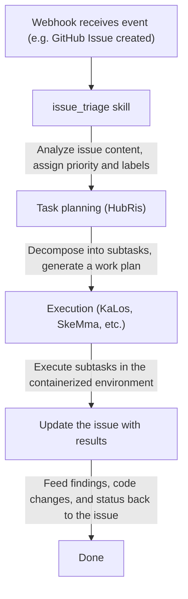

# تكامل تتبع القضايا

> ربط أنظمة تتبع القضايا الخارجية بسير عمل الوكلاء في Entelecheia
> ملاحظة الحالة الحالية: يوفر HubRis حاليًا قدرات مساعدة لإنشاء وتحديث والبحث والتعليق على القضايا، وتكاملات webhook موجودة أيضًا في المستودع. ومع ذلك، يجب ألا يُقرأ هذا المستند على أنه "يوجد بالفعل سطح منتج قضايا موحد وكامل عبر المنصات."

---

## جدول المحتويات

- [نظرة عامة](#نظرة-عامة)
- [معرّفات الحاوية ثلاثية المستويات](#معرّفات-الحاوية-ثلاثية-المستويات)
- [صيغة معرّف الربط](#صيغة-معرّف-الربط)
- [كيفية تفاعل الوكلاء مع القضايا](#كيفية-تفاعل-الوكلاء-مع-القضايا)
- [سير عمل القضايا](#سير-عمل-القضايا)
- [سجل بادئات المنصة](#سجل-بادئات-المنصة)
- [تسمية فرع تفرّع الحاوية](#تسمية-فرع-تفرع-الحاوية)
- [تكامل WebUI](#تكامل-webui)

---

## نظرة عامة

تأتي قدرات Entelecheia الحالية المتعلقة بالقضايا من اتجاهين:

- يمكن لتكامل webhook تحويل الأحداث الخارجية إلى النظام
- يوفر HubRis قدرات مساعدة بأسلوب CRUD للقضايا

يمكن النظر إلى أتمتة القضايا عبر المنصات كاتجاه موجود وميزة مُنفّذة جزئيًا، لكن يجب ألا تفترض افتراضيًا أن كل سير عمل في هذه الوثيقة مغلق الحلقة بالكامل بالفعل.

---

## معرّفات الحاوية ثلاثية المستويات

تستخدم الحاويات في Entelecheia نظام معرّفات ثلاثي المستويات للحفاظ على الهوية عبر سياقات مختلفة:

| المستوى | الصيغة | مدة الحياة | الاستخدام |
| --- | --- | --- | --- |
| UUID | UUID قياسي (مثل `550e8400-e29b-41d4-a716-446655440000`) | دائم | المفتاح الأساسي لقاعدة البيانات، تتبع عبر إعادة التشغيل |
| معرّف الربط | `@platform#id` (مثل `@github#234`) | مستقر | ربط الموارد الخارجية، تسمية الفروع |
| معرّف زمن التشغيل | `#xxx` (مثل `#616`) | لكل جلسة | عرض TUI، توجيه مقبس Unix |

يربط **معرّف الربط** حاوية بمورد منصة خارجي. يبقى مستقرًا عبر إعادة تشغيل Scepter، بخلاف معرّف زمن التشغيل الذي يُعاد تعيينه عند كل بدء.

---

## صيغة معرّف الربط

الصيغة العامة لمعرّف الربط هي:

```text
@platform#id[@#floor]
```

- `platform` — بادئة المنصة (مثل `github`، `gitee`، `gitlab`)
- `id` — رقم القضية أو المورد على المنصة
- `@#floor` — رقم الطابق الاختياري، يُستخدم للمراجع المتداخلة (مثل التعليقات)

### أمثلة

| معرّف الربط | المعنى |
| --- | --- |
| `@github#123` | قضية GitHub رقم 123 |
| `@gitee#456` | قضية Gitee رقم 456 |
| `@gitlab#789` | قضية GitLab رقم 789 |
| `@github#123@#5` | التعليق الخامس على قضية GitHub رقم 123 |
| `@feishu#abc123` | موضوع رسالة Feishu abc123 |

تُستخدم معرّفات الربط لـ:

- تسميات الحاوية والبيانات الوصفية
- أسماء الفروع للتطوير المُحرَّك بالقضايا
- معاملات مهارة الوكيل
- تصفية قائمة القضايا في WebUI

---

## كيفية تفاعل الوكلاء مع القضايا

يتفاعل الوكلاء مع القضايا الخارجية عبر أدوات HubRis MCP. هذه الأدوات تغلف واجهات برمجة تطبيقات خاصة بكل منصة:

### عمليات القضايا المتاحة

| الأداة | الوصف |
| --- | --- |
| `$.agent.HubRis.issue_create()` | إنشاء قضية جديدة على منصة خارجية |
| `$.agent.HubRis.issue_update()` | تحديث قضية موجودة (العنوان، الجسم، الحالة، التسميات) |
| `$.agent.HubRis.issue_search()` | البحث في القضايا عبر المنصات مع تطبيق المرشحات |
| `$.agent.HubRis.issue_comment()` | إضافة تعليق على قضية موجودة |

### الاستخدام في كود exec

```typescript
$.agent.HubRis.issue_create({
  platform: "github",
  repository: "celestia-island/entelecheia",
  title: "Fix WebSocket reconnection logic",
  body: "The WebSocket client does not retry on connection loss.",
  labels: ["bug", "priority:high"]
});
```

```typescript
$.agent.HubRis.issue_search({
  platform: "github",
  repository: "celestia-island/entelecheia",
  state: "open",
  labels: ["bug"]
});
```

```typescript
$.agent.HubRis.issue_comment({
  binding_id: "@github#123",
  body: "Investigation complete. Root cause identified in src/ws/client.rs:42."
});
```

---

## سير عمل القضايا

يتبع سير عمل القضايا الافتراضي هذا الخط الأنابيب:



### مثال خطوة بخطوة

1. ينشئ مطوّر قضية `@github#42` بعنوان "Memory leak in container cleanup"
1. يحوّل webhook الخاص بـ GitHub الحدث إلى Scepter
1. يصنّف مهارة `issue_triage` القضية كـ **bug** بأولوية **high**
1. يفكك HubRis المهمة: (a) إعادة إنتاج التسرب (b) إيجاد السبب الجذري (c) تنفيذ الإصلاح
1. يقرأ KaLos ملفات المصدر ذات الصلة، يشغّل SkeMma نصوص التشخيص
1. يلتزم الوكيل بالإصلاح ويعلّق الحل على `@github#42`

---

## سجل بادئات المنصة

تعيين بادئة المنصة قابل للتكوين. السجل الافتراضي يتضمن:

| البادئة | المنصة | نمط URL للقضية |
| --- | --- | --- |
| `github` | GitHub | `https://github.com/{repo}/issues/{id}` |
| `gitee` | Gitee | `https://gitee.com/{repo}/issues/{id}` |
| `gitlab` | GitLab | `https://gitlab.com/{repo}/-/issues/{id}` |
| `feishu` | Feishu / Lark | رابط رسالة داخلي |
| `discord` | Discord | رابط رسالة قناة |
| `telegram` | Telegram | رابط رسالة محادثة |

### دعم التدويل

تدعم بادئات المنصة أسماء مُدوَلة. على سبيل المثال، يمكن الإشارة إلى Feishu عبر:

- `@feishu#123` (الاسم الإنجليزي)
- `@飞书#123` (الاسم الصيني)

يطبّع سجل البادئات هذه داخليًا إلى البادئة القانونية.

---

## تسمية فرع تفرّع الحاوية

عندما ينشئ وكيل فرعًا للعمل المُحرَّك بالقضايا، يتبع الفرع اصطلاح تسمية:

### الصيغة

```text
cosmos-<binding_id>-<reason>
```

أو

```text
cosmos-<uuid8>-<reason>
```

### أمثلة

| اسم الفرع | السياق |
| --- | --- |
| `cosmos-@github#42-fix-memory-leak` | إصلاح قضية GitHub رقم 42 |
| `cosmos-@gitee#15-add-ci-pipeline` | عمل ميزة لقضية Gitee رقم 15 |
| `cosmos-a1b2c3d4-refactor-auth-module` | مهمة داخلية باستخدام بادئة UUID |

تضمن صيغة معرّف الربط إمكانية تتبع الفرع إلى قضيته الأصلية.

---

## تكامل WebUI

يوفر WebUI الخاص بـ Entelecheia عرضًا موحدًا للقضايا عبر جميع المنصات المتصلة.

### الشريط الجانبي الأيسر — قائمة القضايا المُجمَّعة

- يعرض القضايا من جميع المنصات في قائمة واحدة
- يُظهر كل إدخال: أيقونة المنصة، رقم القضية، العنوان، الحالة، الوكيل المُعيَّن
- النقر على قضية يفتح عرض التفاصيل الخاص بها

### التصفية

يمكن تصفية القضايا حسب:

- **المنصة**: عرض GitHub، Gitee، GitLab، إلخ فقط.
- **الحالة**: مفتوحة، مغلقة، قيد التقدم
- **الأولوية**: عالية، متوسطة، منخفضة (مشتقة من التسميات)
- **الوكيل المُعيَّن**: التصفية حسب الوكيل الذي يعمل حاليًا على القضية

### عرض تفاصيل القضية

يُظهر عرض التفاصيل:

- عنوان وجسم القضية الكاملين (مُعرَض من Markdown)
- رابط المنصة (يفتح القضية الأصلية في متصفح)
- سجل نشاط الوكيل (استدعاءات المهارات، التعليقات المُرسلة)
- الحاويات والفروع المرتبطة

---

## الخطوات التالية

- اقرأ [إعداد منصة Webhook](webhook-setup.md) لربط منصتك
- تصفّح [الهندسة المعمارية](architecture.md) لفهم تصميم وكيل HubRis
- تم ترحيل تكاملات IDE إلى المستودع الشقيق [shittim-chest](https://github.com/celestia-island/shittim-chest)
