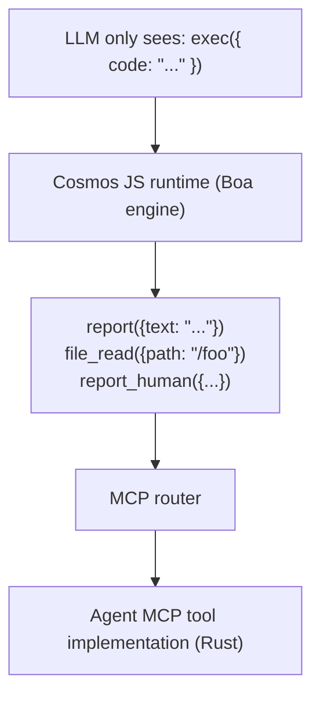
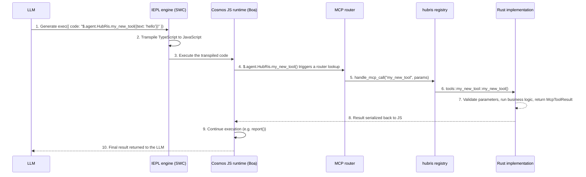

# دليل تطوير أدوات MCP

> كيفية إنشاء وتسجيل أدوات MCP في منصة Entelecheia

---

## جدول المحتويات

- [النواة الدقيقة للتنفيذ فقط](#النواة-الدقيقة-للتنفيذ-فقط)
- [بنية أداة MCP](#بنية-أداة-mcp)
- [إضافة أداة MCP جديدة](#إضافة-أداة-mcp-جديدة)
- [أفضل الممارسات](#أفضل-الممارسات)
- [اختبار أدوات MCP](#اختبار-أدوات-mcp)

---

## النواة الدقيقة للتنفيذ فقط

يستخدم Entelecheia **هندسة نواة دقيقة** للوصول إلى الأدوات. يرى LLM ثلاث أدوات فقط — `exec`، `write_to_var`، `write_to_var_json` — وكل العمل الفعلي يتم داخل زمن تشغيل TypeScript الخاص به (محرك IEPL).



**المبدأ الأساسي:** لا يستدعي LLM أدوات MCP مباشرةً أبدًا. يولّد كود TypeScript يستدعي واجهات دوال الأدوات عبر استيراد وحدات ES (مثل `import { report } from 'hubris'; report()`)، ومحرك IEPL يحوّله إلى JavaScript ويوجّهه إلى التنفيذ الفعلي بـ Rust.

- استيراد وحدات ES — النمط العالمي (مثل `import { report } from 'hubris'; report()`، `file_read()`)
- `exec`، `write_to_var`، `write_to_var_json` هي الأدوات الثلاث الوحيدة المسجلة لكل الوكلاء (راجع `packages/shared/domain_skills/src/tool_names.rs:265-283`)

إعلان `related_tools` في الأمامية TOML لمهارة يحدد أي واجهات استيراد وحدات ES ستُوثَّق في التوجيه المُرسل إلى LLM.

---

## بنية أداة MCP

تتكون أداة MCP من ثلاثة أجزاء:

1. **تنفيذ Rust** — المنطق الفعلي، في `packages/agents/<agent>/src/mcp/tools/`
1. **توجيه السجل** — التوجيه، في `packages/agents/<agent>/src/mcp/registry.rs`
1. **ثابت اسم الأداة** — ثابت سلسلة، في `packages/shared/domain_skills/src/tool_names.rs`

### تعريف الأداة في mcp/registry.rs

لكل وكيل دالة `handle_mcp_call` توجّه أسماء الأدوات إلى التنفيذ المقابل:

```rust
// packages/agents/kalos/src/mcp/registry.rs

use serde_json::Value;
use tracing::info;
use crate::{mcp::tools, state::KalosState};
use _shared::skills::{mcp_tools::McpToolResult, tool_names};

pub async fn handle_mcp_call(
    state: &std::sync::Arc<tokio::sync::RwLock<KalosState>>,
    tool_name: &str,
    parameters: Value,
) -> McpToolResult {
    info!("Calling Kalos MCP tool: {}", tool_name);

    match tool_name {
        tool_names::kalos::FILE_READ => tools::file_read(state, parameters).await,
        tool_names::kalos::FILE_WRITE => tools::file_write(state, parameters).await,
        tool_names::kalos::FILE_EDIT => tools::file_edit(state, parameters).await,
        // ...
        _ => McpToolResult::failure(format!("Unknown tool: {}", tool_name)),
    }
}
```

### التحقق من المعاملات مع validate_required_params

للأدوات التي لها معاملات مطلوبة، استخدم مساعد التحقق المشترك:

```rust
use _shared::skills::mcp_tools::validate_required_params;

pub async fn my_tool(parameters: Value) -> McpToolResult {
    if let Some(failure) = validate_required_params(
        &parameters,
        &["title", "content"],  // required parameter names
        "my_tool",              // tool name for error messages
    ) {
        return failure;
    }

    let title = parameters.get("title").unwrap().as_str().unwrap();
    // ...
}
```

يتحقق `validate_required_params` من أن كل معامل مطلوب موجود وسلسلة غير فارغة. يعيد `None` إذا كان الكل صالحًا، وإلا يعيد `Some(McpToolResult::failure(...))` مع رسالة خطأ وصفية.

المرجع: `packages/shared/domain_skills/src/mcp_tools.rs:12-41`.

### قيمة الإرجاع: McpToolResult

كل أداة يجب أن تعيد `McpToolResult`. المنشئات الرئيسية:

```rust
// Success returning arbitrary JSON data
McpToolResult::success(serde_json::to_value(my_struct).unwrap_or_default())

// Success returning a serializable struct
McpToolResult::success_struct(&my_result)

// Success returning plain text
McpToolResult::success_text("Operation completed".into())

// Success with LLM usage tracking
McpToolResult::success_with_usage(
    "Result text".into(),
    Some("gpt-4".into()),
    Some((prompt_tokens, completion_tokens)),
)

// Failure with an error message
McpToolResult::failure("Missing required parameter: title".into())

// Failure with multiple error lines
McpToolResult::failure_lines(vec!["Error 1".into(), "Error 2".into()])
```

المرجع: `packages/shared/domain_skills/src/mcp_tools.rs:62-136`.

---

## إضافة أداة MCP جديدة

يستخدم هذا الدليل التدريجي HubRis كمثال لتوضيح كيفية إضافة أداة جديدة إلى وكيل موجود.

### الخطوة 1: إضافة ثابت اسم الأداة

حرّر `packages/shared/domain_skills/src/tool_names.rs`:

```rust
/// HubRis tool names
pub mod hubris {
    pub const REPORT: &str = "report";
    pub const CREATE_TODO: &str = "create_todo";
    // ... existing tools ...
    pub const MY_NEW_TOOL: &str = "my_new_tool";  // add this line
}
```

### الخطوة 2: تنفيذ الأداة

أنشئ ملفًا جديدًا `packages/agents/hubris/src/mcp/tools/my_new_tool.rs`:

```rust
use serde::Serialize;
use serde_json::Value;
use std::sync::Arc;
use tokio::sync::RwLock;

use crate::state::HubrisState;
use _shared::skills::mcp_tools::{validate_required_params, McpToolResult};

# [derive(Serialize, Debug, Clone)]
struct MyNewToolResult {
    id: String,
    message: String,
}

pub async fn my_new_tool(
    state: &Arc<RwLock<HubrisState>>,
    parameters: Value,
) -> McpToolResult {
    if let Some(failure) = validate_required_params(&parameters, &["text"], "my_new_tool") {
        return failure;
    }

    let text = parameters.get("text").and_then(|v| v.as_str()).unwrap();
    let id = uuid::Uuid::now_v7().to_string();

    let result = MyNewToolResult {
        id,
        message: format!("Processed: {}", text),
    };

    McpToolResult::success(serde_json::to_value(result).unwrap_or_default())
}
```

### الخطوة 3: التسجيل في الوحدة

حرّر `packages/agents/hubris/src/mcp/tools/mod.rs`:

```rust
pub mod report;
pub mod todo_ops;
pub mod my_new_tool;  // add this line
```

### الخطوة 4: الإضافة إلى توجيه السجل

حرّر `packages/agents/hubris/src/mcp/registry.rs`:

```rust
pub async fn handle_mcp_call(
    state: &Arc<RwLock<HubrisState>>,
    todo_store: &Option<Arc<TodoStore>>,
    tool_name: &str,
    parameters: Value,
) -> McpToolResult {
    match tool_name {
        // ... existing tools ...
        tool_names::hubris::MY_NEW_TOOL => {
            crate::mcp::tools::my_new_tool::my_new_tool(state, parameters).await
        },
        _ => McpToolResult::failure(format!(
            "HubRis does not provide tool: {}",
            tool_name
        )),
    }
}
```

### الخطوة 5: إنشاء وثائق أداة MCP

أنشئ `res/prompts/agents/hubris/mcp/my_new_tool.md`:

```markdown
+++
name = "my_new_tool"
agent = "hubris"

[description]
en = "Process text and return a structured result."
zhs = "处理文本并返回结构化结果。"
+++

# my_new_tool

Process text and return a structured result.

## Parameters

- **text** (string, required): The text to process

## Returns

### Success

\`\`\`json
{ "id": "...", "message": "Processed: ..." }
\`\`\`

### Failure

\`\`\`text
Missing required parameter(s) for my_new_tool: text
\`\`\`
```

### الخطوة 6: العرض عبر related_tools في مهارة

لجعل LLM يدرك أداتك، أضفها إلى الأمامية لمهارة:

```toml
[[related_tools]]
agent_name = "hubris"
tool_name = "my_new_tool"
```

هذا يحقن وثائق API للأداة في توجيه المهارة، مما يسمح لـ LLM باستدعاء `$.agent.HubRis.my_new_tool()`.

### الخطوة 7: الاستخدام عبر exec (حقن التوجيه)

عندما يعالج LLM مهارة تضع `my_new_tool` في `related_tools` الخاص بها، يولّد كود TypeScript:

```typescript
const result: { id: string; message: string } = await $.agent.HubRis.my_new_tool({ text: "some content to process" });
```

يحوّل محرك IEPL الـ TypeScript إلى JavaScript، ثم يعترض زمن تشغيل Cosmos JS الاستدعاء، يوجّهه عبر موجّه MCP إلى تنفيذ Rust، ويعيد النتيجة إلى سياق JavaScript.

### سلسلة الاستدعاء الكاملة



---

## أفضل الممارسات

### 1. استخدم دائمًا write_to_var للمخرجات متعددة الأسطر

عند بناء سلاسل متعددة الأسطر في كود `exec`، استخدم `write_to_var` لتجنب السلاسل السطرية المكلفة بالرموز:

```typescript
// Not recommended — large inline string
exec({ code: "report({text: 'line1\\nline2\\nline3\\n...very long...'})" })

// Recommended — build it incrementally
exec({ code: `
  let output: string = '';
  $write_to_var('step1', 'First part of the content');
  $write_to_var('step2', 'Second part of the content');
  output = $read_var('step1') + '\\n' + $read_var('step2');
  report({text: output});
` })
```

### 2. استخدم env.aporia.language لضبط لغة المخرج

المهارات التي تنتج نصًا موجّهًا للمستخدم يجب أن تفحص لغة المخرج المكوَّنة:

```typescript
const lang: string = env.aporia.language;  // e.g. "en", "zhs", "ja"
const greeting: string = lang === "en" ? "Hello" : lang === "zhs" ? "你好" : "Hello";
```

يمكن للأمامية لمهارة التصريح بهذا الاعتماد:

```toml
config = ["user_language"]
```

### 3. استخدم TypeScript، استخدم دائمًا const/let، أبدًا var

كل الكود في `exec` يجب أن يستخدم صياغة TypeScript:

```typescript
// Correct
const result = file_read({path: '/src/main.rs'});
let items: string[] = result.content.split('\n');

// Wrong
var result = file_read({path: '/src/main.rs'});
```

### 4. ابنِ الكائنات خطوة بخطوة

للكائنات المعاملات المعقدة، ابنِها تزايديًا:

```typescript
let params: Record<string, unknown> = {};
params.title = "My Task";
params.description = "Detailed description";
params.priority = "high";

if (hasDueDate) {
    params.due_date = dueDate;
}

$.agent.HubRis.create_todo(params);
```

### 5. أبلغ عن النتائج عبر report()

كل مهارة يجب أن تستدعي `report()` مرة واحدة على الأقل قبل الانتهاء. هكذا تُلتقط النتائج وتُوجَّه إلى الخطوة التالية في سلسلة المهارات:

```typescript
report({text: "Task decomposition complete. Found 3 sub-tasks."});
```

تُجمَّع الاستدعاءات المتعددة — كل شيء يُدمج في نهاية مرحلة التفكير.

### 6. اصطلاحات تسمية المعاملات

- استخدم `snake_case` لأسماء المعاملات (مثل `parent_id`، `due_date`، `workspace_id`)
- يجب أن تستخدم معرّفات السلاسل صيغة UUID
- يجب أن تستخدم الطوابع الزمنية صيغة ISO 8601 / RFC 3339
- يجب أن توثّق المعاملات الاختيارية قيمة افتراضية واضحة

### 8. تصميم أدوات IEPL الدفعي-أولًا (حرج)

في MCP التقليدي، الأدوات دقيقة الحبيبات — CPU، الذاكرة، والقرص كلٌّ يستدعي أداة مختلفة. في IEPL، كل رحلة ذهاب وإياب تكلف رموز LLM وتأخيرًا. **صمّم الأدوات بحيث تعيد كل البيانات ذات الصلة في 1-2 استدعاء كحد أقصى.**

```rust
// Not recommended: three separate tools each fetching part of the device info
pub const CPU_INFO: &str = "cpu_info";
pub const MEMORY_INFO: &str = "memory_info";
pub const STORAGE_INFO: &str = "storage_info";

// Recommended: one tool returns the complete system configuration
pub const SYSTEM_INFO: &str = "system_info";
// Returns: { cpu: {...}, memory: {...}, storage: {...}, pci: [...], gpu: {...}, os: {...} }
```

للأدوات التي تقرأ البيانات من مصادر خارجية (أجهزة، بروتوكولات، قواعد بيانات)، اقبل معامل `scan` أو `ranges` لدعم الاستعلامات الدفعية:

```typescript
// Batch Modbus read — read multiple register ranges in one call
const result = $.agent.SkeMma.modbus_read({
  endpoint: "/dev/ttyUSB0",
  scan: [
    { register_type: "holding", start_address: 0, count: 10 },
    { register_type: "input", start_address: 100, count: 5 }
  ]
});
```

**الأدوات الدقيقة الحبيبات مقبولة فقط** للكتابة إلى عنوان محدد، أو الاستعلامات حيث يطلب المستدعي صراحةً نطاقًا ضيقًا من البيانات.

### 7. معالجة الأخطاء في الأدوات

أعد رسائل خطأ وصفية لمساعدة LLM على التصحيح الذاتي:

```rust
// Recommended — specific, actionable
McpToolResult::failure("Missing required parameter(s) for create_todo: title".into())

// Recommended — with context
McpToolResult::failure(format!("TODO item {} not found", id))

// Not recommended — vague
McpToolResult::failure("Error".into())
```

---

## اختبار أدوات MCP

### اختبار وحدة لأداة واحدة

اختبر كل دالة أداة مباشرةً ببناء معاملات `Value` والتأكيد على `McpToolResult`:

```rust
# [tokio::test]
async fn test_report_success() {
    use std::sync::Arc;
    use tokio::sync::RwLock;

    let state = Arc::new(RwLock::new(HubrisState::new()));
    let params = serde_json::json!({
        "text": "Test report content"
    });

    let result = crate::mcp::tools::report::report(&state, params).await;

    assert!(result.success);
    assert!(result.data.get("summary").is_some());

    // Verify the state was updated
    let state = state.read().await;
    assert_eq!(state.pending_reports.len(), 1);
    assert_eq!(state.pending_reports[0], "Test report content");
}

# [tokio::test]
async fn test_report_empty_text() {
    let state = Arc::new(RwLock::new(HubrisState::new()));
    let params = serde_json::json!({
        "text": ""
    });

    let result = crate::mcp::tools::report::report(&state, params).await;

    assert!(!result.success);
    assert!(!result.error.is_empty());
}
```

### اختبار توجيه السجل

اختبر أن السجل يوجّه أسماء الأدوات بشكل صحيح:

```rust
# [tokio::test]
async fn test_registry_routes_known_tool() {
    let state = Arc::new(RwLock::new(HubrisState::new()));
    let params = serde_json::json!({"text": "hello"});

    let result = handle_mcp_call(&state, &None, "report", params).await;
    assert!(result.success);
}

# [tokio::test]
async fn test_registry_rejects_unknown_tool() {
    let state = Arc::new(RwLock::new(HubrisState::new()));
    let params = serde_json::json!({});

    let result = handle_mcp_call(&state, &None, "nonexistent_tool", params).await;
    assert!(!result.success);
    assert!(result.error[0].contains("does not provide tool"));
}
```

### اختبار التحقق من المعاملات

اختبر مساعد `validate_required_params` مباشرةً:

```rust
# [test]
fn test_validate_required_params_all_present() {
    let params = serde_json::json!({"title": "test", "content": "body"});
    let result = validate_required_params(&params, &["title", "content"], "test_tool");
    assert!(result.is_none());
}

# [test]
fn test_validate_required_params_missing() {
    let params = serde_json::json!({"title": "test"});
    let result = validate_required_params(&params, &["title", "content"], "test_tool");
    assert!(result.is_some());
    let failure = result.unwrap();
    assert!(!failure.success);
    assert!(failure.error[0].contains("content"));
}

# [test]
fn test_validate_required_params_empty_string() {
    let params = serde_json::json!({"title": ""});
    let result = validate_required_params(&params, &["title"], "test_tool");
    assert!(result.is_some());
}
```

### الاختبار مع Store قاعدة بيانات

للأدوات التي تعتمد على Store قاعدة بيانات، تستخدم الاختبارات عادةً قاعدة بيانات في الذاكرة أو اختبار:

```rust
# [tokio::test]
async fn test_create_todo_success() {
    // Setup: create a test TodoStore (depends on test infrastructure)
    let todo_store = create_test_store().await;
    let params = serde_json::json!({
        "title": "Test Task",
        "workspace_id": test_workspace_id.to_string()
    });

    let result = create_todo(&todo_store, params).await;

    assert!(result.success);
    let id = result.data.get("id").unwrap().as_str().unwrap();
    assert!(!id.is_empty());
    assert_eq!(result.data.get("title").unwrap().as_str(), Some("Test Task"));
}
```

### تشغيل الاختبارات

```bash
# Run all tests
just test

# Run tests for a specific agent crate
cargo test -p hubris
cargo test -p kalos

# Run a specific test
cargo test -p hubris test_report_success

# Run with output
cargo test -p hubris -- --nocapture
```

---

## مرجع سريع: الملفات الرئيسية

| الاستخدام | المسار |
| --- | --- |
| تعريف `McpToolResult` | `packages/shared/domain_skills/src/mcp_tools.rs` |
| `validate_required_params` | `packages/shared/domain_skills/src/mcp_tools.rs:12-41` |
| ثوابت أسماء الأدوات | `packages/shared/domain_skills/src/tool_names.rs` |
| `agent_allowed_tools()` | `packages/shared/domain_skills/src/tool_names.rs:166-169` |
| سجل MCP الخاص بـ HubRis | `packages/agents/hubris/src/mcp/registry.rs` |
| أداة report في HubRis | `packages/agents/hubris/src/mcp/tools/report.rs` |
| أدوات TODO CRUD في HubRis | `packages/agents/hubris/src/mcp/tools/todo_ops.rs` |
| سجل MCP الخاص بـ KaLos | `packages/agents/kalos/src/mcp/registry.rs` |
| أمثلة وثائق أداة MCP | `res/prompts/agents/hubris/mcp/` |
| أمثلة توجيه المهارات | `res/prompts/agents/hubris/skills/` |
