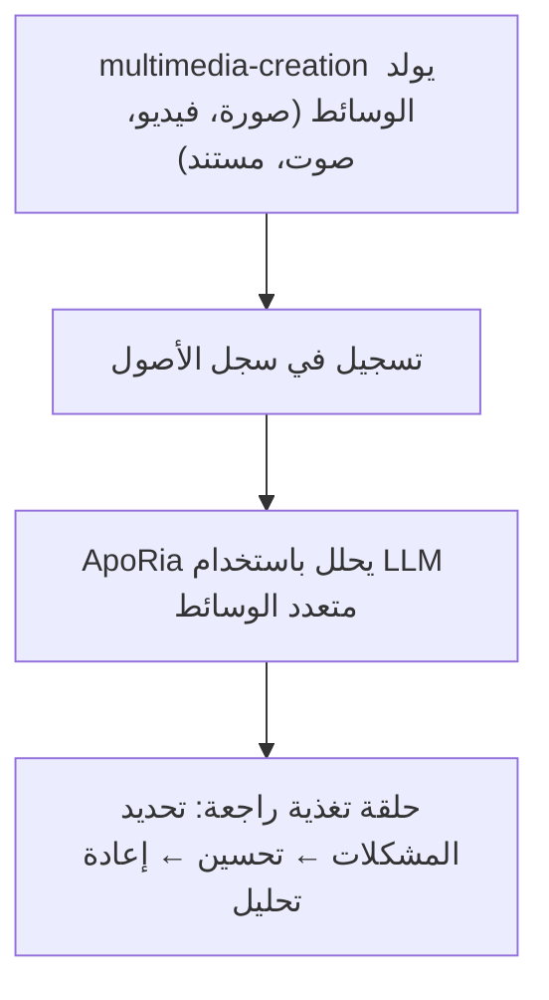

# خط أنابيب الوسائط المتعددة

> **⚠️ مرجع وكيل مؤرشف — ليس في مسار التطوير**
> تم **أرشفة** وكيل Layer2 الخاص بـ `multimedia-creation` المشار إليه في هذا المستند. تمت إزالة كود Rust وارتباطات `.d.ts` وتسجيل الوكيل جميعها. خط أنابيب الوسائط المتعددة الموصوف هنا **هدف تصميم**، وليس ميزة مُسلَّمة. ما لم يطلب مطور ذلك صراحةً، لا تنفذ أو تجدول عملًا على هذا الخط الأنابيب.
> توليد وتسجيل وتحليل الوسائط باستخدام multimedia-creation و ApoRia
> ملاحظة الحالة الحالية: يصف هذا المستند بشكل أساسي سير العمل المستهدف. تحتوي قاعدة الكود على أدوات ApoRia ذات الصلة بالوسائط المتعددة، لكنها لم تصل بعد بالكامل إلى سجل الأصول المركزي وقدرات الحلقة المغلقة الكاملة الموصوفة أدناه.

---

## جدول المحتويات

- [نظرة عامة](#نظرة-عامة)
- [سجل الأصول](#سجل-الأصول)
- [أدوات التوليد](#أدوات-التوليد)
- [التسجيل](#التسجيل)
- [تحليل الوسائط المتعددة](#تحليل-الوسائط-المتعددة)
- [حلقة المراجعة](#حلقة-المراجعة)
- [مستندات Office](#مستندات-office)
- [مثال كامل](#مثال-كامل)

---

## نظرة عامة

يحتوي Entelecheia حاليًا على وحدات أساسية ذات صلة بالوسائط المتعددة، خاصة الأدوات المبكرة على جانب ApoRia. لكن الحلقة المغلقة multimedia-creation ← سجل أصول مركزي ← مراجعة وسائط متعددة الموصوفة هنا يُنظر إليها بشكل أفضل كتصميم مستهدف بدلًا من حالة حالية كاملة.



---

## سجل الأصول

سجل الأصول هو مخزن بيانات وصفية للوسائط مركزي يُدار بواسطة ApoRia. يتتبع:

- مسارات الملفات ومواقع التخزين
- نوع MIME
- بيانات توليد وصفية (prompt، معاملات، طابع زمني)
- سجل التحليل ودرجات الجودة

### سير عمل التسجيل / الاسترجاع

```typescript
const asset = $.agent.ApoRia.media_asset_register({
  file_path: "/output/marketing-banner.png",
  mime_type: "image/png",
  metadata: {
    prompt: "A futuristic city skyline at sunset",
    generator: "multimedia-creation",
    model: "stable-diffusion-xl"
  }
});

const asset_id: string = asset.id;

const retrieved = $.agent.ApoRia.media_asset_retrieve({
  asset_id: asset_id
});
```

---

## أدوات التوليد

يوفر multimedia-creation أدوات توليد لأنواع وسائط مختلفة. تُستدعى جميع الأدوات عبر `$multimedia-creation.<tool>()` داخل كود exec.

### توليد الصور

```typescript
$multimedia-creation.image_generate({
  prompt: "A futuristic city skyline at sunset, cyberpunk style",
  width: 1024,
  height: 512,
  model: "stable-diffusion-xl",
  output_path: "/output/city-skyline.png"
});
```

### توليد الفيديو

```typescript
$multimedia-creation.video_generate({
  prompt: "Camera panning across a mountain landscape at golden hour",
  duration_seconds: 10,
  fps: 24,
  resolution: "1080p",
  output_path: "/output/mountain-pan.mp4"
});
```

### توليد الصوت

```typescript
$multimedia-creation.audio_generate({
  prompt: "Ambient electronic background music, calm and atmospheric",
  duration_seconds: 30,
  format: "mp3",
  output_path: "/output/ambient-bg.mp3"
});
```

### توليد المستندات

```typescript
$multimedia-creation.doc_generate({
  template: "technical-report",
  title: "Q4 Performance Analysis",
  content: report_markdown,
  format: "docx",
  output_path: "/output/q4-report.docx"
});
```

### توليد جداول البيانات

```typescript
$multimedia-creation.sheet_generate({
  title: "Budget Forecast 2025",
  data: budget_data,
  format: "xlsx",
  output_path: "/output/budget-2025.xlsx"
});
```

### توليد الشرائح

```typescript
$multimedia-creation.slide_generate({
  title: "Product Roadmap Presentation",
  sections: slide_sections,
  format: "pptx",
  output_path: "/output/roadmap.pptx"
});
```

---

## التسجيل

بعد توليد الوسائط، سجلها في سجل الأصول حتى يتمكن ApoRia من تحليلها:

```typescript
const result = $multimedia-creation.image_generate({
  prompt: "Product hero shot on white background",
  width: 1920,
  height: 1080,
  output_path: "/output/hero-shot.png"
});

const asset = $.agent.ApoRia.media_asset_register({
  file_path: result.output_path,
  mime_type: "image/png",
  metadata: {
    prompt: "Product hero shot on white background",
    generator: "multimedia-creation",
    dimensions: "1920x1080"
  }
});

const asset_id: string = asset.id;
```

---

## تحليل الوسائط المتعددة

يوفر ApoRia تحليل وسائط متعددة عبر `$.agent.ApoRia.multimodal_chat()`. مرر معرف أصل واحد أو أكثر مع موجز نصي:

```typescript
const analysis = $.agent.ApoRia.multimodal_chat({
  prompt: "Analyze this image for composition, color balance, and visual hierarchy. Rate each aspect from 1-10.",
  asset_ids: [asset_id]
});
```

### تحليل أصول متعددة

```typescript
const comparison = $.agent.ApoRia.multimodal_chat({
  prompt: "Compare these two design variations. Which one has better visual balance and why?",
  asset_ids: [variant_a_id, variant_b_id]
});
```

### تحليل بسياق

```typescript
const context_analysis = $.agent.ApoRia.multimodal_chat({
  prompt: "Does this image match the brand guidelines? Guidelines: primary color blue (#0066CC), clean layout, sans-serif typography.",
  asset_ids: [asset_id]
});
```

---

## حلقة المراجعة

يدعم خط أنابيب الوسائط المتعددة دورة مراجعة تكرارية:

1. **التوليد** — ينشئ multimedia-creation الوسائط الأولية
1. **التسجيل** — تخزينها في سجل الأصول
1. **التحليل** — يقيم ApoRia الوسائط باستخدام LLM متعدد الوسائط
1. **تحديد المشكلات** — استخراج نقاط تحسين ملموسة من التحليل
1. **التحسين** — يعيد multimedia-creation التوليد بمعاملات معدلة بناءً على التغذية الراجعة
1. **إعادة التحليل** — يقيم ApoRia المخرجات المحسّنة

### مثال حلقة المراجعة في كود exec

```typescript
let iteration: number = 0;
const max_iterations: number = 3;
const quality_threshold: number = 8.0;
let current_prompt: string = "A serene mountain lake at dawn, photorealistic";

while (iteration < max_iterations) {
  iteration++;

  const gen_result = $multimedia-creation.image_generate({
    prompt: current_prompt,
    width: 1024,
    height: 768,
    output_path: `/output/lake-v${iteration}.png`
  });

  const asset = $.agent.ApoRia.media_asset_register({
    file_path: gen_result.output_path,
    mime_type: "image/png",
    metadata: { prompt: current_prompt, iteration: iteration }
  });

  const analysis = $.agent.ApoRia.multimodal_chat({
    prompt: "Rate this image on composition (1-10), color harmony (1-10), and overall quality (1-10). Provide specific improvement suggestions.",
    asset_ids: [asset.id]
  });

  const overall_score: number = analysis.data.overall_quality;

  if (overall_score >= quality_threshold) {
    report({ text: `Quality threshold met at iteration ${iteration}. Score: ${overall_score}` });
    break;
  }

  const suggestions = analysis.data.improvement_suggestions;
  current_prompt = current_prompt + ". " + suggestions.join(". ");

  if (iteration === max_iterations) {
    report({ text: `Max iterations reached. Final score: ${overall_score}` });
  }
}
```

---

## مستندات Office

يمكن لـ multimedia-creation توليد مستندات متوافقة مع Office:

### مستندات Word (`doc_generate`)

يولد ملفات `.docx` من Markdown أو محتوى منظم. يدعم قوالب لأنواع مستندات شائعة:

- تقارير تقنية
- محاضر اجتماعات
- مقترحات

```typescript
$multimedia-creation.doc_generate({
  template: "meeting-notes",
  title: "Sprint Planning - Week 12",
  content: meeting_content,
  format: "docx",
  output_path: "/output/sprint-12-notes.docx"
});
```

### جداول بيانات Excel (`sheet_generate`)

يولد ملفات `.xlsx` ببيانات منظمة وصيغ وتنسيق:

```typescript
$multimedia-creation.sheet_generate({
  title: "Monthly Revenue",
  data: revenue_data,
  format: "xlsx",
  output_path: "/output/revenue.xlsx"
});
```

### عروض PowerPoint (`slide_generate`)

يولد ملفات `.pptx` بأقسام ونقاط وتضمين صور اختياري:

```typescript
$multimedia-creation.slide_generate({
  title: "Quarterly Business Review",
  sections: [
    { title: "Revenue", bullets: ["Q1: $1.2M", "Q2: $1.5M"] },
    { title: "Goals", bullets: ["Launch v2.0", "Expand to APAC"] }
  ],
  format: "pptx",
  output_path: "/output/qbr.pptx"
});
```

---

## مثال كامل

يوضح هذا المثال الخط الأنابيب الكامل: توليد صورة تسويقية، تسجيلها، تحليلها، وتحسينها.

### الخطوة 1: توليد الصورة الأولية

```typescript
const gen = $multimedia-creation.image_generate({
  prompt: "A modern SaaS product dashboard mockup, clean UI, blue and white color scheme",
  width: 1920,
  height: 1080,
  output_path: "/output/dashboard-v1.png"
});
```

### الخطوة 2: تسجيل الأصل

```typescript
const asset = $.agent.ApoRia.media_asset_register({
  file_path: gen.output_path,
  mime_type: "image/png",
  metadata: {
    prompt: "SaaS dashboard mockup",
    purpose: "marketing",
    version: 1
  }
});
```

### الخطوة 3: تحليل التكوين

```typescript
const analysis = $.agent.ApoRia.multimodal_chat({
  prompt: "Analyze this dashboard mockup for: 1) Visual hierarchy, 2) Color consistency, 3) Readability of data elements. Provide a score (1-10) for each and specific suggestions for improvement.",
  asset_ids: [asset.id]
});
```

### الخطوة 4: التحسين بناءً على التغذية الراجعة

```typescript
const refined = $multimedia-creation.image_generate({
  prompt: "A modern SaaS product dashboard mockup, clean UI, blue and white color scheme. " + analysis.data.suggestions.join(". "),
  width: 1920,
  height: 1080,
  output_path: "/output/dashboard-v2.png"
});
```

### الخطوة 5: التسجيل وإعادة التحليل

```typescript
const refined_asset = $.agent.ApoRia.media_asset_register({
  file_path: refined.output_path,
  mime_type: "image/png",
  metadata: {
    prompt: "SaaS dashboard mockup (refined)",
    purpose: "marketing",
    version: 2,
    previous_version: asset.id
  }
});

const final_analysis = $.agent.ApoRia.multimodal_chat({
  prompt: "Compare this refined version to the original. Has the visual hierarchy improved? Rate the overall quality 1-10.",
  asset_ids: [asset.id, refined_asset.id]
});

report({
  text: `Marketing image pipeline complete. Initial score: ${analysis.data.overall_score}, Refined score: ${final_analysis.data.overall_score}`
});
```

---

## الخطوات التالية

- اقرأ [دليل الأساسيات](fundamentals.md) لتفاصيل عن وكلاء multimedia-creation و ApoRia
- تصفح [الهندسة المعمارية](architecture.md) للحصول على نظرة عامة كاملة على نظام الوكلاء
- أعد [تكامل Webhook](webhook-setup.md) لتشغيل التوليد من أحداث خارجية
