# المساهمة في Shittim Chest

شكرًا لاهتمامك بالمساهمة! يغطي هذا الدليل كل ما تحتاجه للبدء.

## سياسة المساهمة (اقرأ هذا أولًا)

Shittim Chest هو السطح المواجه للمستخدم لمنصة يمكنها تشغيل الأنظمة المادية
والصناعية، لذا **تتفوق الاستقرار والأمان على إنتاجية المساهمة**. يُرجى قراءة
هذا قبل فتح طلب سحب.

- **شريط دمج مرتفع، وليس خارطة طريق عامة.** فتح طلب سحب لا يعني أنه سيُدمج.

نقبل عددًا صغيرًا متعمدًا من التغييرات، وفقط عندما
تتلاءم مع البنية وتجتاز المراجعة. هذا بالتصميم، لا وقاحة.

- **ما نرحب به:** تقارير الأخطاء، الإصلاحات المركزة، التحسينات محددة النطاق على

**المحيط** (إضافات IDE، تطبيقات Tauri، تكاملات القنوات، محولات المزود،
والوثائق)، والمناقشات التصميمية المسبقة قبل الكود.

- **ما لن ندمجه عمومًا:** إعادة الكتابة الكبيرة غير المطلوبة،

التغييرات المعمارية بدون مناقشة تصميم مسبقة، طلبات السحب "vibe-coded"
الجماعية، أي شيء يخفض شريط الأمان أو الصحة للنواة، والتغييرات على النواة
الحرجة أمنيًا (المصادقة، JWT/OAuth، توجيه LLM، تحقق webhook، RBAC) بدون
دعوة صريحة ومراجعة موسعة.

- **النواة مقابل المحيط.** تُحاسب الخلفية الأساسية ونموذج المصادقة/RBAC على

أشد المعايير ويُحافظ عليها بشكل أساسي فريق النواة. المحيط
(الواجهات الأمامية، تطبيقات IDE/المحمول، موصلات القنوات) هو حيث تكون
المساهمات الخارجية أكثر فائدة وأكثر احتمالًا للقبول.

- **CLA مطلوب.** تتطلب كل مساهمة مقبولة اتفاقية ترخيص مساهم موقعة.

انظر [`CLA.md`](../meta/cla.md). يجب أن تحمل الالتزامات سطر
`Signed-off-by` (`git commit -s`).

> **قد ينفتح الترخيص؛ لن ينخفض شريط الدمج.** في **2030-01-01** يتحول هذا
> المشروع من BUSL-1.1 إلى Synthetic Source License (SySL-1.0) — انظر
> [`LICENSE`](LICENSE). ذلك يوسع *ما يمكنك فعله بالكود*؛ لكنه لا
> **يخفض** شريط المراجعة، أو يزيل CLA، أو يعني أننا نقبل طلبات سحب أكثر. سياسة
> المساهمة دون تغيير قبل تاريخ التغيير وبعده.

## الأمان

لا تفتح **مشكلات** عامة للثغرات الأمنية. أبلغ عنها بشكل خاص
عبر [GitHub Security Advisories](https://github.com/celestia-island/shittim-chest/security/advisories/new).
انظر [`SECURITY.md`](../meta/security.md).

## مدونة قواعد السلوك

كن محترمًا، وبناءً، وشاملاً. نحن نتبع [مدونة قواعد سلوك Rust](https://www.rust-lang.org/policies/code-of-conduct).

## إعداد بيئة التطوير

### المتطلبات الأساسية

- **Rust** 1.85+ (`rustup default stable`)
- **Node.js** 20+ و **pnpm** 9+
- مُشغِّل أوامر **just** (`cargo install just`)
- **PostgreSQL** 18+
- مثيل [entelecheia](https://github.com/celestia-island/entelecheia) scepter قيد التشغيل على `:8424` (اختياري — يمكن لـ shittim-chest العمل مستقلًا للمحادثة/توليد الصور)

### البدء السريع

```bash
git clone https://github.com/celestia-island/shittim-chest.git
cd shittim-chest
cp .env.example .env
# حرر .env — اضبط DATABASE_URL، JWT_SECRET، ENCRYPTION_KEY
# لـ LLM مستقل: اضبط متغيرات LLM_DEFAULT_PROVIDER_*
# لوكيل scepter: اضبط ENTELECHEIA_SCEPTER_URL

 # حزمة تطوير كاملة (عبر Docker)
 just install  # مرحِّل مسبقًا كل الاعتماديات للبناء دون اتصال (يحتاج شبكة مرة واحدة:
               #   cargo fetch + pnpm install + يحل سحب arona
               #   الذي يشارك هذا المستودع سكريبتات أدوات التطوير معه)
 just dev      # يبدأ postgres + يبني + يهاجر + يخدم، ويراقب التغييرات
               # (إعادة بناء تلقائية للواجهة الأمامية/الخلفية؛ مع --mock يعيد تشغيل scepter + LLM وهمي أيضًا)

 # `just watch` اسم مستعار مهمل لـ `just dev` (المراقبة هي الافتراضية).
 ```

> **الشبكة:** يحتاج البناء الأول إلى إنترنت (سجل cargo، اعتماديات git،
> سحب arona + entelecheia). شغّل `just install` مرة واحدة على جهاز متصل
> ويمكن لمسارات `just dev` اللاحقة المتابعة دون اتصال. تعيش سكريبتات أدوات
> تطوير Python المشتركة (حارس ذاكرة الأهداف، المسجل، …) في مستودع `arona`
> وتُحدد تلقائيًا عبر مسار `[patch]` في cargo، أو سحب شقيق، أو كملاذ أخير
> `git clone` في `targets/`.

### التطوير المستقل (دون entelecheia)

يمكن لـ shittim-chest العمل بشكل مستقل لتطوير الواجهة الأمامية + المحادثة. اضبط هذه في `.env`:

```bash
LLM_DEFAULT_PROVIDER_ENDPOINT=https://api.deepseek.com/v1
LLM_DEFAULT_PROVIDER_API_KEY=sk-xxx
LLM_DEFAULT_PROVIDER_MODELS=deepseek-chat,deepseek-reasoner
LLM_DEFAULT_PROVIDER_CATEGORY=chat
```

ثم `just dev` — تعمل المحادثة، وتوليد الصور، والمصادقة بدون scepter. ستُظهر ميزات الوكيل والجهاز أخطاء لكنها لن تتعطل.

### الاعتماديات عبر المشروعات (تطوير محلي)

عند العمل على entelecheia و shittim-chest في وقت واحد، أعد إعداد تصحيحات Cargo المحلية في `~/.cargo/config.toml` لجميع اعتماديات المستودعات المتقاطعة:

```toml
# ~/.cargo/config.toml

# اعتماديات crates.io مع تجاوزات محلية
[patch.crates-io]
libnoa = { path = "/path/to/noa" }

# اعتماديات git مع تجاوزات محلية
[patch."https://github.com/celestia-island/arona.git"]
arona = { path = "/path/to/arona" }

[patch."https://github.com/celestia-island/hifumi.git"]
hifumi = { path = "/path/to/hifumi/packages/types" }

[patch."https://github.com/celestia-island/evernight.git"]
evernight = { path = "/path/to/evernight" }
```

**لا تلتزم أبدًا بـ `~/.cargo/config.toml` في أي مستودع.** يستخدم CI مراجع git.

## بنية المشروع

```mermaid
flowchart TD
    root["shittim-chest/"] --> pkg["packages/"]
    root --> docs_dir["docs/"]
    root --> scripts_dir["scripts/"]
    root --> cargo_toml["Cargo.toml — Rust workspace root"]
    root --> pkg_json["package.json — pnpm workspace root"]
    root --> pnpm_ws["pnpm-workspace.yaml"]

    pkg --> cli_pkg["cli/ — CLI wrapper, orchestrates Docker services"]
    pkg --> sc_pkg["core/ — Rust + Axum backend"]
    pkg --> webui_pkg["webui/ — Vue 3 + Vite frontend (TSX)"]
    pkg --> app_pkg["app/"]
    pkg --> ide_pkg["ide/"]

    sc_pkg --> sc_main["main.rs — CLI entrypoint (DbInit/Migrate/Reset/Serve)"]
    sc_pkg --> sc_lib["lib.rs — Module declarations (33 modules)"]
    sc_pkg --> sc_config["config.rs — Environment config"]
    sc_pkg --> sc_auth["auth/ — Login, register, JWT, OAuth, sessions"]
    sc_pkg --> sc_api["api.rs — Router bootstrap + DB management"]
    sc_pkg --> sc_chat["chat/ — Conversations, messages, SSE/WS streaming"]
    sc_pkg --> sc_llm["llm/ — LLM client, router, provider management"]
    sc_pkg --> sc_gen["generation/ — Image generation"]
    sc_pkg --> sc_webhook["webhook.rs — GitHub/GitLab/Gitee/custom webhooks"]
    sc_pkg --> sc_devices["devices/ — Remote device management + signaling"]
    sc_pkg --> sc_channel["channel/ — 12-platform channel integrations"]
    sc_pkg --> sc_proxy["proxy/ — Scepter HTTP/WS bridge"]
    sc_pkg --> sc_entity["entity/ — SeaORM entity models (25 tables)"]
    sc_pkg --> sc_migration["migration/ — Database migrations (5)"]
    sc_pkg --> sc_static["static_files.rs"]
    sc_pkg --> sc_cargo["Cargo.toml"]

    webui_pkg --> webui_views["views/ — demiurge (chat), auth, admin, topology, holographic"]
    webui_pkg --> webui_comp["components/ — base/ (50+ S-design-system), chat/, layout/, preview/, ..."]
    webui_pkg --> webui_stores["stores/ — Pinia stores"]
    webui_pkg --> webui_composables["composables/ — useChatStream, useSceneManager, ..."]
    webui_pkg --> webui_i18n["i18n/ — vue-i18n, 11 languages, 17 namespace files per locale"]
    webui_pkg --> webui_api["api/ — API client modules"]
    webui_pkg --> webui_types["types/ — TypeScript types"]

    app_pkg --> app_tauri["tauri/ — Tauri desktop app"]
    app_pkg --> app_shared["tauri_shared/ — Shared DTOs for Tauri apps"]
    app_pkg --> app_mobile["tauri_mobile/ — Tauri mobile app"]
    app_pkg --> app_harmony["harmony/ — HarmonyOS app (ArkTS)"]

    ide_pkg --> ide_vscode["vscode/ — VS Code extension (TypeScript)"]
    ide_pkg --> ide_idea["idea/ — IntelliJ plugin (Kotlin)"]
    ide_pkg --> ide_zed["zed/ — Zed extension (Rust)"]
    ide_pkg --> ide_neovim["neovim/ — Neovim plugin (Lua)"]
    ide_pkg --> ide_lsp["lsp-bridge/ — LSP bridge (Rust)"]
    ide_pkg --> ide_e2e["e2e/ — Shared E2E tests (TypeScript)"]

    docs_dir --> docs_guides["guides/ — Multi-language docs (en, zhs, zht, ja, ko, fr, es, ru)"]

    scripts_dir --> scripts_images["images/ — Dockerfile"]
    scripts_dir --> scripts_utils["utils/ — Python utility scripts"]
```



## نمط الكود

### Rust

```bash
cargo fmt                  # تنسيق تلقائي
cargo clippy               # فحص
cargo clippy --fix         # إصلاح تلقائي
```

- اتبع اصطلاحات Rust القياسية (`snake_case` للدوال/المتغيرات، CamelCase للأنواع)
- استخدم `workspace = true` لإصدارات الاعتماديات المشتركة في ملفات كريت `Cargo.toml`
- معالجة الأخطاء: استخدم `anyhow::Result` لكود التطبيق، `thiserror` لأنواع أخطاء كريت المكتبة

### TypeScript / Vue

```bash
pnpm -r lint               # ESLint عبر جميع الحزم
pnpm -r typecheck          # فحص صارم لـ TypeScript
pnpm -r build              # تحقق من بناء الإنتاج
```

- Vue 3 مع TSX (`defineComponent`، `@vitejs/plugin-vue-jsx`)
- وضع TypeScript الصارم
- Pinia لإدارة الحالة
- اتبع الأنماط الموجودة في `webui/`

### i18n

عند إضافة سلاسل واجهة المستخدم في webui، استخدم الدالة `t()` من `vue-i18n` عبر `packages/webui/src/i18n/`:

```ts
import { t } from '@/i18n'
// In template: {t('key.name')}
// With args: {t('msg.toolCalls', count, count > 1 ? t('msg.toolCalls.plural') : '')}
```

تُنظَّم ملفات اللغة كـ 17 ملف JSON مساحة اسم لكل لغة تحت `i18n/locales/{lang}/` (admin، auth، chat، cmd، common، devices، errors، footer، help، logs، models، reports، skills، timeline، tokenUsage، tools، workspace). عند إضافة مفتاح، أضفه إلى جميع اللغات الـ 11 المدعومة: `ar`، `de`، `en`، `es`، `fr`، `ja`، `ko`، `pt`، `ru`، `zhs`، `zht`.

### اصطلاحات التسمية

تستخدم جميع أسماء الدلائل تحت `packages/` **`snake_case`**:

| النوع | الاصطلاح | مثال |
| --- | --- | --- |
| دليل كريت Rust | snake_case | `core/` |
| اسم كريت Rust | snake_case | `core` |

## أوامر Justfile

```bash
just                       # اعرض جميع الأوامر
just dev                   # حزمة تطوير كاملة عبر Docker (postgres + backend)، مراقبة التغييرات
just dev --clean           # بدء نظيف (إزالة المجلدات، .env، إعادة تشغيل)
just dev --mock            # حزمة وهمية كاملة (scepter حقيقي + LLM وهمي) + backend، مراقبة؛
                           # يُعاد بناء+إعادة تشغيل scepter/LLM الوهمي طازجًا كل تشغيل
just up                    # بناء وبدء جميع الخدمات في Docker
just down                  # إيقاف جميع الخدمات
just down --clean          # إيقاف وإزالة المجلدات
just migrate               # تشغيل التهجرات المعلقة داخل الحاوية
just logs                  # بث السجلات من جميع الحاويات
just status                # فحص حالة الخدمة
just watch                 # (اسم مستعار مهمل لـ `just dev`)
just build                 # بناء الثنائي للإصدار
just build-frontend        # بناء واجهات Vue الأمامية فقط
just build-release         # بناء الواجهة الأمامية + ثنائي الإصدار مع الواجهة المضمنة
just test                  # تشغيل جميع الاختبارات
just lint                  # فحص الكل (cargo clippy + eslint)
just fmt                   # تنسيق الكل تلقائيًا
just clean                 # تنظيف مخرجات البناء
```

## عملية طلب السحب

1. أنشئ فرع ميزة من `dev`: `git checkout -b feat/my-feature dev`
1. قم بالتغييرات بالتزامات واضحة وذرية
1. شغّل `just lint && just test` قبل الدفع
1. افتح طلب سحب مقابل فرع `dev`
1. تأكد من نجاح CI (بناء Rust، بناء npm، فحص)

## اصطلاح الالتزام

استخدم [Conventional Commits](https://www.conventionalcommits.org/):

```text
feat(auth): add password login endpoint
fix(proxy): handle WebSocket reconnect
docs(readme): add logo and badges
refactor(config): extract env loading
chore(deps): bump axum to 0.8
```

## الترخيص و CLA

Shittim Chest مرخص بموجب **Business Source License 1.1 (BUSL-1.1)**
بـ **تاريخ تغيير 2030-01-01**، يتحول فيه إلى
**Synthetic Source License (SySL-1.0)**. لجميع الاستخدامات الداخلية والأكاديمية
والحكومية والتعليمية وغير التجارية هو بالفعل مكافئ لـ SySL-1.0
اليوم (انظر منحة الاستخدام الإضافية في [`LICENSE`](LICENSE)). الاستخدامات التجارية
المقيدة (الاستضافة، إعادة البيع، أو إعادة العلامة التجارية كخدمة) تتطلب ترخيصًا
تجاريًا منفصلًا حتى تاريخ التغيير.

بالمساهمة، فإنك توافق على أن مساهماتك مرخصة بموجب
ترخيص المشروع وأنك توقع CLA ([`CLA.md`](../meta/cla.md)). تمنح CLA
المشروع ترخيصًا متساهلًا **بما في ذلك حق إعادة الترخيص**، حتى يتمكن
المشروع من الاحتفاظ بمسار BUSL←SySL وتكييف ترخيصه في المستقبل.
