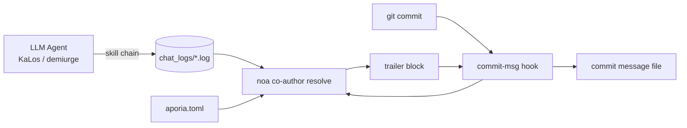

+++
title = "AI Agent Identification & Commit Co-author Strategy"
description = """This document specifies how AI-generated commits across the celestia-island projects"""
lang = "en"
category = "design"
subcategory = "core"
+++

# AI Agent Identification & Commit Co-author Strategy

## Overview

This document specifies how AI-generated commits across the celestia-island projects
(`noa`, `entelecheia`, `evernight`) are stamped with **provenance metadata**: which
models authored the change, through which provider/platform they were reached, how
many tokens they consumed, and whether the change was produced under autonomous
(YOLO) iteration.

The mechanism is **pragmatic metadata**: every commit produced by an AI agent gets a
`Co-authored-by` trailer block (and an optional `Token usage` block) appended by a
git `commit-msg` hook that `noa` installs and resolves. This is not a legal
compliance gate; it is traceability that lets humans audit which model and which
provider touched the code.

## Motivation

| Concern | How this helps |
| --- | --- |
| **Traceability** | Every commit records the exact model(s) that produced it. |
| **Provider accountability** | The author email encodes the provider/platform, including third-party relays. |
| **Anti-poisoning** | If a relay or provider ships compromised data, the co-author trailer identifies the source. |
| **Cost tracking** | The optional `Token usage` block records upload/download/cache per model. |
| **Autonomous-mode marking** | A chain run fully under YOLO cruise control is marked with an `Entelecheia` authority. |

## Provider Identity Model

The author email uses a single trust namespace — `celestia.world` — with the local
part encoding **who served the model**:

```text
Display Name <provider-or-platform-id@celestia.world>
```

The provider id is the **mandatory `website_domain`** field declared in each
provider config (the provider-registry entrypoint TOMLs and the local
`aporia.toml`). It is **not** derived from the API `base_url` — a single provider may
expose several `base_url` hosts (e.g. `zhipu_glm` serves both `open.bigmodel.cn` and
`api.z.ai`, but its canonical domain is `zhipuai.cn`). If a provider lacks
`website_domain`, no co-author is attributed for it (the resolver skips it rather
than guessing from the URL or model prefix).

- **First-party providers** are identified by their canonical domain:

`anthropic.com`, `deepseek.com`, `openai.com`, `zhipuai.cn`, `google.com`, ...

- **Third-party / relay providers** keep their own domain so the relay is visible:

`opencode.ai`, `jdcloud.com`, `openrouter.ai`, `dashscope.aliyuncs.com`, ...

This means the *same* model reached through different routes is distinguishable:

```text
GLM 5 <zhipuai.cn@celestia.world>              # direct from Zhipu AI
GLM 5 <jdcloud.com@celestia.world>           # GLM 5 served via JD Cloud
Deepseek V4 Pro <deepseek.com@celestia.world> # direct from DeepSeek
Deepseek V4 Pro <opencode.ai@celestia.world>  # DeepSeek served via opencode
```

## Co-author Trailer Specification

- Trailer key: `Co-authored-by` (git-recognised trailer).
- Value: `Display Name <local@celestia.world>`.
- **One trailer per distinct model**, in usage order.
- Display name is derived from the model id (brand + version, title-cased).
- The local part must be a valid RFC-5321 sub-domain (letters, digits, `.`, `-`).

## YOLO Authority Trailer

When the entire chain of thought that produced a commit ran under **YOLO cruise
control** (autonomous iteration), an additional co-author is prepended:

```text
Co-authored-by: Entelecheia <demiurge@celestia.world>
```

YOLO mode is detected from either:

1. The session chat log containing a `YOLO cruise control` / `YOLO auto` marker, or
1. The presence of the `/run/entelecheia/yolo_active` sentinel file.

This lets a human immediately see "this commit was made with no human in the loop".

## Embedded Token Usage

Embedded in each model's display name within the `Co-authored-by` trailer (one trailer block GitHub parses correctly):

```text
Co-authored-by: Claude Opus 4.8 (↑ 12.5k ↓ 8.3k ●45.2k) <anthropic.com@celestia.world>
Co-authored-by: Deepseek V4 Pro (↑ 5.1k ↓ 3.2k) <deepseek.com@celestia.world>
```

Rules:

- Usage is embedded inline as `(↑ upload ↓ download)`, with `●cache` appended only

when cached-input tokens were reported and are > 0.

- `↑` = prompt/input tokens; `↓` = completion/output tokens.
- Counts are rendered in thousands (`k`), one decimal place, trailing-zero trimmed.

## Full Commit Message Example

```python
fix(auto_fix): raise clippy/check timeouts from 180s to 300s

The previous 180s timeout was too tight for clean builds on a loaded
machine; raise it to 300s to avoid spurious validation failures.

Co-authored-by: Entelecheia <demiurge@celestia.world>
Co-authored-by: GLM 5 (↑ 36.4k ↓ 1.5k) <zhipuai.cn@celestia.world>
```

## noa Hook Installation

`noa` provides the hook lifecycle:

```text
noa hook install --repo <path> [--force] [--noa-bin <path>]
```

- Writes `.git/hooks/commit-msg` (mode `0755`).
- The hook calls `<noa> co-author resolve` and appends its stdout to the commit

message file (`$1`).

- The hook **never blocks a commit**: on any resolver failure it exits `0` silently.
- If a commit message already contains a `Co-authored-by:` trailer, the hook is a

no-op (it never duplicates or overwrites).

- `NOA_COAUTHOR_DISABLE=1` in the environment disables the hook for one commit.

## noa Co-author Resolution

```text
noa co-author resolve [--repo <path>] [--chat-log-dir <dir>]
                      [--aporia-config <path>] [--lookback-secs <n>]
```

The resolver:

1. Loads the provider map: built-in registry merged with the `aporia.toml` provider

configuration (which gives the precise model→endpoint→provider mapping).

1. Reads the most recent entelecheia chat log(s) and aggregates token usage per

model. With `--lookback-secs 0` (default) only the single most-recent log is used.

1. Detects YOLO mode (chat-log marker or sentinel file).
1. Builds the co-author list (`Entelecheia` authority first if YOLO, then models)

and the token-usage block, and prints the trailer block to stdout.

## Data Flow



## entelecheia Integration

- The `commit-msg` hook is installed into `/mnt/sdb1/entelecheia/.git/hooks/`.
- All commits produced by the surgery pipeline (`NoaMergeCommit` hook in

`packages/scepter/src/state_machine/skill_chain/execution/noa_post_chain.rs`) and
by the `KaLos:auto_fix` self-healing loop pass through the git `commit-msg` hook,
so they are stamped automatically.

- No change to the commit call sites is required: the hook is the single insertion

point.

## evernight Integration

When an AI agent orchestrates a commit through `evernight` (e.g. agent on host A →
evernight SSH → host B → `git commit`), the host-side `commit-msg` hook still fires
locally and stamps the commit. `evernight` itself may appear as a **transit
provider** in the author email when it relays model traffic (e.g.
`GLM 5 <evernight.celestia.world@celestia.world>`), making the transport hop
auditable.

## Security Considerations

- Co-author trailers are **self-reported** provenance, not cryptographic proof.

Future work may add signed attestations.

- The resolver degrades safely: a missing chat log, missing `noa`, or a parse error

all result in an empty block and the commit proceeds untouched.

- Provider identifiers come from the local `aporia.toml`, so a user always sees the

providers *they* configured.

## Provider Identifier Reference (initial registry)

| Provider id | Brand | Endpoint hint |
| --- | --- | --- |
| `zhipuai.cn` | GLM | `open.bigmodel.cn` |
| `deepseek.com` | Deepseek | `api.deepseek.com` |
| `anthropic.com` | Claude | `api.anthropic.com` |
| `openai.com` | GPT / OpenAI | `api.openai.com` |
| `google.com` | Gemini | `googleapis.com` |
| `dashscope.aliyuncs.com` | Qwen | `dashscope.aliyuncs.com` |
| `moonshot.cn` | Kimi | `api.moonshot.cn` |
| `mistral.ai` | Mistral | `api.mistral.ai` |
| `opencode.ai` | (relay) | `opencode.ai` |
| `jdcloud.com` | (relay) | `jdcloud.com` |
| `openrouter.ai` | (relay) | `openrouter.ai` |
