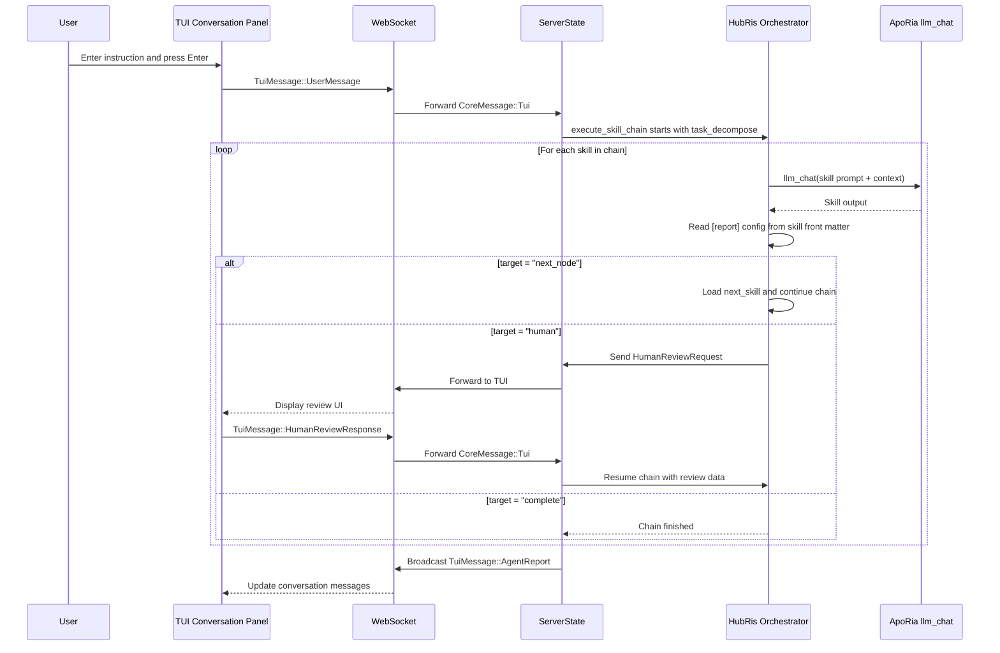

+++
title = "Conversation Orchestration Design (HubRis + ApoRia)"
description = """HubRis is a "Pure Skill Agent" — all capabilities are prompt-only skills"""
lang = "en"
category = "design"
subcategory = "core"
+++

# Conversation Orchestration Design (HubRis + ApoRia)

## Background

HubRis is a "Pure Skill Agent" — all capabilities are prompt-only skills
invoked through ApoRia `llm_chat`. After implementing the report routing
layer, skills declare their routing behavior in TOML front matter via a
`[report]` section, replacing hardcoded orchestration logic.

## Goals

1. Skills declare routing behavior in front matter (not hardcoded).
1. A generic skill chain executor replaces the hardcoded 2-stage pipeline.
1. Human review is a first-class routing target.
1. Prompt language cleanup: skill/MCP flat files are English-only.

## Skill Report Config (TOML Front Matter)

```toml
[report]
target = "next_node"              # "next_node" | "parent" | "human" | "complete"
next_skill = "workplan_generate"  # required if target = "next_node"
```

## HubRis Skill Chain

```text
task_decompose → workplan_generate → operator → workplan_execute → submit_report → human
```

## End-to-End Flow



## Report Routing Targets

| Target       | Behavior                                                        |
| --- | --- |
| `next_node`  | Executor loads the skill named in `next_skill` and runs it.     |
| `parent`     | Returns control to the parent orchestrator (reserved for nested chains). |
| `human`      | Pauses chain, sends `HumanReviewRequest` to TUI, resumes on `HumanReviewResponse`. |
| `complete`   | Terminates the chain and returns the accumulated `AgentReport`.  |

## File Structure (Phase 1)

```text
res/prompts/agents/hubris/skills/
  task_decompose.md
  workplan_generate.md
  operator.md
  workplan_execute.md
  submit_report.md
```

Each file is a flat Markdown document, English-only, with TOML front matter
containing the `[report]` section and any other skill metadata.

## Human Language Config

Agent runtime config includes a `human_language` field using native language
names (e.g. `"中文"`, `"English"`, `"日本語"`). This controls the language
of all user-facing output without affecting the English-only skill prompt
files.

## Default Model Policy

Startup uses `glm-4.7-flash` as the normalized environment default model.
ApoRia `llm_chat` uses that model by default to keep development and
testing cost low.

## Failure Fallback Policy

1. If a skill fails: return failure message and end current chain.
1. If ApoRia is offline: return `Agent not ready` message.
1. If human review times out: return timeout notice without blocking

subsequent chats.
