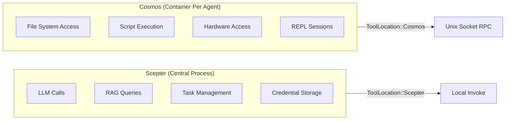
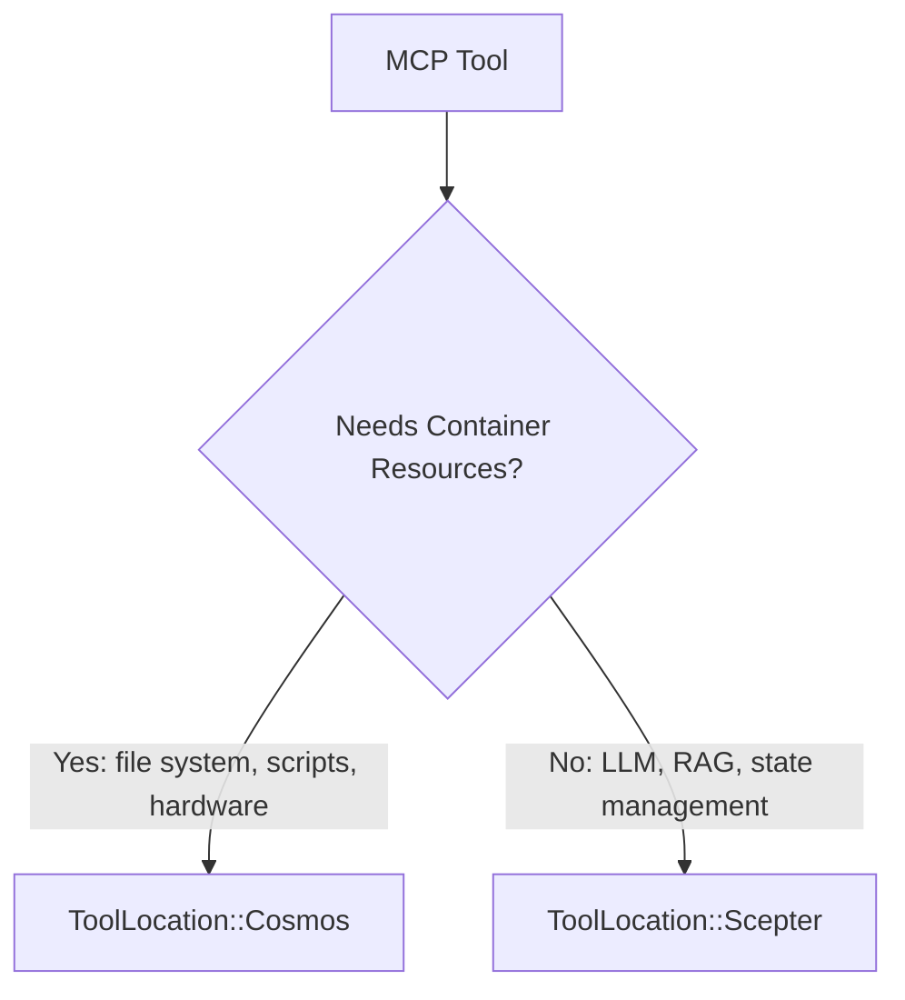
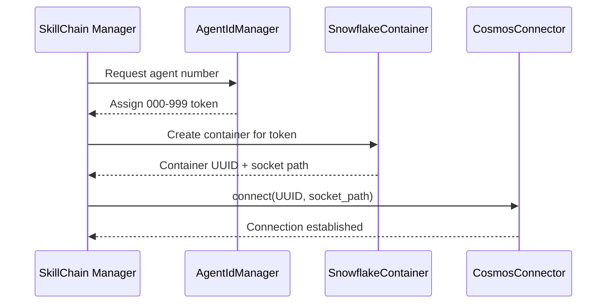
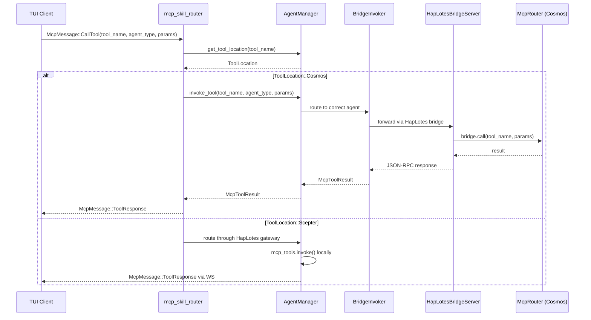
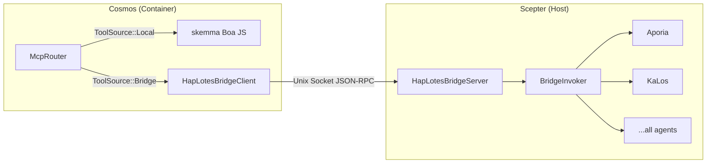
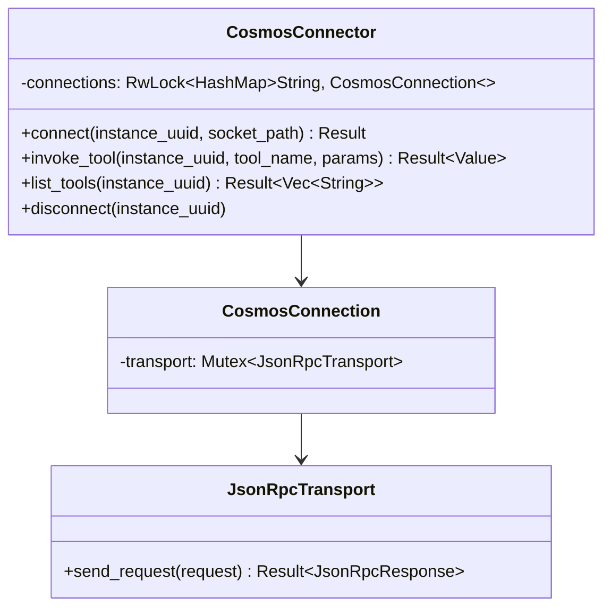
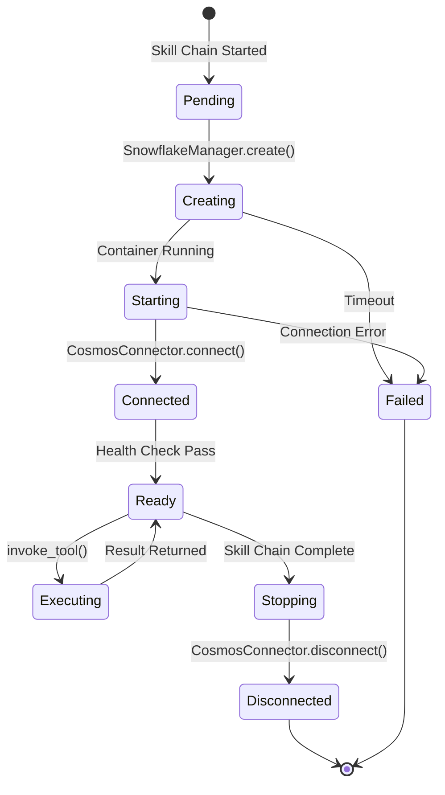
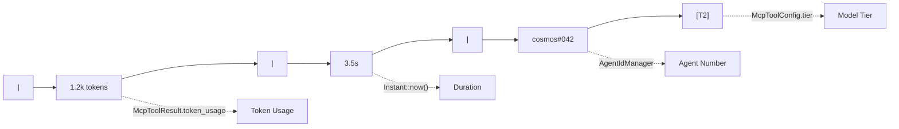
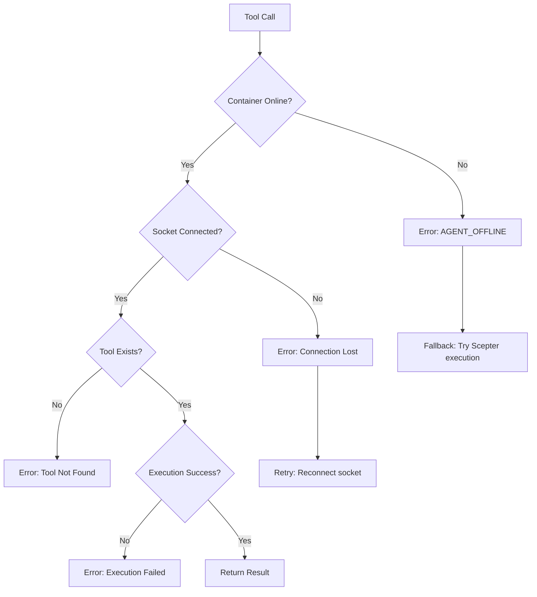

+++
title = "Cosmos Container Scheduling and Token Routing Design"
description = """This document describes the Cosmos container scheduling architecture: how MCP tools marked with `ToolLocation::Cosmos` are routed through unix-socket JSON-RPC to their corresponding containers, and ho"""
lang = "en"
category = "design"
subcategory = "core"
+++

# Cosmos Container Scheduling and Token Routing Design

## Overview

This document describes the Cosmos container scheduling architecture: how MCP tools marked with `ToolLocation::Cosmos` are routed through unix-socket JSON-RPC to their corresponding containers, and how the token (agent number) system ties into container identity and routing.

## I. Tool Location Model

### Dual Execution Environment



### ToolLocation Enum

| Variant | Execution Site | Transport |
| --- | --- | --- |
| `Scepter` (default) | In-process via `McpToolInvoker` | Direct function call |
| `Cosmos` | In container via `CosmosConnector` | Unix socket JSON-RPC |

### Location Decision Criteria



Tools that require container resources (file system, script execution, hardware access) are marked `Cosmos`. Centralized services (LLM, RAG, task management, human interaction) remain `Scepter`.

## II. Token System and Container Identity

### Agent Number Allocation



### Token Properties

| Property | Description |
| --- | --- |
| Format | Three-digit number: `000`-`999` |
| Allocator | `AgentIdManager` in skill chain |
| Binding | One token per skill chain panel |
| Display | Shown in TUI stats line as `cosmos#NNN` |
| Persistence | Survives across agent restarts |

## III. Request Routing Flow

### TUI-originated MCP Call



### Key Routing Logic

The routing decision happens in `mcp_skill_router.rs`:

1. Check `agent_manager.get_tool_location(tool_name)`
1. If `ToolLocation::Cosmos` and containerized mode active:

   - Call `agent_manager.invoke_tool()` which routes through `BridgeInvoker` → HapLotes bridge → Cosmos's `McpRouter`
   - Cosmos's `McpRouter` dispatches locally (skemma) or back to Scepter via bridge for remote agents
   - Return `McpMessage::ToolResponse` directly to TUI

1. Otherwise: route through HapLotes gateway to the agent process

## IV. CosmosConnector / Bridge Architecture

### HapLotes Bridge (Current)

The HapLotes bridge is the **sole communication channel** between Scepter and Cosmos containers.



### Connection Pool (CosmosConnector — Scepter-side)



### JSON-RPC Protocol

All method names use the `UnixMethod` enum for compile-time type safety:

| UnixMethod Variant | Direction | Parameters |
| --- | --- | --- |
| `UnixMethod::McpCall` | Scepter → Cosmos | `{ tool_name, parameters }` |
| `UnixMethod::McpListTools` | Scepter → Cosmos | None |
| `UnixMethod::ReplSnapshot` | Scepter → Cosmos | `{ path }` |
| `UnixMethod::ReplRestore` | Scepter → Cosmos | `{ path }` |
| `UnixMethod::BridgeCall` | Cosmos → Scepter | `{ tool_name, parameters }` |
| `UnixMethod::BridgeListTools` | Cosmos → Scepter | None |

### Response Format

```json
{
  "success": true,
  "data": { ... },
  "error": null
}
```

## V. Container Lifecycle



### Container Agents

Inside Cosmos containers, only skemma runs locally (Boa JS engine). All other agent tools route through the HapLotes bridge back to Scepter:

| Agent | Role | In Cosmos? |
| --- | --- | --- |
| SkeMma | Script execution (Boa JS) | **Local** (in-process) |
| Aporia | LLM chat | Via bridge → Scepter |
| KaLos | File I/O | Via bridge → Scepter |
| NeiKos | Container management | Via bridge → Scepter |
| EleOs | Web search | Via bridge → Scepter |
| All others | Various | Via bridge → Scepter |

## VI. Stats Line Integration

### Display Format

In the TUI `AgentDetailPage`, the stats line shows:



| Segment | Source |
| --- | --- |
| `1.2k tokens` | `McpToolResult.token_usage` |
| `3.5s` | Duration from `Instant::now()` |
| `cosmos#042` | Agent number from `AgentIdManager` |
| `[T2]` | Model tier from `McpToolConfig.tier` |

## VII. Error Handling

### Failure Modes



### Graceful Degradation

When container is unavailable, the system can optionally fall back to `Scepter`-local execution if the tool has a local implementation registered.

## VIII. Future Extensions

| Feature | Description | Priority |
| --- | --- | --- |
| Container pooling | Reuse containers across skill chains | Medium |
| Health monitoring | Periodic container health checks | High |
| Resource limits | CPU/memory limits per container | High |
| Multi-container tools | Tools spanning multiple containers | Low |
| Container migration | Move running containers between hosts | Low |
