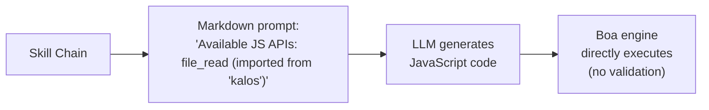
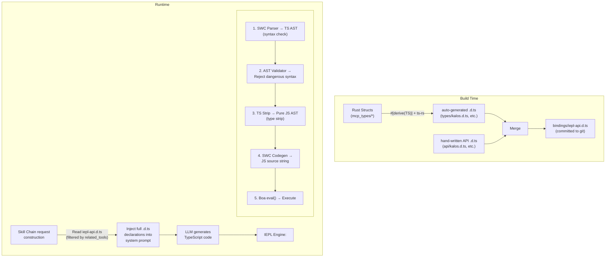
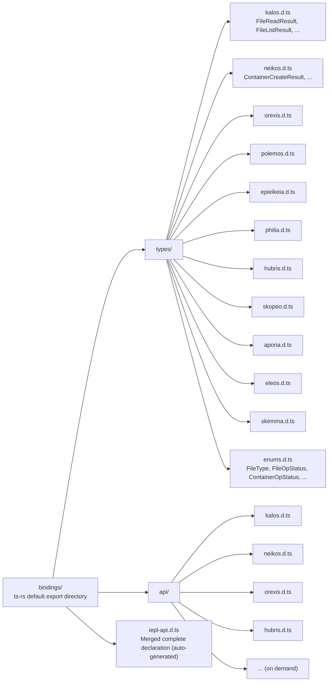
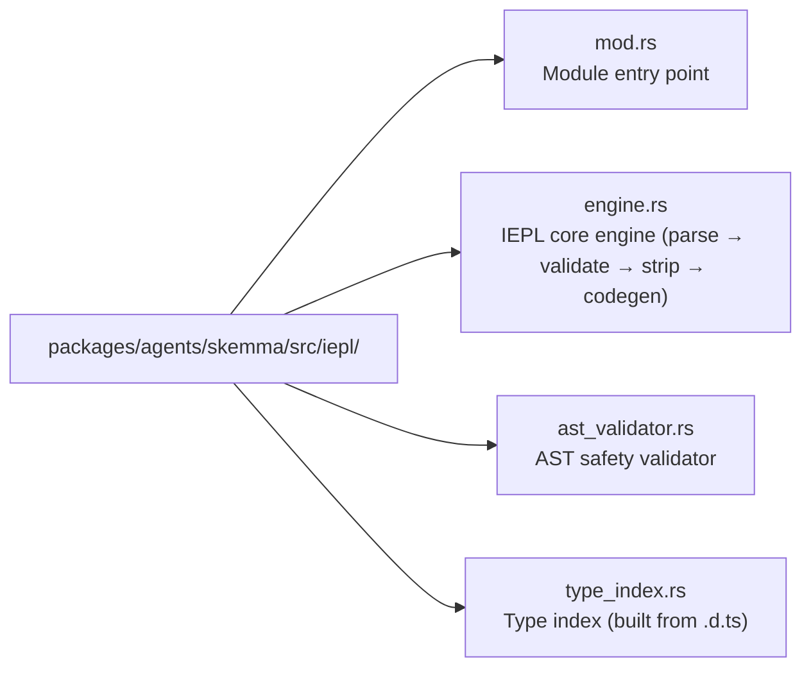

+++
title = "22 — IEPL TypeScript Execution Engine Design"
description = """IEPL (In-Execution Prompt Language) Execution Engine is an architectural upgrade to the existing Cosmos/SkeMma JS runtime, upgrading LLM-generated execution code from JavaScript to TypeScript. The cor"""
lang = "en"
category = "design"
subcategory = "core"
+++

# 22 — IEPL TypeScript Execution Engine Design

## Overview

IEPL (In-Execution Prompt Language) Execution Engine is an architectural upgrade to the existing Cosmos/SkeMma JS runtime, upgrading LLM-generated execution code from JavaScript to TypeScript. The core changes include:

1. **Built-in SWC crate**: Strict syntax checking, type stripping, and transpilation of LLM-generated TypeScript
1. **Rust derive → TypeScript type generation**: Auto-export Rust structs to `.d.ts` declaration files via `ts-rs`
1. **Type-safe Skill Prompt**: Inject complete `.d.ts` declarations instead of hardcoded function lists, significantly improving robustness

## Current State & Problems

### Current Execution Flow



### Existing Problems

| Problem | Description |
| --- | --- |
| **No type constraints** | LLM-generated JS code has zero static type information; parameter typos are only caught at runtime |
| **Fragile interface descriptions** | `build_report_tool_instruction()` hardcodes text lists like `- file_read (imported from 'kalos')`, unable to express parameter types or return value structures |
| **No pre-validation** | LLM code goes directly into Boa `eval()`; syntax errors are only discovered at execution time |
| **Schema & prompt decoupled** | `McpSchemaWriter` generates JSON schema files but they are never used for prompt injection |
| **Tool parameters untyped** | Current tool parameters are passed as `serde_json::Value`, extracted manually via `get("field")`, with no type safety guarantees |

### Key Files Involved

| File | Current Responsibility |
| --- | --- |
| `packages/agents/skemma/src/js_runtime/runtime.rs` | Boa JS runtime, `exec()` directly calls `eval()` |
| `packages/agents/skemma/src/mcp/tools/script_exec.rs` | Only accepts `"javascript"` language |
| `packages/cosmos/src/bin/cosmos/js_repl/js_commands.rs` | Dynamically generates `globalThis.$agent.tool = (...) => ...` |
| `packages/scepter/src/state_machine/skill_chain/prompt.rs:51` | `build_report_tool_instruction()` hardcodes API list |
| `packages/shared/src/mcp_types/*.rs` | All MCP tool result type definitions (serde only, no TS export) |
| `packages/shared/src/mcp_types/schema.rs` | `McpSchemaWriter` generates JSON schema (not used by prompt) |

## Target Architecture



## Technology Selection

### 1. Rust → TypeScript Type Generation: `ts-rs`

| Attribute | Value |
| --- | --- |
| Crate | `ts-rs` (Aleph-Alpha/ts-rs) |
| Version | ≥ 12.0 |
| Stars | 1,772 |
| Downloads | ~7.3M |
| License | MIT |

**Rationale:**

- Deeply compatible with the project's existing `serde` ecosystem (`serde-compat` feature auto-recognizes `rename`/`rename_all`/`skip`, etc.)
- `#[derive(TS)]` is non-intrusive, does not change existing struct definitions
- Supports `#[ts(export)]` to auto-export to `bindings/` directory during `cargo test`
- Generates standard TypeScript `type` aliases, directly usable in `.d.ts`
- Supports cross-file imports, generics, union types
- Rich ecosystem integration: `chrono-impl`, `uuid-impl`, `serde-json-impl`

**Excluded Alternatives:**

| Crate | Reason for Exclusion |
| --- | --- |
| `specta` | Biased toward Tauri/rspc ecosystem; function type export not needed in this scenario |
| `typeshare` | CLI-driven, inconvenient for CI integration; generates `interface` instead of `type` (no practical difference for LLM prompts) |
| `tsify` | Bound to `wasm-bindgen`; this project is not a WASM workflow |

### 2. TypeScript Parsing & Transpilation: SWC

| Crate | Purpose |
| --- | --- |
| `swc_core` (feature: `ecma_parser`) | Parse TS source into AST |
| `swc_core` (feature: `ecma_ast`) | AST node types |
| `swc_core` (feature: `ecma_visit`) | AST traversal/transformation |
| `swc_core` (feature: `ecma_transforms_typescript`) | TS → JS type stripping |
| `swc_core` (feature: `ecma_codegen`) | AST → source code generation |

**Key Capabilities:**

- Full TypeScript syntax support (generics, conditional types, mapped types, decorators, etc.)
- High-performance Rust native implementation (20–70x faster than tsc)
- Type stripping (`strip`) converts TS AST to JS AST
- Syntax-level error reporting (unclosed brackets, invalid tokens, etc.)

**Limitations:**

- SWC **does not perform full type checking** (no equivalent of `tsc --noEmit`). This means it cannot catch semantic errors like "calling a non-existent property"
- For this scenario this is acceptable: LLM-generated code primarily needs syntactic correctness guarantees; the Boa engine provides runtime dynamic type safety
- If full type checking is needed in the future, AST-level custom validation can be introduced (see "AST Validator" below)

## Detailed Design

### Phase 1: ts-rs Type Export Infrastructure

#### 1.1 New Workspace Dependency

```toml
# Cargo.toml (workspace)
[workspace.dependencies]
ts-rs = { version = "12", features = ["serde-compat", "format"] }
```

#### 1.2 Add `#[derive(TS)]` to MCP Types

All structs under `packages/shared/src/mcp_types/` get `ts-rs` derive:

```rust
// packages/shared/src/mcp_types/kalos.rs
use ts_rs::TS;

# [derive(Debug, Clone, Serialize, Deserialize, TS)]
# [ts(export)]
pub struct FileReadResult {
    pub path: String,
    pub size_bytes: u64,
    pub content: String,
}

# [derive(Debug, Clone, Serialize, Deserialize, TS)]
# [ts(export)]
pub struct FileListResult {
    pub path: String,
    pub total_count: usize,
    pub entries: Vec<FileEntry>,
}

// ... other types similarly
```

Enums need `str_enum!` macro adaptation:

```rust
// packages/shared/src/mcp_types/enums.rs
// Existing str_enum! macro-generated enums need additional TS derive

# [derive(Debug, Clone, Copy, PartialEq, Eq, Serialize, Deserialize, TS)]
pub enum FileType {
    File,
    Directory,
}
// Note: str_enum! macro needs extension to also derive TS
// or individually add #[derive(TS)] to existing macro-generated enums
```

#### 1.3 `.d.ts` File Layout



#### 1.4 Hand-Written API `.d.ts` Example

```typescript
// bindings/api/kalos.d.ts

import type {
  FileReadResult,
  FileListResult,
  FileWriteResult,
  FileEditResult,
  FileDeleteResult,
  FileExistsResult,
  MkDirResult,
  FileInfoResult,
} from "../types/kalos";

export interface KalosApi {
  /**
   * Read file content
   * @param params.path - File path (absolute path)
   */
  file_read(params: { path: string }): Promise<FileReadResult>;

  /**
   * Write to file
   * @param params.path - File path
   * @param params.content - File content
   */
  file_write(params: { path: string; content: string }): Promise<FileWriteResult>;

  /**
   * Edit file (find and replace)
   * @param params.path - File path
   * @param params.old_string - Original string to replace
   * @param params.new_string - Replacement string
   */
  file_edit(params: {
    path: string;
    old_string: string;
    new_string: string;
  }): Promise<FileEditResult>;

  file_delete(params: { path: string }): Promise<FileDeleteResult>;
  file_exists(params: { path: string }): Promise<FileExistsResult>;
  file_list(params: { path: string }): Promise<FileListResult>;
  file_get_info(params: { path: string }): Promise<FileInfoResult>;
  file_create_dir(params: { path: string }): Promise<MkDirResult>;
}
```

#### 1.5 Build-Time Merge Script

In `packages/shared/build.rs` or a standalone `xtask`:

```rust
// xtask/src/bin/iepl_codegen.rs
// 1. Run cargo test to trigger ts-rs export
// 2. Read bindings/types/*.d.ts + bindings/api/*.d.ts
// 3. Group and merge by agent, generate final iepl-api.d.ts
// 4. Output to bindings/iepl-api.d.ts
```

Or more simply, add an `iepl_codegen` module in `packages/shared/src/mcp_types/` that triggers export and merge during tests.

**Key principle: Once generated, `.d.ts` files are committed to git and become a permanent part of the source tree.** Subsequent Rust type changes regenerate and commit updates.

### Phase 2: IEPL Execution Engine

#### 2.1 New SWC Dependencies

```toml
# Cargo.toml (workspace)
[workspace.dependencies]
swc_core = { version = "65", features = [
    "ecma_parser",
    "ecma_ast",
    "ecma_visit",
    "ecma_transforms_base",
    "ecma_transforms_typescript",
    "ecma_codegen",
    "common",
] }
```

#### 2.2 IEPL Engine Core

New `iepl/` module under `packages/agents/skemma/src/`:



##### engine.rs — Core Transpilation Flow

```rust
use anyhow::{anyhow, Result};
use swc_core::{
    common::{errors::ColorConfig, SourceFile, SourceMap, GLOBALS},
    ecma::{
        ast::Program,
        codegen::{text_writer::JsWriter, Emitter},
        parser::{lexer::Lexer, Parser, StringInput, Syntax, TsSyntax},
        transforms::{
            base::fixer::fixer,
            typescript::strip,
        },
        visit::FoldWith,
    },
};

pub struct IeplEngine {
    cm: Arc<SourceMap>,
}

pub struct TranspileResult {
    pub js_code: String,
    pub parse_errors: Vec<String>,
}

impl IeplEngine {
    pub fn new() -> Self {
        Self {
            cm: Arc::new(SourceMap::default()),
        }
    }

    /// Transpile TypeScript code to JavaScript
    pub fn transpile(&self, ts_code: &str) -> Result<TranspileResult> {
        let fm = self.cm.new_source_file(
            swc_core::common::FileName::Custom("iepl-input".into()),
            ts_code.into(),
        );

        // 1. Parse TS → AST
        let mut parse_errors = Vec::new();
        let module = self.parse_ts(&fm, &mut parse_errors)?;

        if !parse_errors.is_empty() {
            return Err(anyhow!("TypeScript parse errors:\n{}", parse_errors.join("\n")));
        }

        // 2. AST safety validation
        let validator = AstValidator::new();
        validator.validate(&module)?;

        // 3. Type strip TS → JS
        let mut transforms = swc_core::common::pass::Optional::new(
            strip::strip_typescript(swc_core::common::comments::NoComments),
            true,
        );
        let program = module.fold_with(&mut transforms);

        // 4. AST → JS source
        let js_code = self.emit(program)?;

        Ok(TranspileResult {
            js_code,
            parse_errors,
        })
    }

    fn parse_ts(
        &self,
        fm: &SourceFile,
        errors: &mut Vec<String>,
    ) -> Result<Program> {
        let lexer = Lexer::new(
            Syntax::Typescript(TsSyntax {
                tsx: false,
                decorators: true,
                dts: false,
                no_early_errors: false,
                disallowAmbiguousJSXLike: true,
            }),
            Default::default(),
            StringInput::from(fm),
            None,
        );
        let mut parser = Parser::new_from(lexer);
        match parser.parse_program() {
            Ok(program) => Ok(program),
            Err(e) => {
                errors.push(format!("{:?}", e));
                Err(anyhow!("Failed to parse TypeScript"))
            }
        }
    }

    fn emit(&self, program: Program) -> Result<String> {
        let mut buf = Vec::new();
        let writer = JsWriter::new(self.cm.clone(), "\n", &mut buf, None);
        let mut emitter = Emitter {
            cfg: Default::default(),
            cm: self.cm.clone(),
            comments: None,
            wr: writer,
        };
        emitter.emit_program(&program)?;
        Ok(String::from_utf8(buf)?)
    }
}
```

##### ast_validator.rs — Safety Validator

```rust
use anyhow::{anyhow, Result};
use swc_core::ecma::ast::{Module, Program};
use swc_core::ecma::visit::{Visit, VisitWith};

/// Validates that the AST contains no dangerous patterns
pub struct AstValidator {
    violations: Vec<String>,
}

impl AstValidator {
    pub fn new() -> Self {
        Self {
            violations: Vec::new(),
        }
    }

    pub fn validate(&self, program: &Program) -> Result<()> {
        // Implement dangerous pattern detection
        // - Forbid eval() / Function() calls
        // - Forbid dynamic import()
        // - Forbid access to __proto__ / constructor
        // - Forbid with statements
        // - Optional: forbid access to global variables not on the allowlist
        if self.violations.is_empty() {
            Ok(())
        } else {
            Err(anyhow!("AST validation violations:\n{}", self.violations.join("\n")))
        }
    }
}
```

#### 2.3 Integration into script_exec

Modify `packages/agents/skemma/src/mcp/tools/script_exec.rs`:

```rust
// Before (line 53):
if !matches!(language.as_str(), "javascript" | "js" | "node") {
    return McpToolResult::failure(format!(
        "Unsupported language: '{}'. Only JavaScript is supported.", language
    ));
}

// After:
let executable_code = match language.as_str() {
    "typescript" | "ts" => {
        let engine = crate::iepl::IeplEngine::new();
        match engine.transpile(code) {
            Ok(result) => result.js_code,
            Err(e) => return McpToolResult::failure(format!("TS transpile error: {}", e)),
        }
    }
    "javascript" | "js" | "node" => code.to_string(),
    _ => {
        return McpToolResult::failure(format!(
            "Unsupported language: '{}'. Only TypeScript and JavaScript are supported.",
            language
        ));
    }
};
```

#### 2.4 Integration into Cosmos JS REPL

Modify the execution path in `packages/cosmos/src/bin/cosmos/js_repl/mod.rs` to add the IEPL transpilation step before calling `runtime.exec()`.

### Phase 3: Skill Prompt Type Injection

#### 3.1 Current Prompt Construction

`prompt.rs:51`'s `build_report_tool_instruction()`:

```rust
// Current: hardcoded API list
let items: Vec<String> = available_apis
    .iter()
    .map(|a| format!("- ${}", a))
    .collect();
parts.push(format!("\nAvailable JS APIs:\n{}", items.join("\n")));
```

This generates:

```text
Available JS APIs:
- file_read (imported from 'kalos')
- file_write (imported from 'kalos')
- report()
```

#### 3.2 New Prompt Construction

```rust
pub(super) fn build_report_tool_instruction(
    next_targets: &[String],
    related_tools: &[RelatedTool],  // Changed to accept full RelatedTool info
) -> String {
    let mut parts = Vec::new();

    // Load agent-grouped .d.ts from bindings/
    let type_declarations = load_iepl_type_declarations(related_tools);
    if !type_declarations.is_empty() {
        parts.push(format!(
            "You are writing TypeScript code. Available API type declarations:\n\n\
             ```typescript\n{}\n```",
            type_declarations
        ));
    }

    // ... next_targets and mcp_conv remain unchanged
}
```

Example content injected into the prompt:

```typescript
You are writing TypeScript code. Available API type declarations:

```

// === Types (auto-generated from Rust) ===
type `FileReadResult` = { path: string; `size_bytes`: number; content: string };
type `FileListResult` = { path: string; `total_count`: number; entries: Array<{ name: string; `file_type`: "file" | "directory" }> };
type `FileWriteResult` = { path: string; `size_bytes`: number; status: "created" | "deleted" | "edited" | "written" };

// === API (hand-written) ===
interface KalosApi {
`file_read`(params: { path: string }): Promise<`FileReadResult`>;
`file_write`(params: { path: string; content: string }): Promise<`FileWriteResult`>;
`file_list`(params: { path: string }): Promise<`FileListResult`>;
// ...
}

declare const $kalos: KalosApi;

```text

#### 3.3 .d.ts Loader

```

// packages/shared/src/iepl/decl_loader.rs

use `include_dir`::{Dir, `include_dir`};

static IEPL_BINDINGS: Dir = `include_dir`!("$CARGO_MANIFEST_DIR/../../../bindings");

pub struct `IeplDeclLoader`;

impl `IeplDeclLoader` {
/// Load required .d.ts declarations filtered by `related_tools`
pub fn `load_for_tools`(`related_tools`: &[`RelatedTool`]) -> String {
let mut declarations = Vec::new();

// Collect the set of involved agents
let agents: std::collections::HashSet<&str> = `related_tools`
.iter()
.map(|t| t.agent_name.as_str())
.collect();

for agent in &agents {
// Load auto-generated type declarations
if let Some(`types_file`) = IEPL_BINDINGS.get_file(format!("types/{}.d.ts", agent)) {
if let Ok(content) = std::str::`from_utf8`(types_file.contents()) {
declarations.push(content.to_string());
}
}

// Load hand-written API declarations
if let Some(`api_file`) = IEPL_BINDINGS.get_file(format!("api/{}.d.ts", agent)) {
if let Ok(content) = std::str::`from_utf8`(api_file.contents()) {
declarations.push(content.to_string());
}
}
}

declarations.join("\n\n")
}
}

```text

#### 3.4 JS Namespace Builder Upgrade

`js_commands.rs`'s `build_tool_namespace_js()` keeps generating JavaScript function wrappers unchanged (Boa engine only executes JS), but the prompt-side interface descriptions are provided by `.d.ts` instead of hardcoding.

## Data Flow Comparison

### Current (JavaScript)

```

flowchart TD
Meta["Skill Metadata\`nrelated_tools`:\n- kalos.file_read\n- kalos.file_write"]
Meta --> Build["`build_report_tool_instruction`\n→ '- `file_read` (imported)'\n→ '- `file_write` (imported)'\n(hardcoded text)"]
Build -->|"injected into\nsystem prompt"| LLM1["LLM generates JavaScript\`nfile_read`({path:'x'})\n(no type checking)"]
LLM1 --> Boa1["Boa eval() direct execution\n(no pre-validation)"]

```text

### Target (TypeScript + IEPL)

```

flowchart TD
Meta2["Skill Metadata\`nrelated_tools`:\n- kalos.file_read\n- kalos.file_write"]
Meta2 --> Loader["`IeplDeclLoader`\n→ types/kalos.d.ts\n→ api/kalos.d.ts\n(full type declarations)"]
Loader -->|"injected into\nsystem prompt"| LLM2["LLM generates TypeScript\nconst r: `FileReadResult` =\n  await `file_read`(\n    {path: 'x'}\n  );\n(type-constrained)"]
LLM2 --> IEPL["IEPL Engine\n1. SWC parse → AST (syntax check)\n2. AST validator (safety check)\n3. strip types → JS (type stripping)\n4. codegen → JS string"]
IEPL --> Boa2["Boa eval() execution"]

```text

## Robustness Improvement Analysis

### Comparison: Current vs IEPL

| Dimension | Current (JS + hardcoded list) | IEPL (TS + .d.ts) |
|-----------|------------------------------|-------------------|
| **LLM understanding of interfaces** | Sees `- file_read (imported from 'kalos')` | Sees full `file_read(params: {path: string}): Promise<FileReadResult>` |
| **Parameter errors** | LLM guesses parameter names | LLM knows exact parameter types |
| **Return value usage** | Doesn't know what fields are returned | Knows the complete structure of `FileReadResult` |
| **Syntax errors** | Only discovered at runtime | Rejected by SWC before transpilation |
| **Interface changes** | Requires manual update of hardcoded text | Modify Rust struct → regenerate .d.ts → automatically reflected in prompt |
| **New tool onboarding** | Modify prompt.rs logic | Add ts-rs derive + hand-written api .d.ts |
| **Type export maintenance** | None | .d.ts in git with trackable diffs |

### LLM Prompt Quality Improvement

Current prompt fragment the LLM sees:

```

Available JS APIs:

- `file_read` (imported from 'kalos')
- `file_write` (imported from 'kalos')
- report()

```text

Prompt fragment the LLM sees under IEPL:

```

declare const $kalos: {
`file_read`(params: { path: string }): Promise<{ path: string; `size_bytes`: number; content: string }>;
`file_write`(params: { path: string; content: string }): Promise<{ path: string; `size_bytes`: number; status: "created" | "deleted" | "edited" | "written" }>;
`file_list`(params: { path: string }): Promise<{ path: string; `total_count`: number; entries: Array<{ name: string; `file_type`: "file" | "directory" }> }>;
};
// hubris tools available via ES module import: import { report } from 'hubris'
report(params: { summary: string }): Promise<{ summary: string }>;
};

```text

The latter provides:
- Precise parameter names and types
- Complete return value structure
- Union type literals (e.g., `"file" | "directory"`)
- TypeScript native `Promise<>` expressing async semantics

## New Workspace Dependency Summary

```

# New

ts-rs = { version = "12", features = ["serde-compat", "format"] }
`swc_core` = { version = "65", features = [
"`ecma_parser`",
"`ecma_ast`",
"`ecma_visit`",
"`ecma_transforms_base`",
"`ecma_transforms_typescript`",
"`ecma_codegen`",
"common",
] }

```text

## New Crate Structure

```

flowchart LR
SkemmaIepl["packages/agents/skemma/src/iepl/"] --> SM1["mod.rs\npub mod engine; pub mod `ast_validator`;"]
SkemmaIepl --> SM2["engine.rs\`nIeplEngine`: transpile(`ts_code`) -> Result&lt;`TranspileResult`&gt;"]
SkemmaIepl --> SM3["ast_validator.rs\`nAstValidator`: safety pattern detection"]
SharedIepl["packages/shared/src/iepl/"] --> SH1["mod.rs\npub mod `decl_loader`;"]
SharedIepl --> SH2["decl_loader.rs\`nIeplDeclLoader`: load .d.ts filtered by `related_tools`"]
Bindings["bindings/\nGenerated artifacts, tracked in git"] --> BTypes["types/\nts-rs auto-export"]
Bindings --> BApi["api/\nHand-written and maintained"]
Bindings --> BIepl["iepl-api.d.ts\nMerged artifact (optional)"]
BTypes --> BT1["kalos.d.ts"]
BTypes --> BT2["neikos.d.ts"]
BTypes --> BT3["..."]
BApi --> BA1["kalos.d.ts"]
BApi --> BA2["neikos.d.ts"]
BApi --> BA3["..."]

```text

## Implementation Path

### Phase 1: ts-rs Infrastructure (~2–3 days)

1. Add `ts-rs` workspace dependency
2. Add `#[derive(TS)]` to all `mcp_types/*.rs` structs
3. Extend `str_enum!` macro to be compatible with `ts-rs` derive
4. Run `cargo test` to generate `bindings/types/*.d.ts`
5. Hand-write `bindings/api/*.d.ts` (one file per agent)
6. Write merge script to generate `bindings/iepl-api.d.ts`
7. Commit all `.d.ts` to git

### Phase 2: IEPL Execution Engine (~3–5 days)

1. Add `swc_core` workspace dependency
2. Implement `iepl/engine.rs`: parse → strip → codegen
3. Implement `iepl/ast_validator.rs`: dangerous pattern detection
4. Modify `script_exec.rs` to support TypeScript language
5. Integrate into Cosmos JS REPL execution path
6. End-to-end test: TS code → SWC → JS → Boa

### Phase 3: Prompt Type Injection (~2–3 days)

1. Implement `IeplDeclLoader`
2. Modify `build_report_tool_instruction()` to use .d.ts
3. Update system prompt construction logic in `execution_steps.rs`
4. Verify improved quality of LLM-generated TS code

### Phase 4: Cleanup & Optimization (~1–2 days)

1. Remove or deprecate `McpSchemaWriter` (superseded by .d.ts system)
2. Add CI step: after `cargo test`, check for uncommitted changes in `bindings/`
3. Documentation updates

## Risks & Mitigations

| Risk | Mitigation |
|------|-----------|
| SWC compilation time increase | `swc_core` on-demand features, minimize imports |
| `str_enum!` macro conflicts with `ts-rs` | Macro extension or implement `TS` trait for enums individually |
| `.d.ts` too large, exceeding prompt token limit | Precise filtering by `related_tools`, only inject types needed by current skill |
| Boa does not support `async/await` | SWC can be configured to downgrade to callback style (or Boa future version support) |
| ts-rs version incompatible with serde version | Lock workspace versions, CI verification |

## Extension Possibilities

1. **AST-level type checking**: Implement lightweight type checking on SWC AST (verify that ES module import calls use declared parameters)
2. **.d.ts version management**: Add version numbers to `.d.ts` file headers, include version info in LLM prompts
3. **Incremental updates**: When Rust types change, CI auto-detects `bindings/` diff and alerts for updates
4. **Multi-language execution**: IEPL framework extensible to support other languages (Python via RustPython, etc.)
5. **Runtime type validation**: Add serde validation before/after Boa exec to ensure LLM-used parameters and return values conform to type definitions
