+++
title = "Provider TOML Configuration System Design"
description = """The Provider TOML Configuration System migrates all LLM Provider configuration from hardcoded values to TOML configuration files, achieving separation of configuration and code, improving maintainabil"""
lang = "en"
category = "design"
subcategory = "core"
+++

# Provider TOML Configuration System Design

## Overview

The Provider TOML Configuration System migrates all LLM Provider configuration from hardcoded values to TOML configuration files, achieving separation of configuration and code, improving maintainability and extensibility.

## Core Objectives

| Objective | Description |
| --- | --- |
| Maintainability | Configuration separated from code, no recompilation needed for changes |
| Extensibility | Adding new Provider only requires adding TOML file |
| Readability | Configuration files are clear and easy to understand |
| Reusability | Configuration can be shared across different environments |

## Architecture Design

### Configuration Loading Process

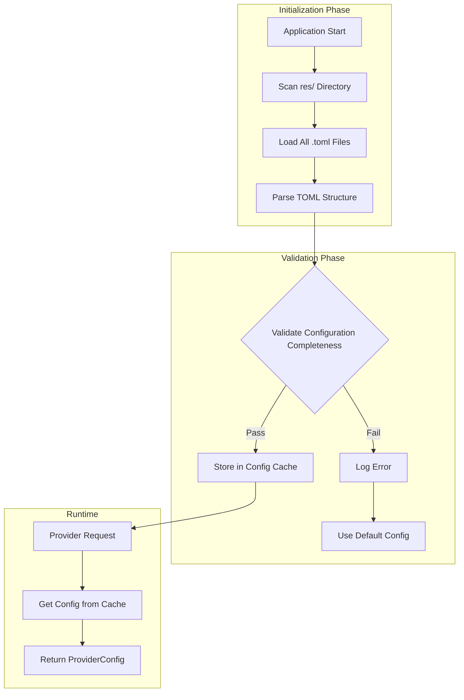

### Configuration Hierarchy

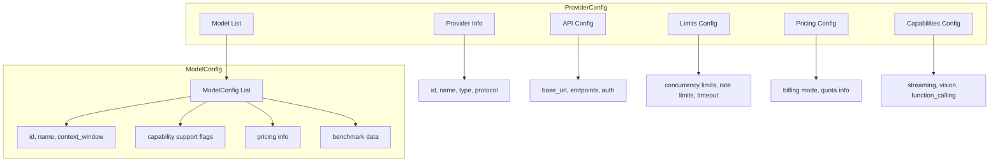

## Configuration Priority

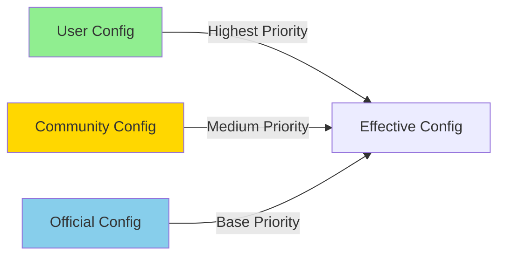

### Priority Merge Rules

| Layer | Source | Description |
| --- | --- | --- |
| 1 | Official Config | Provider official documentation data, as base defaults |
| 2 | Community Config | Community contributed optimized config, overrides official data |
| 3 | User Config | User-defined config, highest priority |

## Pricing Models

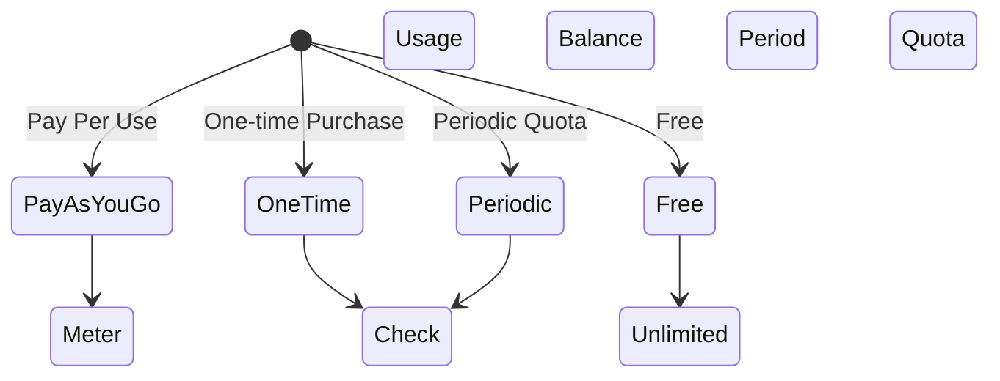

### Pricing Model Comparison

| Model | Applicable Scenarios | Characteristics |
| --- | --- | --- |
| PayAsYouGo | OpenAI, Anthropic | Pay per token, real-time deduction |
| OneTime | Prepaid packages | Pre-purchase quota, use until exhausted |
| Periodic | GLM China, etc. | Periodic quota reset |
| Free | Ollama local models | No cost limits |

## Provider Type Classification

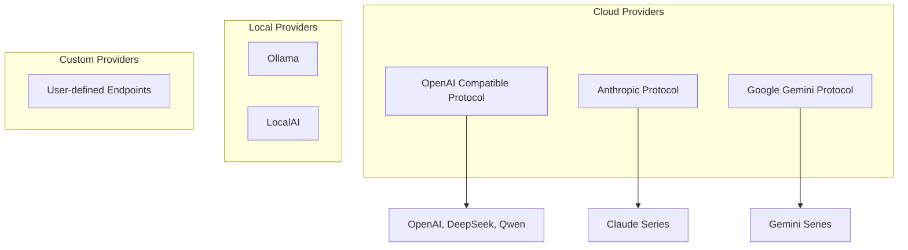

## Hot Reload Mechanism

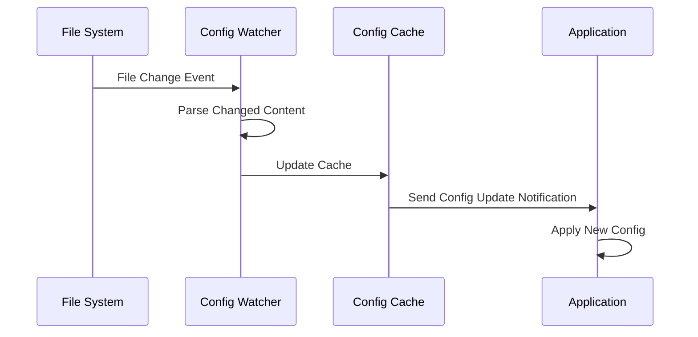

## Error Handling Strategy

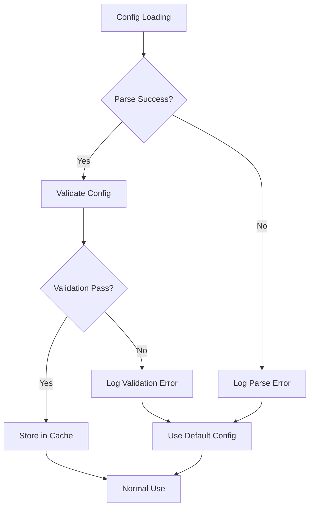

## Extensibility Design

### Adding New Provider

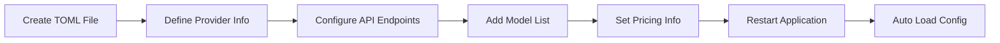

### Configuration Validation Rules

| Field | Validation Rule | Error Handling |
| --- | --- | --- |
| provider.id | Non-empty, unique | Reject loading, log error |
| api.base_url | Valid URL format | Use default value |
| models[].id | Non-empty | Skip that model |
| pricing.model | Enum value check | Default PayAsYouGo |

## Security Considerations

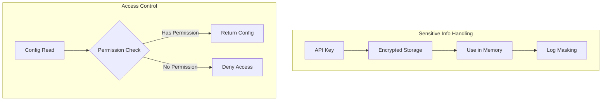

## Future Extensions

| Feature | Description | Priority |
| --- | --- | --- |
| Config Hot Reload | Load external config files at runtime | High |
| Config Validation | Validate config completeness at startup | High |
| Config Merging | User config overrides default config | Medium |
| Config Import/Export | Support config file import/export | Medium |
| Agent Update | Auto-update config from official docs | Low |

# Provider Metadata Management Design

## Overview

The Provider Metadata Management system is responsible for dynamically fetching configuration information from official LLM Provider documentation, enabling automated updates and validation of configuration data.

## Core Problem

The current implementation contains hardcoded usage statistics and lacks dynamic Provider data support. An automated metadata acquisition and management mechanism needs to be established.

## Architecture Design

### Data Flow Architecture

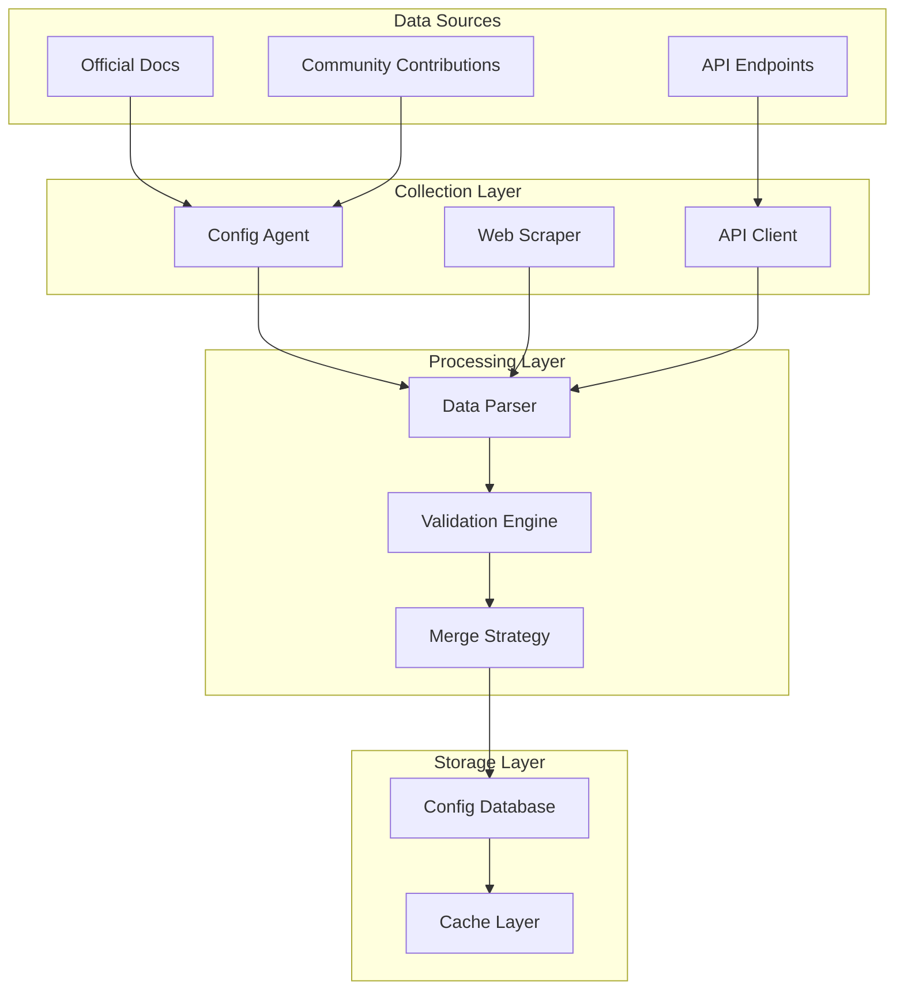

### Configuration Priority Model

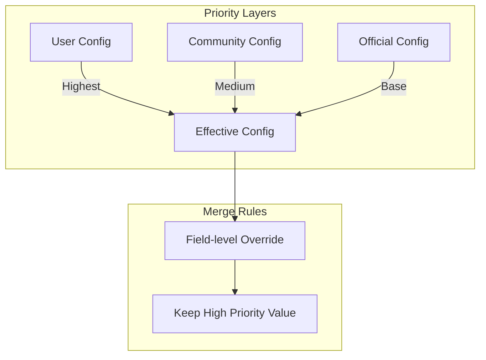

## Metadata Structure

### Provider Configuration Hierarchy

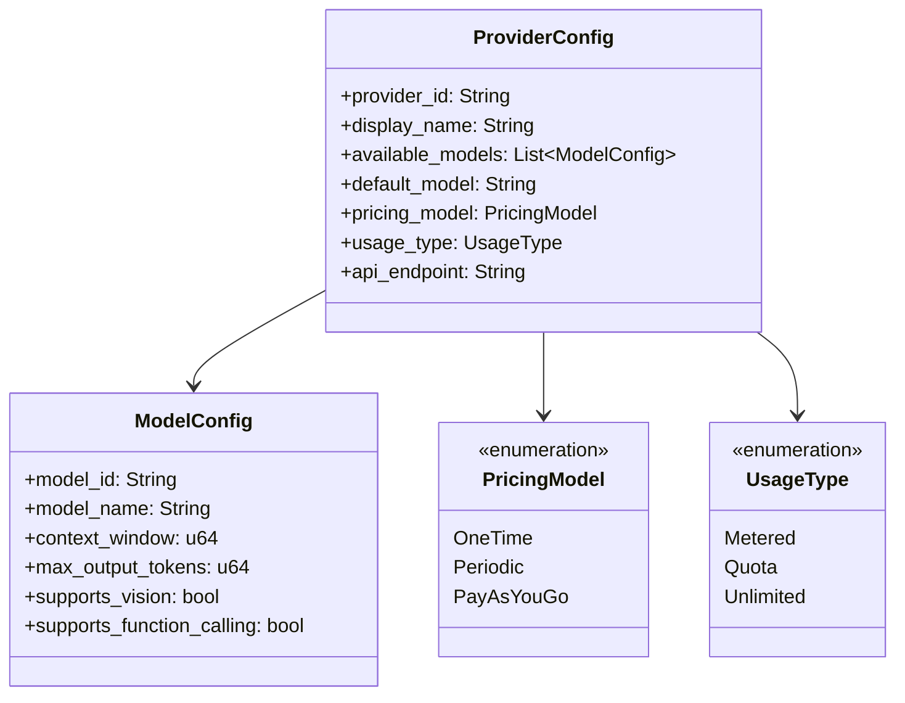

### Configuration Source Classification

| Source Type | Description | Reliability | Update Frequency |
| --- | --- | --- | --- |
| Official | Provider official documentation | High | Automatic periodic |
| Community | Community contributed data | Medium | Manual update |
| UserOverride | User customized | Highest | Real-time |

## Agent Collection System

### Collection Process

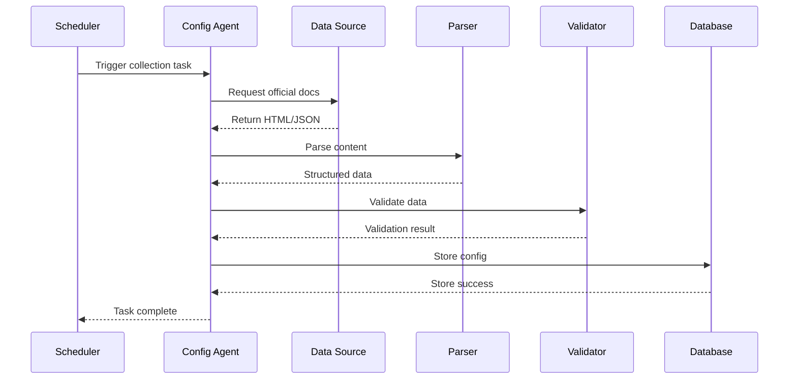

### Provider Agent Responsibilities

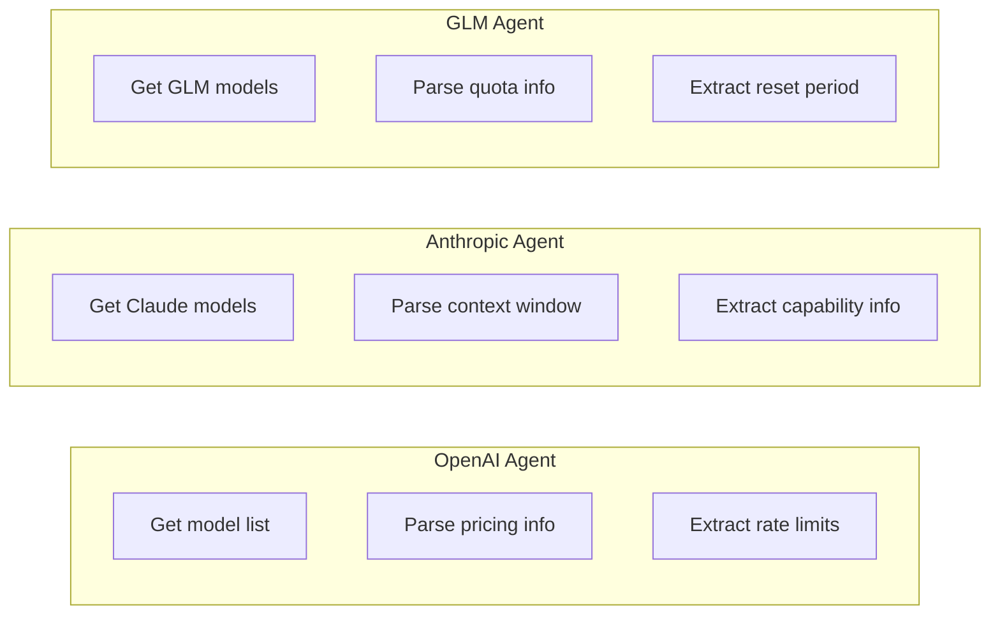

## Data Validation Mechanism

### Validation Process

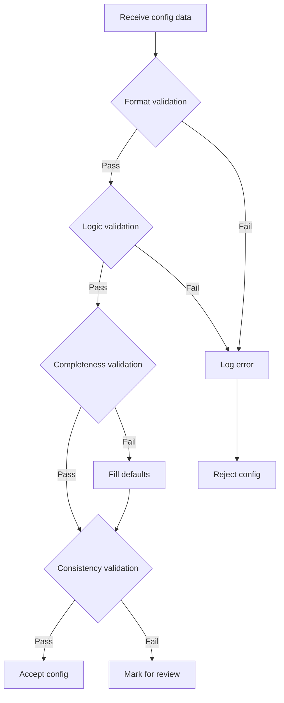

### Validation Rules

| Validation Type | Check Content | Failure Handling |
| --- | --- | --- |
| Format validation | Data types, field formats | Reject and log |
| Logic validation | Value ranges, enum values | Use default values |
| Completeness validation | Required fields exist | Fill default values |
| Consistency validation | Cross-field relationships correct | Mark for review |

## Configuration Merge Strategy

### Field-level Merge

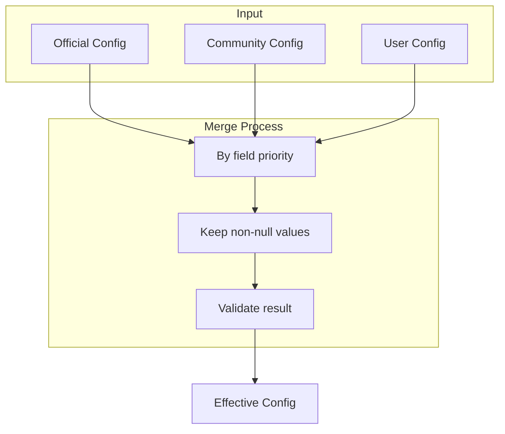

### Merge Example

| Field | Official Value | Community Value | User Value | Final Value |
| --- | --- | --- | --- | --- |
| context_window | 128000 | - | 64000 | 64000 |
| max_concurrent | 100 | 50 | - | 50 |
| pricing_model | PayAsYouGo | - | - | PayAsYouGo |

## User Configuration Interface

### Configuration File Structure

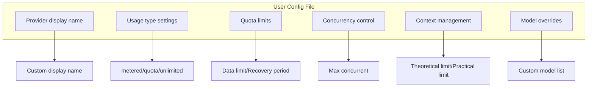

## Scheduled Update Mechanism

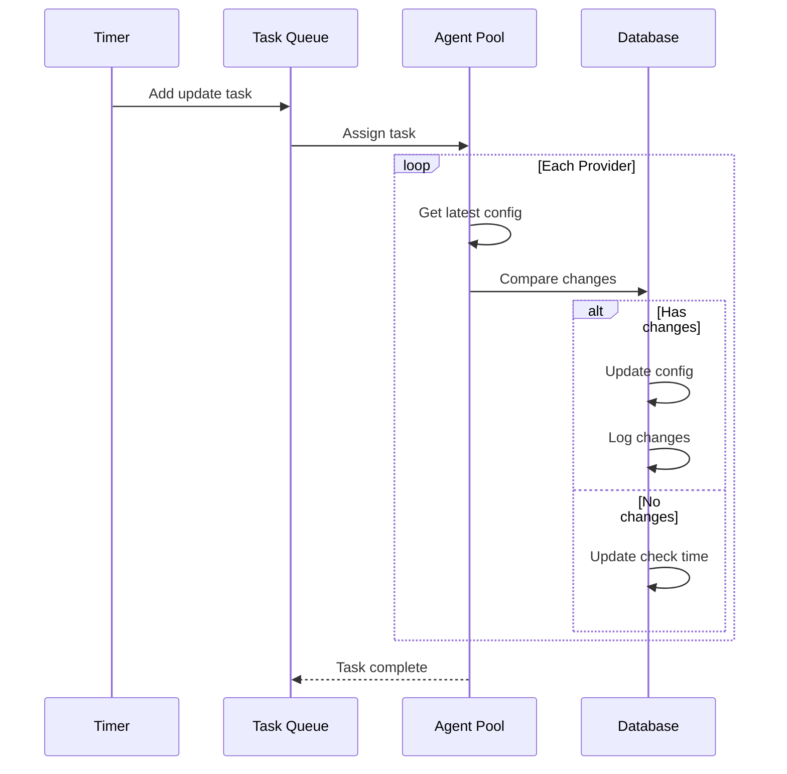

## Error Handling

### Collection Failure Handling

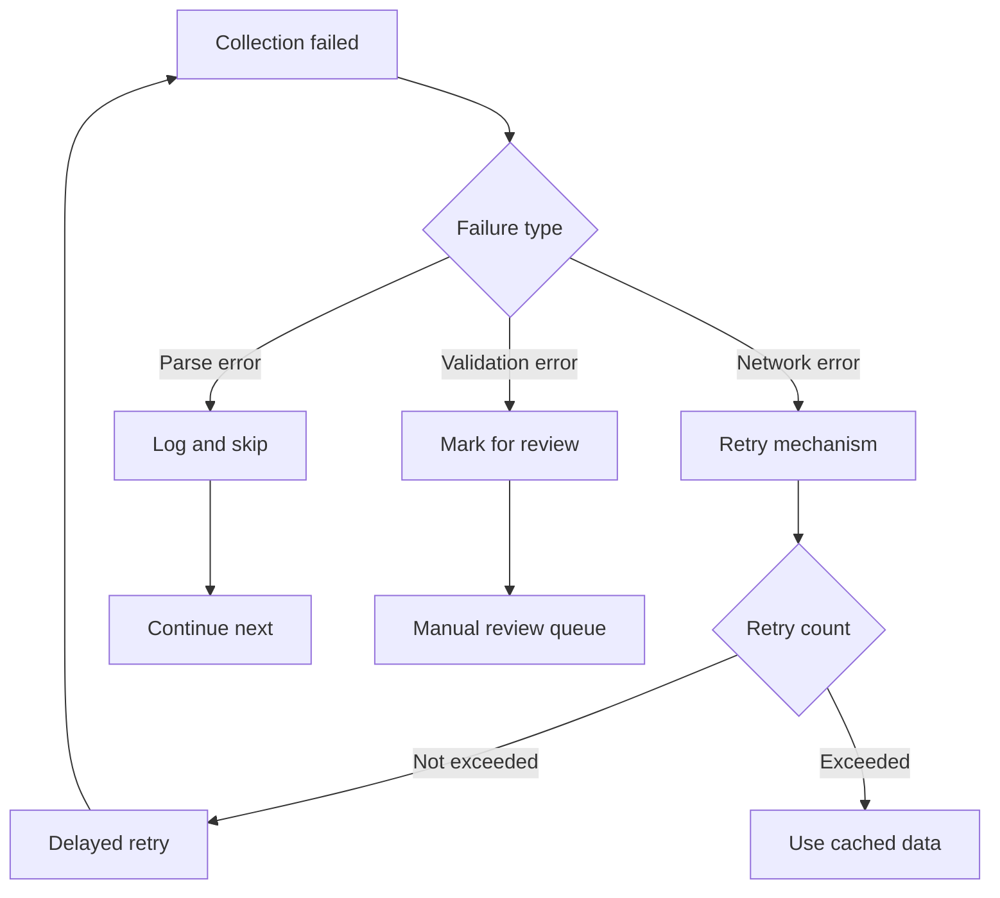

## Extensibility Design

### Adding New Provider

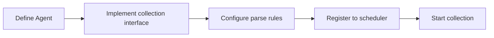

### Extension Points

| Extension Type | Description | Implementation |
| --- | --- | --- |
| New Provider | Add new config source | Implement Provider Agent interface |
| New field | Extend config structure | Update data model and validation rules |
| New validation rule | Add validation logic | Add validator implementation |

## Layer3 Agent Implementation

### ProviderScratch Agent

`ProviderScratch` is the first Layer3 official Agent, serving as an example implementation of scraping facilities.

```mermaid
flowchart TB
    subgraph ProviderScratch Agent
        A[Agent Entry] --> B{Execution Mode}
        B -->|TUI Mode| C[Interactive Interface]
        B -->|CI Mode| D[Automated Execution]

        C --> E[Select Provider]
        D --> F[Read env vars]

        E --> G[Call Skill]
        F --> G

        G --> H[Scrape docs]
        H --> I[Parse data]
        I --> J[Generate TOML]

        J --> K{Confirm commit?}
        K -->|Yes| L[Write to workspace]
        K -->|No| M[Discard changes]

        L --> N[Request user commit]
    end
```

### Skill Architecture

Each Provider corresponds to an independent Skill:

```mermaid
graph LR
    subgraph Skills
        A[openai]
        B[anthropic]
        C[glm]
        D[deepseek]
        E[qwen]
        F[gemini]
    end

    subgraph Shared Components
        G[Doc Scraper]
        H[Data Parser]
        I[TOML Generator]
    end

    A --> G
    B --> G
    C --> G
    D --> G
    E --> G
    F --> G

    G --> H
    H --> I
```

### Directory Structure

```mermaid
flowchart LR
    Root[".amphoreus/provider_scratch/"]
    AT["agent.toml"]
    OV["overview/"]
    SK["skills/"]
    Root --> AT
    Root --> OV
    Root --> SK
    OV --> ZH["zhs.md"]
    SK --> OA["openai/"]
    SK --> AN["anthropic/"]
    SK --> GL["glm/"]
    SK --> DS["deepseek/"]
    SK --> QW["qwen/"]
    SK --> GE["gemini/"]
    OA --> OAP["prompt.md"]
    AN --> ANP["prompt.md"]
    GL --> GLP["prompt.md"]
    DS --> DSP["prompt.md"]
    QW --> QWP["prompt.md"]
    GE --> GEP["prompt.md"]
```

### CI Automation

```mermaid
flowchart LR
    A[Scheduled trigger] --> B[Checkout code]
    B --> C[Run ProviderScratch]
    C --> D{Detect changes}
    D -->|Has changes| E[Create branch]
    E --> F[Commit changes]
    F --> G[Create PR]
    G --> H[Wait for review]
    D -->|No changes| I[Complete]
```

### Environment Variables

| Variable Name | Description |
| --- | --- |
| `AMPHOREUS_PROVIDER_SCRATCH_PROVIDERS` | List of providers to scrape |
| `AMPHOREUS_PROVIDER_SCRATCH_OUTPUT_DIR` | Output directory path |
| `AMPHOREUS_PROVIDER_SCRATCH_GIT_BRANCH` | Target Git branch |
| `AMPHOREUS_PROVIDER_SCRATCH_DRY_RUN` | Dry run only |

## Future Plans

| Feature | Description | Priority |
| --- | --- | --- |
| Config version control | Track config change history | High |
| Change notification | Notify users on config updates | Medium |
| Config rollback | Support rollback to historical versions | Medium |
| Smart recommendations | Recommend configs based on usage patterns | Low |
| GitHub巡回 Agent | Auto-create PRs to update configs | High |
