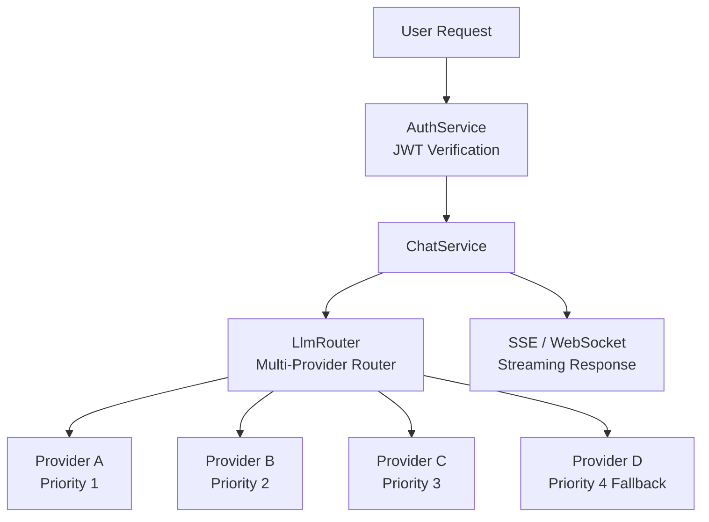
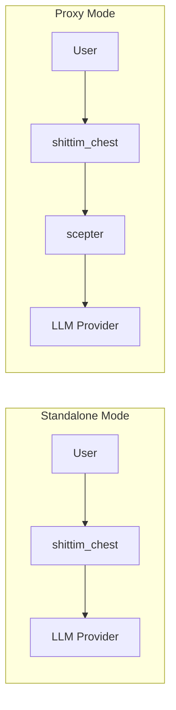

+++
title = "Independent LLM Architecture"
description = """shittim-chest has a fully independent LLM routing layer that does not depend on entelecheia. Users can configure multiple LLM Providers, and the built-in router automatically selects based on priority"""
lang = "en"
category = "design"
subcategory = "webui"
+++

# Independent LLM Architecture

## Overview

shittim-chest has a fully independent LLM routing layer that does not depend on entelecheia. Users can configure multiple LLM Providers, and the built-in router automatically selects based on priority and availability. This is shittim-chest's core differentiating capability against Open WebUI.

## Architecture



## Core Capabilities

### 1. Multi-Provider Priority Routing

```text
Each Provider has a priority field (lower number = higher priority).
Requests are attempted from highest to lowest priority:
  → Provider A (priority=1) available → use
  → Unavailable → Provider B (priority=2) available → use
  → Unavailable → ... → return error
```

### 2. Automatic Fallback

When a higher-priority Provider returns an error (timeout, rate limit, unreachable), the router automatically switches to the next available Provider, transparent to the user.

### 3. API Key Encryption Storage

All Provider API Keys are statically encrypted with AES-256-GCM and stored in `shittim_chest_db`. The encryption key is provided via the `ENCRYPTION_KEY` environment variable. Even if the database is compromised, API Keys remain unreadable.

### 4. Dual-Protocol Streaming

| Protocol | Endpoint | Use Case |
| --- | --- | --- |
| SSE | `/api/chat/stream` | Simple HTTP streaming, proxy-compatible, native browser support |
| WebSocket | `/ws/chat/stream` | Bidirectional communication, supports cancellation and real-time interaction |

### 5. OpenAI Compatibility

All Provider interfaces follow the OpenAI `/v1/chat/completions` format, allowing integration with any OpenAI API-compatible service (DeepSeek, OpenAI, local Ollama/LM Studio, etc.).

## Provider Management

### Configuration Sources

| Method | Use Case |
| --- | --- |
| Environment variables (`LLM_DEFAULT_PROVIDER_*`) | Quick start, single-Provider scenarios |
| Database CRUD (`/api/providers/*`) | Multi-Provider, dynamic management |
| arona admin panel | Graphical management |

### Seed Provider

On first startup, if the `LLM_DEFAULT_PROVIDER_*` environment variables are set, `db-init` automatically creates a seed Provider. Additional Providers can be added later via the arona admin panel.

## Standalone Mode vs Proxy Mode



| Mode | Condition | Behavior |
| --- | --- | --- |
| Standalone | scepter not configured (or `Proxy: disabled`) | Calls LLM Provider directly |
| Proxy | scepter URL configured | Forwards through proxy layer to entelecheia Agent processing |

Standalone mode fully delivers a complete chat experience: conversation management, message persistence, search, export. Proxy mode adds Agent orchestration capabilities.

## Technical Implementation

- **Router**: `packages/shittim_chest/src/llm/router.rs`, supports priority selection + fallback
- **Client**: `packages/shittim_chest/src/llm/client.rs`, based on `reqwest` + `rustls` (no OpenSSL dependency)
- **Provider CRUD**: `packages/shittim_chest/src/api/providers.rs`, standard REST endpoints
- **Encryption**: `aes-gcm` crate, `ENCRYPTION_KEY` environment variable
