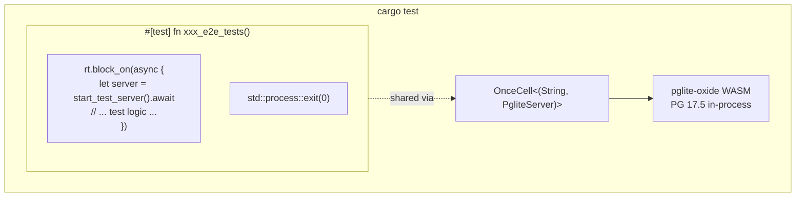

+++
title = "Embedded Test Database (pglite-oxide)"
description = """shittim-chest uses [pglite-oxide](https://crates.io/crates/pglite-oxide) as an embedded PostgreSQL for all integration and E2E tests. No external Postgres, Docker, or `testcontainers` is needed — test"""
lang = "en"
category = "design"
subcategory = "webui"
+++

# Embedded Test Database (pglite-oxide)

## Overview

shittim-chest uses [pglite-oxide](https://crates.io/crates/pglite-oxide) as an embedded PostgreSQL for all integration and E2E tests. No external Postgres, Docker, or `testcontainers` is needed — tests run with a single `cargo test` command on any machine.

## Design Motivation

Previously, integration tests relied on `postgresql_embedded`, which downloads a full PostgreSQL binary (~100 MB) at runtime. This caused slow startup, platform-specific failures, and CI flakiness. pglite-oxide packages PostgreSQL 17.5 as a WASM module via the wasmer runtime — in-process, portable, and fast (~96 ms cold start).

## Architecture



## Key Decisions

| Decision | Rationale |
| --- | --- |
| `pglite-oxide` (WASM) over `postgresql_embedded` (native binary) | No ~100 MB download, no platform-specific PG binary, ~96 ms startup |
| `pglite-oxide` over `pglite-rust-bindings` | Published on crates.io (v0.5.0), faster startup, mature builder API with extension support |
| `tower::ServiceExt::oneshot` over `reqwest` | Avoids tokio runtime deadlock between sqlx pool background tasks and hyper HTTP server |
| Single `#[test]` runner with `std::process::exit(0)` | sqlx `PgPool` spawns persistent background tasks (idle reaper, health checks) that keep the tokio runtime alive. `exit(0)` bypasses this hang |
| `max_connections=1` | PGlite fundamental limitation — single connection only |
| `OnceCell<(String, PgliteServer)>` | Shared PG instance across sub-tests in the same binary run; `PgliteServer` must stay alive (not dropped) |
| `pglite-oxide` in `[dev-dependencies]` only | wasmer runtime must NOT leak into production builds |

## Test Harness Pattern

```rust
// tests/common/mod.rs
static PG: OnceCell<(String, PgliteServer)> = OnceCell::const_new();

async fn ensure_pg_url() -> String {
    PG.get_or_init(|| async {
        let server = PgliteServer::builder()
            .start()
            .expect("Failed to start pglite-oxide");
        let url = server.database_url();
        // connect, run migrations, close initial connection
        (url, server)
    }).await.0.clone()
}

pub async fn start_test_server() -> TestServer {
    let db_url = ensure_pg_url().await;
    let db = Database::connect(/* max_connections=1 */).await;
    // build AppState, Router, return TestServer wrapping tower oneshot
}
```

```rust
// tests/xxx_tests.rs
# [test]
fn xxx_e2e_tests() {
    let rt = tokio::runtime::Runtime::new().unwrap();
    rt.block_on(async {
        let mut server = common::start_test_server().await;
        // ... all sub-tests using server.request() ...
    });
    std::process::exit(0);
}
```

## Tables Created

All 13 tables are created via SeaORM migrations during test setup:

`auth_users`, `sessions`, `api_keys`, `oauth_connections`, `channel_configs`, `channel_messages`, `channel_pairings`, `conversations`, `messages`, `llm_providers`, `remote_devices`, `device_sessions`, `system_settings`, `workspace_sessions`

## PGlite Limitations

1. **Single connection**: `max_connections` must be 1. Multiple pools to the same PGlite instance will hang.
1. **Strict type casting**: PGlite is stricter than standard PostgreSQL. Queries like `uuid_column = text_value` will fail — always cast explicitly.
1. **No concurrent test runners**: All async tests sharing one PGlite instance must run sequentially within a single `#[test]` function.
1. **Pool hang on drop**: `sqlx::PgPool::close()` may hang indefinitely. Use `std::process::exit(0)` to terminate the test process.
