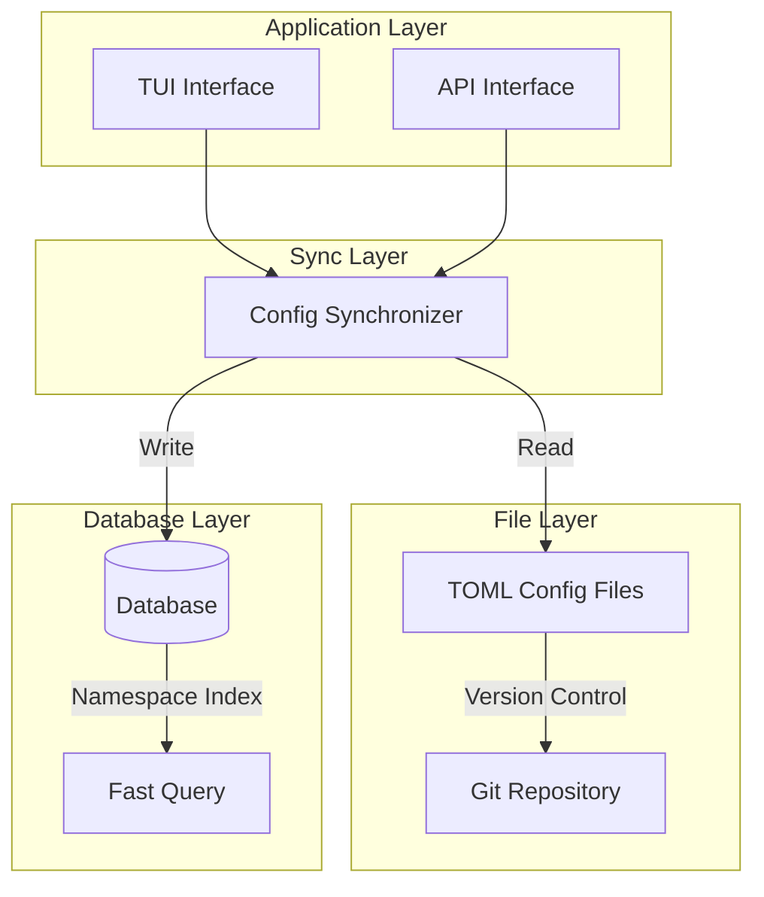
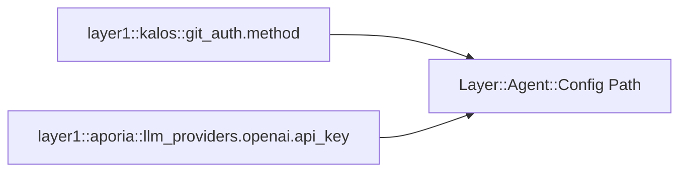
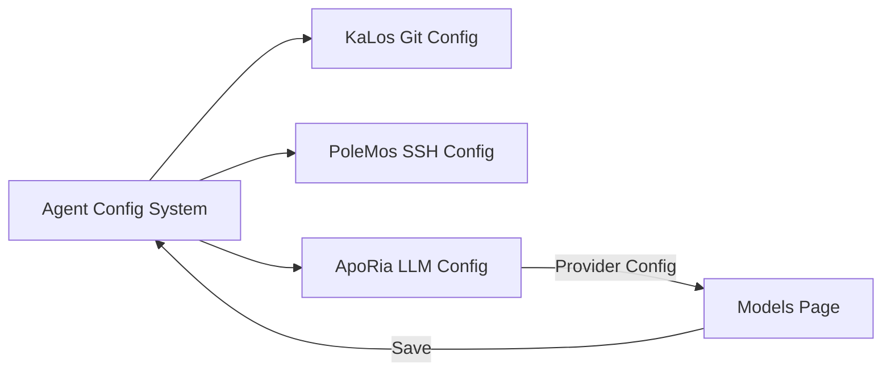

# Agent Configuration System Design

## Overview

The Agent Configuration System provides a unified configuration management mechanism, supporting TOML file storage and database persistence, implementing configuration version management and hot reloading.

## Core Principles

### Dual-layer Storage Architecture



### Configuration Namespace

Adopting hierarchical namespace design:



## Architecture Design

### Configuration Lifecycle

```mermaid
stateDiagram-v2
    [*] --> Default: System Defaults
    Default --> FileConfig: Load TOML
    FileConfig --> DbSync: Sync to Database
    DbSync --> Active: Configuration Active

    Active --> Updated: User Modification
    Updated --> Validated: Format Validation
    Validated --> DbSync: Save Changes

    Active --> HotReload: Hot Reload Trigger
    HotReload --> Active: No Restart Required
```

### TUI Configuration Interface

```mermaid
graph TB
    subgraph Agent Document Modal
        Tabs[Overview | Config | MCP | Skills]
        Tabs --> Content[Content Area]
    end

    subgraph Configuration Page
        Groups[Configuration Group List]
        Groups --> Group1[Git Auth Config]
        Groups --> Group2[Source Management Config]
        Groups --> AddGroup[Add New Config Group]
    end

    Content --> Groups
```

## Relationship with Other Modules



## Design Considerations

### Security

- Sensitive configuration encrypted storage
- Access permission control
- Configuration change audit

### Extensibility

- Support custom configuration types
- Flexible validation rules
- Pluggable configuration handlers

### Consistency

- File and database synchronization
- Configuration version management
- Conflict detection and resolution
