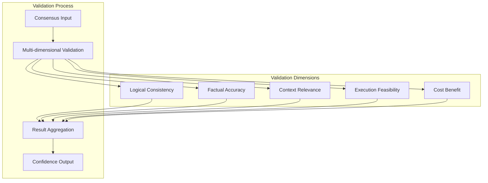
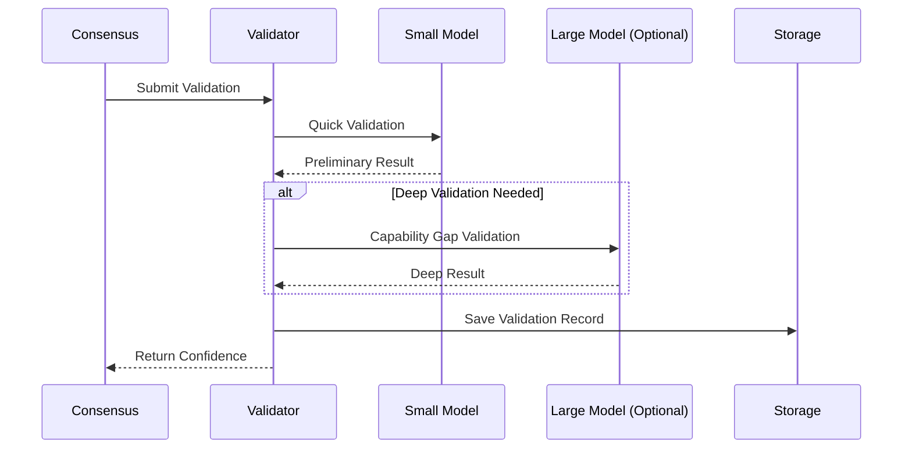
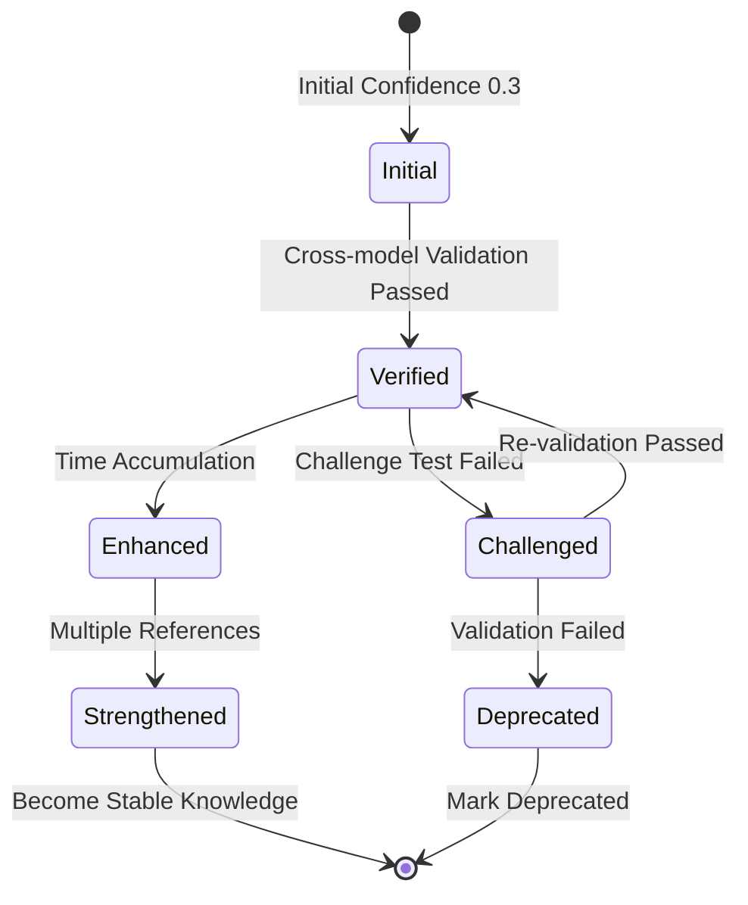
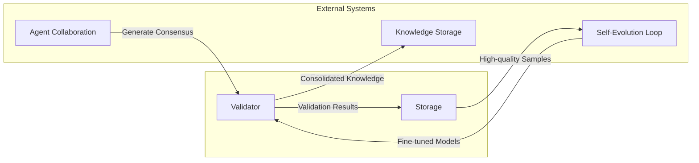

# Consensus Validation Mechanism

## Overview

The Consensus Validation Mechanism is a core component of the multi-Agent collaboration system, used to validate and assess the reliability and accuracy of consensus formed by multiple Agents, ensuring system output quality.

## Core Principles

### Multi-dimensional Validation Framework

The system performs comprehensive validation through five dimensions:

### Validation Dimension Description

| Dimension | Validation Target | Key Indicators |
| --- | --- | --- |
| Logical Consistency | Is consensus self-consistent | No contradictions, complete reasoning |
| Factual Accuracy | Are factual statements correct | Consistent with known knowledge |
| Context Relevance | Is it relevant to current task | Relevance score |
| Execution Feasibility | Is the plan executable | Operability assessment |
| Cost Benefit | Is cost-benefit reasonable | ROI evaluation |

## Architecture Design

### Progressive Validation Process

### Confidence Accumulation Mechanism

## Integration with Other Systems

## Design Considerations

### Cost Control

- Prioritize small models for validation
- Enable large models only when necessary
- Validation result caching and reuse

### Quality Assurance

- Multi-dimensional cross-validation
- Time accumulation enhances credibility
- Challenge tests discover potential issues

### Traceability

- Complete validation history records
- Support audit and backtracking
- Statistical analysis support
