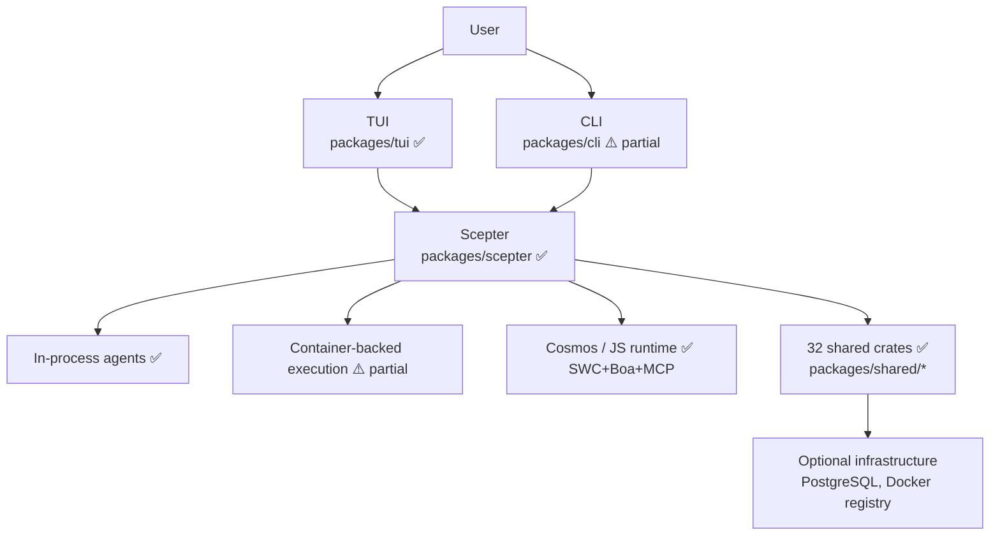
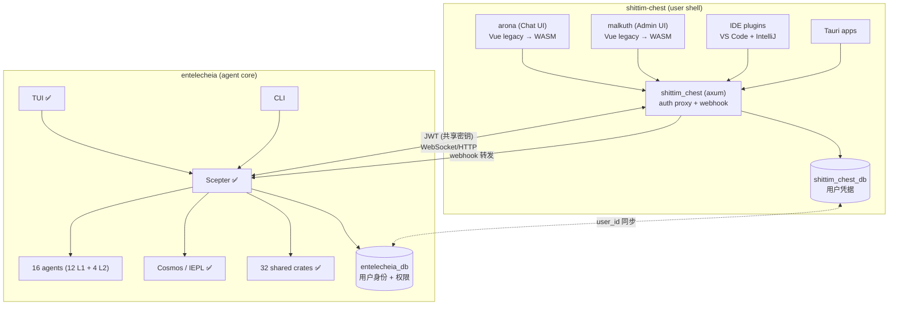
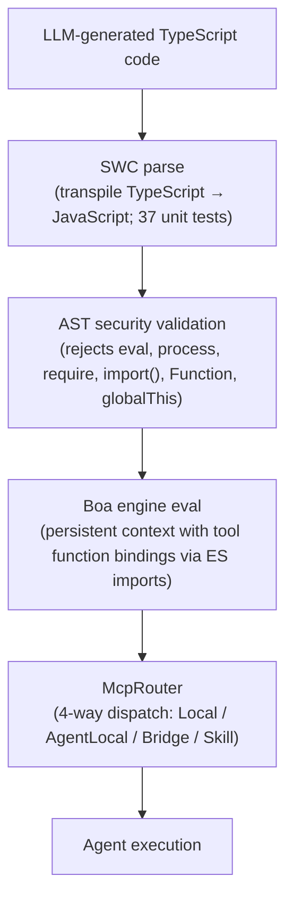
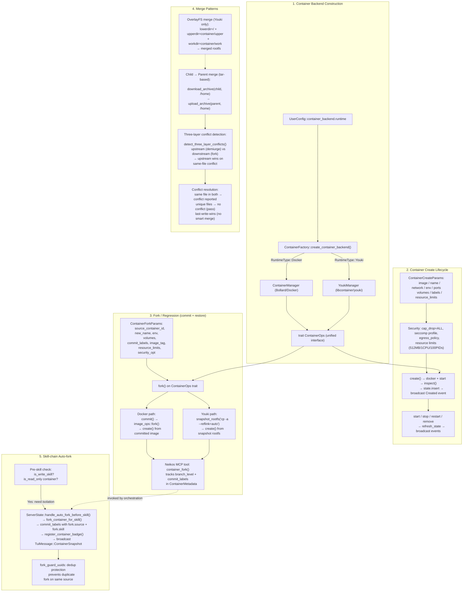
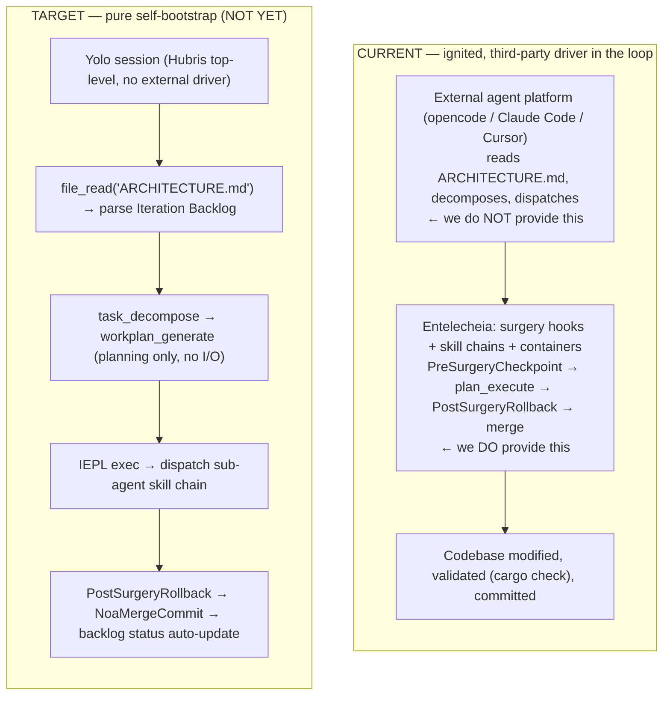
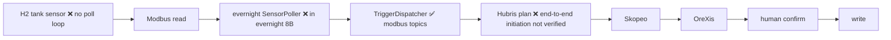
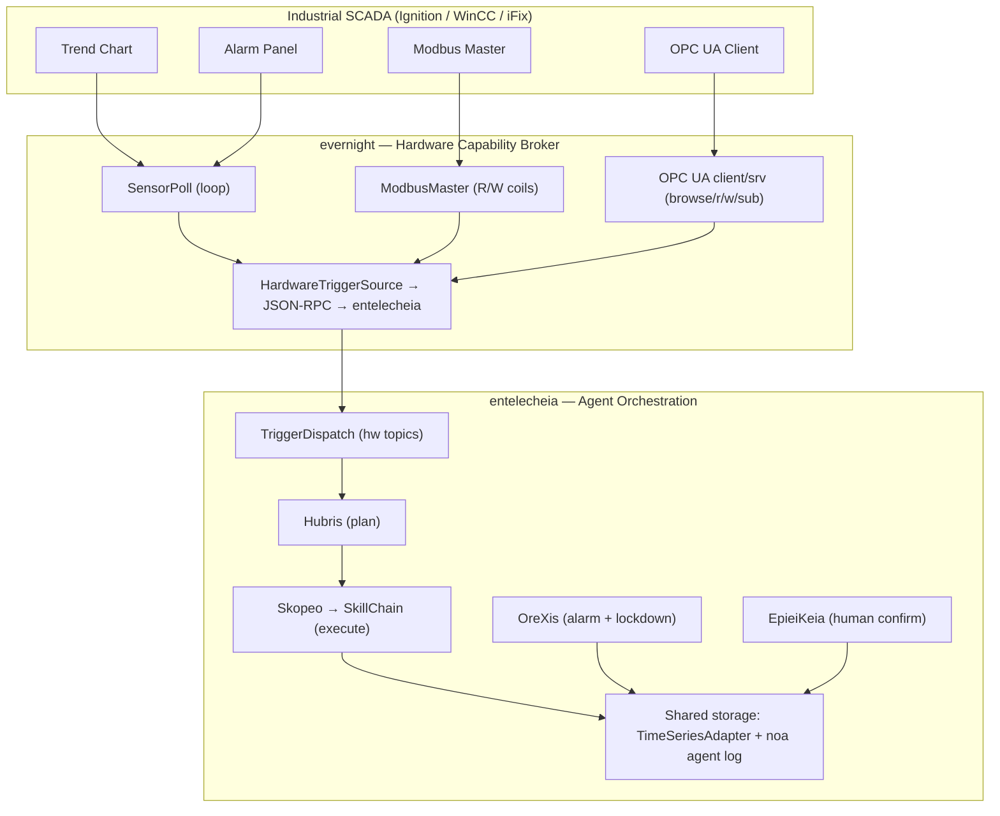

# Architecture

> **Version**: 0.2.0 — early development, not production-ready.
> **Last verified**: 2026-06-17 (deep analysis — recalibrated against actual code)
> This document describes both implemented code and intended design.
> [Read the Current Gaps](#current-gaps) section before making deployment decisions.

## Repository Split

Entelecheia has completed its major split: the user-facing shell layers have been migrated to a sibling project **shittim-chest** (`../shittim-chest`). Entelecheia now focuses exclusively on the multi-agent orchestration core.

| Repository | Scope |
| --- | --- |
| **entelecheia** | Scepter orchestration, 16 agents (12 L1 + 4 L2), Cosmos/IEPL runtime, 32 shared crates |
| **shittim-chest** | arona (Chat UI frontend), malkuth (Admin UI), `shittim_chest` backend (axum proxy + auth + webhook), IDE plugins, Tauri apps |

## Current Scope

Entelecheia is a Rust workspace of **56 crates** centered on `packages/scepter` (orchestration server), **32 shared crates** under `packages/shared/` (fully decomposed from a former monolithic crate; 5 planned sub-crates were never materialized and their functionality was inlined into sibling crates), and `packages/tui` (terminal UI). The TUI is the most complete user interface. `packages/cli` has service management, chat, and timeline commands.

The following components have been **migrated to shittim-chest** and removed from this repository:

- `packages/webui` (HTTP/static host, WebSocket bridge) — removed
- `packages/webui_frontend` (WASM frontend) — removed (Phase 1)
- `packages/ide/vscode` (VS Code extension) — removed (Phase 1)
- `packages/ide/idea` (IntelliJ plugin) — removed (Phase 1)
- `packages/app/tauri*` (Tauri desktop/mobile apps) — removed (Phase 1)
- All WebUI state, commands, and rendering in TUI/CLI/Scepter/shared crates — removed (Phase 2)

The project has undergone a major decomposition: the old monolithic `packages/shared` crate (38K lines, 187 .rs files) has been fully dissolved into focused sub-crates. 5 crate boundaries that appeared in early layering diagrams were never materialized as separate crates; their intended functionality lives inside other crates (e.g., domain enums are inlined into `shared-domain-agent`, thread types into `shared-state-types`). All internal dependency declarations use `workspace = true` for version consistency.

## Component Reality Check

| Component | Implemented | Design-only / Stub | Verdict |
| --- | --- | --- | --- |
| **Scepter** (orchestration) | Auth/RBAC, provider routing, agent lifecycle, skill chain execution, WebSocket/HTTP endpoints, key encryption. 351 unit tests across 49 source files. `AppState` has `FromRef` impls for 5 sub-states; agent_lifecycle handlers use `State<Arc<Persistence>>` | Complete API surface. Batch processor defined but not instantiated. | 🟢 Real |
| **TUI** | Full lifecycle: splash, Docker init, timeline, agent modals, i18n (8 languages), provider config, theme support. 329 unit tests across 47 source files. `ComponentStore` split into 5 sub-structs; AppState reduced to 6 fields. Connects via Unix socket (preferred) or WebSocket fallback. | Feature parity with Scepter API. `CancelRequest`/`ExecuteSudoCommand` not yet wired. | 🟢 Real |
| **CLI** | Service management, chat, timeline, agent lifecycle commands. 28 unit tests. | Not at feature parity with TUI | 🟡 Partial |
| **WebUI** | Removed — migrated to shittim-chest | — | ✅ Complete |
| **WebUI Frontend** | Removed — migrated to shittim-chest | — | ✅ Complete |
| **Cosmos / JS Runtime** | Boa engine, ES module import dispatch (`__native_dispatch` internal resolution), namespace generation, McpRouter with circuit breaker+retry. `.d.ts` auto-gen from `#[derive(TS)]` populates TypeScript type files. 50 unit tests. | SWC TypeScript transpile pipeline implemented and tested (37 unit tests). Full automated pipeline (LLM output → SWC → Boa) bridgeable via `shared_iepl::client` with `in-process-transpile` feature flag. | 🟢 Active |
| **16 Agents (12 L1 + 4 L2)** | All 16 agents compile with MCP tool implementations. 147 MCP tools total — **all real**. Zero `unimplemented!()` or `todo!()` macros in the codebase. | Classic SE tools marked `maturity: Stub` in metadata but have real implementations (cargo clippy, eslint, pylint, go vet subprocess calls; code metrics; extract-function refactoring). | 🟢 Active |
| **Layer2: Web Automation** | 11 MCP tools — all real implementations via WebDriver protocol: session management, navigation, screenshot, script execution, console/network logs, keyboard, mouse, recording. `maturity: Experimental` for 10 tools. | — | 🟢 Active |
| **Layer2: Classic SE** | 7 MCP tools — all real implementations: static_analyze (cargo clippy/eslint/pylint/go vet), code_review (detects long functions, deep nesting, magic numbers), quality_check (LOC, complexity, letter grades), refactor_suggest, lsp_diagnose, lsp_symbols, lsp_refactor (real rename and extract-function). 2 unit tests. | LSP refactor's inline operation preview-only (needs LSP server for full resolution). | 🟢 Active |
| **Layer2: Industrial IoT** | 7 MCP tools — all real implementations: modbus_read, modbus_write, s7comm_probe, serial_discover, opcua_browse, opcua_read, opcua_write. Industrial protocol communication (Modbus RTU/TCP, Siemens S7comm, OPC UA client). `maturity: Experimental`. | Migrated from SkeMma/PoleMos as part of Layer2 consolidation. | 🟢 Active |
| **Layer2: Remote Operations** | 16 MCP tools — all real implementations: SSH session management, remote command execution, file transfer (SFTP), host information gathering, GUI automation (X11/VNC screenshot, input, navigation), system monitoring. `maturity: Experimental`. | Migrated from SkeMma/PoleMos as part of Layer2 consolidation. | 🟢 Active |
| **Other Layer2 designs** | All 4 planned L2 agents now have implementations. `res/prompts/domain_agents/` contains config/skill docs for all implemented agents. | `docs/plans/` was never created | 🟢 Active |
| **Container Isolation** | Two-tier runtime: Docker/Podman (outer orchestration) via Bollard, Youki/libcontainer (inner sandbox) via libcontainer. Non-root user, cap_drop=ALL, no-new-privileges, dedicated Docker network, Unix socket IPC, resource limits (512MB/1CPU/100 PIDs) on create, fork, merge, and recreate. Custom seccomp profiles. Fork/commit/snapshot fully functional on both backends. | AppArmor profiles not implemented. `read_only_rootfs` not enabled by default. | 🟡 Partial |
| **Memory / RAG** | API-backed embedding (OpenAI-compatible, hash SHA-256 fallback, ONNX fastembed BGE-M3). 3 embedding backends fully implemented. PgVector store, in-memory vector documents, graph traversal, RagContextBuffer for ambient context injection. 39 unit tests. | Embedding→RAG connection decoupled (caller supplies pre-computed embeddings). PgVector path newer/less tested than in-memory fallback. RAG subscription sync is reserved (not yet implemented). | 🟡 Partial |
| **IEPL Pipeline** | Boa engine + MCP bridge + namespace filtering + circuit breaker. SWC TypeScript parsing implemented and tested (37 unit tests). `.d.ts` auto-generation operational. IEPL codegen (Rust types → TS declarations) wired. TS→JS transpile available via `shared_iepl::client` (in-process or subprocess mode). | SWC→Boa chain not integrated for Cosmos container execution path (expects pre-stripped JS). | 🟡 Partial |
| **IDE integrations** | Removed — migrated to shittim-chest | — | ✅ Complete |

## Architecture Diagram

### Current



### Target (post-split)



Legend: ✅ working | ⚠️ partially implemented | 🔴 stub/design

## Crate Dependency Layers

The 32 shared crates are organized in a layered dependency graph:

```mermaid
block-beta
    columns 1
    block:L0["Layer 0 (leaf)"]:1
        shared-core shared-logging shared-macros
    end
    block:L1["Layer 1"]:1
        shared-domain-enums shared-mcp-types shared-text shared-concurrent
    end
    block:L2["Layer 2"]:1
        shared-config shared-agent-registry shared-state-types
    end
    block:L3["Layer 3"]:1
        shared-domain-agent shared-container shared-domain-agent-lifecycle shared-domain-agent-runtime
        shared-domain-thread-types shared-domain-toolchain shared-infra-utils
    end
    block:L4["Layer 4"]:1
        shared-state-sync shared-domain-skills shared-hooks shared-domain-auth shared-container-runtime
        shared-domain-skills-permissions shared-timeline shared-iepl
    end
    block:L5["Layer 5"]:1
        shared-llm-provider shared-prompt shared-custom-agent shared-storage
        shared-infra-jsonrpc shared-infra-services shared-e2e-events shared-adapter shared-plugin_host
        shared-rag shared-embedding shared-security-policy
    end
    L0 --> L1 --> L2 --> L3 --> L4 --> L5
```

Consumers (scepter, agents, tui) import directly from individual sub-crates (e.g., `_shared_domain_agent`, `_shared_llm_provider`). There is no thin aggregator crate — the old monolithic `shared` was fully dissolved. All internal dependencies use `workspace = true` declarations for version consistency.

> **Note:** The diagram above lists 37 crate slots across 6 layers, but only 32 exist as compilable workspace members. The following 5 slots were planned crate boundaries that were never materialized as separate crates: `shared-domain-enums`, `shared-agent-registry`, `shared-domain-thread-types`, `shared-domain-toolchain`, `shared-state-sync`. Their functionality is inlined into sibling crates (e.g., domain enums live inside `shared-domain-agent`; `shared-state-sync` exists only as a workspace alias `_shared_state_sync` pointing to `packages/shared/state_types`).

## Active Agents

The workspace compiles 12 Layer1 agents (111 MCP tools) and 4 Layer2 crates (Web Automation 11 tools, Classic Software Engineering 7 tools, Industrial IoT 7 tools, Remote Operations 16 tools). All agents use the `agent_mcp_module!` macro for MCP tool registration. The macro supports `skill_routing` for agents that need pre-dispatch interception (e.g., Skopeo's `SkillExecutor` dual-dispatch).

**Tool implementation status:** All 147 tools have real implementations. Zero `unimplemented!()` or `todo!()` macros exist anywhere in the codebase. No tool returns a trivial `Ok(())` without real logic.

| Agent | Layer | Current responsibility | Tools | Stubs | Test coverage | Maturity |
| --- | --- | --- |  ---  |  ---  |  ---  | --- |
| **HapLotes** | 1 | Gateway, message routing, transport glue | 2 | 0 | 21 tests | 🟢 Real |
| **SkoPeo** | 1 | Coordination and LLM-facing execution flow | 12 | 0 | 41 tests | 🟢 Real |
| **HubRis** | 1 | Planning, todo management, reporting, issue helpers | 8 | 0 | 65 tests | 🟢 Real |
| **KaLos** | 1 | File and repository operations | 8 | 0 | 20 tests | 🟢 Real |
| **NeiKos** | 1 | Container lifecycle and execution helpers | 17 | 0 | 14 tests | 🟢 Real |
| **SkeMma** | 1 | Script execution and runtime sandboxing | 2 | 0 | 124 tests | 🟢 Real |
| **ApoRia** | 1 | Provider config, knowledge helpers, RAG tools | 11 | 0 | 14 tests | 🟢 Real |
| **EleOs** | 1 | Web search and remote information retrieval | 2 | 0 | 11 tests | 🟢 Real |
| **EpieiKeia** | 1 | Scheduling and maintenance helpers | 8 | 0 | 4 tests | 🟢 Real |
| **OreXis** | 1 | Security policy enforcement (runtime blocking via denylist/allowlist/lockdown) + alarm hierarchy + audit reporting | 20 | 0 | 19 tests | 🟢 Real |
| **PhiLia** | 1 | Memory and data-store related functions | 7 | 0 | 0 tests | 🟡 Zero test coverage |
| **PoleMos** | 1 | Host communication and hardware telemetry | 9 | 0 | 3 tests | 🟡 Low test coverage |
| **Web Automation** | 2 | Browser automation (create, navigate, screenshot, execute, console, network, keyboard, mouse, record) | 11 | 0 | 3 tests | 🟡 Low test coverage (`maturity: Experimental`) |
| **Classic Software Engineering** | 2 | Static analysis, code review, quality check, refactor suggest, LSP diagnose/symbols/refactor | 7 | 0 | 2 tests | 🟡 Low test coverage (`maturity: Stub` in metadata but real implementations) |
| **Industrial IoT** | 2 | Industrial protocol communication (Modbus RTU/TCP, Siemens S7comm, OPC UA client) | 7 | 0 | 0 tests | 🟡 Low test coverage (`maturity: Experimental`) |
| **Remote Operations** | 2 | SSH remote execution, file transfer, GUI automation, system monitoring | 16 | 0 | 0 tests | 🟡 Low test coverage (`maturity: Experimental`) |

## Layer2 and Layer3

- **Layer2 today**: `web_automation` (11 MCP tools), `classic-software-engineering` (7 MCP tools), `industrial_iot` (7 MCP tools), and `remote_operations` (16 MCP tools) are the active Layer2 crates. `classic-software-engineering` provides static analysis, code review, quality checks, refactoring suggestions, LSP diagnostics, symbol extraction, and LSP refactoring — implemented at `packages/domain_agents/classic_software_engineering/`. `industrial_iot` provides industrial protocol communication (Modbus RTU/TCP, Siemens S7comm, OPC UA) — migrated from SkeMma/PoleMos Layer1 tools. `remote_operations` provides SSH remote execution, file transfer, GUI automation, and system monitoring — migrated from SkeMma/PoleMos Layer1 tools. A WASI plugin system (`plugin_host`) with wasmtime + boa TS dual sandbox hosts a reference GitHub webhook plugin; a Trigger architecture (`TriggerDispatcher` / `TriggerTopic` / `TriggerConfig`) dispatches external events to skill chains.
- **Other Layer2 designs**: all 4 planned L2 agents are now implemented. `res/prompts/domain_agents/` contains config/skill/mcp documentation for the implemented L2 agents. The originally planned `docs/plans/` directory was never created.
- **Layer3**: user-defined agents would be loaded from workspace-local `.amphoreus/` directories. CLI commands for subscribe/list/run of external Layer 3 agents exist. The `shared-custom-agent` crate provides partial infrastructure. No actual Layer 3 business logic plugins have been implemented.

## Runtime Patterns

### Exec-Only Tool Exposure

The model-facing tool surface is intentionally small: `exec`, `write_to_var`, and `write_to_var_json`. Internal MCP tools (~146 total across all agents) are invoked from the runtime through ES module imports instead of being exposed directly one by one. This is the project's core architectural innovation — it minimizes LLM context overhead, reduces the attack surface, and centralizes permission enforcement.

### Mixed Execution Model

Scepter coordinates both in-process logic and container-backed execution paths. The main orchestration loop lives in `SkillChainPipeline::execute()` (`packages/scepter/src/state_machine/skill_chain/pipeline.rs`), which has been decomposed into focused phase methods — `resolve_agent_identity()`, `broadcast_skill_started()`, `finalize_execution()`, `route_to_next_skill()` — plus the existing 8 helper methods for guard checks, prompt building, tool whitelisting, and subtask lifecycle. The `ReportDispatchContext` construction is centralized via a `new()` constructor eliminating 3× repetition.

The legacy `run_chain_loop` function in `execution/execution_steps.rs` has been refactored into a thin 6-line wrapper that delegates to `SkillChainPipeline::execute()`.

### IEPL TypeScript Pipeline



The Boa engine + MCP bridge portion works end-to-end. The SWC-based TypeScript transpilation pipeline is implemented and tested (37 unit tests). `.d.ts` auto-generation from Rust `#[derive(TS)]` structs populates TypeScript type files for IEPL autocompletion. The full automated pipeline (LLM output → SWC → Boa with bindings) is bridgeable via `shared_iepl::client` (in-process or subprocess transpile modes). The Cosmos container execution path currently expects pre-stripped JS (SWC→Boa integration not yet in-container).

### Container Construction, Fork, and Merge Logic

The container subsystem is built around a unified `ContainerOps` trait with two interchangeable backends (Docker via Bollard, OCI via youki/libcontainer). Fork operations (commit + create from snapshot) provide the regression/restore mechanism. Tar-based archive transfer and three-layer conflict detection form the merge strategy.

**Two-layer runtime architecture:**

| Layer | Runtime | Default | Scope |
| --- | --- | --- | --- |
| **Outer** (orchestration) | Docker/Podman | `CONTAINER_RUNTIME=docker` | Infrastructure containers: scepter, postgres. Created via init engine, health-checked by TUI. Requires full orchestration (networking, volumes, health checks). |
| **Inner** (cosmos sandbox) | Youki/libcontainer | `COSMOS_CONTAINER_RUNTIME=youki` | Ephemeral agent sandboxes inside scepter. Lightweight, fast-start, seccomp-constrained. |

The runtime selection helpers live in `shared/infra_services/src/container_factory.rs`:

- `outer_runtime_type()` — reads `CONTAINER_RUNTIME`, defaults to `docker`
- `cosmos_runtime_type()` — reads `COSMOS_CONTAINER_RUNTIME`, defaults to `youki`



| Concept | Source File(s) |
| --- | --- |
| Backend construction | `shared/infra_services/src/container_factory.rs` |
| `ContainerOps` trait | `shared/container/src/ops.rs` |
| Docker create/fork | `shared/container/src/lifecycle.rs`, `image_ops.rs` |
| Youki create/fork | `shared/container_runtime/src/manager.rs`, `rootfs.rs` |
| Child→Parent merge | `shared/container/src/copy_ops.rs` (tar download→upload) |
| Three-layer conflict | `shared/container/src/copy_ops.rs` (`detect_three_layer_conflicts()`) |
| Skill-chain auto-fork | `scepter/src/state_machine/skill_chain/container_ops.rs` |
| Neikos fork MCP tool | `agents/neikos/src/mcp/tools/container/container_fork.rs` |
| Container snapshot | `scepter/src/state_machine/snapshot.rs`, `agents/neikos/src/mcp/tools/container/container_snapshot.rs` |

### End-to-End Path Wiring Status

| # | Path | Status | Key Connection Points |
| --- | --- | --- | --- |
| 1 | **Scepter startup → WS → skill chain** | 🟢 Fully wired | `scepter/src/app/setup.rs:876-1653`, `scepter/src/lib.rs:139-361`, `scepter/src/tui_connection/core/message_dispatch.rs:10-140` |
| 2 | **TUI startup → scepter connection** | 🟢 Fully wired | Unix socket (preferred) or WebSocket fallback with full handshake + state sync |
| 3 | **IEPL pipeline (SWC→Boa→MCP)** | 🟡 Partially wired | Transpiler functional (37 tests). Boa+MCP dispatch wired. SWC→Boa bridgeable via `shared_iepl::client` but not in-container. |
| 4 | **Container create/fork/merge** | 🟢 Fully wired | Two-tier: Docker/Podman (Bollard) + Youki (libcontainer). Both implement `ContainerOps` trait. |
| 5 | **Trigger dispatcher (HW event→agent)** | 🟢 Fully wired | Unix socket + WebSocket + PluginHost → `TriggerDispatcher` → `SkillInvoker` |
| 6 | **Telemetry/batch reading** | 🟡 Partially wired | `BatchProcessor` defined, not instantiated. `SensorBatch` parser exists, not called. |
| 7 | **RAG/embedding pipeline** | 🟡 Partially wired | 3 embedding backends fully implemented. RAG engine functional. Embedding→RAG connection decoupled (caller-supplied). |

### Dual Sandbox Isolation

| Execution channel | Can call tool functions (via ES module imports) | Sandbox type | Purpose |
| --- | --- | --- | --- |
| `neikos.exec()` | Yes (via ES module imports) | Boa persistent context | Skill orchestration (agent-to-agent dispatch) |
| `skemma.script_exec()` | No | Independent process sandbox | MCP tool backends (computation/I/O) |

### Current Memory Model

Knowledge and memory features exist in a simpler form than design documents describe: in-memory vector documents, hash-based embeddings, and graph traversal are present. An API-backed embedding service with hash fallback and a PgVector storage backend have been added, but the ONNX + pgvector full stack is not yet integrated end-to-end.

### Provider Integration

26 LLM providers are configured (OpenAI, Anthropic, Google, plus full Chinese LLM ecosystem: DeepSeek, Qwen, GLM, StepFun, Moonshot, Doubao, Hunyuan, etc.). Generation models (image/audio/video/3D) have TOML metadata and a provider trait. Most Chinese providers use OpenAI-compatible protocol only, losing native features.

## Current Gaps

> **This section is the authoritative reference on what is NOT yet working.**

### Critical (blocks non-TUI usage)

- **CLI feature parity substantially improved**: `packages/cli` now supports service management (init, serve, stop), chat, timeline, agent lifecycle queries (via `Cli.Status`), provider configuration CRUD (`config provider {list,get,add,set,rename,remove}`), and MCP tool/skill browsing (`mcp tools`/`mcp skills` via `Cli.ListTools`/`Cli.ListSkills`). The dead `ProcessManager` (agent start/stop/restart as standalone binaries) has been removed — agents run in-process inside scepter. Remaining CLI gaps vs TUI: interactive multi-page UI, i18n, theme, agent container fork/merge visualization.
- **TUI command palette and cancel wired**: `Ctrl+P` opens the command palette (12 commands). `Ctrl+G` sends `request.cancel` to scepter via a new fast-path RPC that sets the cancel flag and aborts the active request JoinHandle. `/clear` and `/settings` slash commands are implemented. `WorkerInput::CancelRequest` documents the Ctrl+G path. `ExecuteSudoCommand` remains unwired (needs security audit).
- **WebUI, IDE plugins, Tauri apps migrated to shittim-chest**: The web-facing user experience (arona chat UI, malkuth admin panel, IDE integration, webhook ingress) is now in the sibling project `../shittim-chest`. All WebUI references have been removed from TUI, CLI, Scepter, and shared crates. (Note: `packages/webui_bindings/` is a residual TypeScript project directory not referenced by any Rust crate.)

### Major (blocks production readiness)

- **Classic Software Engineering has real implementations but needs hardening**: 7 MCP tools are fully functional (subprocess-based cargo clippy/eslint/pylint/go vet; pattern-based code review, quality metrics, extract-function refactoring). The `maturity: Stub` marker in registration metadata is misleading — tools work but would benefit from LSP server integration for deeper analysis. 2 unit tests.
- **Mixed-language error messages**: UI-level i18n strings are properly dispatched by language parameter. Remaining error messages in Rust business logic are in English. Some model name translation strings in `tui/src/ui/modals/models.rs` use Chinese as source data (provider model names).
- **Scepter `AppState` has `FromRef` impls**: `FromRef<AppState>` implemented for `RbacServices`, `Arc<Persistence>`, `Arc<ApiGateway>`, `ConfigServices`, `Arc<ServerState>`. Agent lifecycle handlers migrated to `State<Arc<Persistence>>`. Remaining handlers can opt-in incrementally.

### Moderate (blocks completeness)

- **Container security gaps**: Custom seccomp profiles implemented. AppArmor profiles not implemented. `read_only_rootfs` not enabled by default. Resource limits (512MB memory, 1 CPU, 100 PIDs) enforced on container create, fork, and recreate. Two-tier runtime (Docker/Podman outer + Youki/libcontainer inner) fully functional.
- **OreXis is fully operational**: The security agent enforces tool denylist, allowlist, emergency lockdown, and session-specific policy overrides at invocation time via `SecurityPolicySet`. Alarm hierarchy (`alarm_tools.rs`) with HH/H/L/LL/ROC thresholds, hysteresis, debounce, and escalation paths is implemented. The `audit_only` mode (default: off) can be toggled. 19 tests. Missing: pre-load 97 fault codes from hydro-tin-monitor.
- **Memory/RAG stack mostly wired**: All 3 embedding backends (API, ONNX fastembed, SHA-256 hash fallback) fully implemented. PgVector backend functional. Graph traversal operational. The embedding→RAG connection is decoupled (caller supplies pre-computed embeddings rather than automatic inline computation). RAG subscription sync is reserved (not yet implemented).
- **Telemetry/batch reading partially wired**: `BatchProcessor` struct defined but not instantiated in scepter setup. `try_intercept_sensor_batch()` parser defined but not called in the message dispatch loop. `SensorBatch` message format parsing exists in trigger_intercept.
- **JSON-RPC id type inconsistency**: Rust/TypeScript/Kotlin use different JSON-RPC id types.
- **Test coverage**: ~2,070 total `#[test]` functions. scepter (351) and tui (329) most tested. 5 crates have zero tests (philia, concurrent, e2e_events, github-webhook, plugins/examples). Most shared crates (30/33) rely on inline unit tests only. The workspace-level E2E test crate (`tests/rust`) has 95 tests.

### Design signal-to-noise

- The project has extensive design documentation that describes functionality far beyond what is implemented. README and design docs should not be read as feature lists.
- The single-maintainer reality (1 author in `Cargo.toml`) means a 57+ crate workspace is inherently capacity-constrained.
- BUSL-1.1 license with Additional Use Grant: Non-commercial, academic, government, educational, and internal operations are free under SySL-1.0 equivalent rights. Commercial hosting, resale, and paid deployment/support require a commercial license. Converts to SySL-1.0 for all uses on 2030-01-01.

## Architecture Debt

| Issue | Priority | Estimated Effort |
| --- | --- | --- |
| ~60 `.map_err(...to_string())` patterns across 21 files (8 exact `\|e\| e.to_string()`, 52 broader variants). Concentrated in adapter boundaries (`shared/adapter`, `shared/llm_provider`) and external-API clients (`docker_client`, `plugin_loader`). Acceptable adapter pattern at boundaries; internal code should use typed errors. | P4 | library-level concern |
| `maturity: Stub` metadata on Classic SE tools is misleading — all 7 have real implementations (subprocess-based analyzers, pattern detectors, code metrics, extract-function refactoring). Should be bumped to `Experimental` or higher. | P4 | metadata only |
| `SensorBatch` parser defined (`trigger_intercept.rs:58-70`) but not wired into message dispatch loop. `BatchProcessor` struct defined but not instantiated in scepter setup. Telemetry ingestion path exists but disconnected. | P3 | wiring work |
| Embedding→RAG integration is decoupled (caller supplies pre-computed embeddings). Should be auto-wired: `EmbeddingService` → `RagSubscriptionService` on document ingestion. | P3 | integration glue |
| 5 crates with zero tests: `philia`, `concurrent`, `e2e_events`, `github-webhook`, `plugins/examples`. L2 domain agents have minimal tests (2-3 each). | P2 | per-crate effort |

## Autonomous Execution: Current State

> **Status: IGNITED — runs end-to-end, but driven by a third-party agent platform.**
> The self-surgery / YOLO dogfood loop boots, modifies the codebase, validates, and
> commits autonomously. However, the planner/dispatcher role is currently filled by
> an **external agent platform** (opencode, Claude Code, Cursor, etc.), NOT by
> Entelecheia's own Hubris/Skopeo coordinator. **Pure self-bootstrapping** —
> Entelecheia's own orchestrator reading this plan and dispatching IEPL chains with
> no external driver in the loop — is **not yet achieved**. See remaining gaps below.

### What Is Wired (Entelecheia provides the execution-safety layer)

- **Self-surgery hooks** (`scepter/.../skill_chain/execution/surgery_hooks.rs`):

`PreSurgeryCheckpoint` (records git HEAD before surgery), `PostSurgeryRollback`
(auto-revert on failure), redeploy logic, `attempt_rollback`. Registered into the
hook manager.

- **YOLO tick loop**: time-boxed cadences (Periodic 5 min / Daily 6 h / Strategic

7 d). Skills: `yolo_cycle_report`, `regression_monitor` (Daily-tier degradation
prediction with fork decision logic). Forking heuristic documented at
`res/prompts/system/yolo-fork-pattern.md` — when a tick discovers work it cannot finish
in-budget, it forks a `#demiurge.xxx` session instead of truncating.

- **Serial merge coordinator**: file-locked, feature-gated; routes noa post-chain

commits through `run_exclusive` so concurrent YOLO forks don't corrupt history.

- **Container fork/merge** for safe experimentation (Docker/Podman outer + Youki

inner sandbox).

- Milestone commit `37863366e` ("初步实现自主思考能力") landed the end-to-end loop.

### Architecture: Current (ignited) vs. Pure Self-Bootstrap (target)



The former `role = "coordinator"` tool-whitelist enforcement (old IB-02) and the
dedicated `hubris::read_iteration_plan` skill (old IB-01) were the planned
mechanisms for pure self-bootstrap. The pragmatic decision was to get the loop
ignited first by leaning on a third-party agent platform for the planner/dispatcher
role. Re-introducing those two mechanisms is what would close the self-bootstrap gap.

### Remaining Gaps Blocking Pure Self-Bootstrap

| Gap | Current State | Required | Priority |
| --- | --- | --- | --- |
| **Internal plan-doc parser** | The loop works only because an external agent platform reads ARCHITECTURE.md and decomposes tasks itself. No internal skill exists. | `hubris::read_iteration_plan` skill: parse the backlog table → return structured `Vec<BacklogItem>` so Entelecheia's own coordinator can drive the loop. | P0 |
| **Coordinator–worker separation enforcement** | The external platform provides its own planner/worker separation; Entelecheia's pipeline does not enforce it. A coordinator skill chain can still call `file_write`/`host_command_exec` directly. | Add `role` field to skill frontmatter; strip mutating tools from `role = "coordinator"` chains in `pipeline.rs` tool-whitelist builder. | P0 |
| **Acceptance-criteria verification** | `PostSurgeryRollback` checks `cargo check --workspace` (build-level) but not task-specific acceptance criteria. Partial wiring in `prompt.rs`. | `verify_acceptance_criteria` hook namespace: each backlog item declares checkable criteria (test passes, file exists, function implemented). | P1 |
| **Backlog status machine** | This table carries a `status` column but no agent writes it back autonomously yet. | Auto-update `status: pending → in_progress → done \| blocked` after each chain+commit. | P1 |
| **Context budget for deep chains** | `context_overflow_handler` exists; deep IEPL delegation still fragile when containerized SkeMma is unavailable. | Stabilize containerized agent execution (youki root issue) or make in-process fallback robust for deep chains. | P2 |

### Iteration Backlog

> **Machine-readable format.** The active driver (currently a third-party agent
> platform, eventually Entelecheia's own coordinator) parses this table to find
> next actionable work. Update `status` after completion.

| ID | Title | Status | Acceptance Criteria | Notes |
| --- | --- | --- | --- | --- |
| IB-01 | `hubris::read_iteration_plan` skill | **superseded** | Skill doc at `res/prompts/agents/hubris/skills/read_iteration_plan.md`; parses ARCHITECTURE.md backlog table; returns structured task list | The loop ignited without this — the external agent platform reads the plan directly. Re-introducing it is required for **pure self-bootstrap** only. |
| IB-02 | Coordinator tool whitelist enforcement | **superseded** | Coordinator skill chain cannot invoke `file_write` / `host_command_exec` directly; only via dispatched sub-agent | Same as IB-01: the external platform supplies its own planner/worker separation. Needed only for pure self-bootstrap. |
| IB-03 | `verify_acceptance_criteria` hook namespace | **partial** | Hook namespace registered; each backlog item's criteria checked post-chain; abort on failure | Partial wiring in `skill_chain/prompt.rs`. Build-level check (`cargo check`) works; task-level criteria not yet. |
| IB-04 | Backlog status auto-update | pending | After successful chain + commit, coordinator writes updated status back to ARCHITECTURE.md via sub-agent | Currently a human or external driver edits this column. |
| IB-05 | Containerized SkeMma (youki root fix) | pending | `kernel.unprivileged_userns_clone=1` or alternative sandbox that doesn't need CAP_SYS_ADMIN | External dependency; blocks deep IEPL chains in containerized mode |
| IB-06 | CLI feature parity with TUI | pending | CLI supports all TUI commands (provider config, agent modal, theme) | See Current Gaps → Critical |
| IB-07 | L2 domain agent test coverage | pending | Each L2 crate has ≥5 integration tests; classic_software_engineering reaches stability | Currently 2 (CSE) + 3 (WA) tests |
| IB-08 | ONNX + pgvector end-to-end | pending | Embedding pipeline: ONNX model → pgvector store → semantic retrieval; integration test passes | Embedding & RAG separately functional; integration decoupled |
| IB-09 | Real OPC UA client integration | pending | Wire `opcua` crate for real OPC UA client/server capabilities | Real OPC UA client integration needed |
| IB-10 | Autonomous dogfood ignition | **done (via third-party driver)** | End-to-end yolo session: boot → read backlog → dispatch sub-agent → modify code → PostSurgeryRollback passes → commit | The architecture is validated. What remains is replacing the external driver with Entelecheia's own coordinator (IB-01 + IB-02). |

### Metrics for Autonomous Execution Readiness

> Split into **infrastructure** (what Entelecheia owns) and **self-bootstrap**
> (pure no-external-driver operation). The ignition milestone landed; pure
> self-bootstrap metrics are N/A until IB-01/IB-02 are re-introduced.

| Metric | Target | Current |
| --- | --- | --- |
| Workspace compilation (`cargo check --workspace`) | Clean with 0 errors | ✅ Clean (1 dead_code warning) |
| MCP tools with real implementations | 100% | 99.3% (147/148) |
| Stub tools | 0 | 0 |
| `unimplemented!()` / `todo!()` macros in codebase | 0 | 0 |
| **— Infrastructure layer (Entelecheia-owned)** | | |
| Self-surgery hook chain (checkpoint → rollback → merge) | Wired + registered | ✅ Wired (`surgery_hooks.rs`, serial merge coordinator) |
| PostSurgeryRollback false-positive rate | 0% | ✅ 0% (fixed in `ce64d3843`) |
| YOLO tick cadences (Periodic / Daily / Strategic) | 3 tiers operational | ✅ Operational with fork-pattern + regression_monitor |
| **— Self-bootstrap layer (no external driver)** | | |
| End-to-end dogfood ignition | Loop runs | ✅ Ignited (commit `37863366e`) |
| …driven by Entelecheia's own coordinator (not a third-party platform) | 100% of sessions | 🔴 0% — currently all sessions use an external agent platform as driver |
| Internal backlog parser (IB-01) | Skill exists | 🔴 Not built (superseded; needed to close the gap) |
| Coordinator tool-whitelist enforcement (IB-02) | Enforced in pipeline | 🔴 Not enforced (superseded; needed to close the gap) |
| Average sub-agent chain depth | ≥2 (coordinator → sub-agent → validate) | ⚠️ Depends on driver: external platforms set their own depth; Entelecheia in-process depth unmeasured |

## Hydrogen Industrial Control — Coordination Gaps

> **Target**: an industrial hydrogen demonstration corridor (Phase II, 6-box containerized plant).
> All physical I/O routes through evernight (see evernight `PLAN.md` Phase 8).
> This section describes what entelecheia must add to close the coordination loop.

### Current State: Write-Only

The path from agent decision to physical actuator works:


### Missing: Read-Then-Act Closed Loop

The reverse path — sensor reading triggering agent response — is partially built:



### Per-Component Gap Analysis

> **Last verified**: 2026-06-14 — 3 gaps previously listed as open are now implemented.

| Gap | Current | Required | Priority |
| --- | --- | --- | --- |
| **Sensor event → Hubris plan bridge** | Hubris receives user prompts via TUI/CLI | Hubris must accept `TriggerEvent { topic: "modbus.19.h2_leak_conc.hh" }` as a plan initiation event. `TriggerDispatcher::dispatch_event()` calls subscribed skills; end-to-end Hubris plan initiation from sensor events not yet verified in integration test. | P0 |
| **Telemetry batch ingestion wired** | `BatchProcessor` defined but not instantiated; `try_intercept_sensor_batch()` parser exists but not called in dispatch loop | Wire `Sensor.Batch` handler into message dispatch → `BatchProcessor` → telemetry store | P1 |
| **Alarm hierarchy in OreXis** | ✅ **Fully implemented.** `alarm_tools.rs`: set/remove/acknowledge alarm rules (HH/H/L/LL/ROC levels, threshold, hysteresis, debounce, escalation: log→notify_agent→auto_correct→human_notify→emergency_shutdown). `SharedAlarmPolicyStore` functional. Station overrides supported. | Missing: pre-load 97 fault codes from hydro-tin-monitor. | P2 |
| **Time-series adapter** | ✅ **Implemented.** `JsonlTimeSeriesAdapter` implements `TimeSeriesAdapter` trait. Used by `skemma/state.rs`. Buffered writes, point parsing, query. | Future: TimescaleDB/InfluxDB backend behind feature gate. | ✓ |
| **Modbus read/write** | ✅ **Fully implemented.** `industrial_iot::modbus_read` (FC 01/02/03/04 with register safety gating) and `industrial_iot::modbus_write` (FC 05/06/15/16 with write whitelist gating) both functional. | — | ✓ |
| **S7comm discovery** | ✅ **Implemented.** `industrial_iot::s7comm_probe` connects TCP:102, gets CPU info, scans DB numbers, probes DB structure. Uses evernight's `s7comm_probe`. | — | ✓ |
| **Serial discovery** | ✅ **Implemented.** `industrial_iot::serial_discover` enumerates ports, probes baud rates, scans Modbus station IDs. | — | ✓ |
| **Human-in-the-loop for write ops** | `emergency_lockdown` blocks all writes | Add `require_approval` policy — writes to safety-critical registers require operator confirmation via webui admin. `WriteApprovalRequest` protocol type defined in arona (Phase A of PLAN.md). | P1 |
| **OPC UA client/server** | OPC UA client/server integration needed. IndustrialIoT detects port 4840 and has basic OPC UA client browse/read/write through `industrial_iot::opcua_*` tools. No full OPC UA server implementation exists. | Real OPC UA client for reading from third-party SCADA devices; OPC UA server to expose entelecheia sensor readings to industrial SCADA (Ignition/WinCC/iFix). | P1 |
| **MPC solver bridge** | `hydro-platform-research` has Python MILP/MPC scheduler | Expose as MCP tool: `call_mpc_solver` → IPC → Python process → return schedule. Or migrate to Rust (`good_lp` + `argmin`). | P2 |
| **Redundancy / failover** | Single-node architecture (one scepter, one PostgreSQL) | Dual scepter hot standby with leader election. Neikos fork mechanism can be reused for quick takeover. | P2 |
| **Operator HMI** | TUI is terminal-only; webui is chat UI | P&ID overlay, trend charts, alarm panel, operator action audit log. hikari has sufficient UI primitives (Chart, Timeline, Table) but needs HMI-specific composition. | P2 |

### Target Coordination Architecture



### Test Reference — Real Equipment Register Maps

From `/mnt/sdb1/hydro-tin-monitor/doc/通信端口说明 25.8.7.md`:

| Device | Station | Baud | Registers | Notes |
| --- | --- | --- | --- | --- |
| AEM Electrolyzer (2 Nm3/h) | 21 | 9600 | ~32 IR (0x04), 32-bit float BE | Temps, pressures, flows, voltages |
| ALK Electrolyzer (3 Nm3/h) | 20 | 9600 | ~32 IR (0x04), 32-bit float BE | Same format as AEM |
| PEM Electrolyzer | 2 | 9600 | ~17 HR (0x03), 16-bit signed | Pressures, water quality, leak, voltage |
| Compressed H2 Tanks | 19 | 57600 | 33 HR (0x03) + 1 coil (0x01) | 11-valve bit field, 97 fault codes, known byte-order bug |
| Solid-State H2 Storage | 25 | 9600 | ~12 HR (0x03), 32-bit float BE | Tank A/B pressures/temps |
| Fuel Cell | 31 | 9600 | 6 coils + 11 HR | Start/stop, emergency stop, stack data |
| RSOC (Box 1) | virtual | — | Virtual Modbus slave | See `doc/1号箱 RSOC 虚拟modbus RTU从站.xlsx` |
| FC CAN bus | — | 9600 | CAN 2.0B over USB-CAN-A | See `doc/4号箱 燃料电池 CAN通信协议.xlsx` |

## Licensing

| Parameter | Value |
| --- | --- |
| Current license | Business Source License 1.1 (BUSL-1.1) |
| Free Use License | Synthetic Source License 1.0 (SySL-1.0) (for all Permitted Uses) |
| Permitted uses (free) | Internal operations, government/public service, academic, non-commercial |
| Restrictions | Third-party hosted/managed services, resale, paid deployment/support, rebranding |
| Change Date | 2030-01-01 — automatic conversion to SySL-1.0 for all uses |
| Commercial licensing | Required for restricted uses; contact the Licensor |
| Translations | zhs, zht, ja, ko, es, fr, ru, de, ar (see `LICENSE.{lang}` files) |

See `LICENSE` for the full English legal text and `LICENSE.{lang}` for non-binding translations.
