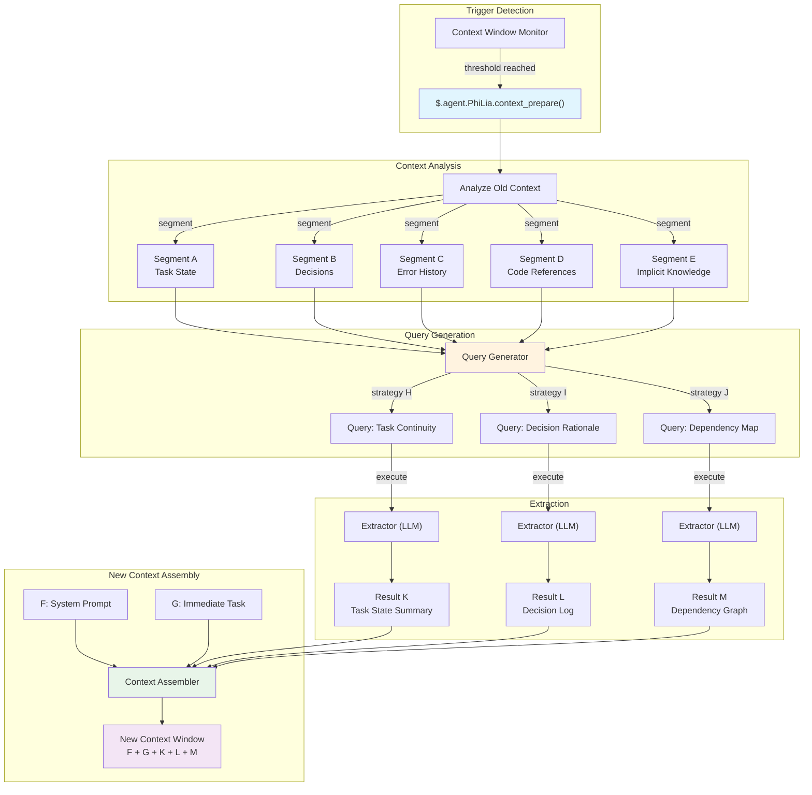
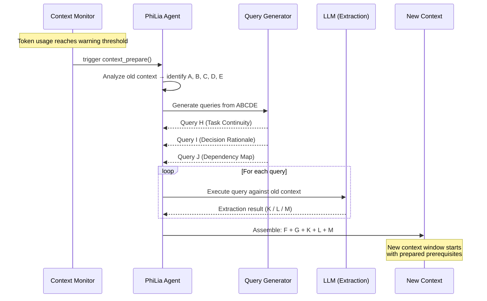

# Context Preparation Mechanism

## Overview

Context Preparation is a proactive extraction mechanism that replaces traditional context compression. Instead of lossily compressing old conversation history, it analyzes the existing context, generates targeted queries, and extracts precisely the information needed to seed a new context window. The mechanism is owned by the PhiLia agent and exposed via `$.agent.PhiLia.context_prepare()`.

## Problem Statement

### Context Window Limits

LLM agents operate within finite context windows. Long-running tasks — multi-file refactors, debugging sessions spanning dozens of messages, or complex multi-step workflows — eventually exhaust the available token budget. When this happens, the system must decide what to preserve and what to discard.

### Compression Loses Detail

Traditional context compression approaches (summarization, truncation, sliding window) are inherently lossy. A compressor does not know what the *next* context will need, so it must guess. Critical details are inevitably discarded:

- Variable names and their current values
- Intermediate decisions and their rationale
- Error states that appeared and were partially resolved
- Implicit dependencies between tasks

The fundamental flaw: **compression optimizes for brevity, not relevance**.

### Cross-Task Interference

When a context window contains multiple tasks or topics, compressing one task's history often corrupts information needed by another. A summary that preserves Task A's state may obscure Task B's critical error chain. There is no universal compression strategy that serves all possible future needs.

### The Real Question

> What does the *next* context window need to know from the *current* context?

This is not a compression question. It is an **information retrieval** question — and the answer depends on what comes next, not what came before.

## Core Concept

### Proactive Extraction vs. Compression

| Aspect | Compression | Context Preparation |
| --- | --- | --- |
| Direction | Past → shorter past | Past → future-ready extract |
| Knowledge of future | None | Queries anticipate upcoming needs |
| Information loss | Inevitable, untargeted | Targeted, intentional |
| Analogy | Zip a file | Search a database |
| Quality ceiling | Summary quality | Extraction precision |

Context Preparation treats the old context as a **data source** — similar to how RAG treats an external document corpus — but the corpus is the conversation itself. Instead of compressing everything into a summary, it asks targeted questions of the old context and collects the answers.

### The ABCDE/KLM Model

The mechanism uses a letter-based notation to describe the information flow:

```text
Old Context:  A + B + C + D + E
                    ↓ (analyze)
Queries:       ABCDE+H  ABCDE+I  ABCDE+J
                    ↓ (extract)
Results:            K        L        M
                    ↓ (assemble)
New Context:  F + G + K + L + M
```

- **A–E**: Distinct segments/aspects of the old context (task state, decisions, error history, code references, implicit knowledge)
- **H, I, J**: Query strategies derived from analyzing the key elements of A–E. Each strategy targets a different information need
- **K, L, M**: Extraction results — the precise answers to each query
- **F, G**: New system prompt and immediate task context for the new window
- **New context** receives F + G (fresh) + K + L + M (extracted), skipping the full A–E history

### Why This Replaces Compression

Once Context Preparation exists, traditional compression becomes unnecessary because:

1. **No information is lost to guessing** — queries are generated based on what the new context will actually need
1. **Extraction is deterministic in structure** — the same query strategy always produces the same category of answer
1. **Multiple angles ensure coverage** — H/I/J queries cover different dimensions (task state, error context, decision rationale)
1. **The old context remains accessible** — it is not discarded but rather *queried on demand* during the preparation phase

## Architecture

### High-Level Flow



### Sequence Diagram



## API Design

### `$.agent.PhiLia.context_prepare()`

The primary entry point. Called when the context window monitor detects that token usage has reached the warning threshold.

```typescript
interface ContextPrepareRequest {
    old_context: string;
    current_task: string;
    warning_threshold: number;
    current_usage: number;
    max_tokens: number;
}

interface ContextPrepareResult {
    segments: ContextSegment[];
    queries: GeneratedQuery[];
    extractions: ExtractionResult[];
    prepared_context: string;
    metadata: {
        old_context_tokens: number;
        prepared_context_tokens: number;
        compression_ratio: number;
        queries_executed: number;
        extraction_time_ms: number;
    };
}

// PhiLia API endpoint
$.agent.PhiLia.context_prepare(request: ContextPrepareRequest): ContextPrepareResult
```

### `$.agent.PhiLia.context_query()`

A lower-level API for executing individual queries against a context. Used internally by `context_prepare()` but also available for ad-hoc queries.

```typescript
interface ContextQueryRequest {
    context: string;
    query: string;
    strategy: "task_continuity" | "decision_rationale" | "dependency_map" | "custom";
    max_result_tokens: number;
}

interface ContextQueryResult {
    result: string;
    confidence: number;
    source_segments: string[];
    tokens_used: number;
}

$.agent.PhiLia.context_query(request: ContextQueryRequest): ContextQueryResult
```

### `$.agent.PhiLia.context_segment()`

Analyzes a context and breaks it into labeled segments (A–E).

```typescript
interface SegmentRequest {
    context: string;
    max_segments: number;
}

interface Segment {
    id: string;           // "A", "B", "C", etc.
    label: string;        // "Task State", "Decisions", etc.
    content: string;
    token_count: number;
    importance_rank: number;
}

$.agent.PhiLia.context_segment(request: SegmentRequest): Segment[]
```

## Query Strategy

### How H/I/J Queries Are Generated

The query generation process takes the segmented old context (A–E) and produces three categories of queries, each targeting a different dimension of information needed by the new context.

### Strategy H: Task Continuity

**Purpose**: Ensure the new context can resume the current task without loss of progress.

**Generation logic**:

1. Identify active tasks from segments A and E (task state + implicit knowledge)
1. Extract current progress indicators (what's done, what's in progress, what's blocked)
1. Generate a query that asks: *"What is the current state of all active tasks, and what are the next steps?"*

**Example query**:

```text
Given the conversation history, identify:
1. All tasks currently in progress and their completion status
2. Any blockers or unresolved errors
3. The exact next step that was about to be taken
4. File paths and line numbers currently being modified
```

### Strategy I: Decision Rationale

**Purpose**: Preserve the *why* behind decisions, not just the *what*.

**Generation logic**:

1. Scan segments B and C (decisions + error history) for choice points
1. Identify decisions where alternatives were considered and rejected
1. Generate a query that asks: *"What decisions were made, what alternatives were rejected, and why?"*

**Example query**:

```text
From this conversation, extract:
1. All architectural or implementation decisions made
2. For each decision: what alternatives were considered
3. For each decision: the specific reason the chosen approach was preferred
4. Any constraints or requirements that influenced these choices
```

### Strategy J: Dependency Map

**Purpose**: Capture relationships between code elements, files, and concepts.

**Generation logic**:

1. Scan segments D and E (code references + implicit knowledge) for entity relationships
1. Map which files depend on which, which functions call which, which concepts relate
1. Generate a query that asks: *"What are the key dependencies and relationships between the entities discussed?"*

**Example query**:

```text
Analyze the conversation and map:
1. All files/modules mentioned and their relationships
2. Function call chains discussed or modified
3. Data flow between components
4. Configuration values and where they are used
5. Any implicit dependencies not directly stated but implied by the work
```

### Extensibility

The three strategies (H, I, J) are the default set. The system supports custom strategies:

```typescript
interface QueryStrategy {
    id: string;
    name: string;
    description: string;
    source_segments: string[];     // which segments to analyze
    query_template: string;        // template with {segment_X} placeholders
    priority: number;              // execution priority
    max_result_tokens: number;
}
```

New strategies can be registered via configuration, allowing domain-specific extraction patterns.

## Integration Points

### Context Window Monitor

The trigger for Context Preparation lives in the context window monitoring subsystem. When token usage crosses the warning threshold (default: 80% of max), the monitor calls `$.agent.PhiLia.context_prepare()`.

```rust
// In the context window monitor (conceptual)
fn check_context_health(&mut self) {
    let usage_ratio = self.current_tokens as f64 / self.max_tokens as f64;
    if usage_ratio >= self.warning_threshold {
        let result = philia.context_prepare(ContextPrepareRequest {
            old_context: self.get_full_context(),
            current_task: self.get_current_task_description(),
            warning_threshold: self.warning_threshold,
            current_usage: self.current_tokens,
            max_tokens: self.max_tokens,
        });
        self.spawn_new_context(result.prepared_context);
    }
}
```

### skill_chain.rs Integration

The skill chain executor must be aware of context preparation. When a skill chain spans multiple context windows, the preparation mechanism ensures that:

1. The skill chain state is captured in segment A (task state)
1. The current skill's input/output is captured in segment D (code references)
1. The chain's remaining steps are preserved in the extraction result K (task continuity)

```rust
// skill_chain.rs (conceptual integration)
impl SkillChainExecutor {
    fn execute_step(&mut self, step: ChainStep) -> Result<StepResult> {
        // Before executing, check if context preparation is needed
        if self.context_monitor.should_prepare() {
            let prepared = self.philia.context_prepare(
                self.build_prepare_request()
            )?;
            self.context = prepared.prepared_context;
        }
        // Continue with step execution
        self.execute_with_context(step, &self.context)
    }
}
```

### PhiLia Agent Ownership

Context Preparation is a PhiLia-owned capability. This means:

- The `$.agent.PhiLia.context_prepare()` API is registered as a PhiLia skill
- PhiLia manages the query generation templates and extraction strategies
- Other agents request context preparation through PhiLia via the standard skill invocation protocol
- PhiLia may leverage its knowledge store to enrich queries with historical patterns

### Context Spawning

When the system spawns a new context window, the prepared context (F + G + K + L + M) replaces the traditional compressed summary:

```rust
fn spawn_new_context(&mut self, prepared: ContextPrepareResult) {
    let system_prompt = self.build_system_prompt();      // F
    let immediate_task = self.get_current_task();         // G
    let new_context = format!(
        "{}\n\n{}\n\n---\n## Context Preparation Results\n### Task State\n{}\n### Decision Log\n{}\n### Dependencies\n{}\n",
        system_prompt,    // F
        immediate_task,   // G
        prepared.extractions[0].result,  // K
        prepared.extractions[1].result,  // L
        prepared.extractions[2].result,  // M
    );
    self.launch_context(new_context);
}
```

## Implementation Phases

### Phase 1: Foundation (MVP)

- Implement `$.agent.PhiLia.context_segment()` — context analysis and segmentation
- Implement the three default query strategies (H: task continuity, I: decision rationale, J: dependency map)
- Implement `$.agent.PhiLia.context_prepare()` — orchestration of segment → query → extract → assemble
- Integrate with context window monitor trigger
- Validate with single-task conversations

### Phase 2: Robustness

- Add confidence scoring to extraction results
- Implement fallback strategies when extraction confidence is low
- Add streaming support for large contexts
- Performance optimization: parallel query execution
- Add `$.agent.PhiLia.context_query()` for ad-hoc queries

### Phase 3: Intelligence

- Learn optimal query strategies from historical preparation results
- Adaptive segment weighting based on task type
- Cross-context reference resolution (link preparation results across multiple spawns)
- Integration with memory sedimentation for long-term retention

### Phase 4: Full Replacement

- Remove legacy context compression code path
- Context Preparation becomes the sole mechanism for context transitions
- Full telemetry and quality metrics
- Documentation and migration guide for custom agents

## Examples

### Example 1: Multi-File Refactoring

**Scenario**: An agent is refactoring a Rust crate, modifying 15 files across 3 modules. The context window fills up after modifying file 10.

**Old context (A–E)**:

- **A** (Task State): 10/15 files modified, module `auth` and `storage` complete, `api` in progress
- **B** (Decisions): Chose trait-based abstraction over enum dispatch; kept backward compatibility via `#[deprecated]`
- **C** (Errors): Encountered lifetime issue in `storage/mod.rs:142`, resolved with `Arc<Mutex<>>`
- **D** (Code References): `auth/traits.rs`, `storage/mod.rs:142`, `api/handler.rs:38-56`
- **E** (Implicit): The `User` struct must remain `Clone` for downstream crates; test coverage is tracked

**Generated queries**:

- **H** (Task Continuity): "What files remain to be modified, what is the pattern being applied, and what is the next file to refactor?"
- **I** (Decision Rationale): "Why was trait-based abstraction chosen over enum dispatch, and what backward compatibility constraints exist?"
- **J** (Dependency Map): "Map the dependencies between `auth`, `storage`, and `api` modules, noting which structs/traits cross module boundaries."

**Extraction results (K, L, M)** are assembled with the new system prompt (F) and next task instruction (G).

### Example 2: Debugging Session

**Scenario**: Debugging a WebSocket connection issue that spans multiple hypotheses and test attempts.

**Old context (A–E)**:

- **A** (Task State): Issue is narrowed to the handshake phase; heartbeat is not the cause
- **B** (Decisions): Ruled out TLS misconfiguration; ruled out proxy interference; current hypothesis is header ordering
- **C** (Errors): `ConnectionReset` at 3s mark, reproduced consistently with curl but not browser
- **D** (Code References): `ws/handshake.rs:67-89`, `headers/mod.rs:23`, test file `tests/ws_test.rs`
- **E** (Implicit): The server is behind nginx; the issue only appears in production, not local dev

**Generated queries** extract the debugging state, rejected hypotheses, and remaining investigation paths into the new context.

### Example 3: Cross-Agent Skill Chain

**Scenario**: PhiLia delegates a task chain to Skemma (schema design) then Logos (documentation). The context fills during Logos's work.

**Old context (A–E)**:

- **A** (Task State): Schema design complete, documentation 60% done
- **B** (Decisions): Schema uses junction tables for M:N relations per PhiLia's architecture guidance
- **C** (Errors): Skemma reported ambiguity in `user_roles` cardinality, resolved by adding `UNIQUE` constraint
- **D** (Code References): `schema.sql:45-67`, `docs/api/endpoints.md:12-34`
- **E** (Implicit): The documentation must match the OpenAPI 3.0 spec format used elsewhere in the project

The preparation ensures Logos's new context receives the schema decisions and the documentation format constraint, without needing the full Skemma design conversation.
