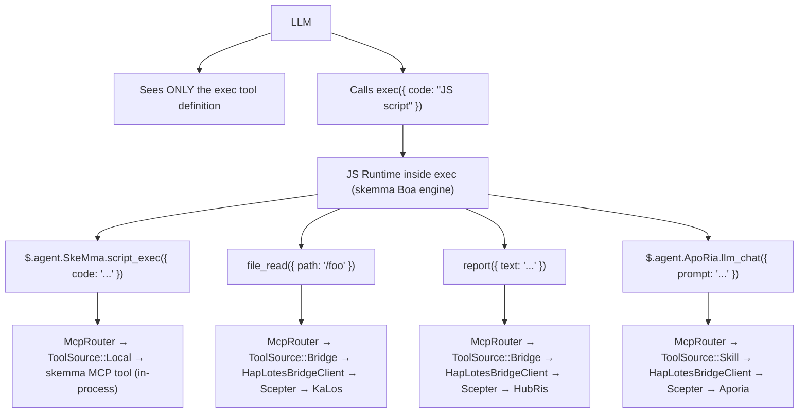
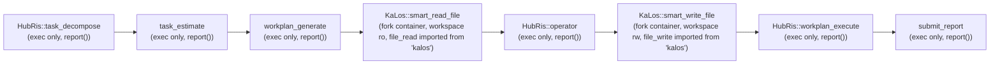
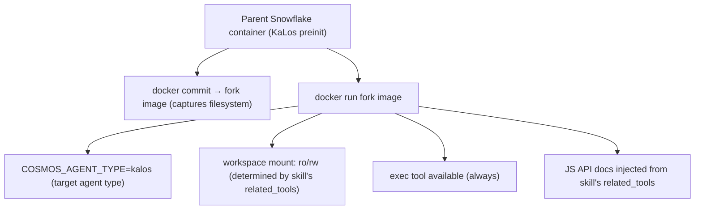

# Cross-Agent Skill Routing Architecture

## Problem

The skill chain (`execute_skill_chain`) uses an exec-only microkernel architecture. The LLM sees only three tools: `exec`, `write_to_var`, `write_to_var_json` — no per-agent tool whitelists, no per-skill tool definitions. All MCP tool invocation happens inside the TypeScript runtime (IEPL engine) via ES module imports and cross-agent TS APIs like `file_read()`.

## Design Principles

1. **Exec-only microkernel** — The LLM is never given MCP tool definitions directly. It has three tools: `exec`, `write_to_var`, and `write_to_var_json`. All tool calls happen inside the IEPL engine's TS runtime.
1. **`related_tools` drive everything** — Skills declare `related_tools` in their TOML frontmatter. These names become TS API documentation injected into the LLM prompt (e.g. `file_read()`, `report()`).
1. **Routing via TS API → McpRouter** — Inside `exec`'s IEPL runtime, ES module imports route to the correct MCP tool implementation via `McpRouter`. Cross-agent calls like `file_read()` resolve to KaLos agent's `file_read` implementation.
1. **Container isolation** — Child containers inherit the parent filesystem via `docker commit` fork. Workspaces are mounted read-only or read-write based on the skill's `related_tools`.
1. **`related_tools` determine read/write mode** — `skill_needs_write_access()` inspects `related_tools` for write tool names (`file_write`, `file_edit`, etc.) to decide the fork container's mount mode.

## Architecture

### Exec-Only Microkernel Flow



### Skill Chain Execution Flow



### Container Fork Mechanism



## Implementation Details

### Core Components

| Component | File | Responsibility |
| --- | --- | --- |
| `skill_to_agent_name()` | `skill_chain.rs` | Looks up the agent name that owns a given skill |
| `skill_needs_write_access()` | `skill_chain.rs` | Inspects `related_tools` for write tool names to determine fork container mount mode |
| `fork_for_sub_skill()` | `snowflake_manager.rs` | Performs `docker commit` + `docker run`; mounts workspace as ro/rw based on `skill_needs_write_access()` |
| `find_by_agent_type()` | `snowflake_manager.rs` | Searches in reverse order, returning the most recent fork container |
| `McpRouter` | `packages/cosmos/src/bin/cosmos/mcp_router.rs` | Routes ES module import calls: `ToolSource::Local` → skemma, `ToolSource::Bridge` → HapLotes |
| `HapLotesBridgeClient` | `packages/agents/haplotes/src/bridge/client.rs` | Cosmos → Scepter bridge: `bridge_call()`, `bridge_list_tools()` |
| `BridgeInvoker` | `packages/scepter/src/agent_manager/bridge_invoker.rs` | Scepter-side: routes tool calls to correct registered agent |
| `build_js_api_docs()` | `skill_chain.rs` | Generates JS API documentation from skill's `related_tools` for prompt injection |
| `build_skill_user_prompt(agent_name, ...)` | `skill_chain.rs` | Assembles the skill prompt with injected JS API docs |

### How JS API Docs Are Generated

A skill's TOML frontmatter declares `related_tools`:

```toml
# smart_read_file.md
related_tools = ["file_read", "file_list", "file_exists"]
```

The system resolves each tool to its owning agent and generates TS API docs from `.d.ts` declarations:

```typescript
// Injected into the LLM prompt as available APIs (with type declarations from .d.ts):
file_read({ path: string }): Promise<string>
file_list({ dir: string }): Promise<string[]>
file_exists({ path: string }): Promise<boolean>
report({ text: string }): Promise<void>
```

The LLM calls these APIs inside its `exec` code; the McpRouter dispatches to the correct agent's MCP tool implementation.

### Fork Lifecycle

1. **Create**: `docker commit` parent container → fork image → `docker run` child container
1. **Connect**: `CosmosConnector` connects to child container's Unix socket
1. **Bridge**: `HapLotesBridgeClient` inside fork container connects to Scepter's `HapLotesBridgeServer`
1. **Execute**: LLM calls `exec` with JS code; JS runtime uses McpRouter → bridge → Scepter agents
1. **Cleanup**: When the chain ends, `snowflake.remove()` destroys the container + `docker rmi` cleans up the image

### Workspace Mount Strategy

| Skill type | `related_tools` characteristic | Workspace mount |
| --- | --- | --- |
| Read-only (smart_read_file) | Only file_read, file_list, file_exists | `:ro` (read-only) |
| Write (smart_write_file) | Includes file_write, file_edit, file_delete | `:rw` (read-write) |

### Cross-Agent Tool Routing

Inside `exec`'s JS runtime, the McpRouter resolves tool calls via the HapLotes bridge:

```mermaid
flowchart TB
    subgraph Bridge["Bridge Call"]
        A1["exec({ code: &quot;file_read({path:'/foo'})&quot; })"] --> B1["McpRouter resolves &quot;kalos&quot; + &quot;file_read&quot;"]
        B1 --> C1["tool_to_source → ToolSource::Bridge"]
        C1 --> D1["HapLotesBridgeClient → bridge.call(&quot;kalos.file_read&quot;, params)"]
        D1 --> E1["Scepter's HapLotesBridgeServer → BridgeInvoker"]
        E1 --> F1["routes to KaLos agent → file_read MCP tool"]
    end
    subgraph Local["Local Call"]
        A2["exec({ code: &quot;$.agent.SkeMma.script_exec({code:'1+1'})&quot; })"] --> B2["McpRouter resolves &quot;skemma&quot; + &quot;script_exec&quot;"]
        B2 --> C2["tool_to_source → ToolSource::Local"]
        C2 --> D2["invokes skemma MCP tool directly (in-process Boa engine)"]
    end
```



### Write Access Detection

```rust
fn skill_needs_write_access(skill: &Skill) -> bool {
    const WRITE_TOOLS: &[&str] = &["file_write", "file_edit", "file_delete", "file_rename"];
    skill.related_tools.iter().any(|t| WRITE_TOOLS.contains(&t.as_str()))
}
```

This function reads the skill's `related_tools` from its TOML frontmatter. If any write tool is present, the fork container's workspace is mounted read-write.

## Configuration

### Skill TOML Frontmatter

```toml
# smart_read_file.md
+++
related_tools = ["file_read", "file_list", "file_exists"]

[[next_action]]
agent = "hubris"
name = "operator"
+++

# smart_write_file.md
+++
related_tools = ["file_write", "file_edit"]

[[next_action]]
agent = "hubris"
name = "workplan_execute"
+++
```

### next_action Chain (skill TOML)

```toml
# workplan_generate.md
[[next_action]]
agent = "kalos"
name = "smart_read_file"

# smart_read_file.md
[[next_action]]
agent = "hubris"
name = "operator"

# operator.md
[[next_action]]
agent = "kalos"
name = "smart_write_file"

# smart_write_file.md
[[next_action]]
agent = "hubris"
name = "workplan_execute"
```

## Skill JS API Reference

| Skill | Agent | JS APIs (from `related_tools`) | Status |
| --- | --- | --- | --- |
| `smart_read_file` | KaLos | `file_read()`, `file_list()`, `file_exists()` | ✅ Implemented |
| `smart_write_file` | KaLos | `file_write()`, `file_edit()` | ✅ Implemented |
| `exec_script` | SkeMma | `$skeMma.script_exec()` | Pending |
| `smart_command` | SkoPeo | `$skoPeo.smart_command_execute()` | Pending |

## Risks & Considerations

1. **Container resources** — Each fork creates a new Docker container; containers are automatically cleaned up when the chain ends.
1. **Token cost** — Each fork has its own independent LLM context; JS API docs add modest overhead per skill.
1. **Fork chain depth** — Currently no depth limit; forks only occur when `step_index > 1`.
1. **Context passing** — Parent → child passes through report content; truncation strategies may be needed.
1. **Parallel safety** — When multiple chains concurrently fork the same agent type, reverse-order search ensures each uses its latest fork.
1. **API surface control** — The LLM can only call JS APIs listed in the injected docs; McpRouter rejects unknown tool names.
