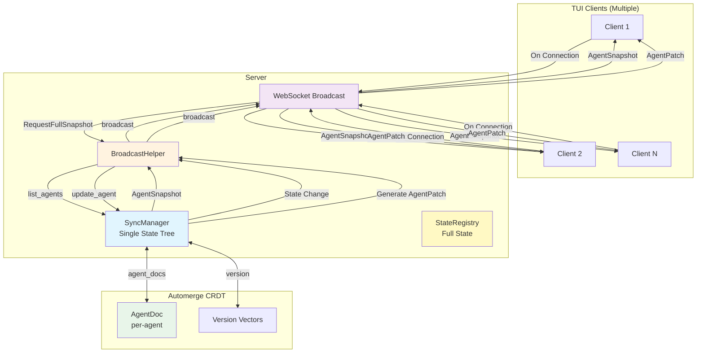
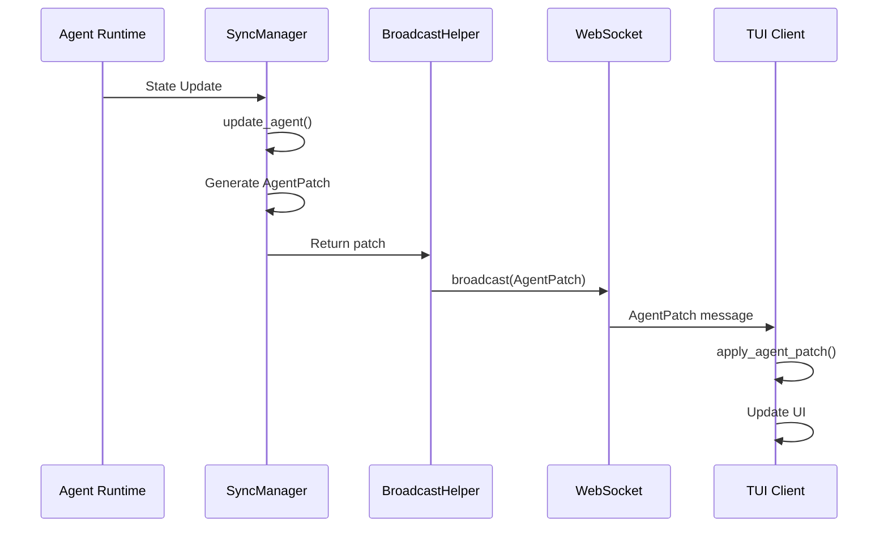
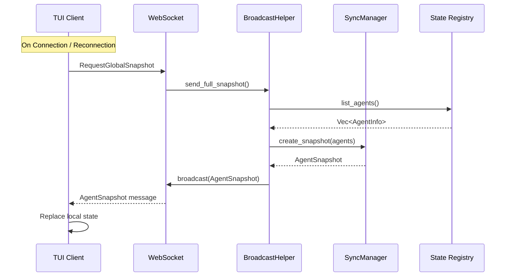
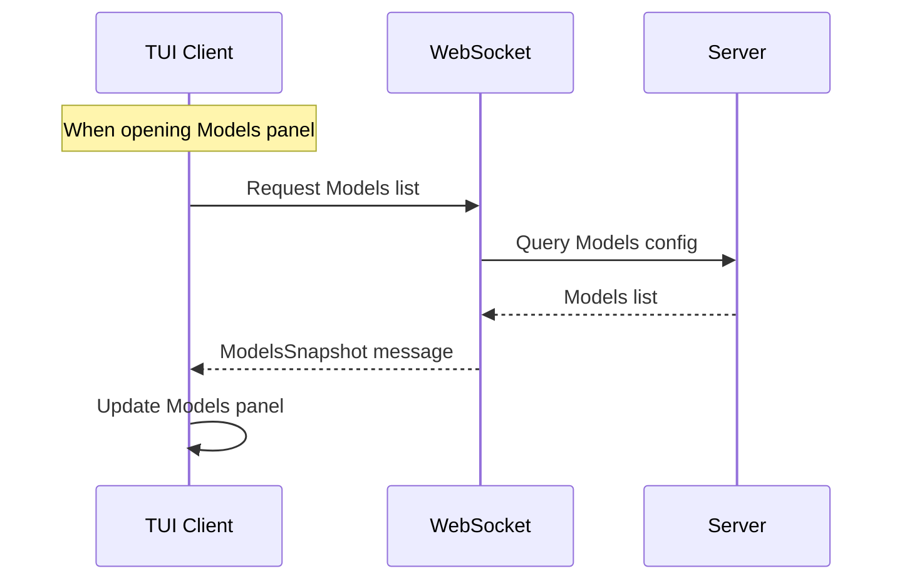
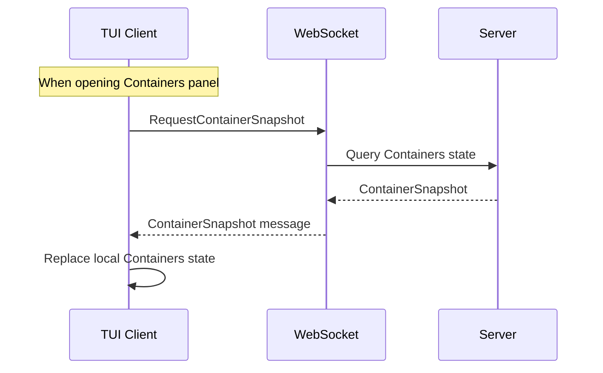
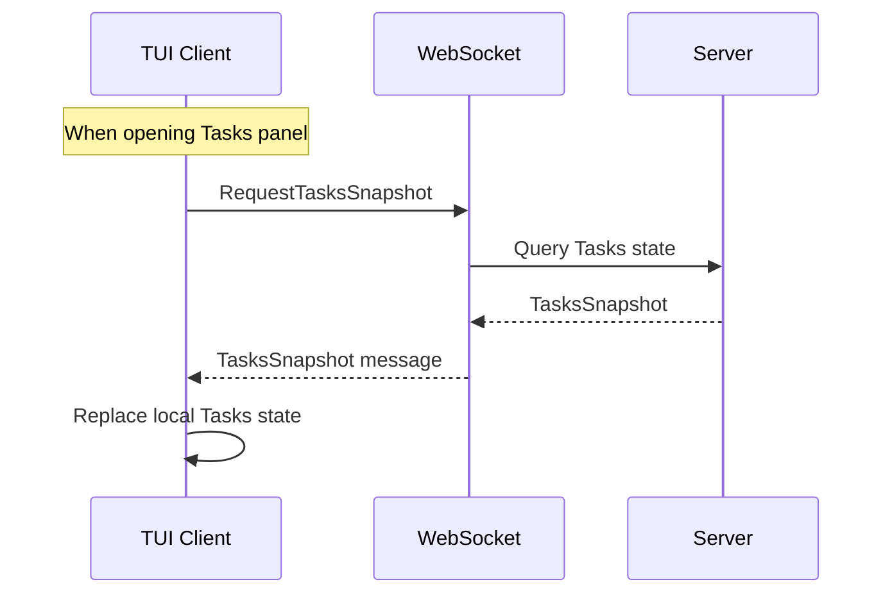

# Incremental Sync Architecture

## Overview

A multi-client state incremental synchronization mechanism based on Automerge CRDT, supporting real-time incremental updates and full synchronization on connection/reconnection, covering all TUI panels.

## Architecture Diagram



## Sync Strategy Matrix

| Panel | Sync Method | Trigger | Frequency | Message Types |
| --- | --- | --- | --- | --- |
| **Agents Timeline** | Incremental + Full | Sync on Connection + Real-time Push | On Connection / Real-time | `AgentPatch` / `GlobalSnapshot` |
| **Containers** | Incremental + Full | Sync on Connection + Real-time Push | On Connection / Real-time | `ContainerPatch` / `GlobalSnapshot` |
| **Tasks** | Incremental + Full | Sync on Connection + Real-time Push | On Connection / Real-time | `TaskPatch` / `GlobalSnapshot` |
| **Models List** | Full | Client Active Request | When Opening Panel | `ModelsSnapshot` |
| **Providers Config** | Full | Client Active Request | When Opening Panel | `ProvidersSnapshot` |

## Message Flow

### Incremental Update Flow (Agents)



### Full Sync Flow



### Models List Sync Flow



### Containers Full Sync Flow



### Tasks Full Sync Flow



## Data Structures

### AgentPatch (Incremental Update)

```rust
pub struct AgentPatch {
    pub agent_id: String,
    pub version: u64,
    pub llm_working_changed: Option<bool>,
    pub work_status: Option<String>,
    pub current_model: Option<String>,
    pub token_usage_delta: Option<(u32, u32)>,
    pub token_usage_absolute: Option<(u32, u32)>,
    pub request_state: Option<RequestState>,
    pub cpu_usage: Option<f64>,
    pub memory_mb: Option<u64>,
}
```

### AgentSnapshot (Full Snapshot)

```rust
pub struct AgentSnapshot {
    pub version: u64,
    pub timestamp: i64,
    pub agents: Vec<TuiAgentInfo>,
}
```

### GlobalSnapshot (Global Snapshot)

```rust
pub struct GlobalSnapshot {
    pub version: u64,
    pub timestamp: i64,
    pub agents: Vec<TuiAgentInfo>,
    pub models: Vec<ModelInfo>,
    pub providers: Vec<ProviderInfo>,
    pub active_tasks: Vec<TaskInfo>,
}
```

### ModelsSnapshot (Models List)

```rust
pub struct ModelsSnapshot {
    pub models: Vec<ModelInfo>,
}
```

### ContainerPatch (Container State Incremental)

```rust
pub struct ContainerPatch {
    pub container_id: String,
    pub version: u64,
    pub status_changed: Option<String>,
    pub cpu_usage_changed: Option<f64>,
    pub memory_usage_changed: Option<u64>,
}
```

### ContainerSnapshot (Container State Full)

```rust
pub struct ContainerSnapshot {
    pub version: u64,
    pub timestamp: i64,
    pub containers: Vec<ContainerInfo>,
}
```

### TaskPatch (Task State Incremental)

```rust
pub struct TaskPatch {
    pub task_id: Uuid,
    pub version: u64,
    pub status_changed: Option<String>,
    pub progress_changed: Option<u8>,
}
```

### TasksSnapshot (Tasks State Full)

```rust
pub struct TasksSnapshot {
    pub version: u64,
    pub timestamp: i64,
    pub tasks: Vec<TaskInfo>,
}
```

## Sync Strategy

| Type | Direction | Trigger | Frequency |
| --- | --- | --- | --- |
| Agent Incremental Update | Server → Client | State Change | Real-time |
| Agent Full Sync | Server → Client | On Connection | On Connection / Reconnection |
| Containers Incremental | Server → Client | State Change | Real-time |
| Containers Full Sync | Server → Client | On Connection | On Connection / Reconnection |
| Tasks Incremental | Server → Client | State Change | Real-time |
| Tasks Full Sync | Server → Client | On Connection | On Connection / Reconnection |
| Models List | Client → Server | Active Request | When opening panel |
| Providers Config | Client → Server | Active Request | When opening panel |

## Key Features

- **Single State Tree**: Server maintains one `SyncManager`, all clients receive the same state updates
- **CRDT Conflict Resolution**: Automatic conflict resolution based on Automerge
- **Incremental Updates**: Only transmit changed fields to reduce network traffic
- **Eventual Consistency**: Full sync on connection guarantees eventual consistency
- **On-Demand Pull**: Models and Providers are requested on-demand when opening their panels to avoid unnecessary network transmission
- **Home Page Sync**: Agents, Containers, and Tasks are synced on connection since they're visible on the home page

## Implementation Status

- ✅ Agents incremental/full sync
- ✅ Models list sync
- ✅ Providers config sync
- ✅ Containers incremental/full sync
- ✅ Tasks incremental/full sync
- ✅ State persistence (/tmp storage, reload on restart)
