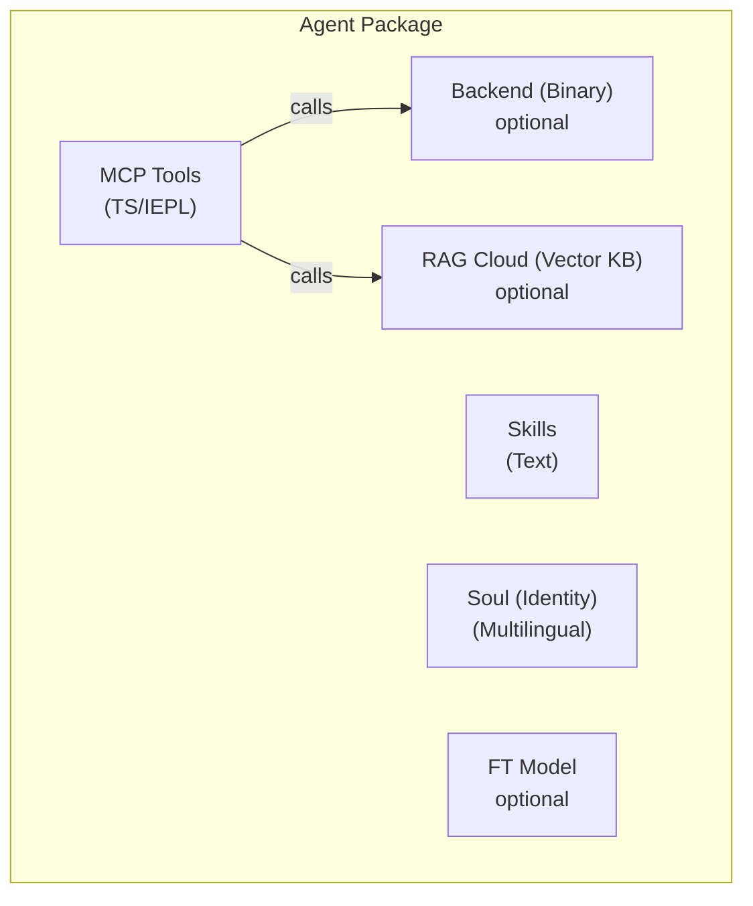

# Layer 2/3 Agent Package Specification

> **Status**: Draft v1 — 2026-06-26
> **Scope**: Defines the self-contained package format for Layer 2 and Layer 3 agents.

## Overview

A Layer 2/3 agent is a **self-contained package** composed of up to five
components. The package is the unit of distribution — it can be installed,
updated, and removed independently.



## Five Components

### 1. MCP Tools (IEPL TypeScript)

The primary tool interface. Written as TypeScript source that runs in the
IEPL sandbox (Boa JS runtime). Each tool file exports a function:

```typescript
// mcp/memory_store.ts
import type { McpResult } from '@entecheia/sdk';

export async function memory_store(params: {
  text: string;
  node_type: string;
  entity_type?: string;
  properties?: Record<string, string>;
}): Promise<McpResult> {
  // Tool logic — can call backend primitives, compose other tools,
  // or make HTTP requests to cloud services.
  const result = await backend.memory_store(params);
  return { ok: true, data: result };
}
```

Tools can be:

- **Pure TS**: Logic-only, composes other tools or transforms data
- **Backend-backed**: Calls a primitive provided by the MCP Backend
- **Cloud-backed**: Calls a remote API (RAG, model, external service)

The TypeScript source is pure text — it can be version-controlled,
reviewed, and distributed without compilation. A self-service packaging
facility can optionally bundle multiple `.ts` files into a single
`bundle.js` for efficient loading.

### 2. MCP Backend (Optional Binary)

Some tools need capabilities beyond the IEPL sandbox (file I/O, hardware
access, database connections). These are provided by a **binary backend** —
a Rust binary that runs alongside the scepter process.

- The backend is compiled into the Docker image and carried in scepter's

"pocket" (the `/workspace-base/target/` directory).

- At runtime, scepter dynamically passes the binary path to the IEPL

environment via a `backend` module import.

- The backend exposes primitive operations; all composition and orchestration

happens in the TS layer.

Example backend interface (auto-generated from Rust):

```typescript
// Auto-generated from Rust backend
declare module 'backend' {
  export function memory_store_raw(params: {...}): Promise<McpResult>;
  export function memory_query_raw(query: string): Promise<McpResult>;
}
```

### 3. Skills (Pure Text)

Skill prompts are markdown files with TOML front-matter. They define
**how** the agent executes tasks — the system prompt, tool whitelist,
execution mode, and pipeline structure.

```markdown
+++
name = "memory_consolidate"
agent = "philia"
related_tools = ["memory_consolidate", "memory_query"]
location = "scepter"
execution_mode = "read"

[features]
tier = "worker"
+++

# memory_consolidate

Consolidate memory nodes into an episode for structured recall...
```

Skills are language-agnostic (the `#` body is the prompt template).
They are pure text — no compilation, no binary.

### 4. RAG Database (Optional, Cloud-Hosted)

A vector knowledge base that provides domain-specific knowledge to the
agent. Hosted on Entelecheia's cloud infrastructure.

- Optional: an agent can function without RAG (reduced capability).
- Query-limited: when quota is exhausted, queries return empty — the

agent degrades gracefully.

- Referenced by URL + API key in the manifest, not bundled in the package.

### 5. Fine-tuned Model (Optional, Cloud-Hosted)

A model fine-tuned for the agent's specific domain. Also cloud-hosted.

- Optional: agents default to the platform's general model (e.g., GLM-5).
- May be open-weighted in the future for self-hosting.
- Referenced by model ID in the manifest.

## Package Directory Structure

```text
packages/agents/{agent_name}/
├── manifest.toml           # Package metadata and configuration
├── mcp/
│   ├── *.ts                # TypeScript tool implementations (IEPL)
│   └── *.md                # Tool documentation (parameters, returns)
├── backend/                # Optional Rust backend
│   ├── Cargo.toml
│   └── src/
│       └── lib.rs
├── skills/
│   └── *.md                # Skill prompts
├── soul/
│   └── {lang}.md           # Agent personality per language
├── rag.toml                # Optional: RAG database reference
└── model.toml              # Optional: fine-tuned model reference
```

## manifest.toml Format

```toml
[package]
name = "philia"              # Must match directory name
version = "0.2.0"
description = "Cognitive memory system — storage, query, consolidation"
layer = 2                    # 2 = platform agent, 3 = extension
category = "complex_tool"    # simple_tool | complex_tool | coordinator

[dependencies]
# Other agent packages whose tools this agent calls
aporia = "0.2.0"

[backend]
# Omit entirely for pure-TS agents
type = "rust"
binary = "philia"            # Binary name in /workspace-base/target/debug/
provides = [                 # Primitives exposed to TS layer
  "memory_store_raw",
  "memory_query_raw",
  "memory_consolidate_raw",
]

[rag]
# Omit if not using cloud RAG
provider = "entelecheia-cloud"
database_id = "philia-knowledge-v1"
endpoint = "https://rag.entelecheia.ai/v1"

[model]
# Omit if using default platform model
provider = "entelecheia-cloud"
model_id = "philia-ft-v1"
endpoint = "https://model.entelecheia.ai/v1"
```

## TS SDK (`@entecheia/sdk`)

The SDK provides types and utilities for tool authors:

```typescript
// @entecheia/sdk — types
export interface McpResult {
  ok: boolean;
  data?: unknown;
  error?: string;
}

export interface McpToolParams {
  [key: string]: unknown;
}

// @entecheia/sdk — utilities
export function rag_search(query: string): string;        // RAG search (sync, cached)
export function llm_chat(prompt: string): Promise<string>; // LLM call
export function vars_get(key: string): unknown;           // Cross-skill state
export function vars_set(key: string, value: unknown): void;
```

The `backend` module is auto-generated per-agent from the `[backend].provides`
list in the manifest. It provides typed wrappers around the binary primitives.

## Layer Architecture

| Layer | Agents | Ships How | Package? | Container? |
| --- | --- | --- | --- | --- |
| L1 | SkeMma, HapLotes, HubRis, KaLos, NeiKos, ApoRia, EleOs, EpieiKeia, OreXis, PhiLia, PoleMos, SkoPeo | Built into image | Backend only (Rust crates) | No (in-process) |
| L2 | ClassicSoftwareEngineering, WebAutomation, WebUiPanel, IndustrialIoT | Built into image | **Full package** (TS + skills + soul) | Yes (e-skemma) |
| L3 | User-installed extensions | Dynamic install | **Full package** | Yes (e-skemma) |

- **Layer 1** (12 agents): Core platform agents. Their Rust crates provide

the primitive operations (file I/O, memory, containers, hardware, etc.).
They are NOT packages — they ARE the platform. Their tools are exposed
as importable modules (e.g., `import { file_write } from 'kalos'`).

- **Layer 2** (4 agents): The first real packages. They have **no binary

backend** — they are pure TS/IEPL compositions of Layer 1 primitives.
They ship with the image as examples of the package format.

- **Layer 3**: User-installed packages. Same format as L2, but loaded

dynamically. Can optionally declare a binary backend (compiled by the
user, injected via scepter).

## Migration Path

Existing Rust agent crates (`packages/agents/*/src/`) become **backends**.
Their MCP tool docs (`res/prompts/agents/*/mcp/*.md`) move into the package.
Skill prompts (`res/prompts/agents/*/skills/*.md`) move into the package.
Soul files (`res/prompts/soul/`) move into the package.

The old `shared/plugin_host` (wasm-based) is replaced by the IEPL TS runtime
already present in `shared/iepl`. No wasm compilation needed.
