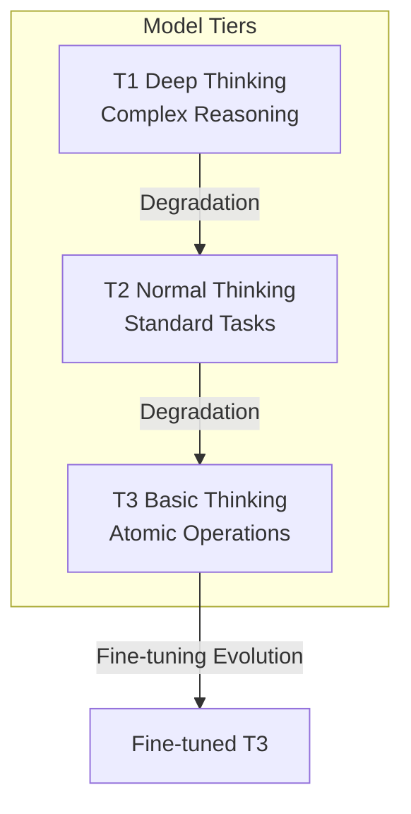
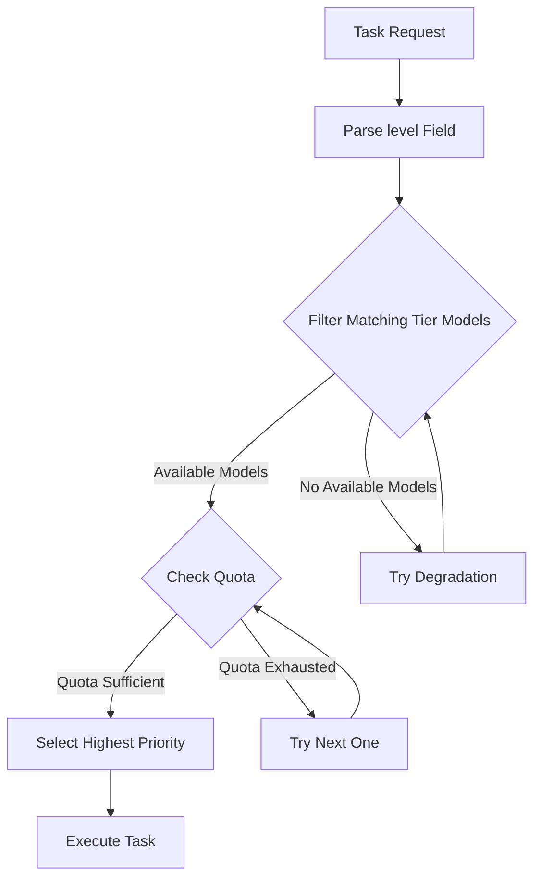
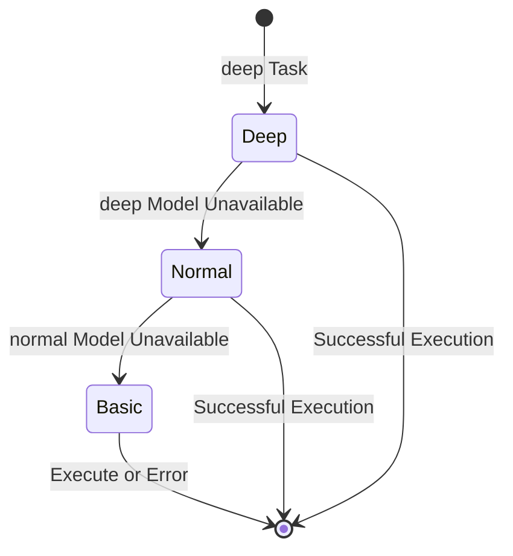
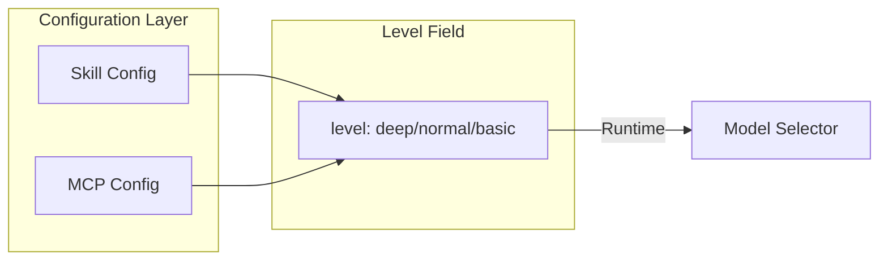
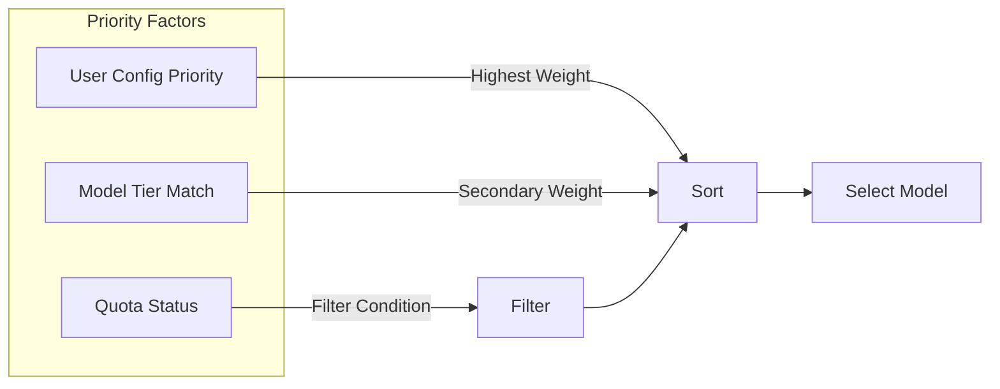
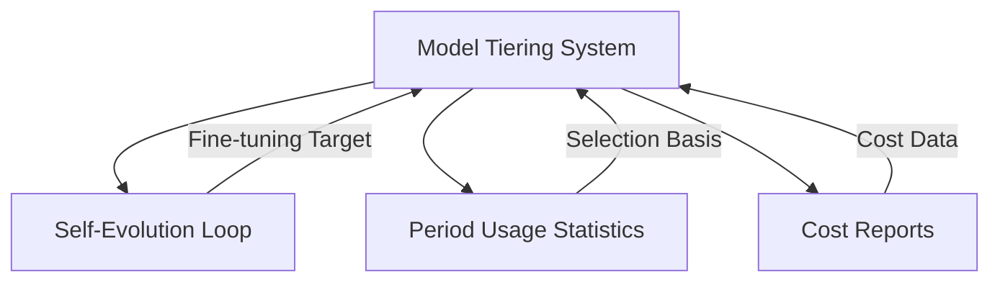

# Model Tiering System Design

## Overview

The Model Tiering System is an intelligent model selection mechanism that assigns appropriate model tiers based on task complexity, maximizing resource utilization while ensuring quality.

> **Related Document**: The three-tier model system defined in this document is the foundation of the [Self-Evolution Loop System](04-self-evolution-loop.md).

## Core Principles

### Three-tier Model System

### Tier Comparison

| Tier | Positioning | Cost | Typical Scenarios |
| --- | --- | --- | --- |
| T1 (deep) | Complex reasoning, decisions | Highest | Architecture design, problem analysis |
| T2 (normal) | Standard tasks | Medium | Code writing, document generation |
| T3 (basic) | Atomic operations | Lowest | File reading, format conversion |

## Model Selection Mechanism

### Selection Process

### Degradation Strategy

## Configuration Mechanism

### Skill/MCP Tier Annotation

Each Skill and MCP tool declares the required model tier through the `level` field:

### Priority Control

## Relationship with Other Modules

## Design Considerations

### Cost Optimization

- Prioritize lower-tier models
- Automatic degradation avoids task failure
- Quota monitoring alerts

### Quality Assurance

- Complex tasks require high tier
- Degradation requires feasibility validation
- Automatic retry on failure

### Extensibility

- Support custom tiers
- Flexible priority configuration
- Pluggable selection strategies
