# Namespace Architecture: `vars`, `refs`, `env`

> **Note (2026-06)**: The LLM-visible tool surface was reduced from 5 to 3 primitives. `ref_add` and `ref_remove` are **no longer exposed to the LLM** — `agent_allowed_tools()` returns only `exec`, `write_to_var`, `write_to_var_json`. The `__refs` namespace still exists as an internal data structure (snapshot/restore, prompt injection) but is no longer directly mutated by the model. Sections below that describe `ref_add`/`ref_remove` dispatch document the residual internal plumbing, not the LLM tool surface.

## Overview

Entelecheia provides three shared namespaces within the IEPL JavaScript runtime (`globalThis.$`) that serve as the cross-skill, cross-agent communication substrate. These namespaces operate at the **Cosmos runtime level**, meaning all agents and skills share them transparently within a single session.

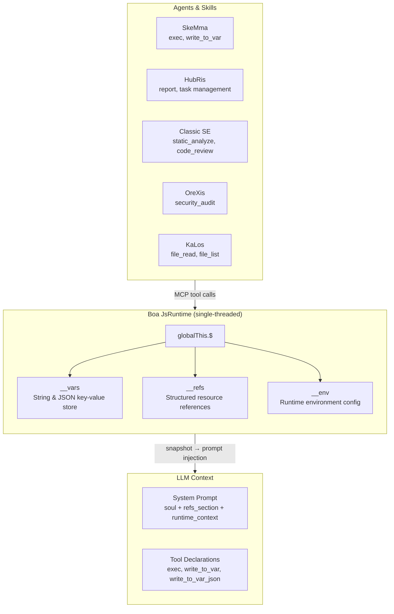

### Design Principles

| Principle | Description |
| --- | --- |
| **Single Source of Truth** | Each namespace has exactly one module (`var_namespace.rs`, `ref_namespace.rs`, `namespace.rs`) that generates **all** JS code strings referencing that namespace |
| **Lazy Initialization** | `__vars` and `__refs` are initialized once at `JsRuntime::new()` and survive across skill chains; `__env` is initialized during namespace JS evaluation |
| **Snapshot/Restore** | The full `__vars` + `__refs` state is snapshotable and restorable, enabling session persistence |
| **Prompt Injection** | Snapshot data drives context-rich system prompts — the LLM sees available variable names, reference summaries, and environment settings |
| **Tool Access Control** | All 3 cosmos internal tools (`exec`, `write_to_var`, `write_to_var_json`) are granted to every agent via `agent_allowed_tools()`; individual skill SOPs define which to use |

---

## Namespace Comparison

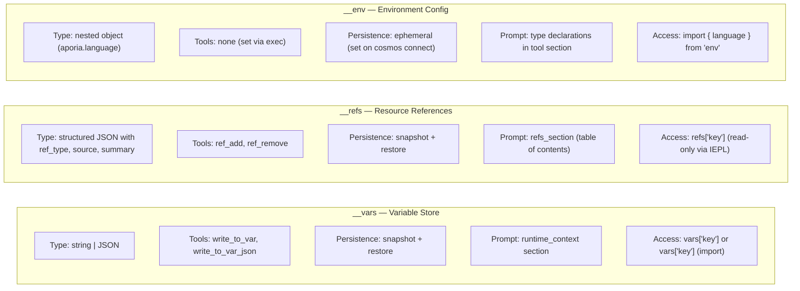

---

## 1. `__vars` — Variable Store (`vars`)

### 1.1 Purpose

`__vars` is the **primary inter-step communication mechanism** within a skill chain. Skills use `write_to_var` / `write_to_var_json` to persist computed results, and subsequent steps (or skills) read from `__vars` in `exec` blocks.

### 1.2 Module Architecture

All `__vars` JS code generation is centralized in `packages/shared/core/src/var_namespace.rs`.

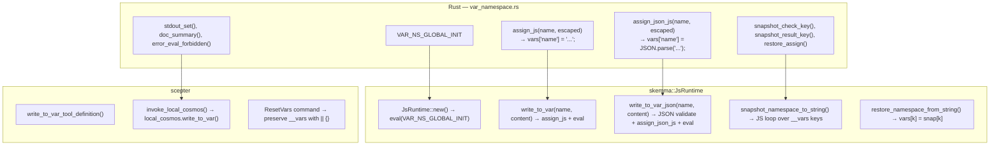

### 1.3 Initialization Sequence

```text
JsRuntime::new()
  → context.eval("globalThis.$ = globalThis.$ || {}; globalThis.__vars = {}; globalThis.__refs = {};")
  → __vars initialized as empty object
```

The initialization runs **before** `build_namespace_js()` (which sets up `__env` and `$.variant`), ensuring `__vars` is always available when namespace modules load.

> **Note:** `__refs` is initialized together with `__vars` via `VAR_NS_GLOBAL_INIT` (defined in `var_namespace.rs`). The standalone `REF_NS_GLOBAL_INIT` in `ref_namespace.rs` exists for symmetry but is never called directly — the actual initialization happens in `JsRuntime::new()`.

### 1.4 Operations

| Operation | Tool Name | Type | Behavior |
| --- | --- | --- | --- |
| Store string | `write_to_var` | Blocking | Escapes content for JS, evals `vars['name'] = 'content'` |
| Store JSON | `write_to_var_json` | Blocking | Validates JSON, evals `vars['name'] = JSON.parse('content')` |
| Read in exec | `exec` | FireAndForget | Direct access: `vars['name']` or `import vars from 'vars'` |
| Snapshot | (internal) | — | Captures all `__vars` keys as `{"$vars": {...}}` |
| Restore | (internal) | — | Sets `vars[k] = snap['$vars'][k]` for each key |
| Reset | (internal) | — | `__vars = __vars \|\| {}` — preserves existing values, ensures structure |

### 1.5 Prompt Injection

In `build_runtime_context()` (`prompt.rs:472`), the variable store appears in the system prompt as:

```text
## JS Runtime Context

__vars (from write_to_var / write_to_var_json, N total):
  `var_1`, `var_2`, `var_3`, ... (up to 30 shown)
  Import as: `import vars from 'vars';`  Access: `vars['key']`
```

### 1.6 Output Display

- String storage: `vars['name'] set:\n{first 200 chars / 5 lines}... (total_chars chars)`
- JSON storage: `vars['name'] set (parsed JSON): object with 3 key(s)`
- Parse failure: Error with content preview (first 200 chars)

### 1.7 `vars` Synthetic Module

Similar to `env`, the `vars` module is a Boa synthetic module that wraps `__vars` for convenient import:

```python
import vars from 'vars';
// vars === __vars (live reference)
const report = vars['analysis_results'];
```

**Implementation:** `packages/agents/skemma/src/js_runtime/module_loader.rs` lines 142-156. The module uses `Module::synthetic()` with a closure that returns `globalThis.__vars` directly (live reference, not a snapshot). This means modifications via `vars['key'] = value` are equivalent to `vars['key'] = value`.

---

## 2. `__refs` — Resource References (`refs`)

### 2.1 Purpose

`__refs` provides **structured cross-agent resource passing**. Unlike `__vars` (raw strings), refs carry typed metadata (`ref_type`, `source`, `summary`) plus optional payloads. Agents can:

- **Publish** references to files, images, or their own outputs
- **Discover** references by name/type in system prompts
- **Access** reference content via `refs['name']` in IEPL exec blocks

### 2.2 Module Architecture

All `__refs` JS code generation is centralized in `packages/shared/core/src/ref_namespace.rs`.

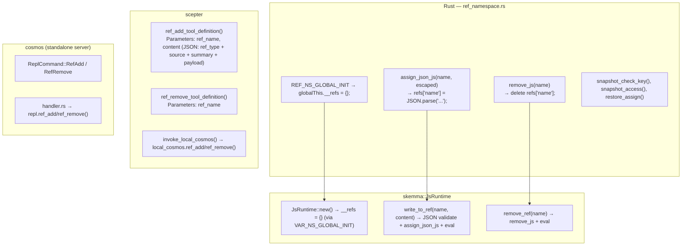

### 2.3 RefItem Structure

```typescript
// TypeScript type definitions (from iepl-api.d.ts)
type RefType = "code" | "image" | "agent_output";

// Used in system prompt and runtime_context for name listing
type RefItemSummary = {
  name: string;
  ref_type: RefType;
  source: string;
  summary: string;
};

interface RefItem {
  name: string;        // e.g. "code:src/main.rs", "image:diagram", "agent:orexis/audit-1"
  ref_type: RefType;   // category for sorting/filtering
  source: string;      // who provided it ("user", agent name, tool name)
  summary: string;     // one-line description for prompt display
  files?: RefCodeFile[];   // for "code" refs
  images?: RefImage[];     // for "image" refs
  output?: RefAgentOutput; // for "agent_output" refs
}

interface RefCodeFile {
  path: string;
  language: string;
  content: string;
  selection?: { start_line: number; end_line: number; content: string };
}

interface RefImage {
  mime: string;          // e.g. "image/png"
  data: string;          // base64-encoded or data URL
  description?: string;
}

interface RefAgentOutput {
  source_agent: string;  // agent name
  source_tool: string;   // tool that produced this output
  content: Record<string, unknown>;
}
```

### 2.4 Operations

| Operation | Tool Name | Type | Behavior |
| --- | --- | --- | --- |
| Add reference | `ref_add` | Blocking | Validates JSON, evals `refs['name'] = JSON.parse('...')` |
| Remove reference | `ref_remove` | FireAndForget | Evals `delete refs['name']` |
| Read in exec | (via `exec`) | — | `refs['name'].files[0].content` |
| Snapshot | (internal) | — | Captures all `__refs` keys as `{"$refs": {...}}` |
| Restore | (internal) | — | Sets `refs[k] = snap['$refs'][k]` for each key |

### 2.5 Prompt Injection

Refs appear in **two** locations in the system prompt:

#### Location 1: `refs_section` (dedicated table of contents)

```text
## Referenced Resources (refs)

The following resources are available via `refs['name']`.
- `code:src/main.rs` [code] from user — main rust file
- `image:architecture` [image] from user — system architecture diagram
- `agent:orexis/audit-1` [agent_output] from OreXis — security audit results
```

Generated by `build_refs_section()` at `prompt.rs:426`. Each ref shows **name, type, source, and summary** — the LLM sees what's available but must read content via `exec` blocks.

#### Location 2: `runtime_context` (name listing)

```text
__refs (referenced resources from user/agents, 3 total):
  `code:src/main.rs`, `image:architecture`, `agent:orexis/audit-1`
  Access: `refs['name']` — each ref has .ref_type, .source, .summary
```

### 2.6 Visibility Principle

> **Ref names are visible to all agents. Ref content is not.**

The `refs_section` in the system prompt exposes the **table of contents** (name, type, source, summary) to every skill execution. However, the actual content (`files[].content`, `images[].data`, `output.content`) is only accessible via explicit `refs['name']` access in IEPL exec blocks. This means:

- OreXis can see that `code:src/main.rs` exists (from its summary), but must explicitly read its content for audit
- The LLM decides when to dereference content based on task relevance
- No agent can accidentally leak reference content into the conversation stream

---

## 3. `__env` — Environment Configuration (`env`)

### 3.1 Purpose

`__env` holds **runtime environment settings** that the IEPL execution engine and agents need. Currently, the only sub-key is `env.aporia.language`, which controls the language for agent output.

### 3.2 Module Architecture

Environment initialization lives in `packages/shared/iepl/src/namespace.rs`.

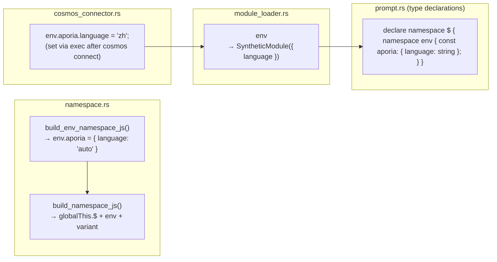

### 3.3 Operations

| Operation | Mechanism | Behavior |
| --- | --- | --- |
| Initialize | `build_namespace_js()` | `__env = __env \|\| {}; env.aporia = env.aporia \|\| { language: 'auto' }` |
| Set language | `exec` call via cosmos connector | `env.aporia.language = 'zh'` |
| Read in IEPL | `import { language } from 'env'` | Returns `env.aporia.language` with `'auto'` fallback |
| Snapshot/Restore | **Not supported** | `__env` is NOT included in snapshot/restore — it is ephemeral and re-initialized on each cosmos connect |

### 3.4 Language Flow

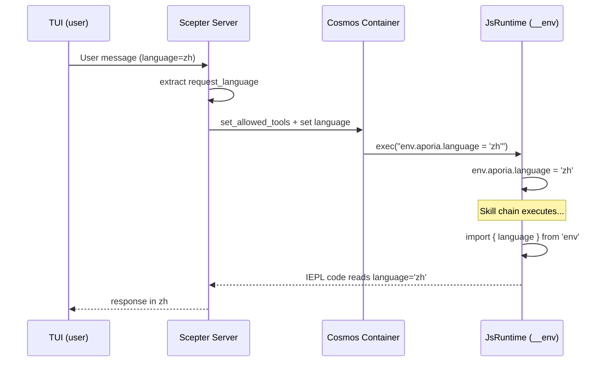

### 3.5 `$.variant` — Backward-Compatible Accessor

**File:** `packages/shared/iepl/src/namespace.rs:199-207`

`build_variant_namespace_js()` creates a circular self-referencing property:

```javascript
Object.defineProperty(globalThis.$, 'variant', {
  get: function() { return globalThis.$; },
  set: function(val) { Object.assign(globalThis.$, val); },
  configurable: true,
  enumerable: true,
});
```

This allows code written as `$.variant.tools.agent.method()` to resolve to the same object as `$.tools.agent.method()`. It exists for backward compatibility with alternative namespace access patterns.

> **Snapshot caution:** Because `$.variant` is a circular reference (`$.variant === $`), attempting to `JSON.stringify` it throws a `TypeError`. The snapshot JS code explicitly targets `__vars` and `__refs` directly rather than iterating `globalThis.$` keys, avoiding this problem.

---

## 4. Snapshot & Restore Architecture

### 4.1 Why Snapshot/Restore?

The `LocalCosmosRuntime` runs a **single long-lived `JsRuntime`** in a dedicated thread. Between skill chain executions, the runtime state (`__vars`, `__refs`) persists naturally. However, snapshots are used for:

1. **Prompt injection** — `build_runtime_context()` and `build_refs_section()` read snapshot JSON to populate the system prompt
1. **Session persistence** — dump/restore on disk for crash recovery or session migration
1. **Container sync** — push state to cosmos containers via `cosmos_set_rag_context()`

### 4.2 Snapshot Format

```json
{
  "$vars": {
    "var_name_1": "value",
    "parsed_json": { "key": "value" }
  },
  "$refs": {
    "code:src/main.rs": {
      "ref_type": "code",
      "source": "user",
      "summary": "main rust file",
      "files": [{ "path": "src/main.rs", "language": "rust", "content": "..." }]
    }
  },
  "__lexical": {
    "my_const": 42
  }
}
```

### 4.3 Snapshot Code Flow

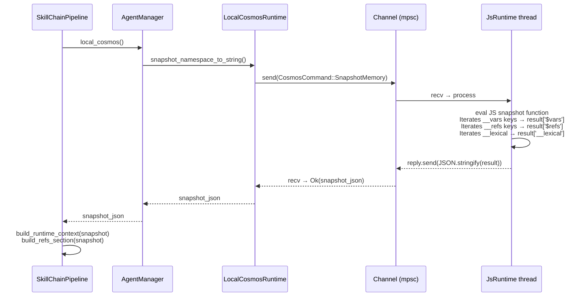

### 4.4 Snapshot JS Code (Deployed Form)

> **Note:** The JS code shown below is the **deployed form** that the Rust code builds dynamically at runtime. It is not stored as a Rust string literal in the source. The `__lexical` section is generated from `self.lexical_var_names` tracked during prior `exec()` calls. See `packages/agents/skemma/src/js_runtime/runtime.rs:549-607` for the Rust string builder.

The snapshot function directly accesses known namespace trees:

```javascript
(function() {
    var result = {};
    if (globalThis.$ && globalThis.__vars) {
        var dollarVars = {};
        var dollarKeys = Object.keys(globalThis.__vars);
        for (var j = 0; j < dollarKeys.length; j++) {
            var dk = dollarKeys[j];
            try {
                var dv = globalThis.vars[dk];
                if (typeof dv === 'function') continue;
                dollarVars[dk] = dv;
            } catch(e) {}
        }
        if (Object.keys(dollarVars).length > 0) {
            result['$vars'] = dollarVars;
        }
    }
    if (globalThis.$ && globalThis.__refs) {
        var dollarRefs = {};
        var refsKeys = Object.keys(globalThis.__refs);
        for (var j = 0; j < refsKeys.length; j++) {
            var dk = refsKeys[j];
            try {
                var dv = globalThis.refs[dk];
                if (typeof dv === 'function') continue;
                dollarRefs[dk] = dv;
            } catch(e) {}
        }
        if (Object.keys(dollarRefs).length > 0) {
            result['$refs'] = dollarRefs;
        }
    }
    // ... __lexical capture ...
    return JSON.stringify(result);
})( )
```

### 4.5 Restore Code (Deployed)

```javascript
(function() {
    var snap = JSON.parse(snapshot_string);
    if (snap['$vars'] && globalThis.$) {
        Object.keys(snap['$vars']).forEach(function(k) {
            try { globalThis.vars[k] = snap['$vars'][k]; } catch(e) {}
        });
    }
    if (snap['$refs'] && globalThis.$) {
        Object.keys(snap['$refs']).forEach(function(k) {
            try { globalThis.refs[k] = snap['$refs'][k]; } catch(e) {}
        });
    }
    if (snap['__lexical']) {
        Object.keys(snap['__lexical']).forEach(function(k) {
            try { globalThis[k] = snap['__lexical'][k]; } catch(e) {}
        });
    }
})()
```

---

## 5. Tool Registration & Access Control

### 5.1 Cosmos Internal Tools

All five cosmos-level tools are **universally granted** to all agents:

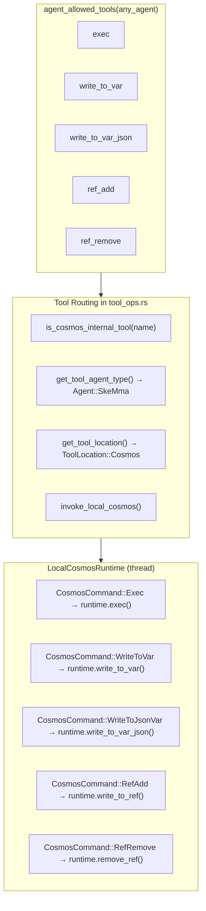

### 5.2 Tool Definitions

| Tool | Call Mode | Requires | Parameter Schema |
| --- | --- | --- | --- |
| `exec` | FireAndForget | `code: string` | Single JS code string |
| `write_to_var` | Blocking | `var_name, content` | `{var_name: string, content: string}` |
| `write_to_var_json` | Blocking | `var_name, content` | `{var_name: string, content: string (valid JSON)}` |
| `ref_add` | Blocking | `ref_name, content` | `{ref_name: string, content: string (JSON: ref_type + source + summary)}` |
| `ref_remove` | FireAndForget | `ref_name` | `{ref_name: string}` |

### 5.3 Standalone Cosmos Server

The `cosmos` binary (standalone JS runtime server) dispatches all tool names through the same `JsRuntime` interface, including the deprecated `ref_add`/`ref_remove` handlers that remain as residual internal plumbing. Only the three LLM-visible primitives (`exec`, `write_to_var`, `write_to_var_json`) are exposed to the model; see the deprecation note at the top of this document.

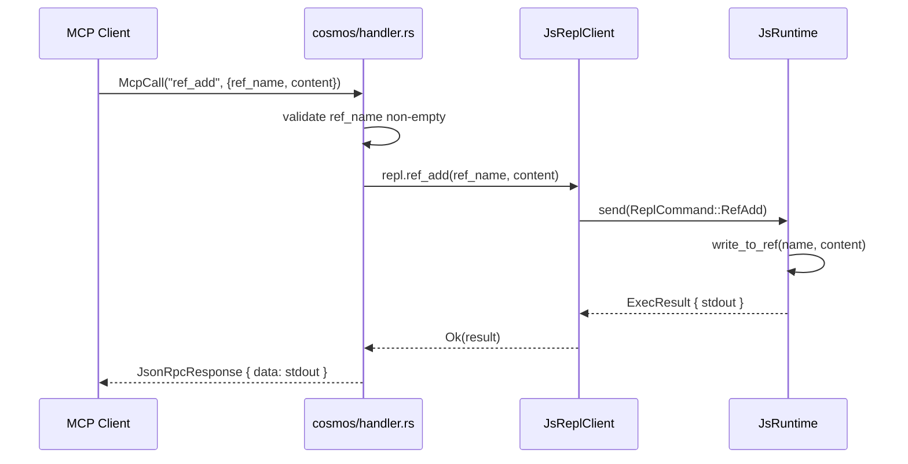

### 5.4 `is_cosmos_internal_tool` — Routing Helper

**File:** `packages/scepter/src/agent_manager/tool_ops.rs:7-13`

```rust
fn is_cosmos_internal_tool(tool_name: &str) -> bool {
    tool_name == cosmos::EXEC
        || tool_name == cosmos::WRITE_TO_VAR
        || tool_name == cosmos::WRITE_TO_VAR_JSON
        || tool_name == cosmos::REF_ADD
        || tool_name == cosmos::REF_REMOVE
}
```

This helper serves two critical purposes:

1. **Agent type resolution** — `get_tool_agent_type()` returns `Agent::SkeMma` for internal tools, since they execute in the Cosmos runtime (not in a domain agent's process).
1. **Fallback routing** — When a containerized cosmos call fails for an internal tool, the system falls back to the local cosmos runtime. For non-internal tools, the fallback goes to in-process execution instead. This ensures cosmos operations never fail silently in containerized mode.

### 5.5 Containerized vs Local Cosmos Routing

The system supports two execution modes for the Cosmos runtime, selected at agent registration time:

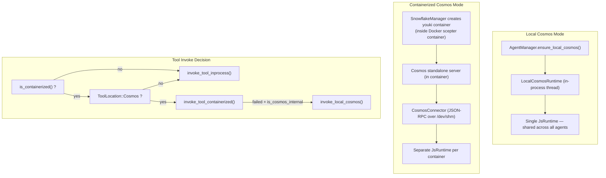

**Key differences:**

| Aspect | Local Mode | Containerized Mode |
| --- | --- | --- |
| `__vars` / `__refs` | Shared across all agents | Shared within container, isolated between containers |
| `__env` | Set directly via `exec` | Set via `CosmosConnector` JSON-RPC call |
| Performance | Zero serialization overhead | JSON-RPC serialization per call |
| Security | Boa sandbox only | Boa + seccomp + youki sandbox |
| Container runtime | Docker/Podman only | Docker/Podman (outer) + youki (inner cosmos) |
| Used by | Non-containerized agents (layer=1) | Containerized agents (layer=2+) |

### 5.6 Namespace JS Assembly

The full namespace JavaScript is assembled by `build_scepter_namespace_config_and_js()` at `packages/scepter/src/services/local_cosmos/namespace.rs:116-124`:

```rust
pub async fn build_scepter_namespace_config_and_js(
    registry: &SharedAgentRegistry,
    scepter_tools: &HashSet<String>,
    plugin_router: &PluginRouter,
) -> (NamespaceConfig, String) {
    let config = build_namespace_config(registry, scepter_tools, plugin_router).await;
    let js = build_namespace_js(&config);
    (config, js)
}
```

This function:

1. Collects all registered agents' MCP tools from the `AgentRegistry`
1. Builds a `NamespaceConfig` with per-agent tool lists and metadata (sync/async, `unwrap_data`)
1. Generates namespace JS via `build_namespace_js(&config)` which:

   - Creates `globalThis.$` if missing
   - Initializes `env.aporia` with `{ language: 'auto' }`
   - Defines `$.variant` property (circular getter returning `globalThis.$`)
   - Registers all agent tool modules via `register_tool_modules_with_rag()`

The namespace JS is evaluated:

- **Once** at `LocalCosmosRuntime::new()` startup
- **On demand** during skill chain rebuilding via `CosmosCommand::RebuildNamespace`

---

## 6. System Prompt Assembly Order

The complete system prompt assembled in `pipeline.rs:869-882`:

```text
You are the {Agent} {skill_name} skill execution engine. Execute the skill faithfully.

[capability_section]
  → Agent-specific capability description
  → TypeScript type declarations (IEPL API types, env)
  → Import instruction prompts
  → Parameter safety rules & data persistence guidance

[tool_decls_section]
  → ## Available Tool APIs
  → .d.ts content for all available MCP tools

[container_context]
  → Container execution mode badges, branch info, constraints

[soul_section]
  → ## Soul Identity: {name}
  → Agent's personality & operational principles

[refs_section]
  → ## Referenced Resources (refs)
  → Table-of-contents: name, type, source, summary

[output_section]
  → Next target agent routing
  → MCP report calling conventions

[runtime_context]
  → ## JS Runtime Context
  → __vars names (with import hint)
  → __refs names (with access hint)
  → lexical variable names

[rag_section]
  → Philia memory sections (relevant past interactions)
  → Aporia knowledge sections (relevant documentation)

[skill_chain_note]
  → Chain navigation: "This is step N of M" or "Final step"
```

### Section Placement Rationale

| Section | Position | Reason |
| --- | --- | --- |
| Agent identity + skill name | First sentence | Sets role immediately |
| Tool declarations | Before soul | LLM needs to know available tools before personality affects choice |
| Soul | After tools, before refs | Personality influences how refs are interpreted |
| Refs section | After soul, before output | LLM knows what resources are available before deciding what to produce |
| Output routing | Before runtime context | LLM knows where to send results before reading context |
| Runtime context | Before RAG, before chain note | Vars and refs provide execution context for knowledge retrieval |

---

## 7. ResetVars Behavior

When switching between skills in a chain, `ResetVars` is called to sanitize the runtime state. The command uses **non-destructive** initialization:

```javascript
globalThis.$ = globalThis.$ || {};
globalThis.__vars = globalThis.__vars || {};
globalThis.__refs = globalThis.__refs || {};
```

This means:

- **Existing values persist** — `__vars` and `__refs` are kept intact
- **Corrupted states recover** — if `__refs` was accidentally deleted, it is re-created
- **Skill isolation is opt-in** — skills should only read variables they know about (by name in the runtime context prompt)
- **No forced cleanup** — it is the LLM's responsibility to manage variable namespace pollution

---

## 8. Implementation File Map

| Component | File | Lines | Description |
| --- | --- | --- | --- |
| `__vars` constants & generators | `packages/shared/core/src/var_namespace.rs` | 1-211 | All JS code generation for vars |
| `__refs` constants & generators | `packages/shared/core/src/ref_namespace.rs` | 1-145 | All JS code generation for refs |
| `__env` generation | `packages/shared/iepl/src/namespace.rs` | 193-197 | `build_env_namespace_js()` |
| `$.variant` generation | `packages/shared/iepl/src/namespace.rs` | 199-207 | `build_variant_namespace_js()` |
| `JsRuntime` init | `packages/agents/skemma/src/js_runtime/runtime.rs` | 153 | `eval(VAR_NS_GLOBAL_INIT)` |
| `write_to_var` impl | same file | 349-403 | String variable storage |
| `write_to_var_json` impl | same file | 405-443 | JSON variable storage |
| `write_to_ref` impl | same file | 445-492 | Ref storage with type extraction |
| `remove_ref` impl | same file | 494-503 | Ref removal |
| `snapshot_namespace_to_string` | same file | 549-607 | Generates snapshot JS |
| `restore_namespace_from_string` | same file | 617-646 | Generates restore JS |
| `LocalCosmosRuntime` | `packages/scepter/src/services/local_cosmos/runtime.rs` | 1-507 | Thread-safe cosmos command channel |
| `CosmosCommand` enum | same file | 21-65 | All cosmos operation variants (including SnapshotMemory, Shutdown) |
| `ResetVars` handler | same file | 448-460 | Non-destructive reset |
| `RebuildNamespace` handler | same file | 478-494 | Re-initialize tool modules |
| Tool definitions | `packages/scepter/src/agent_manager/tool_ops.rs` | 1-795 | All 5 cosmos tool defs |
| `is_cosmos_internal_tool` | same file | 7-13 | Routing helper |
| `invoke_local_cosmos` | same file | 714-787 | Tool dispatch to LocalCosmosRuntime |
| `build_runtime_context` | `packages/scepter/src/state_machine/skill_chain/prompt.rs` | 472-598 | Prompt: vars + refs + lexical |
| `build_refs_section` | same file | 426-470 | Prompt: refs table of contents |
| System prompt assembly | `packages/scepter/src/state_machine/skill_chain/pipeline.rs` | 869-882 | Full system prompt format string |
| Allowed tools list | `packages/shared/domain_skills/src/tool_names.rs` | 265-273 | Universal cosmos tool access |
| Cosmos standalone handler | `packages/cosmos/src/handler.rs` | 447-521 | `ref_add` / `ref_remove` dispatch |
| Cosmos JsReplClient | `packages/cosmos/src/js_repl/mod.rs` | 442-467 | `ref_add()` / `ref_remove()` methods |
| ReplCommand enum | same file | 57-96 | `RefAdd` / `RefRemove` variants |
| IEPL TypeScript types | `packages/shared/bindings/iepl-api.d.ts` | 133-154 | RefItem, RefType, __refs declarations |
| `vars` module | `packages/agents/skemma/src/js_runtime/module_loader.rs` | 142-156 | `__vars` live reference export |
| `env` module | same file | 160-172 | Language value export |
| Namespace JS assembly | `packages/scepter/src/services/local_cosmos/namespace.rs` | 116-124 | `build_scepter_namespace_config_and_js` |
| CosmosConnector language setter | `packages/scepter/src/services/cosmos_connector.rs` | 351-363 | `env.aporia.language` in containers |
| E2E tests | `packages/agents/skemma/tests/mcp_test.rs` | 1677-1726 | `refs_and_snapshot_tests` module |
| Unit tests | `packages/agents/skemma/src/js_runtime/runtime.rs` | 679-746 | `write_to_ref`, snapshot, restore tests |
| Ref namespace tests | `packages/shared/core/src/ref_namespace.rs` | 99-145 | JS code generation pattern tests |

---

## 9. Cross-Cutting Concerns

### 9.1 Thread Safety

- `LocalCosmosRuntime` owns a **single `JsRuntime`** in a dedicated thread (named `"local-cosmos"`)
- All operations are serialized through a `mpsc::channel<CosmosCommand>`
- The `JsRuntime` is never accessed from multiple threads — thread safety is enforced by the channel pattern
- `AgentManager` holds `OnceCell<Arc<LocalCosmosRuntime>>` for lazy initialization

### 9.2 Memory Limits

| Limit | Value | Enforced In |
| --- | --- | --- |
| Max vars in prompt | 30 | `build_runtime_context()` — `MAX_NAMES` constant |
| Max refs in prompt | 30 | `build_refs_section()` — `.take(30)` |
| Max refs in runtime_context | 30 | `build_runtime_context()` — `MAX_NAMES` constant |
| Exec code soft limit | N/A (disabled) | Outer container limits + circuit breakers |
| Exec timeout (SkeMma) | 120s default | `skemma/COMPUTE_TIMEOUT` |
| Exec absolute ceiling | 600s | `skemma/ABSOLUTE_CEILING` |

### 9.3 Error Handling

| Error | Handling |
| --- | --- |
| `write_to_var_json` with invalid JSON | Returns error with preview (first 200 chars) |
| `ref_add` with invalid JSON | Returns `SkemmaError::JsEval` with preview |
| Snapshot of circular reference (`$.variant`) | Catches `TypeError` silently, skips the key |
| Missing `__refs` in snapshot | `build_refs_section` returns empty string |
| Corrupted `__refs` after ResetVars | `|| {}` guarantees re-initialization |

### 9.4 RebuildNamespace Lifecycle

When switching skills in a non-containerized skill chain, the namespace JS may need to be **rebuilt** to include new agent tools discovered during the chain:

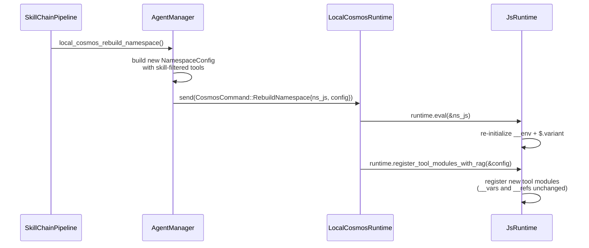

> **Key invariant:** `RebuildNamespace` only updates tool registrations and environment settings. It does **not** reset `__vars` or `__refs` — those are handled separately by `ResetVars`.

### 9.5 Language Propagation in Containerized Mode

When agents run in youki containers (nested inside the Docker scepter container), the `env.aporia.language` value is set via the `CosmosConnector`:

```rust
// packages/scepter/src/services/cosmos_connector.rs:351-363
let lang_code = format!(
    "env.aporia.language = {};",
    serde_json::to_string(&lang).unwrap_or_else(|_| "\"en\"".to_string())
);
connector.cosmos_exec(&container_uuid, &lang_code).await?;
```

This sends an `exec` MCP call over the JSON-RPC transport to the cosmos container, which evaluates the JS assignment in the container's isolated `JsRuntime`. The full language propagation path is:

```text
TUI request language → Scepter (extract request_language)
  → [local mode] direct exec("env.aporia.language = 'zh'")
  → [containerized] CosmosConnector::cosmos_exec(json_rpc_call)
      → cosmos handler → js_runtime.eval(...)
```

### 9.6 Security

- `exec` validation: all code passes SWC AST syntax validation before Boa evaluation
- `eval()` usage in `exec` blocks is detected and blocked with guidance to use `write_to_var` instead
- `ref_add` content goes through `JSON.parse()` — arbitrary code cannot be injected
- No namespace tool exposes raw Boa context access
- Cosmos containers run in sandboxed youki containers with seccomp profiles, each nested inside

the Docker/Podman scepter container (two-layer container isolation)
