# Usage Period Statistics System Design

## Overview

The Usage Period Statistics System manages and tracks LLM token usage based on time periods, supporting multiple period types (5 hours, 7 days, 30 days, custom), providing a data foundation for cost control and quota management.

## Core Principles

### Time Window Aggregation

The system uses a sliding window aggregation mechanism to calculate usage statistics in real-time for any time range through database views:

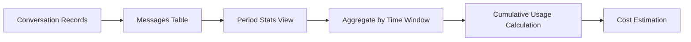

### Data Flow

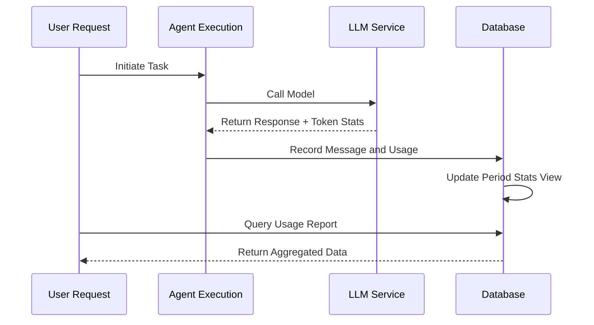

## Period Types

| Period Type | Duration | Typical Use |
| --- | --- | --- |
| Short-term | 5 hours | Rapid iteration development |
| Medium-term | 7 days | Weekly quota control |
| Long-term | 30 days | Monthly cost accounting |
| Custom | Any | Flexible business needs |

## Architecture Design

### View Aggregation Architecture

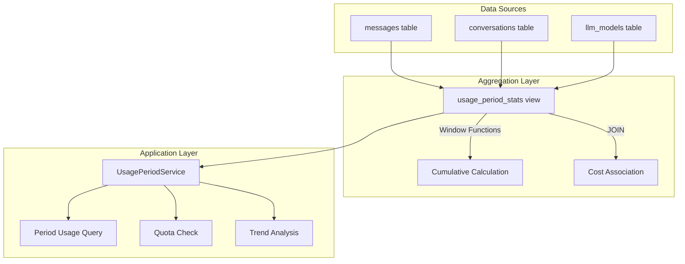

### Core Calculation Logic

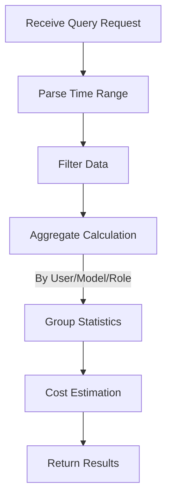

## Quota Control Mechanism

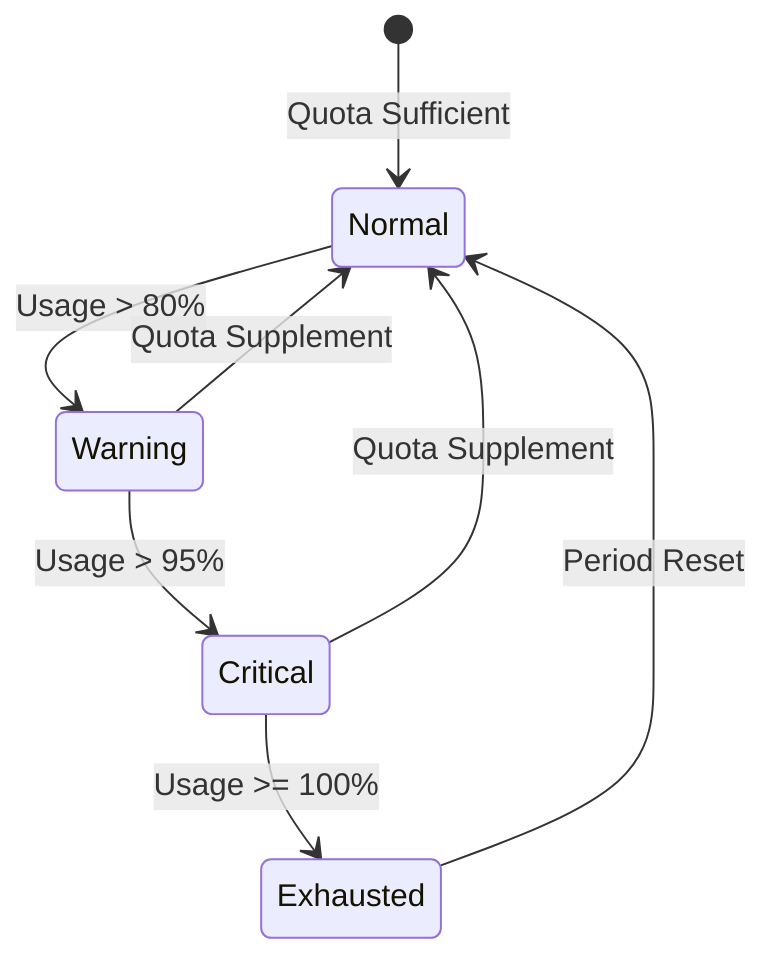

## Relationship with Other Modules

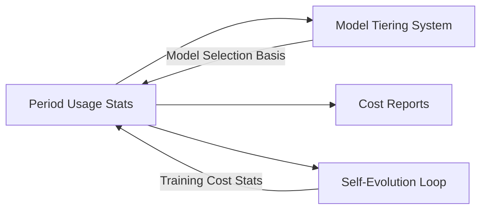

## Design Considerations

### Performance Optimization

- Use database views for pre-aggregation
- Window functions avoid redundant calculations
- Time indexes accelerate range queries

### Extensibility

- Support for new period types
- Extensible aggregation dimensions
- Flexible cost calculation models

### Data Consistency

- Read-only views ensure data integrity
- Timestamps use UTC uniformly
- Transactions guarantee write atomicity

# LLM Configuration Flow Design

## Overview

This document describes the complete flow for users to configure LLM Providers, including configuration interface interaction, data transmission, server-side processing, and conversation usage.

## Configuration Flow Architecture

### Overall Flow

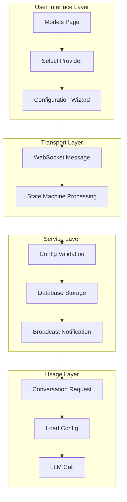

## Provider Configuration Flow

### Configuration Step Sequence

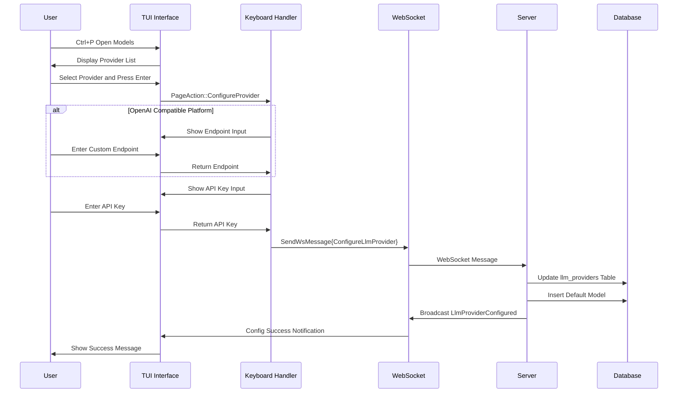

### Configuration State Machine

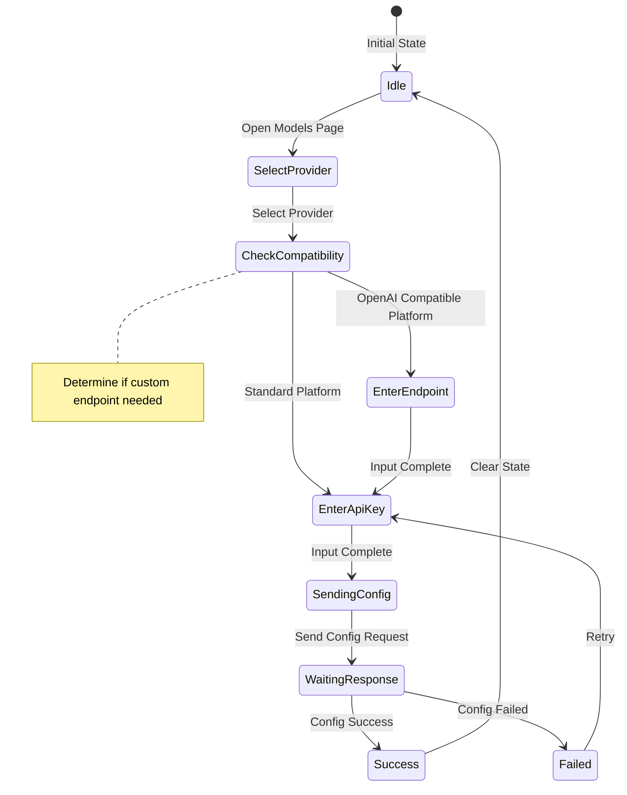

## Conversation Usage Flow

### LLM Call Sequence

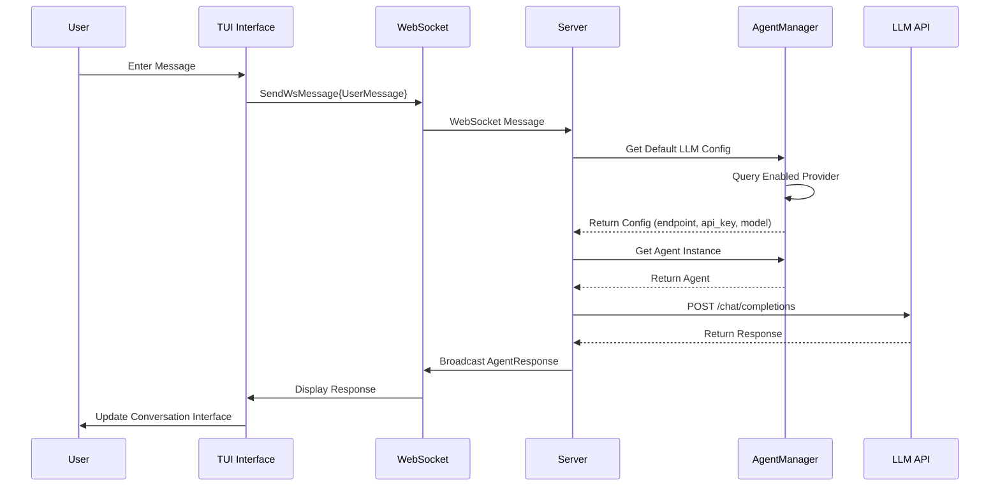

## Key Design Decisions

### Two-step Configuration Flow

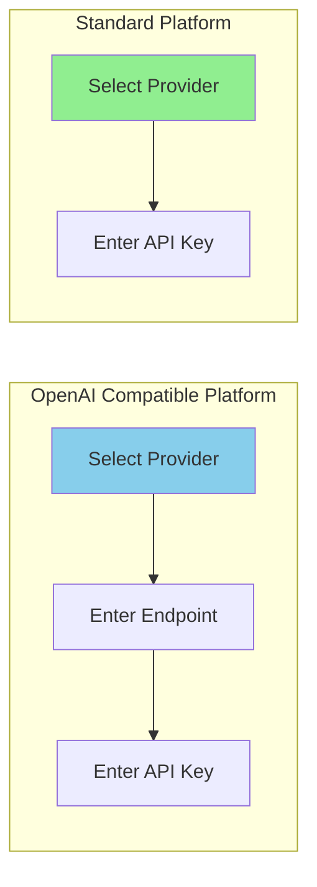

| Platform Type | Configuration Steps | Reason |
| --- | --- | --- |
| OpenAI Compatible | Endpoint + API Key | Need custom service endpoint |
| Standard Platform | API Key Only | Use official endpoint |

### Configuration State Management

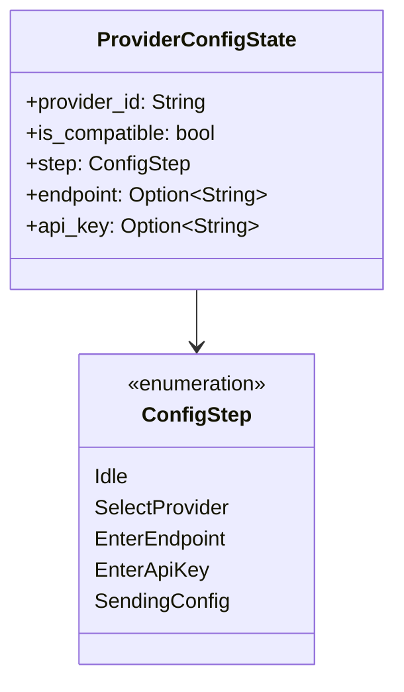

### Default Model Auto-insertion

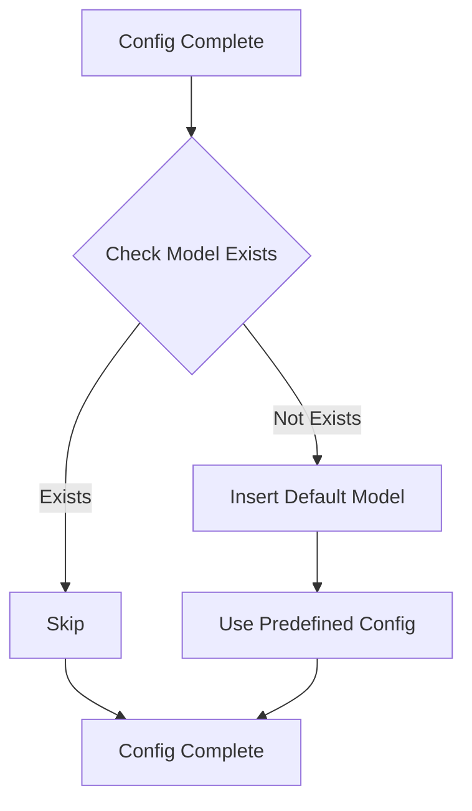

## Performance Optimization

### Configuration Cache Strategy

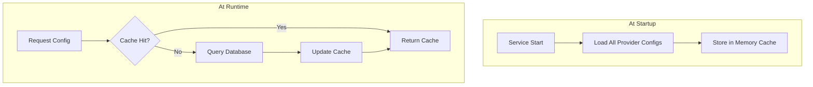

### Connection Pool Management

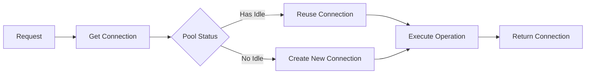

## Error Handling

### User Input Validation

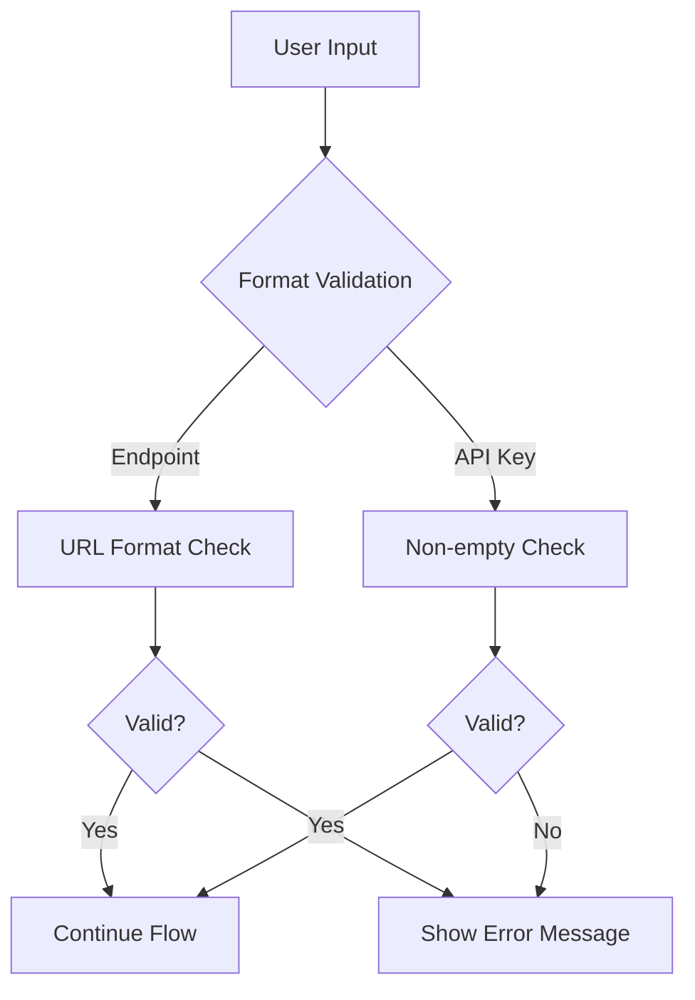

### Network Error Handling

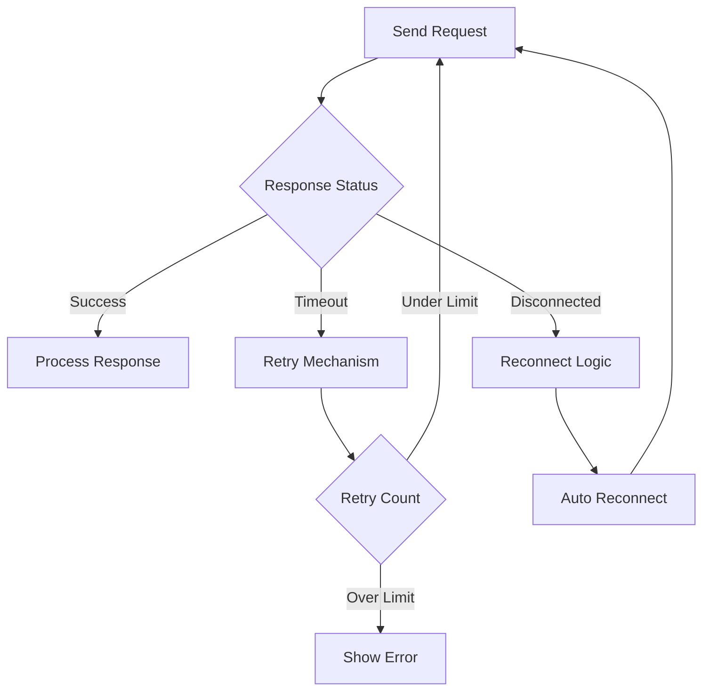

## Security Considerations

### API Key Protection

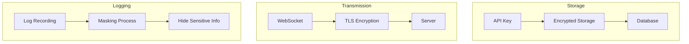

### Security Measures

| Stage | Measure | Description |
| --- | --- | --- |
| Storage | Encrypted storage | Encrypt API Key in database |
| Transmission | TLS encryption | WebSocket uses encrypted channel |
| Logging | Masking | Don't log plaintext Key |
| Input | Parameterized queries | Prevent SQL injection |

## Extensibility Design

### Adding New Provider

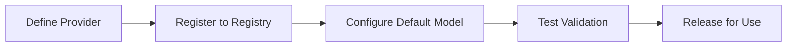

### Multi-Provider Support

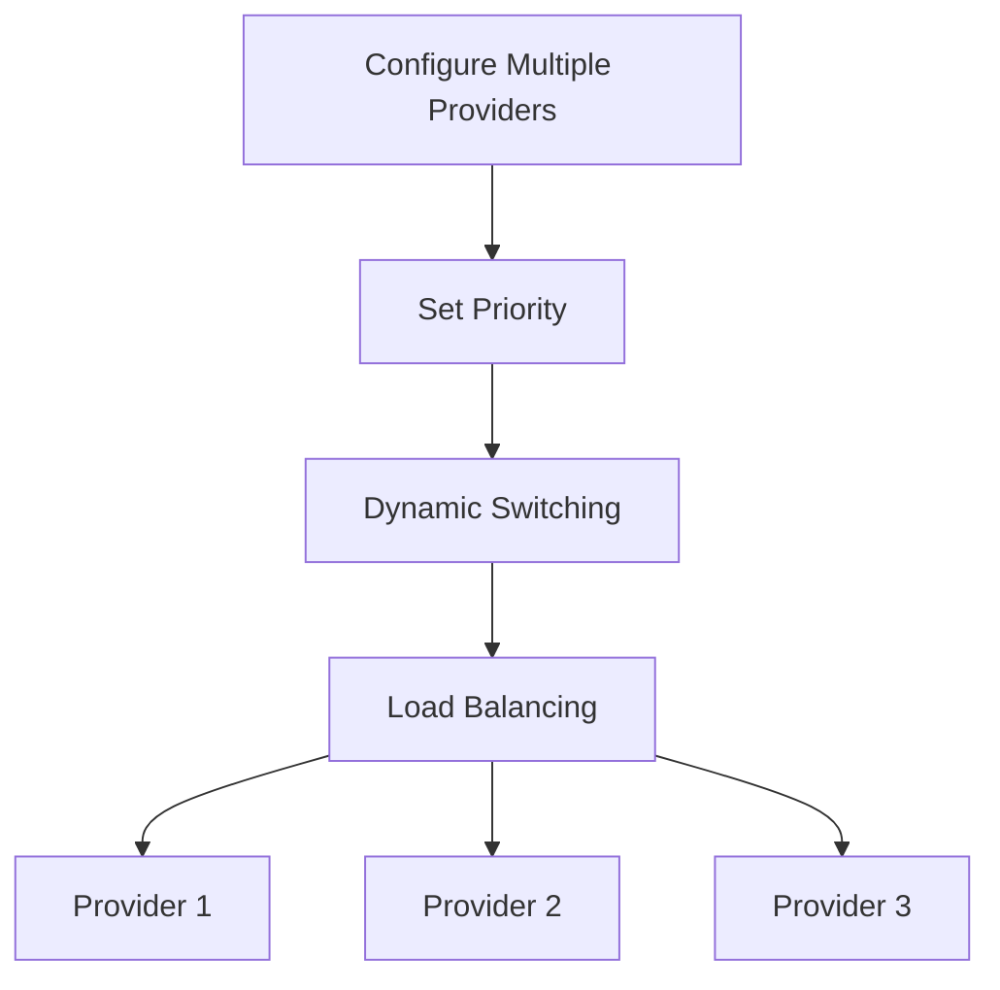

## Message Type Definition

### WebSocket Messages

| Message Type | Direction | Description |
| --- | --- | --- |
| ConfigureLlmProvider | TUI → Server | Configuration request |
| LlmProviderConfigured | Server → TUI | Configuration result |
| UserMessage | TUI → Server | User conversation |
| AgentResponse | Server → TUI | Agent response |

## Future Planning

| Feature | Description | Priority |
| --- | --- | --- |
| Config Import/Export | Support config file migration | High |
| Provider Health Check | Periodic Provider availability detection | Medium |
| Auto Failover | Auto-switch when Provider unavailable | Medium |
| Usage Stats Integration | Link with usage statistics system | Low |

# MCP Prompt Injection and Context Compression Mechanism

## Overview

This document describes two key architectural designs: MCP tool mandatory Prompt injection mechanism and Todo marker-based context compression mechanism. These two mechanisms work together to standardize Agent behavior and optimize context management in long conversation scenarios.

## I. MCP Tool Documentation Injection (Exec-Only)

### Core Concept

Under the exec-only microkernel architecture, the LLM receives only **three tool definitions**: `exec`, `write_to_var`, and `write_to_var_json`. MCP tools are internal APIs invoked through exec's JS runtime. MCP tool documentation is injected into the skill prompt as JS API documentation via the `related_tools` mechanism — not as separate tool definitions sent to the LLM.

```mermaid
flowchart LR
    A[Skill related_tools] --> B[McpToolDocLoader]
    B --> C[Read TOML params + MD description]
    C --> D[Format as JS API docs]
    D --> E[Inject into system prompt]

    style D fill:#90EE90
```

### Key Characteristics

| Characteristic | Description |
| --- | --- |
| Exec-only surface | LLM sees only `exec`, `write_to_var`, `write_to_var_json`; MCP tools are never exposed as tool definitions |
| Skill-scoped | Tool docs are injected per-skill via `related_tools`, not globally |
| JS API format | Docs formatted as `ES module import API reference — description` |
| Internal routing | McpToolRegistry is per-agent but used only for internal dispatch |

### Design Motivation

```mermaid
flowchart TB
    subgraph Problem Scenarios
        A[Too many tool definitions bloat context]
        B[Per-tool prompt injection is fragile]
        C[LLM confused by tool proliferation]
    end

    subgraph Solutions
        D[Three-tool surface: exec, write_to_var, write_to_var_json]
        E[MCP docs as JS API references]
        F[Skill-scoped related_tools injection]
    end

    A --> D
    B --> E
    C --> F
```

### Injection Flow

```mermaid
sequenceDiagram
    participant Skill as Skill (related_tools)
    participant Loader as McpToolDocLoader
    participant MCP as MCP Tool Config (TOML + MD)
    participant Prompt as System Prompt

    Skill->>Loader: List of related tool names
    Loader->>MCP: Read TOML params + MD description
    MCP-->>Loader: Tool metadata

    Loader->>Loader: Format as ES module import API reference — description
    Loader->>Prompt: Inject into skill section of system prompt

    Note over Prompt: LLM sees only exec tool<br/>MCP docs appear as JS API references
```

### Injection Format

Each MCP tool's documentation is formatted as a JS API reference:

$agent.todo_list_view() — View the current todo tree structure
$agent.todo_create({ title: String, description: String }) — Create a new todo item
$agent.todo_update_status({ `todo_id`: String, status: String }) — Update the status of a todo item

### Configuration Example

```mermaid
flowchart TB
    subgraph Skill related_tools
        A[Skill TOML: related_tools field]
        A --> A1["[tool_name]"]
        A1 --> B[todo_list_view]
        A1 --> C[todo_create]
        A1 --> D[todo_update_status]
    end

    subgraph McpToolDocLoader
        E[Read TOML params]
        F[Read MD description]
        G[Format as JS API doc]
    end

    B --> E
    C --> E
    D --> E
    E --> F --> G
```

### Permission Levels

Each `[[related_tools]]` entry can optionally declare an `access_mode`:

[[`related_tools`]]
`agent_name` = "polemos"
`tool_name` = "`node_execute`"
`access_mode` = "read"       # Skill only needs read-level access (default: "read")

The dual-authorization gateway checks that:

1. The tool's declared `ToolCapability` supports the requested `access_mode`
1. The target node's `TrustLevel` permits the operation
1. For external nodes, additional risk-level gating applies

See `docs/design/en/22-mcp-tool-permission-model.md` for full details.

### Advantages and Trade-offs

```mermaid
graph TB
    subgraph Advantages
        A[Minimal tool surface]
        B[Skill-scoped documentation]
        C[Consistent API format]
        D[Internal routing flexibility]
    end

    subgraph Trade-offs
        E[LLM must construct JS calls]
        F[Debugging requires exec tracing]
        G[related_tools must be maintained]
    end
```

## II. Todo Marker-based Context Compression Mechanism

### Core Concept

Traditional compression relies on summarizing text, which loses key details. The new mechanism changes to marking key Todo items, preserving original details as user input, directly continuing the original Skill execution.

```mermaid
flowchart LR
    subgraph Traditional Way
        A1[Context] --> B1[Summary Text]
        B1 --> C1[New Conversation]
        C1 --> D1[Possible Detail Loss]
    end

    subgraph Todo Marker Way
        A2[Context] --> B2[Mark Key Todo]
        B2 --> C2[Preserve Original Details]
        C2 --> D2[No Information Loss]
    end
```

### Design Motivation Comparison

| Traditional Way Problems | Todo Marker Advantages |
| --- | --- |
| Information loss | Original preservation |
| Semantic drift | Traceable |
| Unverifiable | Verifiable |
| Skill invalidation | Skill continuity |

### Compression Flow

```mermaid
sequenceDiagram
    participant User as User
    participant Agent as Original Agent
    participant Marker as Todo Marker
    participant NewAgent as New Agent
    participant TodoMCP as Todo MCP

    User->>Agent: Request Context Compression
    Agent->>Marker: Get Key Todo Items

    Note over Marker: Apply Marking Strategy

    Marker-->>Agent: Marked Item List
    Agent->>TodoMCP: Batch Get Details
    TodoMCP-->>Agent: Todo Details

    Agent->>NewAgent: Start New Session

    Note over NewAgent: System prompt = Original Skill<br/>User input = Todo details

    NewAgent->>TodoMCP: View Todo Tree
    Note over NewAgent: Find details already in input<br/>Continue directly
```

### Marking Strategies

```mermaid
flowchart TB
    subgraph Strategy Types
        A[Manual Marking]
        B[AutoCritical Critical Path]
        C[AutoUnfinished Unfinished Tasks]
        D[Hybrid Strategy]
    end

    A --> A1[User Selects Key Items]
    B --> B1[Auto Identify Main Task Chain]
    C --> C1[Mark All Unfinished Items]
    D --> D1[Combine Multiple Strategies]
```

### Strategy Comparison

| Strategy | Marked Content | Applicable Scenarios |
| --- | --- | --- |
| Manual | User specified | Precise control |
| AutoCritical | Main task chain + blocking tasks | Complex tasks |
| AutoUnfinished | All unfinished tasks | Simple recovery |
| Hybrid | Combined + user marks | General scenarios |

### Marked Item Structure

```mermaid
classDiagram
    class MarkedTodoItem {
        +todo_id: String
        +include_depth: u32
        +include_ancestors: bool
        +include_artifacts: bool
    }

    class MarkerStrategy {
        <<enumeration>>
        Manual
        AutoCritical
        AutoUnfinished
        Hybrid
    }

    class TodoMarker {
        +marked_items: List~MarkedTodoItem~
        +marker_strategy: MarkerStrategy
        +mark_critical_todos()
    }

    TodoMarker --> MarkedTodoItem
    TodoMarker --> MarkerStrategy
```

## III. Collaboration of Two Mechanisms

### Collaboration Flow

```mermaid
sequenceDiagram
    participant User as User
    participant OldAgent as Old Agent
    participant Marker as Todo Marker
    participant Loader as McpToolDocLoader
    participant NewAgent as New Agent

    Note over OldAgent: Context near limit

    User->>OldAgent: Compress Context
    OldAgent->>Marker: Mark Key Todo
    Marker-->>OldAgent: Marked Item List

    OldAgent->>NewAgent: Create New Session

    Note over NewAgent: System prompt = Soul + Skill<br/>related_tools loaded by McpToolDocLoader

    NewAgent->>Loader: Load tool docs for related_tools
    Loader-->>NewAgent: Formatted JS API docs

    Note over NewAgent: System prompt contains:<br/>1. Soul identity<br/>2. Skill template + related_tools docs<br/>3. Three tools: exec, write_to_var, write_to_var_json

    NewAgent->>NewAgent: Execute via exec JS runtime
    Note over NewAgent: MCP tools are internal APIs<br/>Find details already in input

    NewAgent-->>User: Seamless Task Continuation
```

### Key Collaboration Points

```mermaid
flowchart TB
    subgraph Collaboration Mechanism
        A[McpToolDocLoader injects JS API docs]
        B[Marker Provides Complete Context]
        C[Soul + Skill Prompt Preserved]
    end

    A --> D[Skill has JS API references for MCP tools]
    B --> E[Sufficient complete info provided]
    C --> F[Behavioral consistency maintained]

    D --> G[Seamless Task Continuation]
    E --> G
    F --> G
```

## IV. Implementation Roadmap

```mermaid
flowchart LR
    subgraph Phase 1 High Priority
        A[MCP Prompt Injection]
        A --> A1[Data Structure]
        A --> A2[Injection Logic]
        A --> A3[Config Management]
    end

    subgraph Phase 2 Medium Priority
        B[Todo Marker Mechanism]
        B --> B1[Marking Strategy]
        B --> B2[Compression Recovery]
        B --> B3[Manual Marking]
    end

    subgraph Phase 3 Low Priority
        C[Smart Strategy]
        C --> C1[AutoCritical]
        C --> C2[Hybrid]
        C --> C3[Smart Suggestions]
    end
```

## V. Risk Assessment and Mitigation

### Risk Matrix

| Risk | Impact | Mitigation Measures |
| --- | --- | --- |
| Token overhead too large | Performance degradation | Limit marked count, compression level config |
| Prompt too strict | Reduced flexibility | Provide bypass mechanism, exception handling guidance |
| Marking strategy inaccurate | Information omission | Manual override, visual confirmation |

### Error Handling Flow

```mermaid
flowchart TB
    A[Operation Failed] --> B{Failure Type}
    B -->|Token Exceeded| C[Trim Non-critical Items]
    B -->|Strategy Failed| D[Fallback to Manual Mode]
    B -->|Injection Failed| E[Use Default Behavior]

    C --> F[Retry Operation]
    D --> F
    E --> F
```

## VI. Configuration Integration

### Overall Configuration Structure

```mermaid
flowchart TB
    subgraph Skill Config
        A[related_tools]
        B[tool_names list]
    end

    subgraph Compression Config
        C[enabled]
        D[default_strategy]
        E[trigger_threshold]
    end

    subgraph Strategy Config
        F[include_critical_path]
        G[include_unfinished]
        H[max_marked_items]
    end

    A --> I[JS API Doc Generation]
    C --> J[Compression Control]
    F --> K[Marking Rules]
```

## VII. Future Extensions

| Feature | Description | Priority |
| --- | --- | --- |
| Dynamic Prompt Generation | Adjust constraints based on task complexity | Medium |
| Multi-session Sharing | Multiple Agents share Todo markers | Medium |
| Smart Marking Suggestions | Auto-recommend marked items | Low |
| Visual Marking Tool | Graphical marking interface | Low |

## VIII. Complementary RAG Context Injection (v2.1+)

The MCP tool injection described in Sections I-VII provides the LLM with **API references** — it tells the LLM *how* to call tools. A complementary mechanism, RAG Context Injection, provides the LLM with **pre-computed knowledge** — it injects the *results* of RAG queries directly into the system prompt.

| Aspect | MCP Tool Injection | RAG Context Injection |
| --- | --- | --- |
| What LLM receives | API reference docs (ES module imports) | Actual knowledge content (memory nodes, workspace docs) |
| When injected | Per skill, based on `related_tools` | Per skill step, based on skill context |
| LLM involvement | LLM must call the tool | No LLM involvement — pre-computed |
| Latency impact | N round-trips (one per call) | 1 pre-computation per skill step |
| IEPL modules | `{agent}` (MCP dispatch) | `rag/{philia,aporia}` (buffer read) |

Both mechanisms coexist: MCP tools remain available as a fallback for queries the pre-computed context doesn't cover. See `docs/design/en/26-rag-context-injection.md` for the full design.

# Agent Dual Identity and Visibility Boundary Design

## Objectives

- Fully separate visible Skill execution instances from internal MCP/LLM tool providers.
- Allow only Skill invocations to create temporary visible agents with 3-digit badges.
- Attribute MCP/LLM model and token usage to the attached Skill instance instead of creating extra visible agents.
- Keep runtime UUID identity for audit, history, and replay without letting it leak into the TUI timeline.

## Identity Layers

- `agent_number`: the 3-digit UI-facing badge and the stable key for visible timeline nodes.
- `agent_uuid`: the runtime UUID used for registry, audit, and history.
- `agent_id`: a compatibility field.
  - In visible TUI payloads, `agent_id` should match the panel-facing `agent_number`.
  - In internal registries and MCP execution paths, `agent_id` may remain UUID-style.

## Visibility and Instantiation Rules

- Only Skill invocations create temporary visible agent instances.
- SimpleTool/MCP providers must not create additional visible agents merely because one of their tools is called.
- When a Skill uses MCP tools or an internal `llm_chat` call, those invocations remain subordinate execution under that Skill instance.
- Example: if HubRis calls ApoRia `llm_chat`, ApoRia stays an internal executor and must not appear as a second visible node in the upper-right timeline.

## MCP and LLM Attribution Rules

- If an MCP/LLM call belongs to a visible Skill instance, its model name and token usage must be attributed to that Skill instance.
- Internal providers may still keep their own audit or global accounting, but those internal stats must not trigger TUI node creation.
- MCP logs and context should preserve:
  - `agent_number`
  - `agent_uuid`
  - `tool_name`
  - `phase` (`start`/`finish`)
  - `success` and `error`

## TUI Rendering Contract

- The TUI creates timeline nodes only for explicit 3-digit panel IDs.
- Payloads without a visible `agent_number` may update global model/token statistics only and must not create visible agent nodes.
- Display labels and node keys must never derive a visible badge from UUIDs or arbitrary digits found inside `agent_id`.
- For visible nodes:
  - `agent_number` is used for display and interaction.
  - `agent_uuid` is kept only for audit, history, and debugging.

## Badge Allocation and Lifecycle

- `agent_number` is randomly allocated from the available `000`-`999` pool rather than sequentially assigned.
- Released numbers are reusable.
- When all 1000 badges are active, the allocator may fall back to random reuse; historical disambiguation must then rely on `agent_uuid`.
- Visible instance cleanup and badge reclamation are handled by the Skill lifecycle manager.

## Compatibility Constraints

- Legacy payloads that only carry `agent_id` may still be parsed internally, but the visible UI must not synthesize new nodes from UUID-style IDs.
- When both `agent_number` and `agent_uuid` are present, the dual-identity model applies:
  - `agent_number` is for display and interaction.
  - `agent_uuid` is for audit and history.

# Request Concurrency Architecture

## Overview

Scepter manages two independent concurrency layers:

```mermaid
flowchart LR
    User["User Requests"] --> Semaphore["Request Semaphore"]
    Semaphore --> Cosmos["Cosmos Containers"]
    Cosmos --> Queue["Tier Queue (RequestPool)"]
    Queue --> LLM["LLM API"]
```

## Analogy

Think of a restaurant:

- **Customers** (user requests) arrive and place orders simultaneously
- **Tables** (Cosmos containers) are created per request — each gets its own workspace
- **Kitchen stations** (LLM provider concurrency) are limited — maybe 3 total
- **Ticket system** (`RequestPool` tier queue) manages FIFO ordering per tier

30 customers can order at once (scepter accepts multiple requests), but the kitchen can only cook 3 dishes at a time (LLM API rate limit).

## Layer 1: Request Semaphore

**Location**: `state_machine/domains/control_domain.rs` — `concurrent_request_semaphore`

Controls how many user requests scepter accepts concurrently. Each request creates an independent Cosmos container with its own LLM handle.

```mermaid
flowchart LR
    User1["User Message"] -->|"N = sum of all model max_concurrent"| Semaphore["Semaphore(N)"]
    User2["User Message"] --> Semaphore
    User3["User Message"] --> Semaphore
    Semaphore --> Container1["Cosmos container + LLM handle"]
    Semaphore --> Container2["Cosmos container + LLM handle"]
    Semaphore --> Container3["Cosmos container + LLM handle"]
```

N = total concurrent slots across all enabled models. If models A (3 slots) + B (2 slots) = 5 concurrent requests.

Previously this was `AtomicBool` (N=1), now it's `Semaphore(N)`.

## Layer 2: Tier Queue (RequestPool)

**Location**: `infra/request_pool.rs` — `RequestPool`

Per-tier FIFO queue with per-model semaphores. Within a tier:

1. Incoming LLM requests enter the tier queue
1. Try to acquire a slot on the highest-priority model first
1. If busy, try next model in priority order
1. If all busy, wait in FIFO queue — whichever model frees up first serves the next request

```mermaid
flowchart TB
    subgraph Tier["Tier: 'normal'"]
        direction TB
        Queue["FIFO Queue: req1 → req2 → req3 → req4"]
        MA["Model A (priority 10): Semaphore(3) ■■□"]
        MB["Model B (priority 5):  Semaphore(2) □□"]
        MC["Model C (priority 1):  Semaphore(1) ■"]
        Queue -->|"req1 → Model A (available)"| MA
        Queue -->|"req2 → Model B (available, A busy)"| MB
        Queue -->|"req3 → wait... Model A frees → serve"| MA
        Queue -->|"req4 → wait... Model C frees → serve"| MC
    end
```

### Key Properties

- **Per-provider isolation**: Each model's `max_concurrent` is independent
- **Priority ordering**: Higher-priority models are preferred when available
- **Fallback**: If high-priority model is saturated, lower-priority models serve immediately
- **FIFO fairness**: Waiting requests are served in order of arrival

### Configuration

# provider_config.toml
[[models]]
id = "gpt-5.4"
tier = "normal"
priority = 10
`max_concurrent` = 3        # 3 simultaneous API calls to this model

[[models]]
id = "gpt-4o-mini"
tier = "normal"
priority = 5
`max_concurrent` = 5        # 5 simultaneous API calls

[[models]]
id = "deepseek-v3"
tier = "deep"
priority = 8
`max_concurrent` = 2

With this config:

- `normal` tier: Model A (3 slots) + Model B (5 slots) = 8 concurrent normal-tier LLM calls
- `deep` tier: Model C (2 slots) = 2 concurrent deep-tier LLM calls
- Request Semaphore: 3 + 5 + 2 = 10 concurrent user requests

## Flow: User Message → LLM Response

    1. User sends message via TUI/CLI/socket
    1. `handle_user_message`():

a. `try_acquire`() on Request Semaphore (Layer 1)

          - If no slots: return "busy" error
          - Each slot → independent Cosmos container

b. `execute_skill_chain`() → `invoke_aporia_llm_chat`()

    1. `invoke_aporia_llm_chat`():

a. `acquire_tier`("normal", `excluded_models`) on `RequestPool` (Layer 2)

          - Try each model in priority order (non-blocking)
          - If all busy: wait in FIFO until any model slot frees
          - Returns TierPermit { `model_id`, `display_name` }

b. `chat_loop` → llm_backend.chat() → LlmService::`chat_with_tools`()

          - Uses selected model for API call

c. TierPermit dropped → semaphore slot released

    1. `finish_handling`():

a. Request Semaphore permit returned
b. Cosmos container can be cleaned up (or reused)

## E2E Testing

Tests use idle-timeout (not absolute deadline). Timer resets on every meaningful event:

# Activity resets the idle timer — chain can run indefinitely as long as it stays active
ACTIVE_METHODS = {
"Tui.`OrchestrationStatus`",
"Tui.`McpToolResult`",
"Tui.`AgentReport`",
"Tui.`AgentStreamingChunk`",
"Tui.`TaskStatusUpdate`",
"Tui.`AskHumanRequest`",
"Tui.AgentPatch",
"Tui.`ContainerSnapshot`",
}

This ensures:

- Short idle timeout (120s) catches truly stuck chains
- Long-running but active chains (complex multi-skill) are never prematurely killed

# Embedded Dev Database & Feature-Gated Production Isolation

## Overview

entelecheia uses [pglite-oxide](https://crates.io/crates/pglite-oxide) as an embedded PostgreSQL for two purposes:

1. **Local development**: When no `DATABASE_URL` is configured, scepter automatically starts an in-process PostgreSQL (PG 17.5 via WASM/wasmer) with pgvector support.
1. **Integration tests**: PG integration tests use pglite-oxide instead of Docker/testcontainers.

In production (Docker), the `embedded-db` feature is excluded, and scepter connects to a real PostgreSQL container.

## Design Motivation

Previously, local development required either Docker Compose or a manual PostgreSQL installation. Integration tests relied on `testcontainers`, adding Docker-in-Docker complexity in CI. pglite-oxide eliminates both requirements — `cargo run` "just works" for local dev, and `cargo test` runs without Docker.

## Feature Gate Architecture

```mermaid
flowchart TB
    Cargo["scepter Cargo.toml<br/>[features] default = ['all-agents', 'embedded-db']  ← dev<br/>embedded-db = ['dep:pglite-oxide']<br/>[dependencies] pglite-oxide = { workspace = true, optional = true }"]

    Cargo -->|"cargo build (default)"| Dev["pglite-oxide + wasmer WASM<br/>included"]
    Cargo -->|"Dockerfile<br/>--no-default-features<br/>--features all-agents"| Prod["No pglite, no wasmer<br/>(production)"]
```

| Build Context | Command | pglite-oxide | wasmer | DATABASE_URL |
| --- | --- |  ---  |  ---  | --- |
| `cargo run` (local dev) | default features | ✓ | ✓ | Optional — auto-starts embedded PG if missing |
| `cargo test` (tests) | default features | ✓ | ✓ | Auto-started by test harness |
| `just build` (release) | `--no-default-features --features all-agents` | ✗ | ✗ | Required |
| Docker `Dockerfile` | `--no-default-features --features all-agents` | ✗ | ✗ | Required (points to PG container) |

## Runtime DB Resolution Order

// packages/scepter/src/app/setup.rs
let `db_url` = if let Ok(url) = std::env::var("DATABASE_URL") {
// 1. Environment variable (production: Docker PG, dev: .env file)
url
} else if !user_config.database.url.is_empty() {
// 2. User config file (~/.config/entelecheia/config.toml)
user_config.database.url.clone()
} else {
// 3. Embedded pglite-oxide (feature-gated)
#[cfg(feature = "embedded-db")]
{
let server = `PgliteServer`::builder()
.extension(`pglite_oxide`::extensions::VECTOR)  // pgvector support
.start()?;
let url = server.database_url();
std::mem::forget(server);  // keep alive for process lifetime
url
}
#[cfg(not(feature = "embedded-db"))]
{
return Err(/* "no DATABASE_URL configured" */);
}
};

## Test Harness Pattern

```no_run
// tests/pg_integration/auth_test.rs
static PG: OnceCell<(String, PgliteServer)> = OnceCell::const_new();

# [test]
fn pg_integration_tests() {
    let rt = tokio::Runtime::new().unwrap();
    rt.block_on(async {
        let url = ensure_pg_url().await;
        let db = connect_db(&url).await;  // max_connections=1
        pg_user_crud(&db).await;
        pg_unique_username(&db).await;
        pg_rbac_role_persistence(&db).await;
        pg_rbac_audit_log(&db).await;
    });
    std::process::exit(0);  // bypass sqlx pool hang
}
```

## Tables Created

All 23 tables + 1 schema-scoped table + 4 views are created via SeaORM migrations:

**Core**: `users`, `rbac_user_roles`, `rbac_audit_log`, `agents`, `conversations`, `messages`, `tasks`
**Goals**: `goals`, `tracks`, `goal_tasks`
**Knowledge**: `knowledge_bases`, `knowledge_documents` (pgvector embeddings), `rag_subscriptions`
**Consensus**: `consensus_records`, `consensus_references`, `consensus_verifications`
**Infrastructure**: `credentials`, `ssh_credentials`, `container_snapshots`, `model_usage_stats`
**Workspace**: `workspace_registry`, `todo_items`, `workspace_bindings`
**Logging**: `log.entries` (separate `log` schema)
**Views**: `usage_period_stats`, `usage_model_stats`, `usage_role_stats`, `usage_session_stats`

## PGlite Constraints

| Constraint | Impact | Mitigation |
| --- | --- | --- |
| `max_connections=1` | Only one pool at a time | Shared DB connection across sub-tests; no `db.close()` between tests |
| Strict type casting | `uuid = text` fails | Always pass typed values (e.g., `Uuid` not `String` for UUID columns) |
| No concurrent access | Tests must be sequential | Single `#[test]` runner with all sub-tests inline |
| sqlx pool background tasks | `close()` hangs indefinitely | `std::process::exit(0)` after all tests complete |

## Docker Build Hardening

All production Dockerfiles exclude embedded-db:

# Dockerfile
RUN cargo build --release -p scepter \
--no-default-features --features all-agents

This ensures zero wasmer/pglite code in production images, keeping binary size minimal and attack surface reduced.
